# SRAM (SURF Research Access Management)

[SRAM](https://sram.surf.nl/) manages research collaborations (COs): an
organisation creates a CO, invites members, groups them, and connects the CO to
services. For every service with SCIM enabled, SRAM's application
([SBS](https://github.com/SURFscz/SBS)) pushes the members and groups of the
connected COs to that service's SCIM 2.0 endpoint.

This page describes how to connect Waldur to SRAM as such a service, and how to
run SBS locally next to a Waldur development stack to work on the integration.

!!! note "Requirements"
    The SRAM integration (`/scim/v2/sram/`, organization mapping, placeholder
    roles and project rules) requires Waldur 8.1.3 or later; release candidates
    up to `8.1.3-rc.14` do not include it. Older releases only accept users on
    the generic `/scim/v2/` endpoint, and a sweep against that endpoint deletes
    everything SRAM does not know, so never connect SRAM to them with the sweep
    enabled (see [The sweep](#the-sweep)).

## How SRAM talks to a service

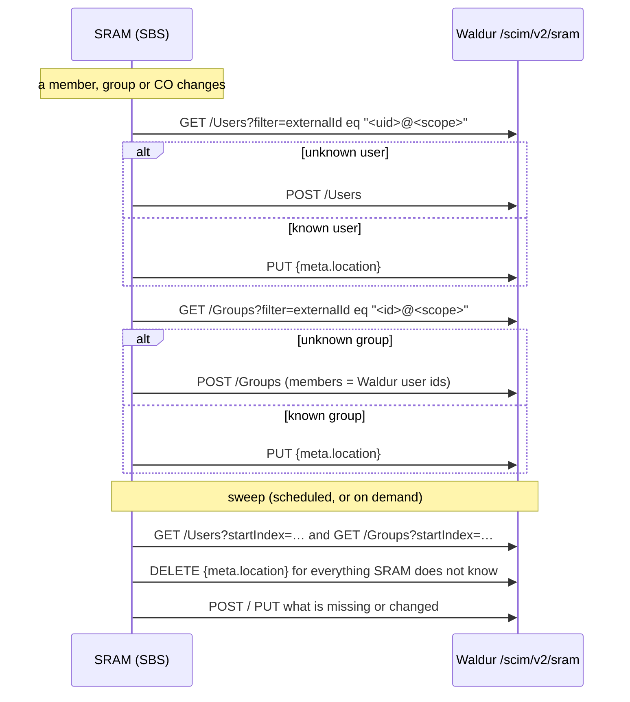

What SRAM sends:

| SCIM resource | Key fields |
|---|---|
| User | `externalId` = `<SRAM uid>@<scope>`, `userName`, `name`, `emails`, `active`, SSH keys base64-encoded in `x509Certificates`, and `urn:mace:surf.nl:sram:scim:extension:User` (`eduPersonUniqueId`, `eduPersonScopedAffiliation`, `voPersonExternalId`, `voPersonExternalAffiliation`, `sramInactiveDays`) |
| Group (CO) | `externalId`, `displayName` = CO name, `members[].value` = the service's user ids, and `urn:mace:surf.nl:sram:scim:extension:Group` with `urn` = `<organisation>:<co>`, `description`, `labels`, `links` |
| Group (CO sub-group) | as above, with `urn` = `<organisation>:<co>:<group>` and no labels |

SRAM authenticates with `Authorization: Bearer <token>`, where the token is
whatever the service registered in SRAM. Every call to a service goes through
one worker queue per SCIM endpoint. Errors are logged on the SRAM side and never
retried, except by the next change or sweep.

### The sweep

A sweep lists **every** user and group the service returns, deletes each one
whose `externalId` SRAM does not recognise, and then creates or updates the rest.
Waldur therefore serves SRAM on its own base URL, `/scim/v2/sram/`, which lists,
updates and deletes only the users and groups SRAM provisioned. Local accounts,
staff and Waldur's own role groups are invisible there, so a sweep cannot touch
them.

Register Waldur as **one** SRAM service: all services pointing at the same
Waldur share one set of SRAM objects, so one service's sweep would delete what
another provisioned.

## What Waldur does with SRAM data

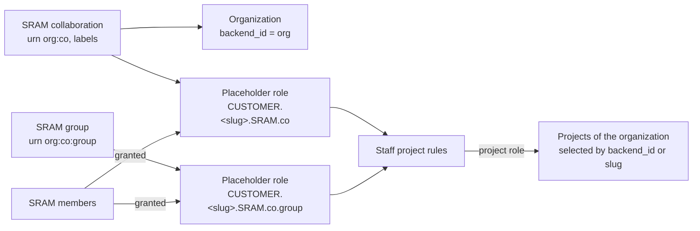

| SRAM | Waldur |
|---|---|
| User | A Waldur account, matched to an existing one by `SCIM_USER_MATCH_WALDUR_ATTRIBUTE` / `SCIM_USER_MATCH_SCIM_ATTRIBUTE` (default: `userName` → username). With username matching, new accounts are named after the matched value, so pick the attribute your login uses, e.g. `urn:mace:surf.nl:sram:scim:extension:User.eduPersonUniqueId` when users log in through SRAM with `sub` as username. Staff and support accounts are never linked. SSH keys follow `x509Certificates` when `SCIM_INBOUND_SSH_KEYS_ENABLED` is on; `eduPersonScopedAffiliation` becomes affiliations. A user without given and family names gets them from the display name. A suspended user is deactivated and keeps its attributes; a deleted user is deactivated. |
| Organisation short name (first URN segment) | The organization whose `backend_id` equals it. Otherwise an organization with exactly that name and no `backend_id` is adopted (an event records it). Otherwise one is created. Organizations are never deleted. |
| Collaboration and group | A placeholder role private to the organization, named `CUSTOMER.<org-slug>.SRAM.<co>[.<group>]`, described by the SRAM display name, with the permissions of `SRAM_PLACEHOLDER_ROLE_TEMPLATE` (none by default). Active members hold it; members who leave lose it. Deleting the group revokes every grant of the role and deletes it. The role can also be granted by hand. |
| Collaboration labels, group short names | Conditions of staff-defined **project rules** (Administration → Configuration → SRAM integration, or `/api/sram-project-rules/`). A rule grants a project role to all holders of matching placeholder roles, on the organization's projects selected by `backend_id` or slug, e.g. `backend_id` starting with `{co_external_id}_` for workspaces an external system creates. Rules apply retroactively and follow membership, label and project changes. |

In Waldur, the collaboration's members hold its placeholder role, and a
project rule gives them a role in the organization's workspaces. Both are
marked **SRAM**:

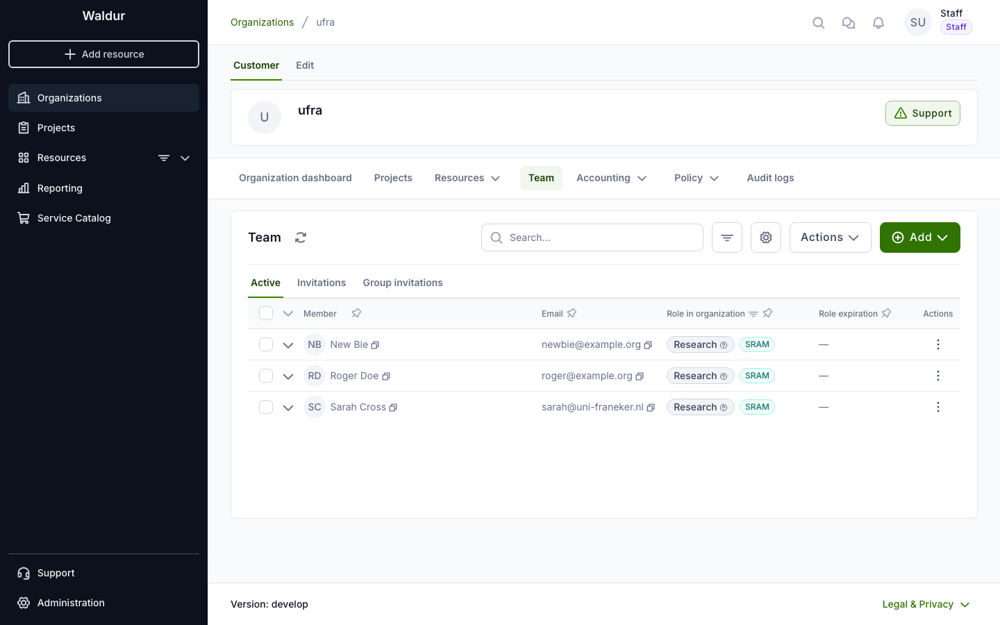

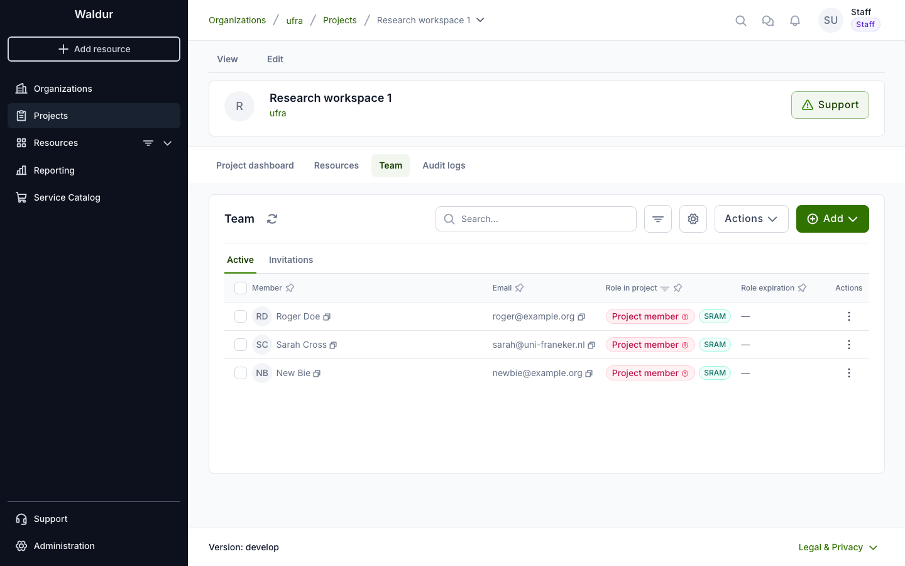

SRAM-made grants carry `UserRole.source` (`sram:…`, `sram-rule:…`). Their
events are logged without email, and holders count toward the organization's
user quota. `waldur sram_resync` re-applies the stored SRAM data, for example
after changing the placeholder template.

!!! tip "Keep the team private"
    Listing an organization's or project's members requires `CUSTOMER.VIEW_TEAM`
    or `PROJECT.VIEW_TEAM`. The built-in owner, support, reader and project roles
    have it, and upgrading adds it to their organization-specific copies too.
    Placeholder roles only have it if `SRAM_PLACEHOLDER_ROLE_TEMPLATE` does, so
    by default SRAM members cannot see who else is in the organization.

## Connecting a Waldur deployment

1. Make `/scim/v2/` reachable from SRAM (the Helm chart and docker-compose
   route it) and enable `SCIM_INBOUND_ENABLED` and `SRAM_INTEGRATION_ENABLED`
   in Constance. To show the SRAM administration page and the SRAM markers in
   HomePort, also enable the feature **SRAM integration → integration**
   (`sram.integration`). See
   [SCIM identity provider](../../admin-guide/mastermind-configuration/scim-identity-provider.md).
2. Decide how SRAM users match existing accounts
   (`SCIM_USER_MATCH_WALDUR_ATTRIBUTE`, `SCIM_USER_MATCH_SCIM_ATTRIBUTE`) and
   what placeholder roles may do (`SRAM_PLACEHOLDER_ROLE_TEMPLATE`) **before**
   the first push.

    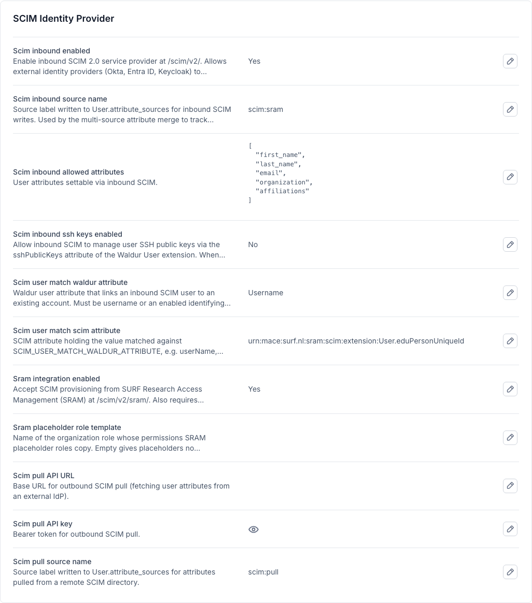

3. Create a staff service account whose token never expires, and note the token:

    ```python
    from rest_framework.authtoken.models import Token
    from waldur_core.core.models import User

    svc, _ = User.objects.get_or_create(username="scim-sram-svc")
    svc.is_staff = True
    svc.is_active = True
    svc.set_unusable_password()
    svc.token_lifetime = None
    svc.save()
    print(Token.objects.get_or_create(user=svc)[0].key)
    ```

4. Optionally set `SCIM_INBOUND_SOURCE_NAME` to `scim:sram`, so SRAM-provided
   attributes are recognisable in the users' attribute sources.
5. In SRAM, open the service, enable SCIM, and set the SCIM URL to
   `https://<waldur-host>/scim/v2/sram` and the bearer token to the token from
   step 3. Enable the sweep: SBS does not push sub-group deletions on its own,
   so the sweep is what removes them.

    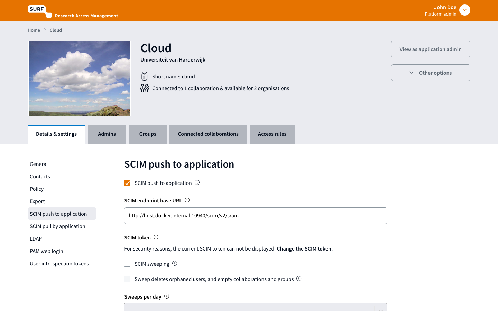

6. Connect the service to a collaboration. SRAM pushes that collaboration's
   members and groups right away.
7. Define project rules for the projects SRAM members should reach.

## Project rules in Waldur

Staff manage the rules under **Administration → Configuration → SRAM
integration**. The page also lists the collaborations and groups SRAM
provisioned, with their organization and placeholder role, and summarises the
SRAM settings.

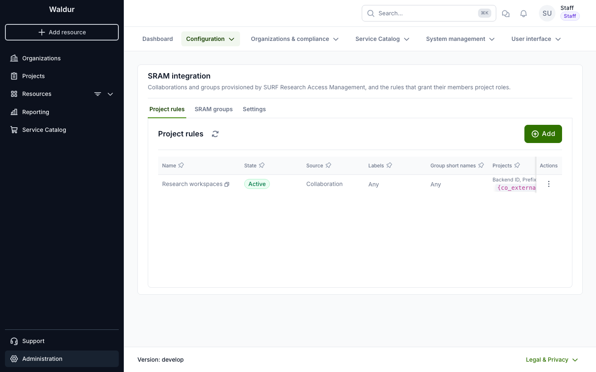

A rule picks SRAM groups (collaborations, groups or both, optionally by label and
group short name) and selects projects of the group's organization by backend ID
or slug. The pattern placeholders are listed under the field:

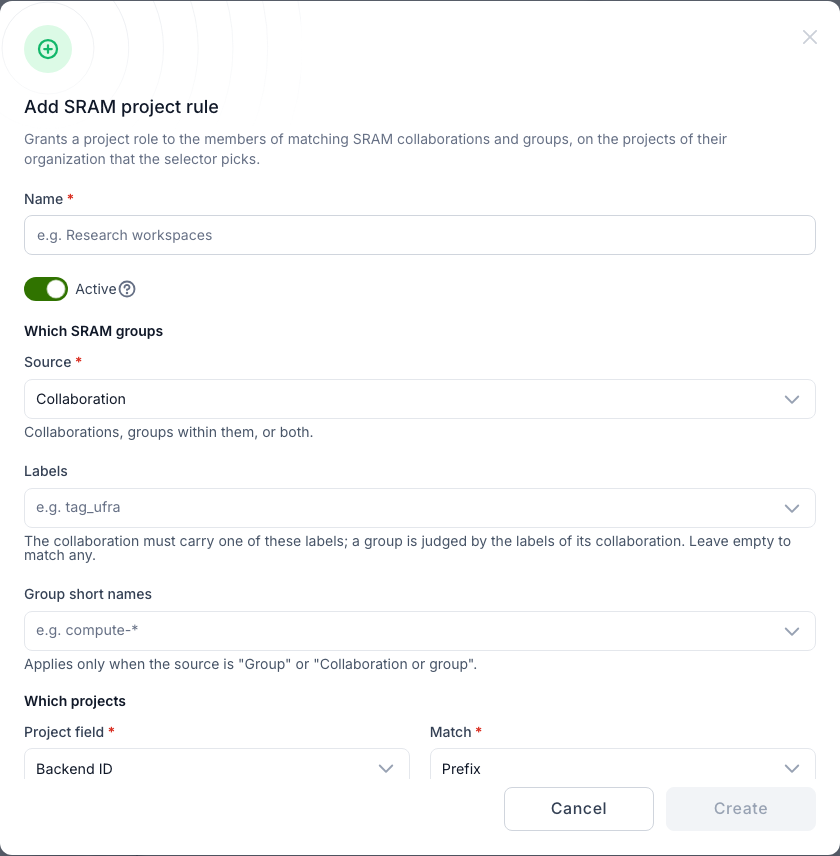

**Preview** shows, per matching group, the projects the rule selects and the
members who get the role:

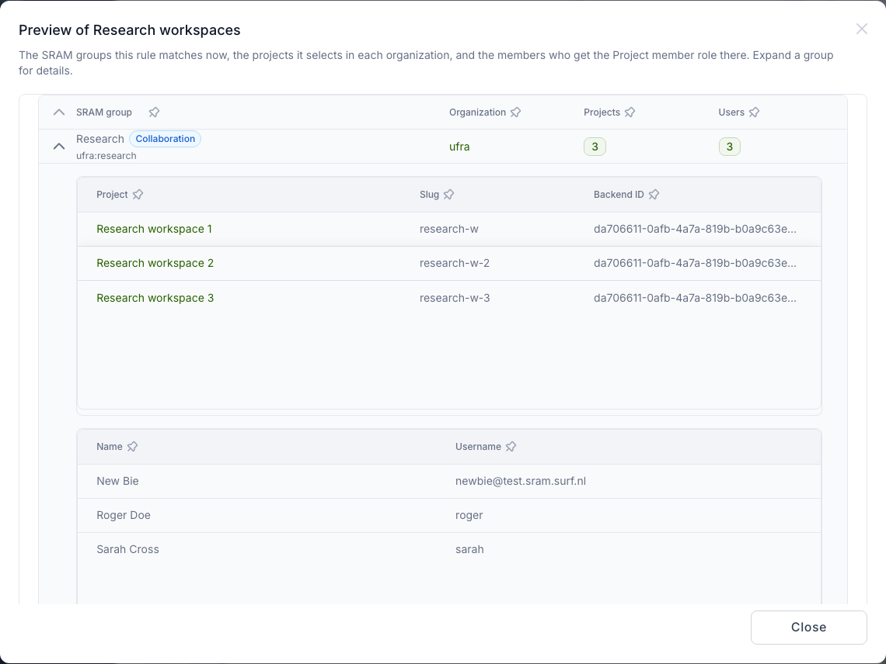

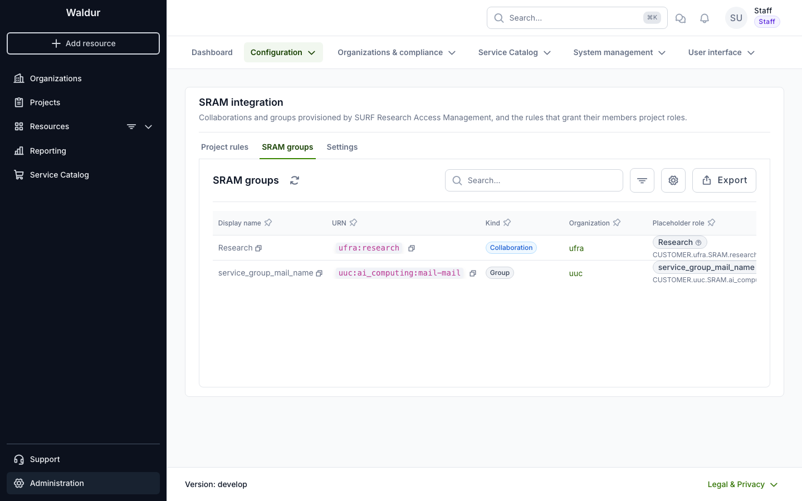

## Switching the integration off

`SRAM_INTEGRATION_ENABLED` is the switch that matters; the `sram.integration`
feature only hides the user interface. While the setting is off, SRAM data is
frozen: SRAM's pushes and the SRAM APIs are refused, and nothing re-applies
placeholder roles or project rules, not even when projects or placeholder
grants change. Existing grants stay. After switching it back on, run
`waldur sram_resync`: it re-applies every collaboration and group and revokes
the grants of rules or groups deleted in the meantime.

## Running SBS locally

SBS ships a Docker Compose stack (MariaDB, Redis, the Flask server and the Vite
client) with a mock login and seed data, so no real identity provider is
needed. The steps below were verified on Apple Silicon with Docker Desktop.
The images build natively for arm64, so the `DOCKER_DEFAULT_PLATFORM=linux/amd64`
from the SBS README is not needed.

### 1. Get SBS and prepare an override

```bash
git clone https://github.com/SURFscz/SBS.git sbs
cd sbs
```

Create `docker-compose.override.yml` (Compose loads it automatically). It moves
the UI to port 18080, lets the server reach a Waldur backend on the host, and
runs the database migrations once before the server starts:

```yaml
services:
  client:
    ports: !override
      - "18080:8080"
  migrate:
    image: sbs-server
    depends_on:
      db:
        condition: service_healthy
      redis:
        condition: service_healthy
    volumes:
      - "${PWD}/etc/config.yml:/etc/config.yml"
      - "${PWD}/server:/opt/server"
    environment:
      CONFIG_TEMPLATE: "/etc/config.yml"
      DATABASE_URI: "mysql+mysqldb://sbs:sbs@db/sbs?charset=utf8mb4"
      REDIS_URI: "redis://redis:6379/"
      SECRET: "${SECRET:-geheim}"
      SKIP_APP_MIGRATIONS: "1"
    command:
      - /bin/bash
      - -c
      - >-
        envsubst <$${CONFIG_TEMPLATE} >server/$${CONFIG} &&
        cd server && python -c "from server.db.db import db_migrations; import os; db_migrations(os.environ['DATABASE_URI'])"
    restart: "no"
  server:
    depends_on:
      migrate:
        condition: service_completed_successfully
    environment:
      BASE_URL: "http://localhost:18080"
      SOCKET_URL: "ws://localhost:18080"
      SKIP_APP_MIGRATIONS: "1"
    extra_hosts:
      - "host.docker.internal:host-gateway"
```

Why the `migrate` service: the server starts eight gunicorn workers, and each
applies migrations on boot. On an empty database they race each other, fail with
`Table 'alembic_version' already exists`, and leave the schema half-migrated.
If that has already happened, reset with `docker compose down -v` (it removes
only the SBS database volume).

!!! note "gunicorn 26 and the eventlet worker"
    If the server exits with `Entry point ('gunicorn.workers', 'eventlet') not found`,
    the checkout pins a gunicorn release that no longer ships the eventlet
    worker. Pin `gunicorn==25.3.0` in `server/pyproject.toml` and rebuild with
    `docker compose build server`.

### 2. Start and seed

```bash
docker compose build
docker compose up -d
curl -s http://localhost:18080/health   # {"components":{"database":"UP","redis":"UP"},"status":"UP"}
```

The compose file sets `ALLOW_MOCK_USER_API=1`, `PROFILE=local` and `TESTING=1`,
which enables the mock login and disables the CSRF check. `urn:john` is the
platform admin. Log in, accept the acceptable use policy, and load the seed:

```bash
B=http://localhost:18080
J=sbs-cookies.txt
login() {
  curl -s -c $J -b $J -X PUT -H 'Content-Type: application/json' \
    -d '{"sub":"urn:john","name":"John Doe","email":"john@example.org"}' $B/api/mock
}
login; login          # the first call creates the user, the second binds the session to it
curl -s -c $J -b $J -X POST -H 'Content-Type: application/json' -d '{}' $B/api/aup/agree
curl -s -c $J -b $J $B/api/users/me | jq '{uid, admin}'
curl -s -c $J -b $J $B/api/system/seed   # replaces all data; log in again afterwards
login
```

In a browser, open <http://localhost:18080> and use the mock login page instead.

The seed contains several SCIM-enabled services that push to SBS's own mock
SCIM receiver (`http://localhost:8080/api/scim_mock`). Among them:

| Service | Connected collaboration | Sweep |
|---|---|---|
| Cloud (id 3) | `research` | off |
| Storage (id 4) | `research` | off |
| Network Services (id 6) | `ai_computing` | on, with orphan removal |

The seed's `id_scope` is `test.sram.surf.nl`, so local `externalId` values end
in `@test.sram.surf.nl`.

### 3. Prepare the Waldur dev stack

The SBS server reaches the host as `host.docker.internal`, which the Waldur
development settings do not allow. Add a settings module next to
`dev_settings.py`, for example `dev_settings_sram.py`, and keep it out of commits:

```python
from waldur_core.server.dev_settings import *  # noqa

ALLOWED_HOSTS = [*ALLOWED_HOSTS, "host.docker.internal"]  # noqa: F405
```

Start the backend with `DJANGO_SETTINGS_MODULE=waldur_core.server.dev_settings_sram`,
run `waldur migrate`, enable `SCIM_INBOUND_ENABLED` and `SRAM_INTEGRATION_ENABLED`,
and create the service account from
[Connecting a Waldur deployment](#connecting-a-waldur-deployment).

Check that the SBS container can reach Waldur (replace the port with your
backend's):

```bash
docker exec sbs-server python -c "import requests; print(requests.get('http://host.docker.internal:10780/scim/v2/sram/ServiceProviderConfig', headers={'Authorization': 'Bearer <token>'}).status_code)"
```

### 4. Point a service at Waldur

```bash
curl -s -c $J -b $J -X PUT -H 'Content-Type: application/json' \
  -d '{"scim_url":"http://host.docker.internal:10780/scim/v2/sram","scim_bearer_token":"<token>"}' \
  $B/api/services/reset_scim_bearer_token/3
```

SBS stores the token encrypted, so set it through this endpoint or the service's
SCIM settings in the UI, never directly in the database.

### 5. Trigger a push

Any change to the connected collaboration pushes to the service: add or remove a
member, edit a group, change labels. To push everything for a service at once,
run a sweep as the admin:

```bash
curl -s -c $J -b $J -X PUT $B/api/scim/v2/sweep?service_id=3 | jq
```

The response lists what SBS created, updated and deleted. SBS logs the service's
errors as `Scim endpoint … returned error <status>` (`docker logs sbs-server`).
The Waldur side logs every request in its backend log.

### What to expect

With the seeded Cloud service (collaboration `research` of organisation `ufra`,
sub-group `science`) pointed at a Waldur dev stack:

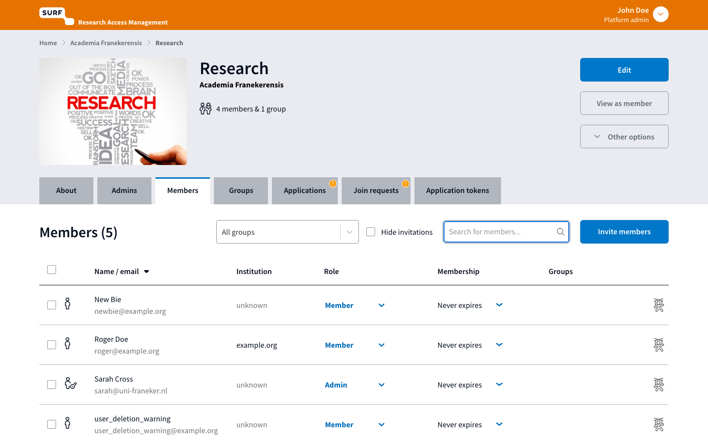

1. A sweep creates the collaboration's members as users, the `ufra`
   organization (or adopts an existing one named `ufra`), and the placeholder
   roles `CUSTOMER.ufra.SRAM.research` and `CUSTOMER.ufra.SRAM.research.science`,
   held by the active members. A second sweep reports nothing to do.
2. Create workspaces the way an external system would:

    ```bash
    curl -s -X POST -H "Authorization: Token <token>" -H 'Content-Type: application/json' \
      -d '{"name":"Research workspace 1","customer":"http://localhost:10780/api/customers/<ufra uuid>/","backend_id":"<research externalId>_ws1"}' \
      http://localhost:10780/api/projects/
    ```

3. Add a project rule (Administration → Configuration → SRAM integration, or
   `POST /api/sram-project-rules/`) with `project_field=backend_id`,
   `project_match=prefix`, `project_pattern={co_external_id}_` and
   `PROJECT.MEMBER`. The members get the role on every matching workspace;
   `GET /api/sram-project-rules/<uuid>/preview/` shows who and where.
4. Remove a member in SBS (`DELETE /api/collaboration_memberships/<co id>/<user id>`):
   SBS pushes the groups, and the member loses the placeholder and the
   workspace roles. Deleting the rule revokes all its grants.

## Capturing SRAM payloads

To record exactly what SRAM sends without a Waldur backend, leave a service
pointed at SBS's mock receiver. The seeded services have no SCIM token, so give
the service one first, because the mock checks it:

```bash
curl -s -c $J -b $J -X PUT -H 'Content-Type: application/json' \
  -d '{"scim_url":"http://localhost:8080/api/scim_mock","scim_bearer_token":"mock-secret"}' \
  $B/api/services/reset_scim_bearer_token/4
curl -s -c $J -b $J -X PUT $B/api/scim/v2/sweep?service_id=4
curl -s -c $J -b $J $B/api/scim_mock/statistics > sram-scim-calls.json
```

`statistics` returns every recorded call per service (method, path, query and
JSON body) plus the mock's stored resources. That makes it a good source of
realistic test fixtures. `DELETE /api/scim_mock/clear` resets it.

## Cleaning up

```bash
docker compose down -v   # in the sbs checkout
```

Restore the service's SCIM URL (or re-run the seed) before pointing another
Waldur stack at the same SBS.

## References

- [SBS source](https://github.com/SURFscz/SBS), in particular `server/scim/`
  (the SCIM client) and `server/api/scim.py` (sweep and SRAM's own SCIM API)
- [SRAM API documentation](https://sram.surf.nl/apidocs/)
- [SCIM identity provider](../../admin-guide/mastermind-configuration/scim-identity-provider.md)
