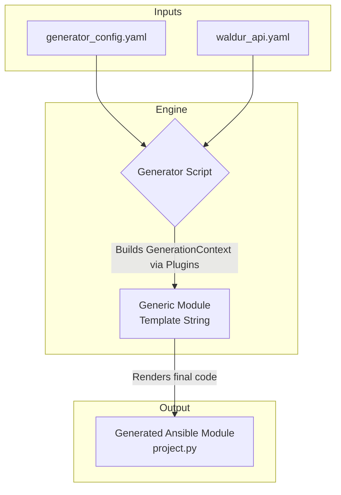
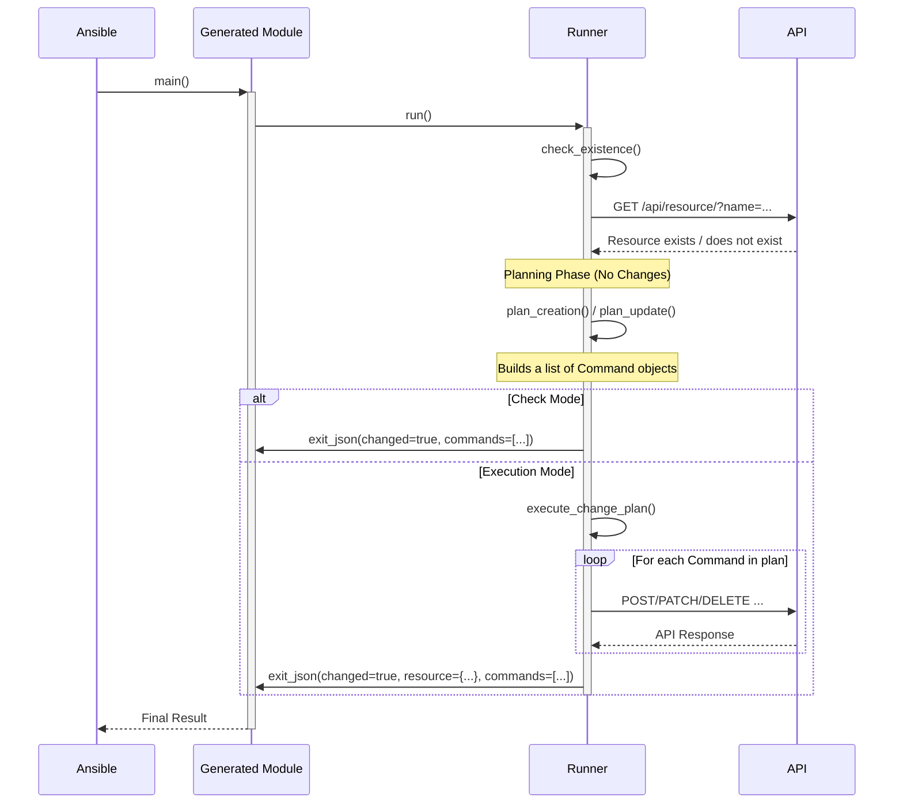

# Ansible Waldur Module Generator

This project is a code generator designed to automate the creation of a self-contained **Ansible Collection** for the Waldur API. By defining a module's behavior and its API interactions in a simple YAML configuration file, you can automatically generate robust, well-documented, and idempotent Ansible modules, perfectly packaged for distribution and use.

The primary goal is to eliminate boilerplate code, enforce consistency, and dramatically speed up the development process for managing Waldur resources with Ansible. Waldur Ansible Collection is published on [Ansible Galaxy](https://galaxy.ansible.com/ui/repo/published/waldur/openstack/).

## Core Concept

The generator works by combining three main components:

1.  **OpenAPI Specification (`waldur_api.yaml`):** The single source of truth for all available API endpoints, their parameters, and their data models.
2.  **Generator Configuration (`generator_config.yaml`):** A user-defined YAML file where you describe the Ansible Collection and the modules you want to create. This is where you map high-level logic (like "create a resource") to specific API operations.
3.  **Plugins:** The engine of the generator. A plugin understands a specific workflow or pattern (e.g., fetching facts, simple CRUD, or complex marketplace orders) and contains the logic to build the corresponding Ansible module code.

## Getting Started

### Prerequisites

-   Python 3.11+
-   [Poetry](https://python-poetry.org/docs/#installation) (for dependency management and running scripts)
-   Ansible Core (`ansible-core >= 2.14`) for building and using the collection.

### Installation

1.  Clone the repository:
    ```bash
    git clone <your-repo-url>
    cd ansible-waldur-generator
    ```

2.  Install the required Python dependencies using Poetry:
    ```bash
    poetry install
    ```
    This will create a virtual environment and install packages like `PyYAML`, and `Pytest`.

### Running the Generator

To generate the Ansible Collection, run the `generate` script defined in `pyproject.toml`:

```bash
poetry run ansible-waldur-generator
```

By default, this command will:

-   Read `inputs/generator_config.yaml` and `inputs/waldur_api.yaml`.

-   Use the configured collection name (e.g., `waldur.openstack`) to create a standard Ansible Collections structure.

-   Place the generated collection into the `outputs/` directory.

The final structure will look like this:
```
outputs/
└── ansible_collections/
    └── waldur/
        ├── structure/          # Collection 1
        │   ├── galaxy.yml
        │   ├── plugins/
        │   │   ├── modules/
        │   │   │   ├── customer.py
        │   │   │   └── project.py
        │   │   └── module_utils/
        │   └── ...
        ├── openstack/          # Collection 2
        │   ├── galaxy.yml
        │   ├── plugins/
        │   │   ├── modules/
        │   │   │   ├── volume.py
        │   │   │   └── security_group.py
        │   │   └── module_utils/
        │   └── ...
        └── slurm/              # Collection 3
            ├── galaxy.yml
            └── ...
```

You can customize the path using command-line options:
```bash
poetry run generate --config my_config.yaml --output-dir ./dist
```
Run `poetry run ansible-waldur-generator --help` for a full list of options.

## The Plugin System

The generator uses a plugin-based architecture to handle different types of module logic. Each plugin is specialized for a common interaction pattern with the Waldur API. When defining a module in `generator_config.yaml`, the `type` key determines which plugin will be used.

The header defines Ansible collection namespace, name and version.

```yaml
collections:
  - namespace: waldur
    name: structure
    version: 1.0.0
    modules:
      - name: modename
        plugin: crud
```

Below is a detailed explanation of each available plugin.

---

### 1. The `facts` Plugin

-   **Purpose:** For creating **read-only** Ansible modules that fetch information about existing resources. These modules never change the state of the system and are analogous to Ansible's `_facts` modules (e.g., `setup_facts`).

-   **Workflow:**
    1.  The module's primary goal is to find and return resource data based on an identifier (by default, `name`).
    2.  If the `many: true` option is set, the module returns a list of all resources matching the filter criteria.
    3.  If `many: false` (the default), the module expects to find a single resource. It will fail if zero or multiple resources are found, prompting the user to provide a more specific identifier.
    4.  It can be configured with `context_params` (like `tenant` or `project`) to filter the search within a parent resource.

-   **Configuration Example (`generator_config.yaml`):**
    This example creates a `waldur_openstack_security_group_facts` module to get information about security groups within a specific tenant.

    ```yaml
    modules:
      - name: security_group_facts
        plugin: facts
        resource_type: "security group"
        description: "Get facts about OpenStack security groups."

        # Defines the base prefix for API operations. The 'facts' plugin uses
        # this to automatically infer the necessary operation IDs:
        #  - `check`: via `openstack_security_groups_list`
        #  - `retrieve`: via `openstack_security_groups_retrieve`
        # The 'operations' block is therefore not needed for a conventional API.
        base_operation_id: "openstack_security_groups"

        # If `true`, the module is allowed to return a list of multiple resources
        # that match the filter criteria.
        # If `false` (the default), the module would fail if more than one
        # resource is found, ensuring a unique result.
        many: true

        # Defines additional parameters that can be used to filter the search.
        # This is essential for finding resources within a specific scope.
        context_params:
          - # The name of the Ansible parameter the user will provide.
            name: "tenant"
            description: "The name or UUID of the tenant to filter security groups by."

            # Tells the generator how to resolve the user-provided 'tenant' name
            # into the UUID needed by the API. The string "openstack_tenants" is
            # a shorthand that expands to the standard list/retrieve operations for tenants.
            resolver: "openstack_tenants"

            # Specifies the exact query parameter key to use when calling the 'check'
            # operation. The generator will construct a query like:
            # `?tenant_uuid=<resolved_tenant_uuid>`
            filter_key: "tenant_uuid"
    ```

---

### 2. The `crud` Plugin

-   **Purpose:** For managing the full lifecycle of resources with **simple, direct, synchronous** API calls. This is ideal for resources that have distinct `create`, `list`, `update`, and `destroy` endpoints. The plugin supports both top-level resources (like projects) and nested resources (like security groups under a tenant).

-   **Workflow:**
    -   **`state: present`**:
        1.  Calls the `list` operation to check if a resource with the given name already exists.
        2.  If it **does not exist**, it calls the `create` operation. `resolvers` and `path_param_maps` are used to convert parent resource names into the required API URLs or path UUIDs.
        3.  If it **does exist**, it checks for changes:
            -   It compares values for parameters listed in `update_config.fields` and sends a `PATCH` request via the `update` operation if any have changed.
            -   It checks if any parameters for special `update_config.actions` are provided and calls their respective `POST` operations.
                -   **Asynchronous Actions**: If the `POST` action returns a `202 Accepted` status code, the module recognizes it as an asynchronous task.
                -   If the `wait: true` parameter is set (the default), the module will poll the resource's status until it reaches a stable state (e.g., "OK" or "ERRED").
                -   You can configure the stable/error states and polling parameters in `generator_config.yaml`.
    -   **`state: absent`**:
        1.  Calls the `list` operation to find the resource.
        2.  If it exists, it calls the `destroy` operation to remove it.

-   **Return Values:**
    -   `resource`: A dictionary representing the final state of the resource after the operation.
    -   `commands`: A list of dictionaries detailing the HTTP requests that were made to achieve the desired state. This is useful for auditing and debugging.
    -   `changed`: A boolean indicating if any changes were made.

-   **Configuration Example (`generator_config.yaml`):**
    This example creates a `security_group` module that is a **nested resource** under a tenant, and supports both simple updates (description) and a special action (set_rules).

    ```yaml
    modules:
      - name: security_group
        plugin: crud
        resource_type: "OpenStack security group"
        description: "Manage OpenStack Security Groups and their rules in Waldur."

        # The core prefix for inferring standard API operation IDs.
        # By providing this, the generator automatically enables:
        #  - `check`: via `openstack_security_groups_list`
        #  - `delete`: via `openstack_security_groups_destroy`
        base_operation_id: "openstack_security_groups"

        # The 'operations' block is now only for EXCEPTIONS and detailed configuration.
        # Since 'check' and 'delete' follow the convention, they are omitted here.
        operations:

            # Defines special, non-standard update actions that call dedicated
            # POST endpoints. These are idempotent and schema-aware.
            actions:
              # 'set_rules' is the logical name for our action.
              set_rules:
                # The specific operationId to call when this action is triggered.
                operation: "openstack_security_groups_set_rules"
                # The name of the Ansible parameter that triggers this action and
                # provides its data. The runner will only call the operation if
                # the user provides the 'rules' parameter AND its value differs
                # from the resource's current state.
                param: "rules"

          # Override the 'create' operation.
          # This is necessary because creating a security group is a NESTED action
          # under a tenant, so it doesn't follow the standard '[base_id]_create' pattern.
          create:
            id: "openstack_tenants_create_security_group"

            # This block is crucial for nested endpoints. It maps the placeholder
            # in the API URL path (`/api/openstack-tenants/{uuid}/...`) to the
            # name of an Ansible parameter (`tenant`).
            path_params:
              uuid: "tenant"

        wait_config:
          ok_states: ["OK"] # The state(s) that mean success
          erred_states: ["ERRED"] # The state(s) that mean failure
          state_field: "state" # The key in the resource dict that holds the state

        # This block defines how to resolve dependencies.
        resolvers:
          # We need a resolver for 'tenant' because it's used in `path_params` for
          # the 'create' operation. This tells the generator how to convert the
          # user-friendly tenant name or UUID into the internal API URL/UUID
          # needed for the API call.
          tenant: "openstack_tenants" # Shorthand for the tenants resolver
    ```

---

### 3. The `order` Plugin

-   **Purpose:** The most powerful and specialized plugin, designed for resources managed through Waldur's **asynchronous marketplace order workflow**. This is the correct plugin for nearly all major cloud resources like VMs, volumes, databases, etc.

**Attribute Inference**: To simplify configuration, you can specify an offering_type. The generator will then look for a corresponding schema in the OpenAPI specification (e.g., Marketplace.Volume becomes MarketplaceVolumeCreateOrderAttributes) and automatically generate all the necessary attribute_params. Any manually defined attribute_params will override the inferred ones, allowing for customization.

**Termination Attributes**: You can define a set of optional parameters that will be passed as attributes in the termination order. This is useful for resources that require extra options during deletion, such as forcing destruction or deleting associated sub-resources. This is configured under the `operations.delete` key. You can use the `maps_to` field to define a different name for the attribute in the API payload.

-   **Workflow:** This plugin encapsulates a complex, multi-step process:
    -   **`state: present`**:
        1.  Checks for the existence of the *final resource* (e.g., the volume) using `existence_check_op`.
        2.  If it **does not exist**, it creates a marketplace order via `marketplace_orders_create` and, if `wait: true`, polls for completion.
        2.  If it **does exist**, it checks for changes. It supports two kinds of updates:
            -   **Synchronous Updates:** For simple fields inferred from update request schema, it sends a direct `PATCH` request.
            -   **Asynchronous Actions:** For complex operations defined in `update_actions`, it sends a `POST` request. If this request returns a `202 Accepted` status, the module recognizes it as an asynchronous task. If `wait: true` is set, the module will then poll the *resource's status* (not the order) until it reaches a stable state (e.g., "OK" or "Erred"), which can be configured via `wait_config`.
    -   **`state: absent`**:
        1.  Finds the existing resource.
        2.  Calls the standard `marketplace_resources_terminate` endpoint, passing any configured termination attributes.

-   **Return Values:**
    -   `resource`: A dictionary representing the final state of the resource after a successful operation.
    -   `commands`: A list of dictionaries detailing the HTTP requests that were made.
    -   `changed`: A boolean indicating if any changes were made.

-   **Configuration Example (`generator_config.yaml`):**

    ```yaml
    modules:
      - name: volume
        plugin: order
        resource_type: "OpenStack volume"
        description: "Create, update, or delete an OpenStack Volume via the marketplace."

        # By specifying the offering type, the generator will automatically find the
        # corresponding schema in the OpenAPI specification (e.g., for volume size,
        # image, etc.) and generate all the necessary Ansible parameters.
        # This dramatically reduces the amount of manual configuration required.
        offering_type: "OpenStack.Volume"

        # The base prefix for inferring standard API operation IDs.
        # The 'order' plugin uses this to automatically enable:
        #  - `check`: via `openstack_volumes_list` (to see if the volume already exists)
        base_operation_id: "openstack_volumes"

        # This block defines how to resolve dependencies and filter choices for the
        # module's parameters.
        resolvers:
          # This resolver is for the 'type' parameter, which was automatically
          # inferred from the offering_type schema.
          type:
            # Shorthand for the volume types API endpoints.
            base: "openstack_volume_types"
            # This is a powerful feature for dependent filtering. It tells the
            # generator to filter the list of available volume types based on
            # the cloud settings of the selected 'offering'.
            filter_by:
              - # The parameter whose resolved value we will use as the filter source.
                source_param: "offering"
                # The key to extract from the resolved offering's API response.
                source_key: "scope_uuid"
                # The query parameter to use when listing volume types. The final
                # API call will be something like:
                # `.../openstack-volume-types/?tenant_uuid=<offering_scope_uuid>`
                target_key: "tenant_uuid"

          # The same dependent filtering pattern is applied to the 'image' parameter.
          image:
            base: "openstack_images"
            filter_by:
              - source_param: "offering"
                source_key: "scope_uuid"
                target_key: "tenant_uuid"

          # And again for the 'availability_zone' parameter.
          availability_zone:
            base: "openstack_volume_availability_zones"
            filter_by:
              - source_param: "offering"
                source_key: "scope_uuid"
                target_key: "tenant_uuid"
    ```

### Reusable Configuration with YAML Anchors

As your `generator_config.yaml` file grows, you'll notice that certain configurations, especially for `resolvers` or `update_config`, are repeated across multiple modules. To keep your configuration DRY (Don't Repeat Yourself) and improve maintainability, you can use a standard YAML feature called **anchors (`&`)** and **aliases (`*`)**.

The generator's YAML parser supports this out of the box, allowing you to define a configuration block once and reuse it wherever needed.

A common convention is to create a top-level key (e.g., `definitions` or `x-fragments`) to hold your reusable blocks.

#### Example 1: Reusing a Common Resolver

Imagine you have two modules that both need to resolve a `tenant`.

**Before (Repetitive Configuration):**

```yaml
collections:
  - namespace: waldur
    name: openstack
    version: 1.0.0
    modules:
      - name: security_group
        plugin: crud
        resource_type: "security group"
        # ... other config ...
        resolvers:
          tenant:
            list: "openstack_tenants_list"
            retrieve: "openstack_tenants_retrieve"
            error_message: "Tenant '{value}' not found."

      - name: volume_facts
        plugin: facts
        resource_type: "volume"
        # ... other config ...
        context_params:
          - name: "tenant"
            description: "The tenant to filter volumes by."
            resolver:
              list: "openstack_tenants_list"
              retrieve: "openstack_tenants_retrieve"
              filter_key: "tenant_uuid"
```

**After (Using a Reusable Anchor):**

We define the resolver once under a `definitions` key and give it an anchor `&tenant_resolver`. Then, we use the alias `*tenant_resolver` to insert that block in multiple places.

```yaml
# Define reusable configuration blocks at the top level.
definitions:
  # This entire block is now anchored with the name 'tenant_resolver'.
  tenant_resolver: &tenant_resolver
    list: "openstack_tenants_list"
    retrieve: "openstack_tenants_retrieve"
    error_message: "Tenant '{value}' not found."

collections:
  - namespace: waldur
    name: openstack
    version: 1.0.0
    modules:
      - name: security_group
        plugin: crud
        resource_type: "security group"
        # ... other config ...
        resolvers:
          # Use the alias '*' to insert the anchored block here.
          tenant: *tenant_resolver

      - name: volume_facts
        plugin: facts
        resource_type: "volume"
        # ... other config ...
        context_params:
          - name: "tenant"
            description: "The tenant to filter volumes by."
            # The alias works for nested keys too.
            resolver: *tenant_resolver
            filter_key: "tenant_uuid"
```

#### Example 2: Creating a Reusable Module Template

You can make entire module definitions reusable by combining anchors with the YAML **merge key (`<<`)**. This allows you to define a "base" module and then override or extend it for specific cases.

This is perfect for a set of simple CRUD resources that share the same plugin type and update logic but differ only in their `resource_type` and API `base_operation_id`.

```yaml
definitions:
  # Define a base template for a simple CRUD module.
  base_crud_module: &base_crud_module
    plugin: crud
    update_config:
      fields:
        - "name"
        - "description"

collections:
  - namespace: waldur
    name: structure
    version: 1.0.0
    modules:
      - name: customer
        # The '<<: *base_crud_module' line merges the anchored block.
        # Keys defined here will override any from the base template.
        <<: *base_crud_module
        resource_type: "customer"
        base_operation_id: "customers"
        description: "Manage Customers in Waldur."

      - name: project
        <<: *base_crud_module
        resource_type: "project"
        base_operation_id: "projects"
        description: "Manage Projects in Waldur."
        # You can also add keys that don't exist in the base template.
        resolvers:
          customer:
            list: "customers_list"
            retrieve: "customers_retrieve"
            error_message: "Customer '{value}' not found."
```

By using these standard YAML features, you can significantly reduce duplication and make your generator configuration cleaner and easier to manage.

## Architecture

The generator's architecture is designed to decouple the Ansible logic from the API implementation details. It achieves this by using the `generator_config.yaml` as a "bridge" between the OpenAPI specification and the generated code. The generator can produce multiple, self-contained Ansible Collections in a single run.




### Plugin-Based Architecture

The system's flexibility comes from its plugin architecture. The `Generator` itself does not know the details of a `crud` module versus an `order` module. It only knows how to interact with the `BasePlugin` interface.

1.  **Plugin Discovery**: The `PluginManager` uses Python's entry point system to automatically discover and register plugins at startup.
2.  **Delegation**: The `Generator` reads a module's `plugin` key from the config and asks the `PluginManager` for the corresponding plugin.
3.  **Encapsulation**: Each plugin fully encapsulates the logic for its type. It knows how to parse its specific YAML configuration, interact with the `ApiSpecParser` to get operation details, and build the final `GenerationContext` needed to render the module.
4.  **Plugin Contract**: All plugins implement the `BasePlugin` interface, which requires a central `generate()` method. This ensures a consistent interaction pattern between the `Generator` and all plugins.

### Runtime Logic (Runners and the Resolver)

The logic that executes at runtime inside an Ansible module is split between two key components: **Runners** and the **ParameterResolver**.

1.  **Runners (`runner.py`)**: Each plugin is paired with a `runner.py` file (e.g., `CrudRunner`, `OrderRunner`). This runner contains the Python logic for the module's state management (create, update, delete). The generated module file (e.g., `project.py`) is a thin wrapper that calls its corresponding runner. The generator copies the runner and a `base_runner.py` into the collection's `plugins/module_utils/` directory and rewrites their imports, making the collection **fully self-contained**.

2.  **ParameterResolver**: This is a powerful, centralized utility that is composed within each runner. Its sole responsibility is to handle the complex, recursive resolution of user-friendly inputs (like resource names) into the URLs or other data structures required by the API. By centralizing this logic, runners are kept clean and focused on their state-management tasks. The resolver supports:
    *   Simple name/UUID to URL conversion.
    *   Recursive resolution of nested dictionaries and lists.
    *   Caching of API responses to avoid redundant network calls.
    *   Dependency-based filtering (e.g., filtering flavors by the tenant of a resolved offering).

### The "Plan and Execute" Runtime Model

While the generator builds the module code, the real intelligence lies in the runtime architecture it creates. All generated modules follow a robust, two-phase **"plan and execute"** workflow orchestrated by a `BaseRunner` class, which is vendored into the collection's `module_utils`.

1.  **Planning Phase**: The `BaseRunner` first determines the current state of the resource (does it exist?). It then calls a `plan_*` method (e.g., `plan_creation`, `plan_update`) corresponding to the desired state. This planning method **does not make any changes** to the system. Instead, it builds a list of `Command` objects. Each `Command` is a simple data structure that encapsulates a single, atomic API request (method, path, body).

2.  **Execution Phase**: If not in check mode, the `BaseRunner` iterates through the generated plan and executes each `Command`, making the actual API calls.

This separation provides key benefits:
-   **Perfect Check Mode**: Since the planning phase is purely declarative and makes no changes, check mode works perfectly by simply serializing the plan without executing it.
-   **Clear Auditing**: The final output of a module includes a `commands` key, which is a serialized list of the exact HTTP requests that were planned and executed. This provides complete transparency.
-   **Consistency**: All module types (`crud`, `order`) use the same underlying `BaseRunner` and `Command` structure, ensuring consistent behavior.

The diagram below illustrates this runtime workflow.



### The Resolvers Concept: Bridging the Human-API Gap

At the heart of the generator's power is the **Resolver System**. Its fundamental purpose is to bridge the gap between a human-friendly Ansible playbook and the strict requirements of a machine-focused API.

-   **The Problem:** An Ansible user wants to write `customer: 'Big Corp Inc.'`. However, the Waldur API requires a full URL for the customer field when creating a new project, like `customer: 'https://api.example.com/api/customers/a1b2-c3d4-e5f6/'`. Asking users to find and hardcode these URLs is cumbersome, error-prone, and goes against the principle of declarative, readable automation.

-   **The Solution:** Resolvers automate this translation. You define *how* to find a resource (like a customer) by its name or UUID, and the generated module's runtime logic (the "runner") will handle the lookup and substitution for you.

This system is used by all plugins but is most critical for the `crud` and `order` plugins, which manage resource relationships. Let's explore how it works using examples from our `generator_config.yaml`.

#### Simple Resolvers

A simple resolver handles a direct, one-to-one relationship. It takes a name or UUID and finds the corresponding resource's URL. This is common for top-level resources or parent-child relationships.

-   **Mechanism:** It works by using two API operations which are inferred from a base string:
    1.  A `list` operation to search for the resource by its name (e.g., `customers_list` with a `name_exact` filter).
    2.  A `retrieve` operation to fetch the resource directly if the user provides a UUID (this is a performance optimization).

-   **Configuration Example (from `waldur.structure`):**
    This example configures resolvers for the `customer` and `type` parameters in the `project` module.

    ```yaml
    # In generator_config.yaml
    - name: project
      plugin: crud
      base_operation_id: "projects"
      resolvers:
        # Shorthand notation. This tells the generator:
        # 1. There is an Ansible parameter named 'customer'.
        # 2. To resolve it, use the 'customers_list' and 'customers_retrieve' API operations.
        customer: "customers"

        # Another example for the project's 'type'.
        type: "project_types"
    ```

-   **Runtime Workflow:**
    When a user runs a playbook with `customer: "Big Corp"`, the `project` module's runner executes the following logic:

    ```mermaid
    sequenceDiagram
        participant User as Ansible User
        participant Module as waldur.structure.project
        participant Resolver as ParameterResolver
        participant Waldur as Waldur API

        User->>Module: Executes playbook with `customer: "Big Corp"`
        Module->>Resolver: resolve("customer", "Big Corp")
        Resolver->>Waldur: GET /api/customers/?name_exact="Big Corp" (via 'customers_list')
        Waldur-->>Resolver: Returns customer object `{"url": "...", "name": "Big Corp", ...}`
        Resolver-->>Module: Returns resolved URL: "https://.../customers/..."

        Module->>Waldur: POST /api/projects/ with body `{"customer": "https://.../customers/...", "name": "..."}`
        Waldur-->>Module: Returns newly created project
        Module-->>User: Success (changed: true)
    ```

#### Advanced Resolvers: Dependency Filtering

The true power of the resolver system shines when dealing with nested or context-dependent resources. This is essential for the `order` plugin.

-   **The Problem:** Many cloud resources are not globally unique. For example, an OpenStack "flavor" named `small` might exist in multiple tenants. To create a VM, you need the *specific* `small` flavor that belongs to the tenant where you are deploying. A simple name lookup is not enough.

-   **The Solution:** The `order` plugin's resolvers support a `filter_by` configuration. This allows one resolver's lookup to be filtered by the results of another, previously resolved parameter.

-   **Configuration Example (from `waldur.openstack`):**
    This `instance` module resolves a `flavor`. The list of available flavors *must* be filtered by the tenant, which is derived from the `offering` the user has chosen.

    ```yaml
    # In generator_config.yaml
    - name: instance
      plugin: order
      offering_type: OpenStack.Instance
      # ...
      resolvers:
        # The 'flavor' resolver depends on the 'offering'.
        flavor:
          # Shorthand to infer 'openstack_flavors_list' and 'openstack_flavors_retrieve'
          base: "openstack_flavors"

          # This block establishes the dependency.
          filter_by:
            - # 1. Look at the result of the 'offering' parameter.
              source_param: "offering"
              # 2. From the resolved offering's API response, get the value of the 'scope_uuid' key.
              #    (In Waldur, this is the UUID of the tenant associated with the offering).
              source_key: "scope_uuid"
              # 3. When calling 'openstack_flavors_list', add a query parameter.
              #    The parameter key will be 'tenant_uuid', and its value will be the
              #    'scope_uuid' we just extracted.
              target_key: "tenant_uuid"
    ```

-   **Runtime Workflow:** This is a multi-step process managed internally by the runner and resolver.

    ```mermaid
    sequenceDiagram
        participant User as Ansible User
        participant Runner as OrderRunner
        participant Resolver as ParameterResolver
        participant Waldur as Waldur API

        Note over User, Runner: Playbook runs with `offering: "VMs in Tenant A"` and `flavor: "small"`

        Runner->>Resolver: resolve("offering", "VMs in Tenant A")
        Resolver->>Waldur: GET /api/marketplace-public-offerings/?name_exact=...
        Waldur-->>Resolver: Returns Offering object `{"url": "...", "scope_uuid": "tenant-A-uuid", ...}`
        Note right of Resolver: Caches the full Offering object internally.
        Resolver-->>Runner: Returns Offering URL

        Runner->>Resolver: resolve("flavor", "small")
        Note right of Resolver: Sees `filter_by` config for 'flavor'.
        Resolver->>Resolver: Looks up 'offering' in its cache. Finds the object.
        Resolver->>Resolver: Extracts `scope_uuid` ("tenant-A-uuid") from cached object.

        Note right of Resolver: Builds query: `?name_exact=small&tenant_uuid=tenant-A-uuid`
        Resolver->>Waldur: GET /api/openstack-flavors/?name_exact=small&tenant_uuid=tenant-A-uuid
        Waldur-->>Resolver: Returns the correct Flavor object for Tenant A.
        Resolver-->>Runner: Returns Flavor URL

        Note over Runner, Waldur: Runner now has all resolved URLs and creates the final marketplace order.
    ```

#### Resolving Lists of Items

Another common scenario is a parameter that accepts a list of resolvable items, such as the `security_groups` for a VM.

-   **The Problem:** The user wants to provide a simple list of names: `security_groups: ['web', 'ssh']`. The API, however, often requires a more complex structure, like a list of objects: `security_groups: [{ "url": "https://.../sg-web-uuid/" }, { "url": "https://.../sg-ssh-uuid/" }]`.

-   **The Solution:** The resolver system handles this automatically. The generator analyzes the OpenAPI schema for the `offering_type`. When it sees that the `security_groups` attribute is an `array` of objects with a `url` property, it configures the runner to:
    1.  Iterate through the user's simple list (`['web', 'ssh']`).
    2.  Resolve each name individually to its full object, using the `security_groups` resolver configuration (which itself uses dependency filtering, as shown above).
    3.  Extract the `url` from each resolved object.
    4.  Construct the final list of dictionaries in the format required by the API.

This powerful abstraction keeps the Ansible playbook clean and simple, hiding the complexity of the underlying API. The user only needs to provide the list of names, and the resolver handles the rest.

## The Unified Update Architecture

The generator employs a sophisticated, unified architecture for handling resource updates within `state: present` tasks. This system is designed to be both powerful and consistent, ensuring that all generated modules—regardless of their plugin (`crud` or `order`)—behave predictably and correctly, especially when dealing with complex data structures.

The core design principle is **"Specialized Setup, Generic Execution."** Specialized runners (`CrudRunner`, `OrderRunner`) are responsible for preparing a context-specific environment, while a shared `BaseRunner` provides a powerful, generic toolkit of "engine" methods that perform the actual update logic. This maximizes code reuse and enforces consistent behavior.

### Core Components

1.  **`BaseRunner` (The Engine):** This class contains the three central methods that form the update toolkit:
    *   `_handle_simple_updates()`: Manages direct `PATCH` requests for simple, mutable fields (like `name` or `description`).
    *   `_handle_action_updates()`: Orchestrates the entire lifecycle for complex, action-based updates (like setting security group rules).
    *   `_normalize_for_comparison()`: A critical utility that provides robust, order-insensitive idempotency checks for complex data types like lists of dictionaries.

2.  **Specialized Runners (The Orchestrators):**
    *   **`CrudRunner`:** Uses the `BaseRunner` toolkit directly with minimal setup, as its context is typically straightforward.
    *   **`OrderRunner`:** Performs crucial, context-specific setup (like priming its cache with the marketplace `offering`) before delegating to the same `BaseRunner` toolkit.

### Deep Dive: The Idempotency Engine (`_normalize_for_comparison`)

The cornerstone of the update architecture is its ability to correctly determine if a change is needed, especially for lists of objects where order does not matter. The `_normalize_for_comparison` method is the "engine" that makes this possible.

**Problem:** How do you compare `[{'subnet': 'A'}]` from a user's playbook with `[{'uuid': '...', 'subnet': 'A', 'name': '...'}]` from the API? How do you compare `['A', 'B']` with `['B', 'A']`?

**Solution:** The method transforms both the desired state and the current state into a **canonical, order-insensitive, and comparable format (a set)** before checking for equality.

#### Mode A: Complex Objects (e.g., a list of `ports`)

When comparing lists of dictionaries, the method uses `idempotency_keys` (provided by the generator plugin based on the API schema) to understand what defines an object's identity.

1.  **Input (Desired State):** `[{'subnet': 'url_A', 'fixed_ips': ['1.1.1.1']}]`
2.  **Input (Current State):** `[{'uuid': 'p1', 'subnet': 'url_A', 'fixed_ips': ['1.1.1.1']}]`
3.  **Idempotency Keys:** `['subnet', 'fixed_ips']`
4.  **Process:**
    *   For each dictionary, it creates a new one containing *only* the `idempotency_keys`.
    *   It converts this filtered dictionary into a sorted, compact JSON string (e.g., `'{"fixed_ips":["1.1.1.1"],"subnet":"url_A"}'`). This string is deterministic and hashable.
    *   It adds these strings to a set.
5.  **Result:** Both inputs are transformed into the exact same set: `{'{"fixed_ips":["1.1.1.1"],"subnet":"url_A"}'}`. The comparison `set1 == set2` evaluates to `True`, and **no change is triggered.** Idempotency is achieved.

#### Mode B: Simple Values (e.g., a list of `security_group` URLs)

When comparing lists of simple values (strings, numbers), the solution is simpler.

1.  **Input (Desired State):** `['url_A', 'url_B']`
2.  **Input (Current State):** `['url_B', 'url_A']`
3.  **Process:** It converts both lists directly into sets.
4.  **Result:** Both inputs become `{'url_A', 'url_B'}`. The comparison `set1 == set2` is `True`, and **no change is triggered.**

### Handling Critical Edge Cases

The unified architecture is designed to handle two critical, real-world edge cases that often break simpler update logic.

#### Edge Case 1: Asymmetric Data Representation

*   **Problem:** An existing resource might represent a relationship with a "rich" list of objects (e.g., `security_groups: [{'name': 'sg1', 'url': '...'}]`), but the API action to update them requires a "simple" list of strings (e.g., `['url1', 'url2']`).
*   **Solution:** The `_handle_action_updates` method contains specific logic to detect this asymmetry. If the resolved user payload is a simple list of strings, but the resource's current value is a complex list of objects, it intelligently **transforms the resource's list** by extracting the `url` from each object before passing both simple lists to the normalizer. This ensures a correct, apples-to-apples comparison.

#### Edge Case 2: Varied API Payload Formats

*   **Problem:** Some API action endpoints expect a JSON object as the request body (e.g., `{"rules": [...]}`), while others expect a raw JSON array (e.g., `[...]`).
*   **Solution:** The generator plugin analyzes the OpenAPI specification for each action endpoint. It passes a boolean flag, `wrap_in_object`, in the runner's context. The `_handle_action_updates` method reads this flag and constructs the `final_api_payload` in the precise format the API endpoint requires, avoiding schema validation errors.

This robust, flexible, and consistent architecture ensures that all generated modules are truly idempotent and can handle the full spectrum of simple and complex update scenarios presented by the Waldur API.

### Component Responsibilities

1.  **Core System (`generator.py`, `plugin_manager.py`)**:
    -   **`Generator`**: The main orchestrator. It is type-agnostic. Its job is to:
        1.  Loop through each **collection** definition in the config.
        2.  For each collection, create the standard directory skeleton (`galaxy.yml`, etc.).
        3.  Loop through the **module** definitions within that collection.
        4.  Delegate to the correct plugin to get a `GenerationContext`.
        5.  Render the final module file.
        6.  Copy the plugin's `runner.py` and a shared `base_runner.py` into `module_utils`, rewriting their imports to make the collection self-contained.
    -   **`PluginManager`**: The discovery service. It finds and loads all available plugins registered via entry points.

2.  **Plugin Interface (`interfaces/plugin.py`)**:
    -   **`BasePlugin`**: An abstract base class defining the contract for all plugins. It requires a `generate()` method that receives the module configuration, API parsers, and the current **collection context** (namespace/name) and returns a complete `GenerationContext`.

3.  **Runtime Components (`interfaces/runner.py`, `interfaces/resolver.py`)**:
    -   **`BaseRunner`**: A concrete base class that provides shared runtime utilities for all runners, such as the `send_request` helper for making API calls.
    -   **`ParameterResolver`**: A reusable class that encapsulates all logic for converting user inputs (names/UUIDs) into API-ready data. It is instantiated by runners.

4.  **Concrete Plugins and Runners (e.g., `plugins/crud/`)**:
    -   Each plugin is a self-contained directory with:
        -   **`config.py`**: Pydantic models for validating its specific YAML configuration.
        -   **`plugin.py`**: The generation-time logic. It implements `BasePlugin` and is responsible for creating the module's documentation, parameters, and runner context.
        -   **`runner.py`**: The runtime logic. It inherits from `BaseRunner`, uses the `ParameterResolver`, and executes the module's core state management tasks (e.g., creating a resource if it doesn't exist).


### How to Add a New Plugin

This architecture makes adding support for a new module type straightforward:

1.  **Create Plugin Directory**:
    Create a new directory for your plugin, e.g., `ansible_waldur_generator/plugins/my_type/`.

2.  **Define Configuration Model**:
    Create `plugins/my_type/config.py` with a Pydantic model inheriting from `BaseModel` to define and validate the YAML structure for your new type.

3.  **Implement the Runner**:
    Create `plugins/my_type/runner.py`. Define a class (e.g., `MyTypeRunner`) that inherits from `BaseRunner` and implements the runtime logic for your module.

4.  **Implement the Plugin Class**:
    Create `plugins/my_type/plugin.py`:
    ```python
    from ansible_waldur_generator.interfaces.plugin import BasePlugin
    from ansible_waldur_generator.models import GenerationContext
    # Import your config model and other necessary components

    class MyTypePlugin(BasePlugin):
        def get_type_name(self) -> str:
            # This must match the 'type' key in the YAML config
            return 'my_type'

        def generate(self, module_key, raw_config, api_parser, ...) -> GenerationContext:
            # 1. Parse and validate raw_config using your Pydantic model.
            # 2. Use api_parser to get details about API operations.
            # 3. Build the argument_spec, documentation, examples, etc.
            # 4. Build the runner_context dictionary to pass runtime info to your runner.
            # 5. Return a fully populated GenerationContext object.
            return GenerationContext(...)
    ```

5.  **Register the Plugin**:
    Add the new plugin to the entry points section in `pyproject.toml`:
    ```toml
    [tool.poetry.plugins."ansible_waldur_generator"]
    # ... existing plugins
    crud = "ansible_waldur_generator.plugins.crud.plugin:CrudPlugin"
    order = "ansible_waldur_generator.plugins.order.plugin:OrderPlugin"
    facts = "ansible_waldur_generator.plugins.facts.plugin:FactsPlugin"
    my_type = "ansible_waldur_generator.plugins.my_type.plugin:MyTypePlugin" # Add this line
    ```

6.  **Update Poetry Environment**:
    Run `poetry install`. This makes the new entry point available to the `PluginManager`. Your new `my_type` is now ready to be used in `generator_config.yaml`.

After these steps, running `poetry install` will make the new `facts` type instantly available to the generator without any changes to the core `generator.py` or `plugin_manager.py` files.

## How to Use the Generated Collection

Once generated, the collection can be used immediately for local testing or packaged for distribution. End-users who are not developing the generator can skip directly to the "Installing from Ansible Galaxy" section.

### Method 1: Local Development and Testing

The most straightforward way to test is to tell Ansible where to find your newly generated collection by setting an environment variable.

1.  **Set the Collection Path:**
    From the root of your project, run:
    ```bash
    export ANSIBLE_COLLECTIONS_PATH=./outputs
    ```
    This command tells Ansible to look for collections inside the `outputs` directory. This setting lasts for your current terminal session.

2.  **Run an Ad-Hoc Command:**
    You can now test any module using its **Fully Qualified Collection Name (FQCN)**. This is perfect for a quick check.

    **Command:**
    ```bash
    # Test the 'waldur.structure.project' module from the 'waldur.structure' collection
    ansible localhost -m waldur.structure.project \
      -a "state=present \
          name='My AdHoc Project' \
          customer='Big Corp' \
          api_url='https://api.example.com/api/' \
          access_token='YOUR_SECRET_TOKEN'"
    ```

    **Example Output (Success, resource created):**
    ```json
    localhost | CHANGED => {
        "changed": true,
        "commands": [
            {
                "body": {
                    "customer": "https://api.example.com/api/customers/...",
                    "name": "My AdHoc Project"
                },
                "description": "Create new project",
                "method": "POST",
                "url": "https://api.example.com/api/projects/"
            }
        ],
        "resource": {
            "created": "2024-03-21T12:00:00.000000Z",
            "customer": "https://api.example.com/api/customers/...",
            "customer_name": "Big Corp",
            "description": "",
            "name": "My AdHoc Project",
            "url": "https://api.example.com/api/projects/...",
            "uuid": "a1b2c3d4-e5f6-7890-abcd-ef1234567890"
        }
    }
    ```

    **Example Output (Success, resource already existed):**
    ```json
    localhost | SUCCESS => {
        "changed": false,
        "commands": [],
        "resource": {
            "created": "2024-03-21T12:00:00.000000Z",
            "customer": "https://api.example.com/api/customers/...",
            "customer_name": "Big Corp",
            "description": "",
            "name": "My AdHoc Project",
            "url": "https://api.example.com/api/projects/...",
            "uuid": "a1b2c3d4-e5f6-7890-abcd-ef1234567890"
        }
    }
    ```


    > **Security Warning**: Passing `access_token` on the command line is insecure. For production, use Ansible Vault or environment variables as shown in the playbook method.

1.  **Use in a Playbook:**
    This is the standard and recommended way to use the collection for automation.

    **`test_playbook.yml`:**
    ```yaml
    - name: Manage Waldur Resources with Generated Collection
      hosts: localhost
      connection: local
      gather_facts: false
      # Good practice to declare the collection you are using
      collections:
        - waldur.structure

      vars:
        waldur_api_url: "https://api.example.com/api/"
        waldur_access_token: "{{ lookup('env', 'WALDUR_ACCESS_TOKEN') }}"

      tasks:
        - name: Ensure 'My Playbook Project' exists
          # Use the FQCN of the module
          project:
            state: present
            name: "My Playbook Project"
            customer: "Big Corp"
            api_url: "{{ waldur_api_url }}"
            access_token: "{{ waldur_access_token }}"
          register: project_info

        - name: Show the created or found project details
          ansible.builtin.debug:
            var: project_info.resource
    ```

    **Run the playbook:**
    ```bash
    # Set the environment variables first
    export ANSIBLE_COLLECTIONS_PATH=./outputs
    export WALDUR_ACCESS_TOKEN='YOUR_SECRET_TOKEN'

    # Run the playbook
    ansible-playbook test_playbook.yml
    ```

   **Example Output (Success, resource created):**
   ```
   PLAY [Manage Waldur Resources with Generated Collection] ******************

   TASK [Ensure 'My Playbook Project' exists] **************************************
   changed: [localhost]

   TASK [Show the created or found project details] ********************************
   ok: [localhost] => {
       "project_info": {
           "changed": true,
           "commands": [
               {
                   "body": {
                       "customer": "https://api.example.com/api/customers/...",
                       "name": "My Playbook Project"
                   },
                   "description": "Create new project",
                   "method": "POST",
                   "url": "https://api.example.com/api/projects/"
               }
           ],
           "failed": false,
           "resource": {
               "created": "2024-03-21T12:05:00.000000Z",
               "customer": "https://api.example.com/api/customers/...",
               "customer_name": "Big Corp",
               "description": "",
               "name": "My Playbook Project",
               "url": "https://api.example.com/api/projects/...",
               "uuid": "a1b2c3d4e5f67890abcdef1234567890"
           }
       }
   }

   PLAY RECAP **********************************************************************
   localhost                  : ok=2    changed=1    unreachable=0    failed=0    ...
   ```


## Publishing and Installing

### Publishing to Ansible Galaxy

The generated output is ready to be published, making your modules available to everyone.

1.  **Build the Collection Archive:**
    Navigate to the root of the generated collection and run the build command. The output tarball will be placed in the parent directory.
    ```bash
    # Navigate to the actual collection directory
    cd outputs/ansible_collections/waldur/structure/

    # Build the collection, placing the output tarball in the `outputs` directory
    ansible-galaxy collection build --output-path ../../../..
    ```
    This will create a file like `outputs/waldur-structure-1.0.0.tar.gz`.

2.  **Get a Galaxy API Key:**
    -   Log in to [galaxy.ansible.com](https://galaxy.ansible.com/).
    -   Navigate to `Namespaces` and select your namespace.
    -   Copy your API key from the "API Key" section.

3.  **Publish the Collection:**
    Use the `ansible-galaxy` command to upload your built archive.
    ```bash
    # Set the token as an environment variable (note the correct variable name)
    export ANSIBLE_GALAXY_TOKEN="your_copied_api_key"

    # From the `outputs` directory, publish the tarball
    cd outputs/
    ansible-galaxy collection publish waldur-structure-1.0.0.tar.gz
    ```

### Installing from Ansible Galaxy (for End-Users)

Once the collection is published, any Ansible user can easily install and use it.

1.  **Install the Collection:**
    ```bash
    ansible-galaxy collection install waldur.structure
    ```

2.  **Use it in a Playbook:**
    After installation, the modules are available globally. Users can simply write playbooks referencing the FQCN.

    ```yaml
    - name: Create a Waldur Project
      hosts: my_control_node
      tasks:
        - name: Ensure project exists
          waldur.structure.project:
            state: present
            name: "Production Project"
            customer: "Customer Name"
            api_url: "https://api.waldur.com/api/"
            access_token: "{{ my_waldur_token }}"
    ```

## End-to-End Testing with VCR

This project uses a powerful "record and replay" testing strategy for its end-to-end (E2E) tests, powered by `pytest` and the `VCR.py` library. This allows us to create high-fidelity tests based on real API interactions while ensuring our CI/CD pipeline remains fast, reliable, and completely independent of a live API server.

The E2E tests are located in the `tests/e2e/` directory.

### Core Concept: Cassette-Based Testing

1.  **Recording Mode:** The first time a test is run, it requires access to a live Waldur API. The test executes its workflow (e.g., creating a VM), and `VCR.py` records every single HTTP request and its corresponding response into a YAML file called a "cassette" (e.g., `tests/e2e/cassettes/test_create_instance.yaml`).

2.  **Replaying Mode:** Once a cassette file exists, all subsequent runs of the same test will be completely offline. `VCR.py` intercepts any outgoing HTTP call, finds the matching request in the cassette, and "replays" the saved response. The test runs instantly without any network activity.

This approach gives us the best of both worlds: the realism of integration testing and the speed and reliability of unit testing.

### Running the E2E Tests

The E2E tests are designed to be run in two distinct modes.

#### Mode 1: Replaying (Standard CI/CD and Local Testing)

This is the default mode. If the cassette files exist in `tests/e2e/cassettes/`, the tests will run offline. This is the fastest and most common way to run the tests.

```bash
# Run all E2E tests using their saved cassettes
poetry run pytest tests/e2e/
```

This command should complete in a few seconds.

#### Mode 2: Recording (When Adding or Modifying Tests)

You only need to enter recording mode when you are:
*   Creating a new E2E test.
*   Modifying an existing E2E test in a way that changes its API interactions (e.g., adding a new parameter to a module call).

**Workflow for Recording a Test:**

1.  **Prepare the Live Environment:** Ensure you have a live Waldur instance and that all the necessary prerequisite resources for your test exist (e.g., for creating a VM, you need a project, offering, flavor, image, etc.).

2.  **Set Environment Variables:** Provide the test runner with the credentials for the live API. **Never hardcode these in the test files.**

    ```bash
    export WALDUR_API_URL="https://your-waldur-instance.com/api/"
    export WALDUR_ACCESS_TOKEN="<your_real_api_token>"
    ```

3.  **Delete the Old Cassette:** To ensure a clean recording, delete the corresponding YAML file for the test you are re-recording. `pytest-vcr` names cassettes based on the test file and function name.

    ```bash
    # Example for the instance creation test
    rm tests/e2e/cassettes/test_e2e_modules.py::TestInstanceModule::test_create_instance.yaml
    ```

4.  **Run Pytest:** Execute the test. It will now connect to the live API specified by your environment variables.

    ```bash
    # Run a specific test to record its interactions
    poetry run pytest tests/e2e/test_e2e_modules.py::TestInstanceModule::test_create_instance
    ```

    After the test passes, a new cassette file will be generated.

5.  **Review and Commit:**
    *   **CRITICAL:** Inspect the newly generated `.yaml` cassette file.
    *   Verify that sensitive data, like the `Authorization` token, has been automatically scrubbed and replaced with a placeholder (e.g., `DUMMY_TOKEN`). This is configured in `pyproject.toml` or `pytest.ini`.
    *   Commit the new or updated cassette file to your Git repository along with your test code changes.

### Writing a New E2E Test

Follow the pattern established in `tests/e2e/test_e2e_modules.py`:

1.  **Organize with Classes:** Group tests for a specific module into a class (e.g., `TestVolumeModule`).
2.  **Use the `@pytest.mark.vcr` Decorator:** Add this decorator to your test class or individual test methods to enable VCR.
3.  **Use the `auth_params` Fixture:** This fixture provides the standard `api_url` and `access_token` parameters, reading them from environment variables during recording and using placeholders during replay.
4.  **Use the `run_module_harness`:** This generic helper function handles the boilerplate of mocking `AnsibleModule` and running the module's `main()` function.
5.  **Write Your Test Logic:**
    *   **Arrange:** Define the `user_params` dictionary that simulates the Ansible playbook input.
    *   **Act:** Call the `run_module_harness`, passing it the imported module object and the `user_params`.
    *   **Assert:** Check the `exit_result` and `fail_result` to verify that the module behaved as expected (e.g., `changed` is `True`, the returned `resource` has the correct data).

**Example Skeleton:**
```python
# In a test file within tests/e2e/

import pytest
from ansible_collections.waldur.structure.plugins.modules import project as project_module
# ... import harness and fixtures ...

@pytest.mark.vcr
class TestProjectModule:
    def test_create_new_project(self, auth_params):
        # 1. Arrange: Define user input
        user_params = {
            "state": "present",
            "name": "E2E New Project",
            "customer": "Big Corp",
            **auth_params
        }

        # 2. Act: Run the module
        exit_result, fail_result = run_module_harness(project_module, user_params)

        # 3. Assert: Verify the outcome
        assert fail_result is None
        assert exit_result['changed'] is True
        assert exit_result['resource']['name'] == "E2E New Project"
```
