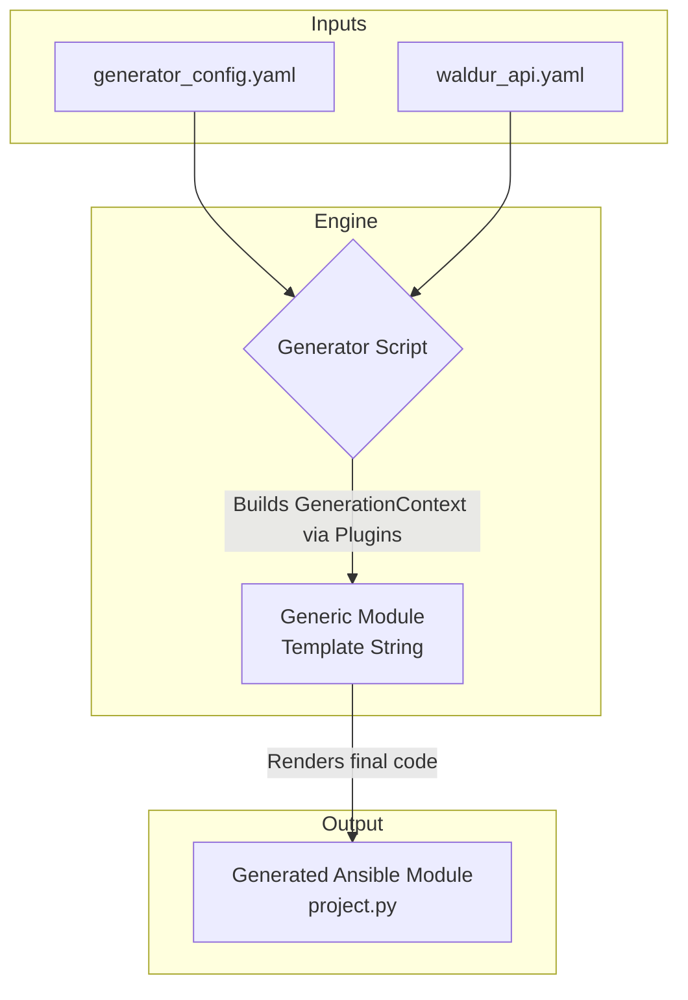
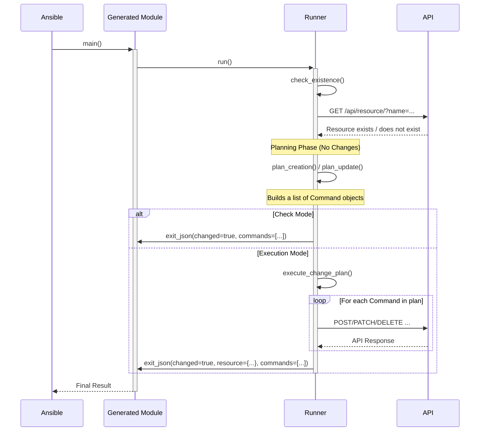

# Plugin author guide

## Architecture

The generator's architecture is designed to decouple the Ansible logic from the API implementation details. It
achieves this by using the `generator_config.yaml` as a "bridge" between the OpenAPI specification and the
generated code. The generator can produce multiple, self-contained Ansible Collections in a single run.



### Plugin-Based Architecture

The system's flexibility comes from its plugin architecture. The `Generator` itself does not know the
details of a `crud` module versus an `order` module. It only knows how to interact with the `BasePlugin`
interface.

1. **Plugin Discovery**: The `PluginManager` uses Python's entry point system to automatically discover and
   register plugins at startup.
2. **Delegation**: The `Generator` reads a module's `plugin` key from the config and asks the `PluginManager`
   for the corresponding plugin.
3. **Encapsulation**: Each plugin fully encapsulates the logic for its type. It knows how to parse its specific
   YAML configuration, interact with the `ApiSpecParser` to get operation details, and build the final
   `GenerationContext` needed to render the module.
4. **Plugin Contract**: All plugins implement the `BasePlugin` interface, which requires a central `generate()`
   method. This ensures a consistent interaction pattern between the `Generator` and all plugins.

### Runtime Logic (Runners and the Resolver)

The logic that executes at runtime inside an Ansible module is split between two key components: **Runners**
and the **ParameterResolver**.

1. **Runners (`runner.py`)**: Each plugin is paired with a `runner.py` file (e.g., `CrudRunner`,
   `OrderRunner`). This runner contains the Python logic for the module's state management (create, update,
   delete). The generated module file (e.g., `project.py`) is a thin wrapper that calls its corresponding
   runner. The generator copies the runner and a `base_runner.py` into the collection's `plugins/module_utils/`
   directory and rewrites their imports, making the collection **fully self-contained**.

2. **ParameterResolver**: This is a powerful, centralized utility that is composed within each runner. Its
   sole responsibility is to handle the complex, recursive resolution of user-friendly inputs (like resource
   names) into the URLs or other data structures required by the API. By centralizing this logic, runners are
   kept clean and focused on their state-management tasks. The resolver supports:
   - Simple name/UUID to URL conversion.
   - Recursive resolution of nested dictionaries and lists.
   - Caching of API responses to avoid redundant network calls.
   - Dependency-based filtering (e.g., filtering flavors by the tenant of a resolved offering).

### The "Plan and Execute" Runtime Model

While the generator builds the module code, the real intelligence lies in the runtime architecture it creates.
All generated modules follow a robust, two-phase **"plan and execute"** workflow orchestrated by a `BaseRunner`
class, which is vendored into the collection's `module_utils`.

1. **Planning Phase**: The `BaseRunner` first determines the current state of the resource (does it exist?).
   It then calls a `plan_*` method (e.g., `plan_creation`, `plan_update`) corresponding to the desired state.
   This planning method **does not make any changes** to the system. Instead, it builds a list of `Command`
   objects. Each `Command` is a simple data structure that encapsulates a single, atomic API request (method,
   path, body).

2. **Execution Phase**: If not in check mode, the `BaseRunner` iterates through the generated plan and executes
   each `Command`, making the actual API calls.

This separation provides key benefits:

- **Perfect Check Mode**: Since the planning phase is purely declarative and makes no changes, check mode works
  perfectly by simply serializing the plan without executing it.
- **Clear Auditing**: The final output of a module includes a `commands` key, which is a serialized list of the
  exact HTTP requests that were planned and executed. This provides complete transparency.
- **Consistency**: All module types (`crud`, `order`) use the same underlying `BaseRunner` and `Command`
  structure, ensuring consistent behavior.

The diagram below illustrates this runtime workflow.



### The Resolvers Concept: Bridging the Human-API Gap

At the heart of the generator's power is the **Resolver System**. Its fundamental purpose is to bridge the gap
between a human-friendly Ansible playbook and the strict requirements of a machine-focused API.

- **The Problem:** An Ansible user wants to write `customer: 'Big Corp Inc.'`. However, the Waldur API
  requires a full URL for the customer field when creating a new project, like
  `customer: 'https://api.example.com/api/customers/a1b2-c3d4-e5f6/'`. Asking users to find and hardcode these
  URLs is cumbersome, error-prone, and goes against the principle of declarative, readable automation.

- **The Solution:** Resolvers automate this translation. You define *how* to find a resource (like a customer)
  by its name or UUID, and the generated module's runtime logic (the "runner") will handle the lookup and
  substitution for you.

This system is used by all plugins but is most critical for the `crud` and `order` plugins, which manage
resource relationships. Let's explore how it works using examples from our `generator_config.yaml`.

#### Simple Resolvers

A simple resolver handles a direct, one-to-one relationship. It takes a name or UUID and finds the
corresponding resource's URL. This is common for top-level resources or parent-child relationships.

- **Mechanism:** It works by using two API operations which are inferred from a base string:
  1. A `list` operation to search for the resource by its name (e.g., `customers_list` with a `name_exact`
     filter).
  2. A `retrieve` operation to fetch the resource directly if the user provides a UUID (this is a performance
     optimization).

- **Configuration Example (from `waldur.structure`):**
  This example configures resolvers for the `customer` and `type` parameters in the `project` module.

    ```yaml
    # In generator_config.yaml
    - name: project
      plugin: crud
      base_operation_id: "projects"
      resolvers:
        # Shorthand notation. This tells the generator:
        # 1. There is an Ansible parameter named 'customer'.
        # 2. To resolve it, use the 'customers_list' and 'customers_retrieve' API operations.
        customer: "customers"

        # Another example for the project's 'type'.
        type: "project_types"
    ```

- **Runtime Workflow:**
  When a user runs a playbook with `customer: "Big Corp"`, the `project` module's runner executes the following logic:

    ```mermaid
    sequenceDiagram
        participant User as Ansible User
        participant Module as waldur.structure.project
        participant Resolver as ParameterResolver
        participant Waldur as Waldur API

        User->>Module: Executes playbook with `customer: "Big Corp"`
        Module->>Resolver: resolve("customer", "Big Corp")
        Resolver->>Waldur: GET /api/customers/?name_exact="Big Corp" (via 'customers_list')
        Waldur-->>Resolver: Returns customer object `{"url": "...", "name": "Big Corp", ...}`
        Resolver-->>Module: Returns resolved URL: "https://.../customers/..."

        Module->>Waldur: POST /api/projects/ with body `{"customer": "https://.../customers/...", "name": "..."}`
        Waldur-->>Module: Returns newly created project
        Module-->>User: Success (changed: true)
    ```

#### Advanced Resolvers: Dependency Filtering

The true power of the resolver system shines when dealing with nested or context-dependent resources. This is
essential for the `order` plugin.

- **The Problem:** Many cloud resources are not globally unique. For example, an OpenStack "flavor" named
  `small` might exist in multiple tenants. To create a VM, you need the *specific* `small` flavor that belongs
  to the tenant where you are deploying. A simple name lookup is not enough.

- **The Solution:** The `order` plugin's resolvers support a `filter_by` configuration. This allows one
  resolver's lookup to be filtered by the results of another, previously resolved parameter.

- **Configuration Example (from `waldur.openstack`):**
  This `instance` module resolves a `flavor`. The list of available flavors *must* be filtered by the tenant,
  which is derived from the `offering` the user has chosen.

    ```yaml
    # In generator_config.yaml
    - name: instance
      plugin: order
      offering_type: OpenStack.Instance
      # ...
      resolvers:
        # The 'flavor' resolver depends on the 'offering'.
        flavor:
          # Shorthand to infer 'openstack_flavors_list' and 'openstack_flavors_retrieve'
          base: "openstack_flavors"

          # This block establishes the dependency.
          filter_by:
            - # 1. Look at the result of the 'offering' parameter.
              source_param: "offering"
              # 2. From the resolved offering's API response, get the value of the 'scope_uuid' key.
              #    (In Waldur, this is the UUID of the tenant associated with the offering).
              source_key: "scope_uuid"
              # 3. When calling 'openstack_flavors_list', add a query parameter.
              #    The parameter key will be 'tenant_uuid', and its value will be the
              #    'scope_uuid' we just extracted.
              target_key: "tenant_uuid"
    ```

- **Runtime Workflow:** This is a multi-step process managed internally by the runner and resolver.

    ```mermaid
    sequenceDiagram
        participant User as Ansible User
        participant Runner as OrderRunner
        participant Resolver as ParameterResolver
        participant Waldur as Waldur API

        Note over User, Runner: Playbook runs with `offering: "VMs in Tenant A"` and `flavor: "small"`

        Runner->>Resolver: resolve("offering", "VMs in Tenant A")
        Resolver->>Waldur: GET /api/marketplace-public-offerings/?name_exact=...
        Waldur-->>Resolver: Returns Offering object `{"url": "...", "scope_uuid": "tenant-A-uuid", ...}`
        Note right of Resolver: Caches the full Offering object internally.
        Resolver-->>Runner: Returns Offering URL

        Runner->>Resolver: resolve("flavor", "small")
        Note right of Resolver: Sees `filter_by` config for 'flavor'.
        Resolver->>Resolver: Looks up 'offering' in its cache. Finds the object.
        Resolver->>Resolver: Extracts `scope_uuid` ("tenant-A-uuid") from cached object.

        Note right of Resolver: Builds query: `?name_exact=small&tenant_uuid=tenant-A-uuid`
        Resolver->>Waldur: GET /api/openstack-flavors/?name_exact=small&tenant_uuid=tenant-A-uuid
        Waldur-->>Resolver: Returns the correct Flavor object for Tenant A.
        Resolver-->>Runner: Returns Flavor URL

        Note over Runner, Waldur: Runner now has all resolved URLs and creates the final marketplace order.
    ```

#### Resolving Lists of Items

Another common scenario is a parameter that accepts a list of resolvable items, such as the `security_groups`
for a VM.

- **The Problem:** The user wants to provide a simple list of names: `security_groups: ['web', 'ssh']`. The
  API, however, often requires a more complex structure, like a list of objects:
  `security_groups: [{ "url": "https://.../sg-web-uuid/" }, { "url": "https://.../sg-ssh-uuid/" }]`.

- **The Solution:** The resolver system handles this automatically. The generator analyzes the OpenAPI schema
  for the `offering_type`. When it sees that the `security_groups` attribute is an `array` of objects with a
  `url` property, it configures the runner to:
  1. Iterate through the user's simple list (`['web', 'ssh']`).
  2. Resolve each name individually to its full object, using the `security_groups` resolver configuration
     (which itself uses dependency filtering, as shown above).
  3. Extract the `url` from each resolved object.
  4. Construct the final list of dictionaries in the format required by the API.

This powerful abstraction keeps the Ansible playbook clean and simple, hiding the complexity of the underlying
API. The user only needs to provide the list of names, and the resolver handles the rest.

## The Unified Update Architecture

The generator employs a sophisticated, unified architecture for handling resource updates within `state: present`
tasks. This system is designed to be both powerful and consistent, ensuring that all generated modules—regardless
of their plugin (`crud` or `order`)—behave predictably and correctly, especially when dealing with complex data
structures.

The core design principle is **"Specialized Setup, Generic Execution."** Specialized runners (`CrudRunner`,
`OrderRunner`) are responsible for preparing a context-specific environment, while a shared `BaseRunner` provides
a powerful, generic toolkit of "engine" methods that perform the actual update logic. This maximizes code reuse
and enforces consistent behavior.

### Core Components

1. **`BaseRunner` (The Engine):** This class contains the three central methods that form the update toolkit:
   - `_handle_simple_updates()`: Manages direct `PATCH` requests for simple, mutable fields (like `name` or
     `description`).
   - `_handle_action_updates()`: Orchestrates the entire lifecycle for complex, action-based updates (like
     setting security group rules).
   - `_normalize_for_comparison()`: A critical utility that provides robust, order-insensitive idempotency
     checks for complex data types like lists of dictionaries.

2. **Specialized Runners (The Orchestrators):**
   - **`CrudRunner`:** Uses the `BaseRunner` toolkit directly with minimal setup, as its context is typically
     straightforward.
   - **`OrderRunner`:** Performs crucial, context-specific setup (like priming its cache with the marketplace
     `offering`) before delegating to the same `BaseRunner` toolkit.

### Deep Dive: The Idempotency Engine (`_normalize_for_comparison`)

The cornerstone of the update architecture is its ability to correctly determine if a change is needed,
especially for lists of objects where order does not matter. The `_normalize_for_comparison` method is the
"engine" that makes this possible.

**Problem:** How do you compare `[{'subnet': 'A'}]` from a user's playbook with
`[{'uuid': '...', 'subnet': 'A', 'name': '...'}]` from the API? How do you compare `['A', 'B']` with `['B', 'A']`?

**Solution:** The method transforms both the desired state and the current state into a **canonical,
order-insensitive, and comparable format (a set)** before checking for equality.

#### Mode A: Complex Objects (e.g., a list of `ports`)

When comparing lists of dictionaries, the method uses `idempotency_keys` (provided by the generator plugin based
on the API schema) to understand what defines an object's identity.

1. **Input (Desired State):** `[{'subnet': 'url_A', 'fixed_ips': ['1.1.1.1']}]`
2. **Input (Current State):** `[{'uuid': 'p1', 'subnet': 'url_A', 'fixed_ips': ['1.1.1.1']}]`
3. **Idempotency Keys:** `['subnet', 'fixed_ips']`
4. **Process:**
   - For each dictionary, it creates a new one containing *only* the `idempotency_keys`.
   - It converts this filtered dictionary into a sorted, compact JSON string (e.g.,
     `'{"fixed_ips":["1.1.1.1"],"subnet":"url_A"}'`). This string is deterministic and hashable.
   - It adds these strings to a set.
5. **Result:** Both inputs are transformed into the exact same set:
   `{'{"fixed_ips":["1.1.1.1"],"subnet":"url_A"}'}`. The comparison `set1 == set2` evaluates to
   `True`, and **no change is triggered.** Idempotency is achieved.

#### Mode B: Simple Values (e.g., a list of `security_group` URLs)

When comparing lists of simple values (strings, numbers), the solution is simpler.

1. **Input (Desired State):** `['url_A', 'url_B']`
2. **Input (Current State):** `['url_B', 'url_A']`
3. **Process:** It converts both lists directly into sets.
4. **Result:** Both inputs become `{'url_A', 'url_B'}`. The comparison `set1 == set2` is `True`, and **no change
   is triggered.**

### Handling Critical Edge Cases

The unified architecture is designed to handle two critical, real-world edge cases that often break simpler
update logic.

#### Edge Case 1: Asymmetric Data Representation

- **Problem:** An existing resource might represent a relationship with a "rich" list of objects (e.g.,
  `security_groups: [{'name': 'sg1', 'url': '...'}]`), but the API action to update them requires a "simple"
  list of strings (e.g., `['url1', 'url2']`).
- **Solution:** The `_handle_action_updates` method contains specific logic to detect this asymmetry. If the
  resolved user payload is a simple list of strings, but the resource's current value is a complex list of
  objects, it intelligently **transforms the resource's list** by extracting the `url` from each object before
  passing both simple lists to the normalizer. This ensures a correct, apples-to-apples comparison.

#### Edge Case 2: Varied API Payload Formats

- **Problem:** Some API action endpoints expect a JSON object as the request body (e.g., `{"rules": [...]}`),
  while others expect a raw JSON array (e.g., `[...]`).
- **Solution:** The generator plugin analyzes the OpenAPI specification for each action endpoint. It passes a
  boolean flag, `wrap_in_object`, in the runner's context. The `_handle_action_updates` method reads this flag
  and constructs the `final_api_payload` in the precise format the API endpoint requires, avoiding schema
  validation errors.

This robust, flexible, and consistent architecture ensures that all generated modules are truly idempotent and
can handle the full spectrum of simple and complex update scenarios presented by the Waldur API.

### Component Responsibilities

1. **Core System (`generator.py`, `plugin_manager.py`)**:
   - **`Generator`**: The main orchestrator. It is type-agnostic. Its job is to:
     1. Loop through each **collection** definition in the config.
     2. For each collection, create the standard directory skeleton (`galaxy.yml`, etc.).
     3. Loop through the **module** definitions within that collection.
     4. Delegate to the correct plugin to get a `GenerationContext`.
     5. Render the final module file.
     6. Copy the plugin's `runner.py` and a shared `base_runner.py` into `module_utils`, rewriting their imports
        to make the collection self-contained.
   - **`PluginManager`**: The discovery service. It finds and loads all available plugins registered via entry
     points.

2. **Plugin Interface (`interfaces/plugin.py`)**:
   - **`BasePlugin`**: An abstract base class defining the contract for all plugins. It requires a `generate()`
     method that receives the module configuration, API parsers, and the current **collection context**
     (namespace/name) and returns a complete `GenerationContext`.

3. **Runtime Components (`interfaces/runner.py`, `interfaces/resolver.py`)**:
   - **`BaseRunner`**: A concrete base class that provides shared runtime utilities for all runners, such as the
     `send_request` helper for making API calls.
   - **`ParameterResolver`**: A reusable class that encapsulates all logic for converting user inputs
     (names/UUIDs) into API-ready data. It is instantiated by runners.

4. **Concrete Plugins and Runners (e.g., `plugins/crud/`)**:
   - Each plugin is a self-contained directory with:
     - **`config.py`**: Pydantic models for validating its specific YAML configuration.
     - **`plugin.py`**: The generation-time logic. It implements `BasePlugin` and is responsible for creating
       the module's documentation, parameters, and runner context.
     - **`runner.py`**: The runtime logic. It inherits from `BaseRunner`, uses the `ParameterResolver`, and
       executes the module's core state management tasks (e.g., creating a resource if it doesn't exist).

### How to Add a New Plugin

This architecture makes adding support for a new module type straightforward:

1. **Create Plugin Directory**:
   Create a new directory for your plugin, e.g., `ansible_waldur_generator/plugins/my_type/`.

2. **Define Configuration Model**:
   Create `plugins/my_type/config.py` with a Pydantic model inheriting from `BaseModel` to define and validate
   the YAML structure for your new type.

3. **Implement the Runner**:
   Create `plugins/my_type/runner.py`. Define a class (e.g., `MyTypeRunner`) that inherits from `BaseRunner`
   and implements the runtime logic for your module.

4. **Implement the Plugin Class**:
   Create `plugins/my_type/plugin.py`:

   ```python
   from ansible_waldur_generator.interfaces.plugin import BasePlugin
   from ansible_waldur_generator.models import GenerationContext
   # Import your config model and other necessary components

    class MyTypePlugin(BasePlugin):
        def get_type_name(self) -> str:
            # This must match the 'type' key in the YAML config
            return 'my_type'

        def generate(self, module_key, raw_config, api_parser, ...) -> GenerationContext:
            # 1. Parse and validate raw_config using your Pydantic model.
            # 2. Use api_parser to get details about API operations.
            # 3. Build the argument_spec, documentation, examples, etc.
            # 4. Build the runner_context dictionary to pass runtime info to your runner.
            # 5. Return a fully populated GenerationContext object.
            return GenerationContext(...)
    ```

5. **Register the Plugin**:
   Add the new plugin to the entry points section in `pyproject.toml`:

   ```toml
    [tool.poetry.plugins."ansible_waldur_generator"]
    # ... existing plugins
    crud = "ansible_waldur_generator.plugins.crud.plugin:CrudPlugin"
    order = "ansible_waldur_generator.plugins.order.plugin:OrderPlugin"
    facts = "ansible_waldur_generator.plugins.facts.plugin:FactsPlugin"
    my_type = "ansible_waldur_generator.plugins.my_type.plugin:MyTypePlugin" # Add this line
    ```

6. **Update Poetry Environment**:
   Run `poetry install`. This makes the new entry point available to the `PluginManager`. Your new `my_type`
   is now ready to be used in `generator_config.yaml`.

After these steps, running `poetry install` will make the new `facts` type instantly available to the
generator without any changes to the core `generator.py` or `plugin_manager.py` files.
