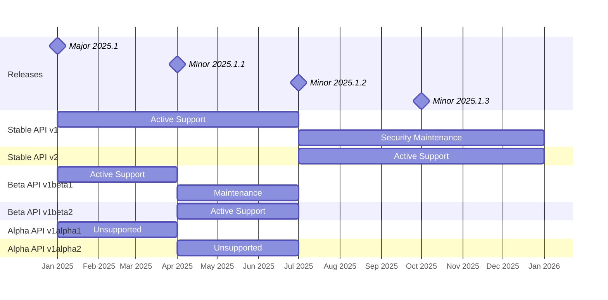
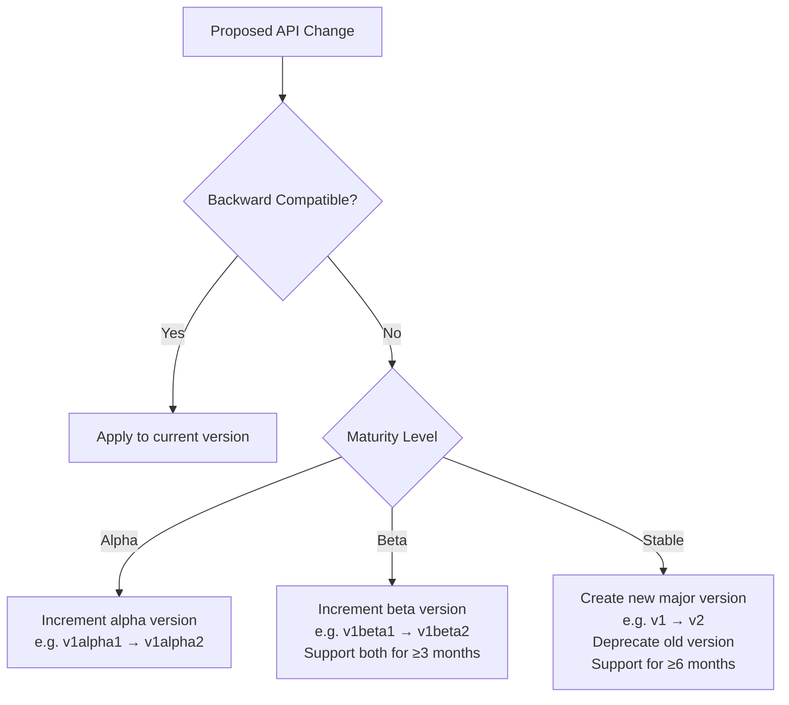
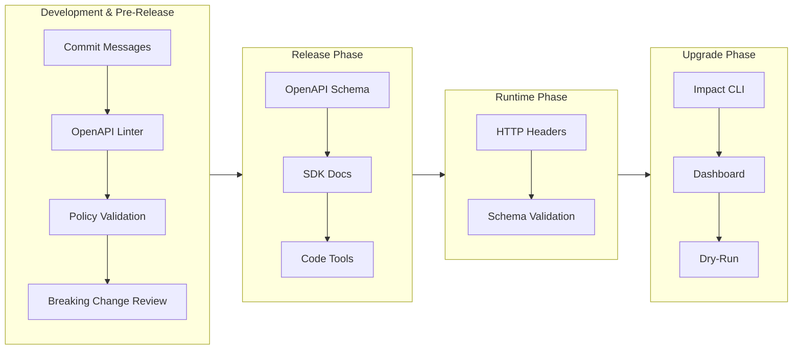
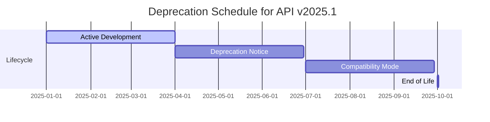
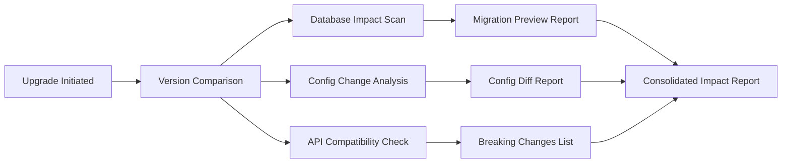

# Waldur Release Lifecycle and API Stability Guarantees

## Introduction to API Policies

Waldur's API lifecycle management balances innovation with stability through defined policies:

- **Release Cadence**:
   - 2 major releases per year (every 6 months)
   - 4 minor releases per year (every 3 months)

- **API Group Segmentation**:
   - APIs are grouped by functional domains (e.g., `core`, `marketplace`, `openstack`)
   - Groups have independent maturity levels and versioning

- **API Maturity Management**:
   - Three maturity levels: `alpha`, `beta`, `stable`
   - Each level has specific stability guarantees and versioning rules

- **Change Classification**:
   - Backward-compatible (additive changes) and backward-incompatible (breaking changes)
   - API changes, database changes, configuration and deployment changes

- **Change Communication**:
   - For Waldur developers: via commit message and OpenAPI schema linter
   - For release manager: breaking changes in stable APIs trigger policy validation
   - For external developers: via OpenAPI schema, SDK documentation, code transformations and validation tools
   - For external scripts: via OpenAPI schema validation and version validation in HTTP response
   - For Waldur operators: via release impact assesment CLI tooling and Waldur dashboard

Waldur MasterMind lifecycle strategy enables:

- **Rapid Innovation** through alpha/beta channels
- **Enterprise Stability** through backported security patches
- **Risk Mitigation** with pre-upgrade analysis
- **Seamless Upgrades** using migration tooling

## Release Cadence

### Waldur MasterMind Release Timeline



## API Maturity Levels

| Maturity | Breaking Changes | Support Window | Version Format | Recommended Use           |
| -------- | ---------------- | -------------- | -------------- | ------------------------- |
| Alpha    | Daily            | None           | 2025.2-dev.45  | Internal development only |
| Beta     | Quarterly        | 90 days        | 2025.2-beta.3  | Preview environments      |
| Stable   | Bi-annually      | 180 days       | 2025.2.5       | General production        |

### Alpha Level

- **Versioning**: `XalphaY` (e.g., `1alpha1`)
- **Availability**: In main repo, disabled by default (feature flag)
- **Audience**: Developers and expert users
- **Completeness**: Partial implementation expected
- **Upgradeability**: No upgrade path; breaking changes without notice
- **Reliability**: May destabilize deployments
- **Support**: No commitment to completion or long-term support
- **Use Cases**: Short-lived testing environments only

### Beta Level

- **Versioning**: `XbetaY` (e.g., `2beta3`)
- **Availability**: In releases, disabled by default (feature flag)
- **Audience**: Users providing feedback
- **Completeness**: Full implementation with API review
- **Upgradeability**: Breaking changes with documented migration path
- **Reliability**: Minor bugs possible, shouldn't break core functionality
- **Support**: Two concurrent versions supported for ≥1 minor release (3 months)
- **Use Cases**: Evaluation environments and limited production trials

### Stable Level

- **Versioning**: `X` (e.g., `v3`)
- **Availability**: Enabled by default in releases
- **Audience**: All users
- **Completeness**: Full implementation with integration tests
- **Upgradeability**: Only backward-compatible changes allowed
- **Reliability**: High stability guarantee
- **Support**: Maintained for ≥1 major release cycle (6 months) after deprecation
- **Use Cases**: All production environments

## Types of API Changes

### Backward-Incompatible Changes

- URL format changes
- Removing/renaming resources, parameters, properties, or methods
- Changing parameter/property types
- Modifying HTTP status codes
- Changing optional field to mandatory in REST API
- Adding required parameters

### Backward-Compatible Changes

- Adding new resources
- Adding operations to existing resources
- Adding optional parameters
- Adding response fields
- Extending string formats
- Adding enum values



## Change Communication

### Change Communication Stages



### Change Communication Schedule



| Phase         | Duration  | Communication Channels                                             |
| ------------- | --------- | ------------------------------------------------------------------ |
| Announcement  | 90 days   | API headers, OpenAPI metadata, email notices, developer portal     |
| Compatibility | 180 days  | Support both versions, code transformation tools, migration guides |
| End of Life   | Immediate | Remove deprecated endpoints                                        |

## Impact Preview & Reporting



### Impact Report Components

- **Database Impact**:

   - Schema changes
   - Data migration requirements
   - Estimated execution time

- **API Compatibility**:

   - Breaking changes
   - Required client updates
   - Deprecation timeline

- **Configuration Changes**:

   - Modified settings
   - New environment variables
   - Security implications

### Impact Report Sample

```json
{
  "upgrade_path": "2025.1 → 2025.2",
  "risk_level": "medium",
  "estimated_downtime": "15 minutes",
  "critical_issues": [
    {
      "type": "schema_change",
      "location": "marketplace/Resources",
      "description": "Required field 'category' added"
    }
  ],
  "actions_required": [
    "Update client code to handle new required field",
    "Execute a management command to migrate data"
  ]
}
```

## Stabilization Action Plan

### Phase 1: Inventory & Classification

- Catalog all API endpoints by functional group
- Assign current maturity level (alpha/beta/stable)
- Identify breaking changes in last 2 releases

### Phase 2: Stabilization Foundations

- Add header-based versioning (`Waldur-Version`)
- Introduce version match validation in SDK
- Introduce standardized error format
- OpenAPI schema validation in pull requests
- Breaking change detection gates
- Automated SDK documentation publishing
- Set up versioning automation for alpha/beta releases

### Phase 3: Impact Analysis Tooling

- Database migration previews
- Configuration change detection
- API compatibility scanning
- Dry-run execution framework
- Risk score calculation
- Data loss probability assessment
- Downtime estimation
- Actionable remediation steps
- Automated customer alerts
- Personalized impact assessments
- Upgrade scheduling dashboard

## Key Metrics for Success

- 100% breaking changes detected in CI
- Zero unannounced breaking changes in stable APIs
- 90%+ deprecated endpoints removed on schedule
- <30 days between beta and stable promotion
- 100% of new features launch behind feature flags

## Example workflows

These examples demonstrate how to apply lifecycle and communication rules in practice.

### Patching and Releasing an Older Supported Release

**Context**: Waldur 2025.1 is in **Security Maintenance** phase.

**Scenario**: A security bug is discovered in the `marketplace` app in version 2025.1.

**Steps**:

1. **Create a branch** from the `release/2025.1` tag.
2. Apply the patch fix (e.g., sanitize input in `marketplace.views.OfferingViewSet`).
3. Bump patch version: `2025.1.4` → `2025.1.5`.
4. Add changelog entry under `SECURITY FIXES`.
5. Create new tag `release/2025.1.5`, trigger CI/CD.

**Communication**:

- Email notification for operators
- Waldur HomePort dashboard warning for operators


### Adding a New Endpoint in a Mature App (e.g., `openstack`, maturity: **stable**)

**Scenario**: Add a new endpoint to list all flavors with extended metadata.

**Constraints**:

- Must be backward-compatible
- Cannot break existing consumers

**Steps**:

1. Create a new action or viewset method: `GET /openstacktenant-flavors/extended/`.
2. Use `@extend_schema` to document new response format in OpenAPI.
3. Add unit and integration tests.
4. Add a changelog entry under `FEATURES`.
5. Merge into `develop`.
6. New version number will be **minor**: e.g., `2025.2.3` → `2025.2.4`.

**Communication**:

- Added to OpenAPI schema
- SDK is regenerated
- Endpoint is announced in changelog


### Adding a New Endpoint in an Experimental App (e.g., `checklist`, maturity: **alpha**)

**Scenario**: Introduce a new endpoint for scoring checklist responses.

**Steps**:

1. Create endpoint: `POST /checklist-items/{uuid}/score/`.
2. No guarantee of stability — endpoint can be renamed/removed later.
3. Version updated in `checklist.VERSION = 2025.2-alpha.7`.
4. No changelog required, but internal commit message must follow pattern:

   ```text
   feat(checklist): add scoring endpoint [alpha]
   ```

**Communication**:

- Only available when feature flag enabled
- Not included in stable OpenAPI documentation
- Optional preview in dev dashboard
