# Applicant guide

This guide follows an **applicant** (a principal investigator or proposal
submitter) end to end: finding an open call, creating and filling in a proposal,
answering the call's compliance checklist, submitting, tracking the proposal
through the evaluation workflow, reading technical-assessment feedback when the
call shares it, and finally responding to an award.

For the call manager's side of the same workflow see the
[Call manager workflow](call-manager-workflow.md); for the reviewer's side see
the [Reviewer workflow](reviewer-workflow.md).

!!! note
    Screenshots in this guide use the *2025 Spring HPC Allocation Call* demo
    call, which shares its technical assessment with applicants and includes an
    award-response step. Your calls will show different names, offerings,
    checklists and reviewers, and the steps you see depend on how the call
    manager configured the call.

## Finding an open call

Open **Calls → Calls for proposals** from the sidebar. The dashboard lists
**Open calls** you can apply to and the **Available offerings** they grant access
to. Each call card shows the managing organisation, a short description and the
submission **cutoff**.

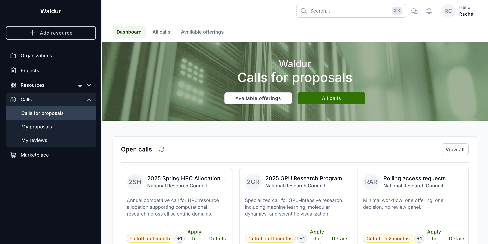

Use **Details** to read a call's full description and eligibility rules, or
**View all** (or **All calls** in the banner) to browse the complete catalogue.
When you have found the call you want, click **Apply to call**.

!!! tip
    The **Calls for proposals** catalogue is also reachable without signing in,
    from the public landing page — handy for sharing a call with colleagues.

## Starting a proposal

**Apply** opens the **Create proposal** dialog. It confirms the call name, the
round you are applying to and the round deadline. Give your proposal a **Name**
and click **Create**.

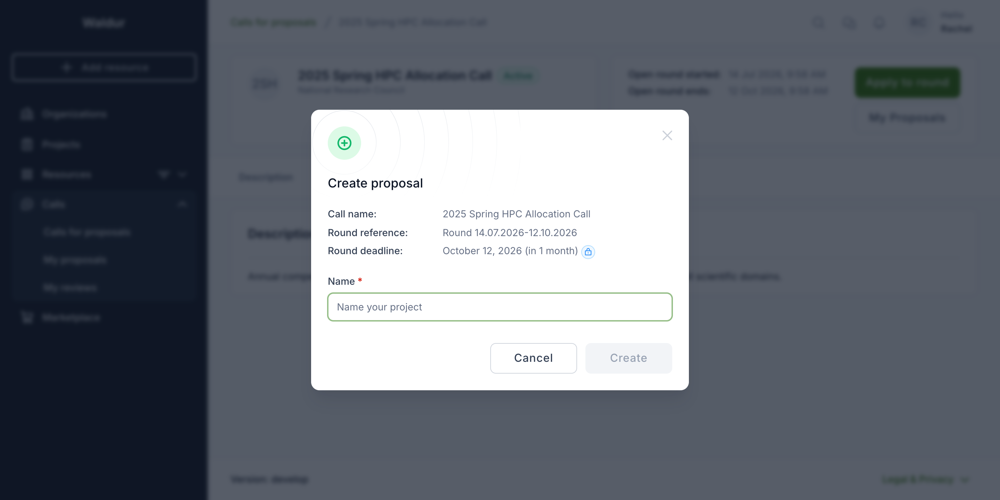

The proposal opens in the **Applicant** editor. The **Progress** panel on the
right tracks each section's completion and holds the **Submit** and **Save as
draft** actions; the main area presents the sections as expandable cards. A
proposal stays in **Draft** — and is never seen by the call team — until you
submit it, so you can save and return as often as you like.

The editor opens on **Details overview**, a read-only summary of the call, round
and deadline you are applying under. The editable sections follow.

### Project details

Expand **Project details** and describe your project:

| Field | Notes |
|---|---|
| **Name** | Required |
| **Summary** | Required |
| **Description** | Optional, longer free text |
| **Project for civilian purpose?** | Yes/no, with room for a comment |
| **Research field (OECD code)** | Required on deployments configured to mandate it |
| **Is the project confidential?** | Yes/no, with room for a comment |
| **Project duration in days** | Required, unless the call fixes the duration |
| **Upload supporting documentation** | Optional attachments |

Required fields are marked with a red asterisk, and the card header shows how
many fields are filled.

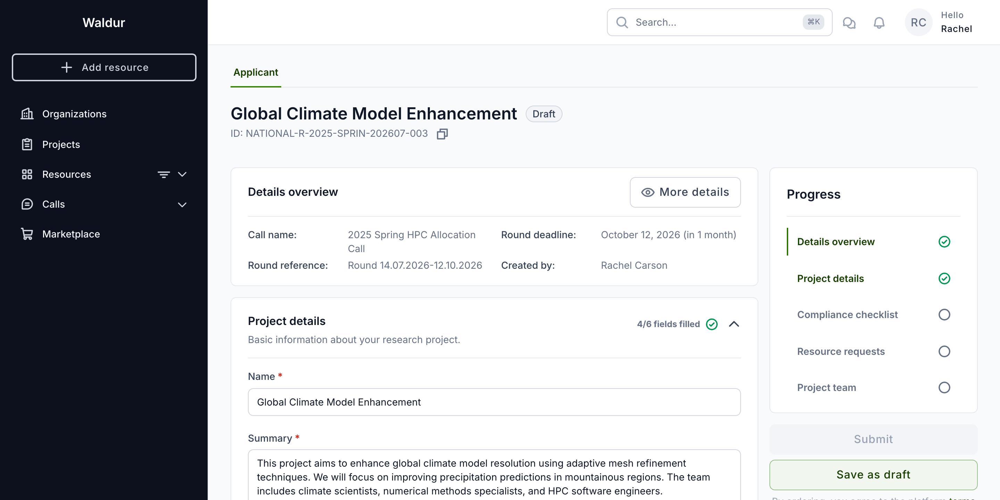

### Resource requests

Expand **Resource requests** to choose what you need. On a **template-based**
call the call manager has predefined resource templates — tick the ones your
project requires (here, the *GPU Compute Package*) and click **Save**. Each
template shows its offering, plan and preconfigured attributes.

### Compliance checklist

When the call has a **compliance checklist**, a **Compliance checklist** step
appears between project details and resource requests. Answer every required
question; the card header tracks your progress as *n/N answered*, and its
subtitle warns that *additional questions may appear based on your answers* — so
the total can grow as you answer.

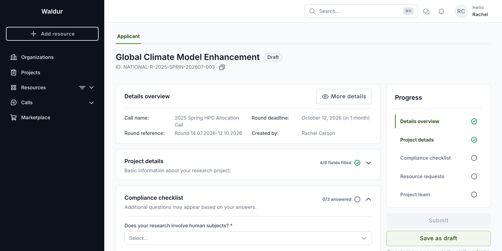

Checklists support many question types — single- and multi-select, numbers,
dates, file uploads, confirmations and more (see
[Checklists and forms](checklists-and-forms.md)). Some questions are
**conditional**: answering one may reveal a follow-up, flagged with a
*Shown based on: …* hint naming the answer that triggered it.

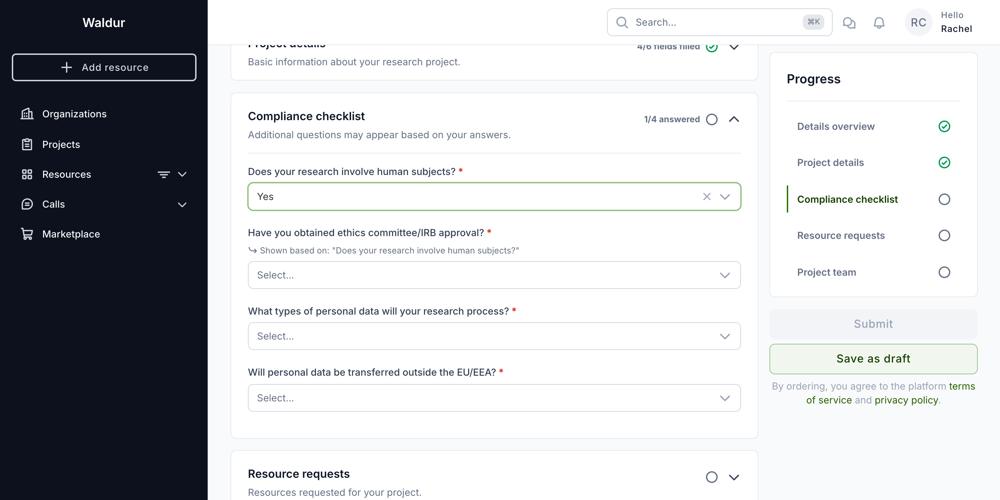

### Project team

Expand **Project team** to add colleagues who should have access to the resulting
project and set their roles. You are added automatically as the creator.

## Reviewing and submitting

Before submitting, review each section. The **Submit** button stays disabled
until every required step is complete — the **Progress** panel shows a green tick
against finished sections and an empty circle against those still needing input.

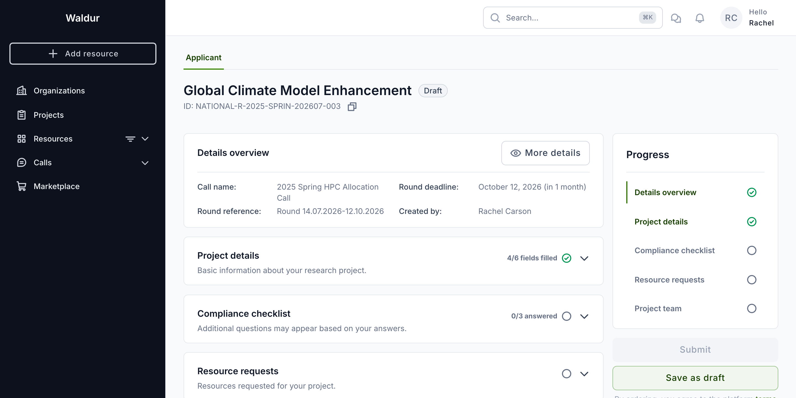

When everything is complete, click **Submit**. A note beneath the button records
that submitting means agreeing to the platform's terms of service and privacy
policy. The proposal moves out of **Draft** and into the evaluation workflow, and
the call team can now see it.

!!! warning
    Submit before the round **deadline**. Once the round closes you can no longer
    submit, and a proposal left in **Draft** is not evaluated.

## Your proposals

Open **Calls → My proposals** to see everything you have created, across all
calls, with its call, round deadline and current **state**. Use the state filter
to focus on drafts, submitted, in-review or accepted proposals.

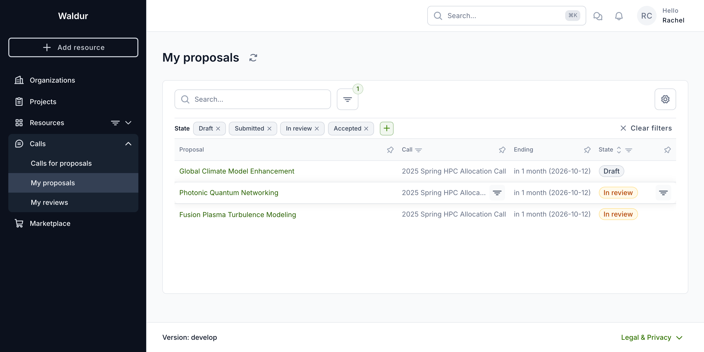

Proposal states an applicant sees:

| State | Meaning |
|---|---|
| **Draft** | Not yet submitted — only you can see it |
| **Submitted** | Submitted and awaiting evaluation |
| **In review** | Moving through the evaluation workflow |
| **Accepted** | Approved — a project and resources have been (or are being) provisioned |
| **Rejected** | Not funded |
| **Canceled** | Withdrawn, or an award you declined |

## Tracking progress

Open a submitted proposal to follow it through the call's **evaluation
workflow**. The **stepper** at the top shows every step, with completed steps
ticked, the current step highlighted, and later steps greyed out. Here the
proposal has cleared *Administrative check* and *Technical assessment* and is in
*Expert review*.

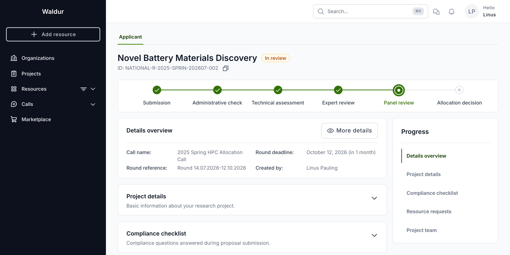

The sections below the stepper are read-only once submitted, so you always see
exactly what you sent. Which steps appear, and how much of each you can see,
depends on the call's configuration at the moment you submitted (see
[The evaluation workflow](call-manager-workflow.md#the-evaluation-workflow)).
Steps that were not part of your proposal's sequence are omitted from the
stepper, so two proposals in the same call can show different steps if the call
was reconfigured between their submissions.

## Technical-assessment feedback

Some steps can be made **visible to applicants** by the call manager. When the
**Technical assessment** step is shared, a **Technical assessment decisions**
section shows the feasibility decisions from the technical reviewers — one entry
per reviewer, each with a colour-coded decision badge and comment.

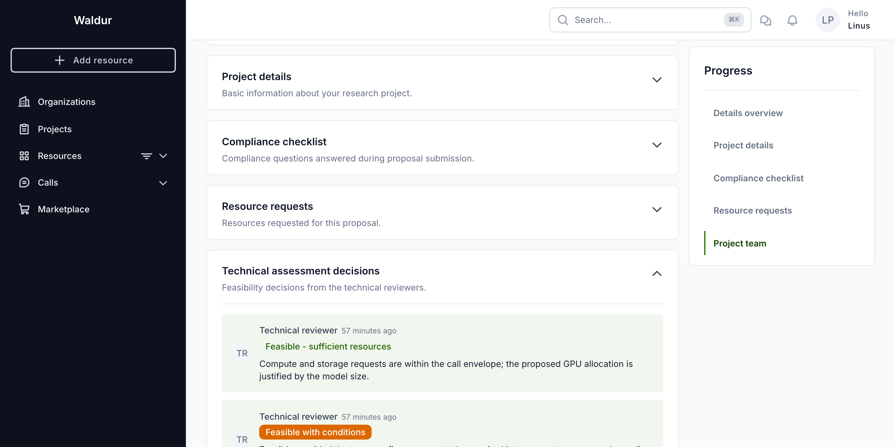

!!! note
    You only see this section when the call manager has marked the step
    **applicant-visible**. On calls that keep technical assessments internal, the
    section does not appear — this is expected, not an error. The decision wording
    and badge colours come from the call's own technical-assessment checklist, so
    they differ between calls.

## Responding to an award

If the call includes an **award response** step, an approved proposal pauses for
your decision before resources are provisioned. The stepper shows an *Award
response* step, and the **Progress** panel offers **Accept award** and **Decline
award**.

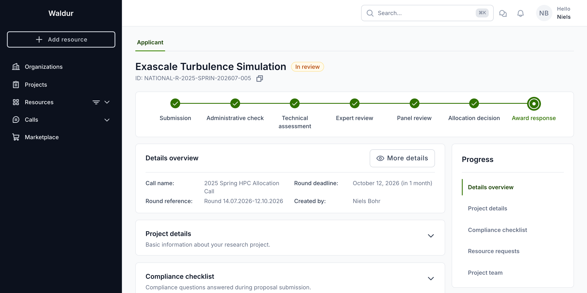

**Accept award** asks you to confirm; once you do, the requested resources are
provisioned, a project is created under your organisation and your team is
granted access.

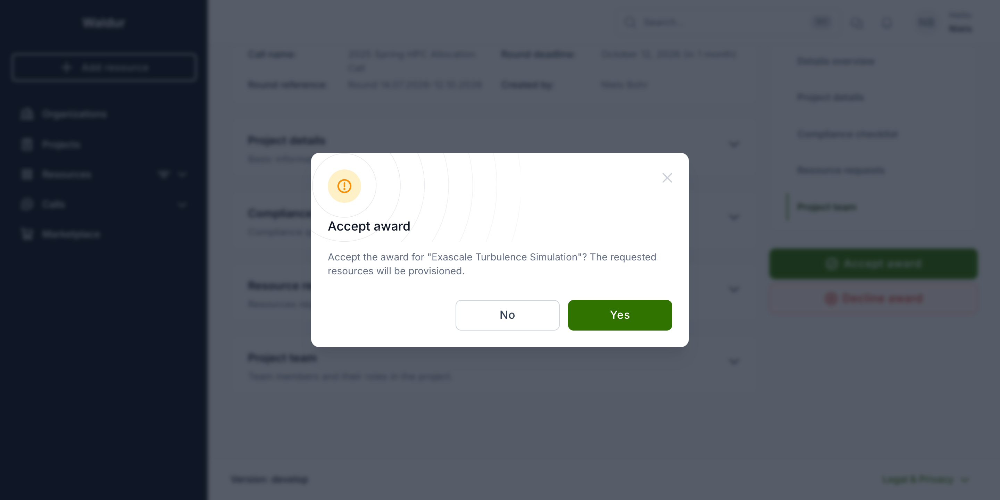

**Decline award** asks for a **Reason for declining** — it is required — and
moves the proposal to **Canceled**. Use it when you can no longer take up the
allocation.

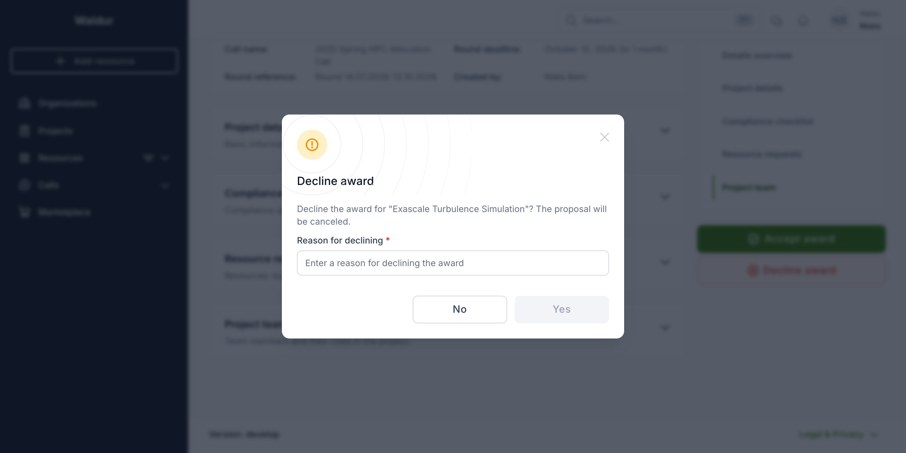

!!! tip
    Not every call uses an award response step. When it is absent, an approved
    proposal is provisioned automatically at the **Allocation decision** step
    without asking you to confirm.

## Related guides

- [Call management](call_management.md) — the call lifecycle and rounds
- [Checklists and forms](checklists-and-forms.md) — question types and conditional visibility
- [Call manager workflow](call-manager-workflow.md) — how call managers drive proposals through the workflow
- [Reviewer workflow](reviewer-workflow.md) — the reviewer's perspective
