# Call manager workflow

This guide follows the **call manager** end to end: from setting up a call and
its evaluation workflow, through building a reviewer pool and managing conflicts
of interest, to driving individual proposals through each workflow step and
recording the final allocation decision.

It focuses on the multi-step **evaluation workflow** — the configurable sequence
of steps (administrative check, technical assessment, expert review, panel
review, allocation decision) that every proposal travels through. For the
higher-level call lifecycle (organisation setup, rounds, offerings, role
mapping) see [Call management](call_management.md).

!!! note
    Screenshots in this guide use the *2025 Spring HPC Allocation Call* demo
    call, which has the full six-step workflow enabled. Your calls will show
    different names, offerings and reviewers, and which steps you see depends on
    how the call is configured.

## The evaluation workflow

Each call defines an ordered list of workflow steps. Every step has a
**responsible role**, an optional **deadline**, a **transition mode**, and can
carry an evaluation **checklist** and review **criteria**.

| Step | Responsible role | Purpose |
|---|---|---|
| **Administrative check** | Call manager | Eligibility and completeness screening before evaluation |
| **Technical assessment** | Offering manager | Service provider confirms technical feasibility |
| **Expert review** | Reviewer | Independent peer review with scoring |
| **Panel review** | Panel member | Collective panel evaluation consolidating expert reviews |
| **Allocation decision** | Call manager | Final approve/reject decision and resource allocation |

Steps can be enabled or disabled per call, so a lightweight call might use only
an administrative check and an allocation decision, while a competitive
programme uses the full sequence.

## Landing in call management

After signing in, open your call-managing organisation and switch to the
**Call management** tab. Its **Dashboard** counts open calls, accepted proposals,
pending proposals and pending reviews — each with a **View all** shortcut into
the matching list — above a second row tracking active rounds, rounds and calls
closing soon, and pending offering requests.

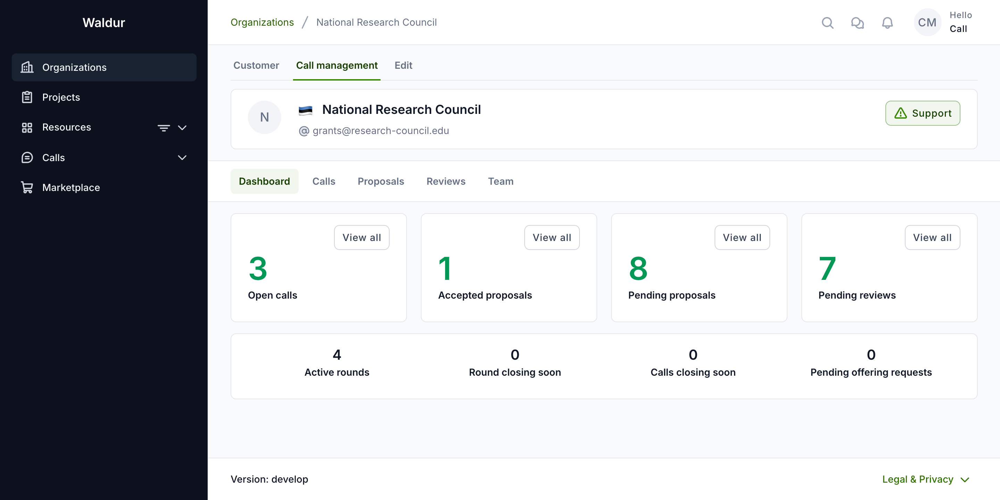

The **Calls** section lists every call your organisation manages, grouped by
state (All / Active / Draft / Archived). Click a call name to open its
configuration.

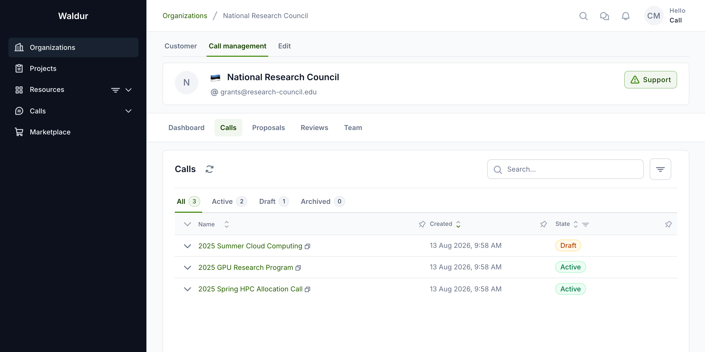

## Setting up a call

### General settings

The **General** tab holds the call's identity: name, description, reference code,
an optional external URL, and the proposal slug template used to generate
human-readable proposal IDs. See
[Proposal ID configuration](proposal-id-configuration.md) for slug placeholders.

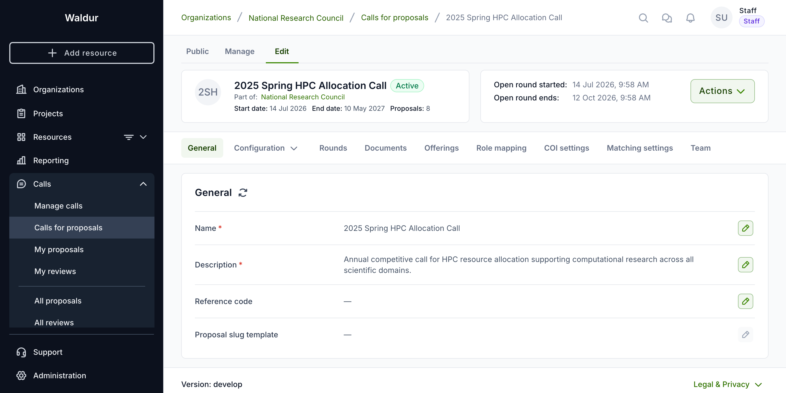

### Configuration and workflow steps

The **Configuration** tab is where the evaluation workflow lives. Below the
general options, applicant data visibility, and resource templates, the
**Steps & settings** table lists every workflow step with its description,
deadline, responsible role and transition mode. The **Preview sequence** below
the table visualises the proposal journey exactly as configured.

!!! warning
    Workflow steps stay editable while the call is in **Draft** or **Active**;
    the step table only becomes read-only once the call is **Archived**.

    Enabling or disabling a step does **not** retroactively change proposals
    already in flight: each proposal's path is fixed when it is submitted, so
    reconfiguring an active call means new submissions follow the new sequence
    while existing proposals continue on the one they were submitted under. Make
    structural changes before activation wherever you can.

    Per-step **durations** are the exception — a step reads its duration when it
    becomes active, so adjusting one still affects steps a proposal has not
    reached yet.

## Configuring a workflow step

Use the row's actions menu — **Configure**, **Enable**/**Disable**, **Remove** —
and choose **Configure** to open a step's settings. The dialog adapts to the step
type.

For a **task step** such as the administrative check, it opens as *Configure
step: …* with the estimated duration, responsible role, transition mode and an
optional checklist.

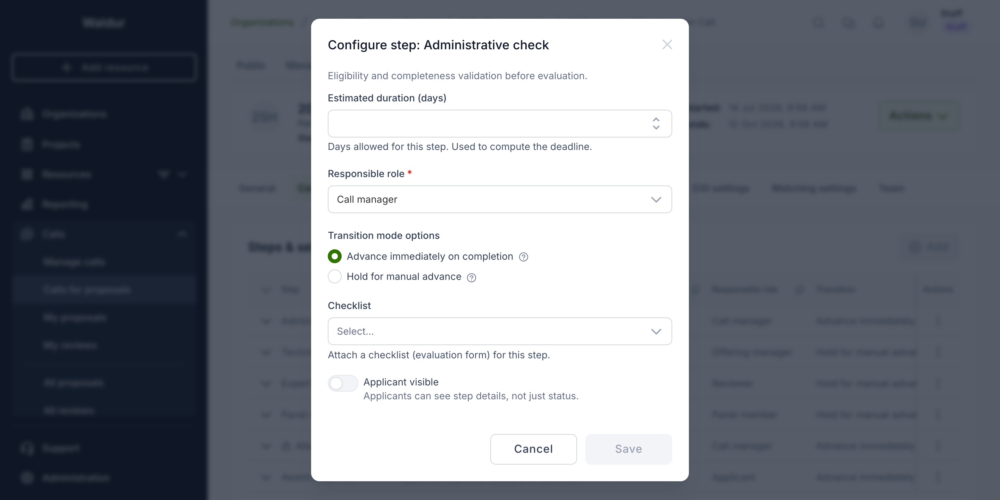

For a **review step** such as expert review, it opens as *Configure criteria
for …* and adds review-specific settings — minimum reviewers, minimum score
threshold, scoring criteria, blind review and conflict-of-interest confirmation.

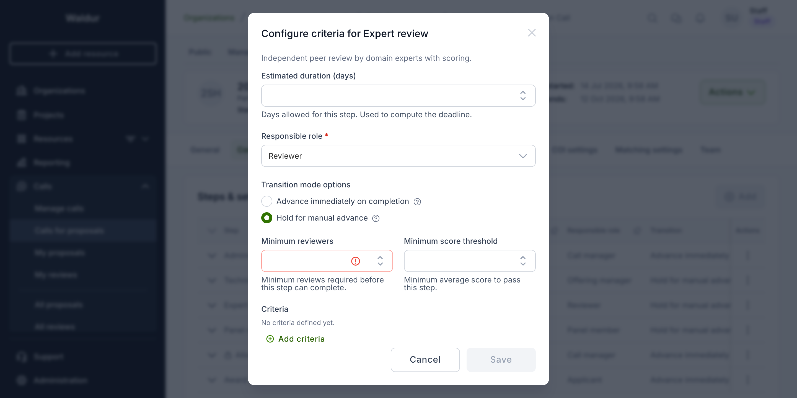

The remaining criteria appear lower in the same dialog:

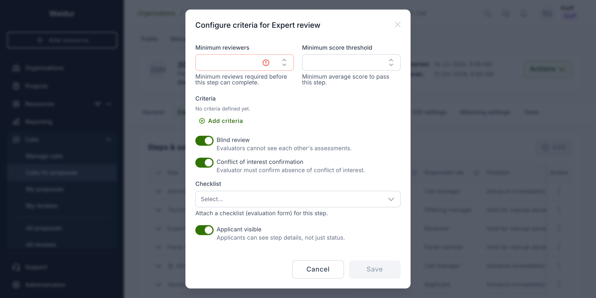

Key settings:

- **Estimated duration (days)** — days allowed for the step, used to compute its
  deadline. Leave it empty for a step that should wait indefinitely.
- **Responsible role** — who owns the step and can complete it (call manager,
  offering manager, reviewer, panel member, or the applicant for award response).
- **Transition mode options** — *Advance immediately on completion* moves the
  proposal to the next step automatically; *Hold for manual advance* pauses so
  you can review before advancing.
- **Checklist** — attach an evaluation form (see below). The **Checklist
  required** toggle decides whether it blocks completion.
- **Minimum reviewers / Minimum score threshold** — gates for review steps; the
  step cannot complete until enough reviews are in and the average score clears
  the threshold.
- **Criteria** — named scoring criteria, available on the expert review step only.
- **Blind review** — evaluators cannot see each other's assessments.
- **Conflict of interest confirmation** — reviewers must confirm they have no
  conflict with the proposal before they can **submit** their review; it does not
  block them from opening or drafting it (see
  [Conflict of interest](#conflict-of-interest)).
- **Applicant visible** — applicants see this step by name on their progress tracker.
  Off by default; an invisible step shows to them only as "In review" while it runs.

### Required vs advisory checklists

A step checklist turns the step into a structured evaluation form. The
**Checklist required** toggle controls how strictly it is enforced:

- **Required** — the step cannot be completed until every required question is
  answered. This is the checklist **gate** (see
  [Completing or rejecting a step](#completing-or-rejecting-a-step)).
- **Advisory** (toggle off) — the checklist is available to record structured
  input but never blocks completion.

Checklists are built from the same flexible question types described in
[Checklists and forms](checklists-and-forms.md). A technical-assessment
checklist, for example, pairs a single-select decision question with a free-text
rationale — in the demo call, *Technical feasibility decision* (**Feasible –
sufficient resources** / **Feasible with conditions** / **Not feasible**) and
*Assessment rationale*.

## Building the reviewer pool

Open the call's **Manage** tab and go to **Reviewer pool** to invite and track
reviewers. The **Pool** table lists each reviewer with their acceptance status,
review counts, invitation date and assignment load; an **Expertise match** column
is available from the column settings, and expanding a row reveals the reviewer's
expertise in full. The sub-tabs are **Pool**, **Discovery**, **Assignment
batches**, **Reviewer capacity** and **COI**.

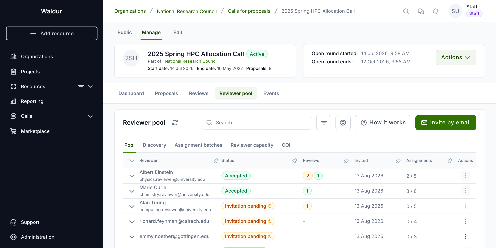

Building the pool, running matching suggestions and creating assignment batches
are covered in depth in [Reviewer management](reviewer-management.md) and the
[Reviewer guide](reviewer-guide.md).

## Conflict of interest

### COI settings

Configure automated conflict detection per call from the **COI settings** tab
in the call configuration. You control co-authorship and institutional
lookback windows, matching thresholds, and which relationships are flagged.

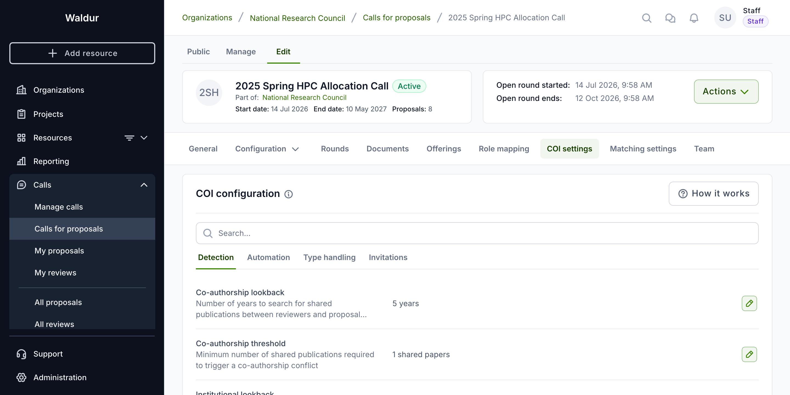

When a review step has **Conflict of interest confirmation** enabled, reviewers
must additionally attest to being conflict-free before they can submit their
review — the **Submit review** button stays disabled until they do.

### Reviewing detected conflicts

The **COI** sub-tab of the reviewer pool lists conflicts detected between
reviewers and proposal teams. From here you dismiss false positives, waive with
a management plan, or recuse a reviewer.

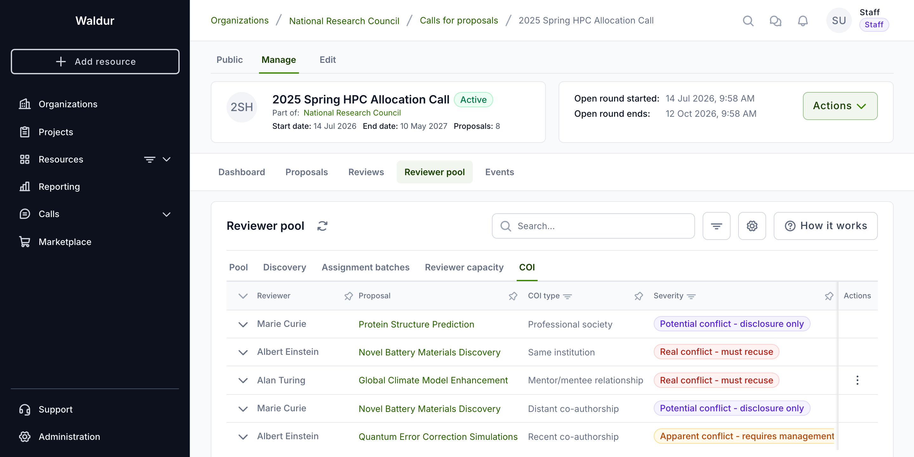

Conflict types, severities and handling rules are detailed in
[COI management](coi-management.md).

## Driving proposals through the workflow

### The proposals list

The **Proposals** tab (under either call management or the call's Manage view)
lists every proposal for the call with its applicant, current **Step** and the
step's responsible role, creation date, state and compliance status. Click a
proposal to open it.

### Opening a proposal

A proposal opens on the **Call manager** view. The **workflow stepper** at the
top shows each step with its status and outcome; the **Progress** sidebar on the
right offers the section tabs and the step action buttons — **Create review**,
**Complete step** and **Reject at step**.

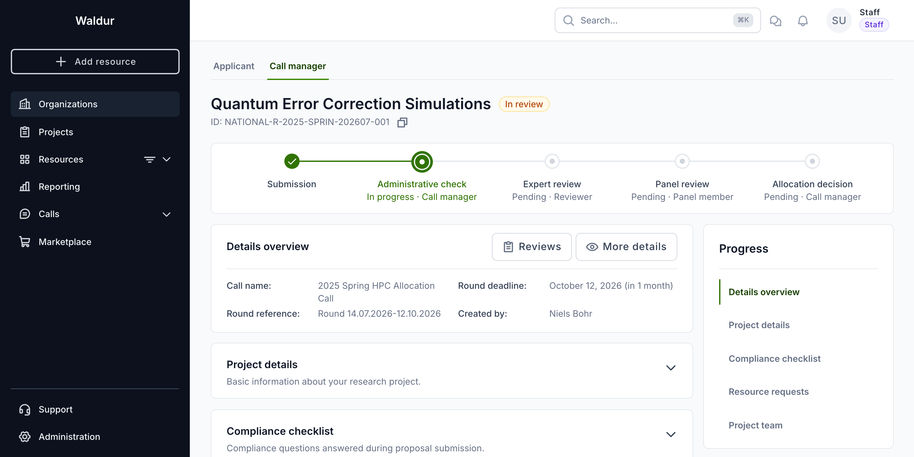

The stepper makes the proposal's position obvious at a glance: completed steps
carry their outcome (for example *Eligible*, *Accepted*, *Approved*), the active
step is marked *In progress*, and downstream steps are *Pending*.

### Answering a step checklist

When the active step has a checklist and you are its responsible role, the
checklist appears as a section on the proposal. Answer the questions and click
**Submit answers**. Once every required question is answered, the section shows
an **OK** completion badge.

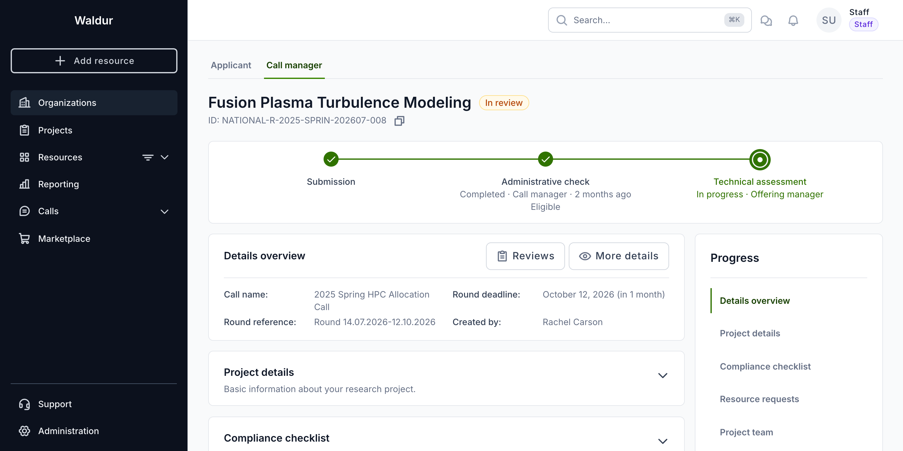

### Reading technical assessments

When technical reviewers (offering managers) have submitted their feasibility
decisions, the **Technical assessment decisions** section presents them as a
threaded, read-only view — one entry per reviewer, each with a colour-coded
decision badge and comment.

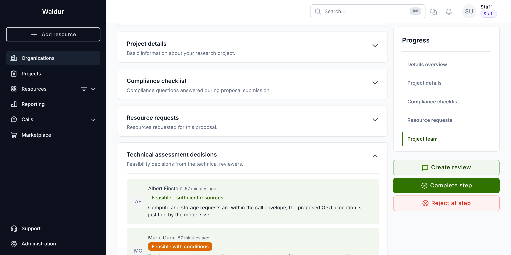

The decision values are whatever the step's checklist defines, so they differ
between calls.

!!! tip
    Badge colours are derived from the *wording* of the decision option, not from
    a fixed list: an option containing "condition" renders amber, "accept" green
    and "reject" red, and anything else falls back to a neutral style. Word your
    decision options with those terms if you want feasibility consensus to be
    readable at a glance.

### Completing or rejecting a step

Click **Complete step** to record the step's outcome. Choose an outcome from the
step's allow-list (for the administrative check, *Eligible* or *Ineligible*) and
add an optional comment.

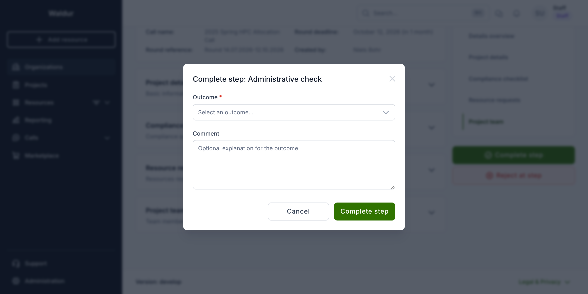

If the step's checklist is **required** and any required question is still
unanswered, **Complete step** is disabled and explains why on hover — *Answer the
required checklist questions before completing this step*. Answer the checklist
first, then complete the step.

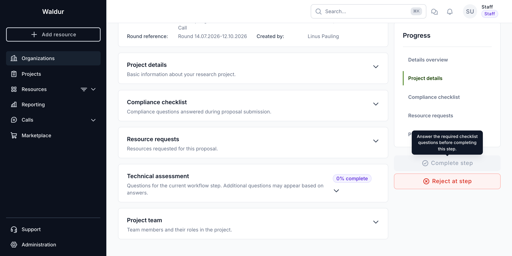

!!! warning
    The required-checklist gate is enforced by the backend, not just the UI: a
    step with a required checklist cannot be completed — via any client — until
    all required questions are answered. Advisory checklists never block.

    The same applies to the **Minimum reviewers** and **Minimum score threshold**
    gates, which are evaluated against the proposal's *submitted* reviews.

    One exception cuts across all three: a **Declined** outcome is never blocked,
    so a weak proposal can always be turned down regardless of how much of the
    evaluation was completed.

To send a proposal back or knock it out at the current step, use **Reject at
step** instead and record the reason.

### The allocation decision

**Allocation decision** is owned by the call manager and is the one mandatory
step in every workflow. Completing it with an *Approved* outcome advances the
proposal to the next enabled step.

Provisioning happens when the **last enabled step** completes, not at the
allocation decision as such:

- If **Award response** is disabled, the allocation decision is the last step, so
  approving it immediately marks the proposal **Accepted**, creates a project
  under the applicant's organisation, provisions the requested resources and
  grants the team access.
- If **Award response** is enabled, the proposal moves to that step instead and
  waits for the applicant to accept before anything is provisioned. See
  [Responding to an award](applicant-guide.md#responding-to-an-award).

An accepted proposal shows the full workflow completed, each step stamped with
its outcome and completion time.

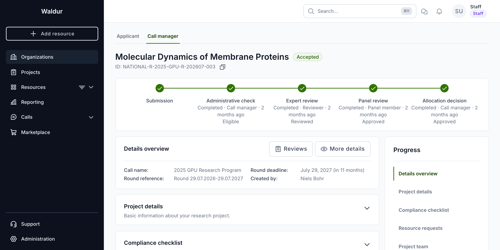

## Related guides

- [Call management](call_management.md) — full call lifecycle and rounds
- [Checklists and forms](checklists-and-forms.md) — question types and form building
- [Reviewer management](reviewer-management.md) — pool, matching and assignments
- [COI management](coi-management.md) — conflict types, severities and handling
- [Reviewer guide](reviewer-guide.md) — the reviewer's perspective
