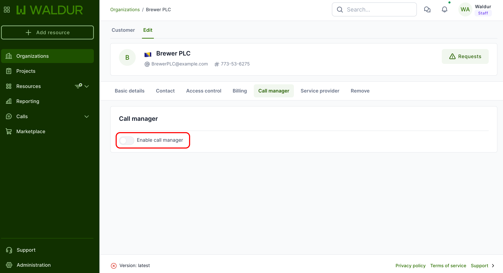
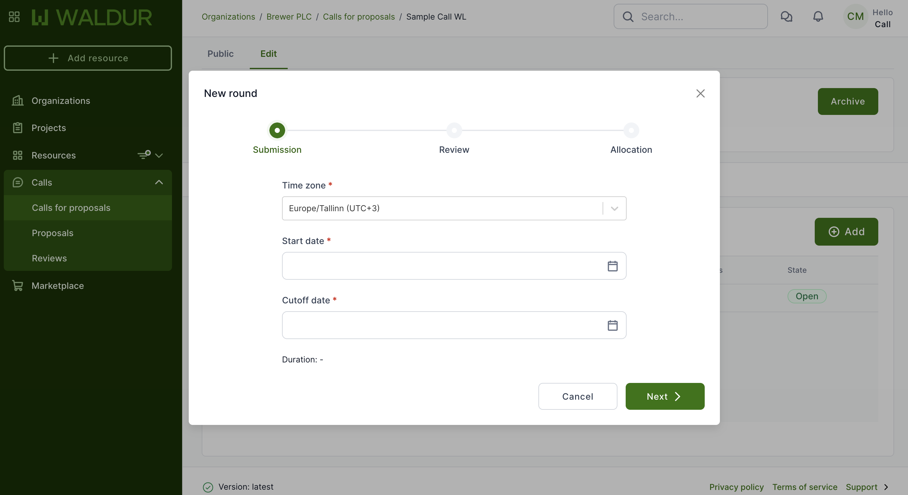
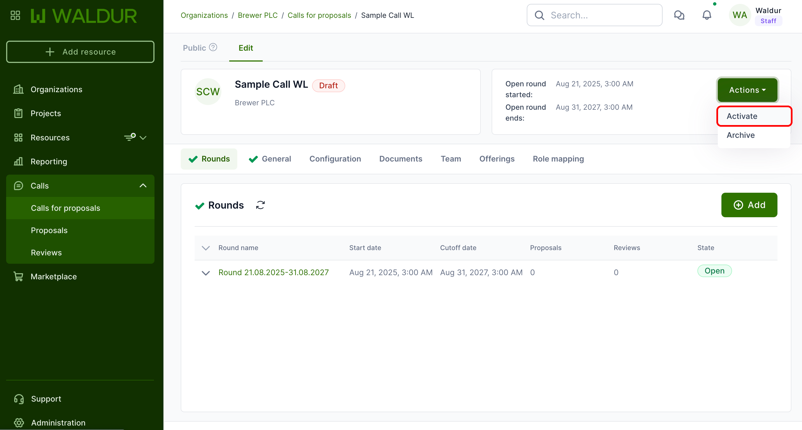
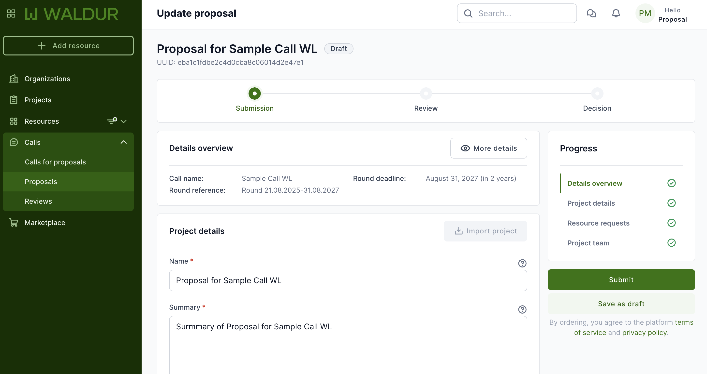
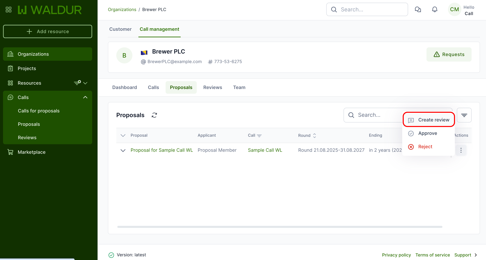
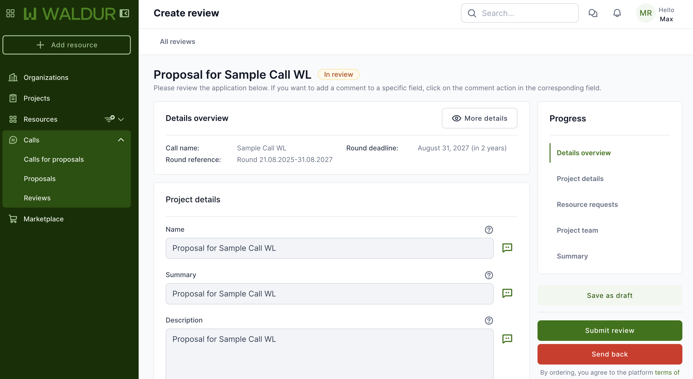
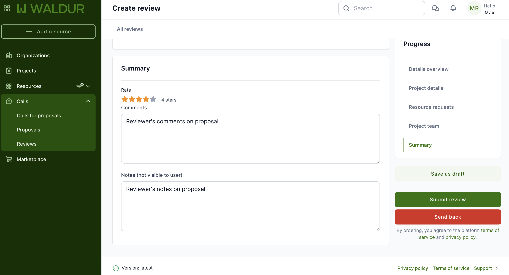
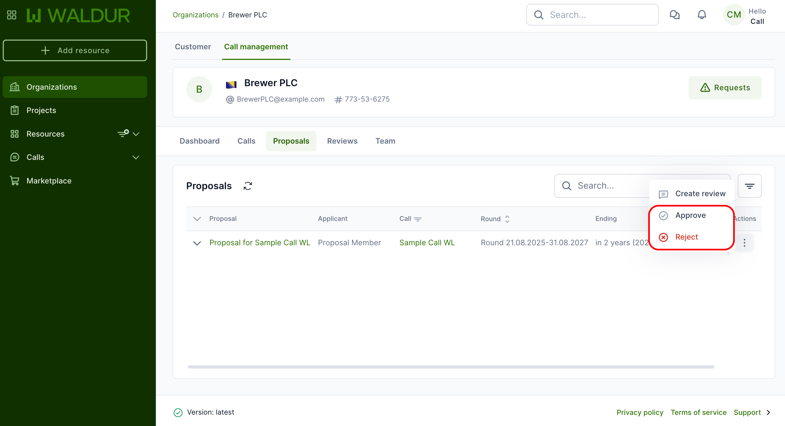
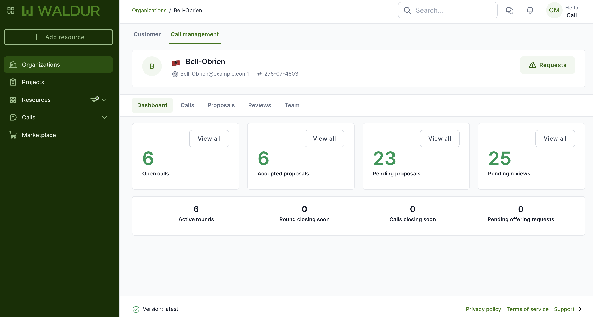

# Call management

This guide walks you through the entire lifecycle of call management in Waldur, from setup to final resource allocation. It is structured in a step-by-step format to help each stakeholder understand their responsibilities in the process.

## Detailed process guide

## Step 1: Organization setup  

**Performed by:** Organization owner

1. **Verify organization type**:
      - Navigate to your organization's profile settings
      - Confirm your organization is registered as a **Call managing organization**
      - If not, contact your Waldur administrator to update your organization type

2. **Review available offerings**:
      - Check that there are **marketplace offerings** available to be requested in calls
      - These offerings will form the resource pool available for allocation

3. **Assign Call organisers**:
      - Go to the **Team** section of your organization
      - Click on the **Add member** button
      - Search for users to assign as Call organisers
      - Select the **Call organiser** role from the dropdown menu
      - Click **Add** to confirm the assignment

## Step 2: Call creation

**Performed by:** Call organiser or Organization owner

1. Navigate to the **Call management** section, in the organisation dashboard.
2. Go to the **Calls** section, to click **"Create call"**.
3. Fill in the following details:
      - Call title
      - Description and documentation
      - Submission guidelines
      - Assign call manager to the call

## Step 3: Configure call rounds  

**Performed by:** Call manager

1. Create a **Round** within the call.
2. Configure the round settings:
      - Start and end dates
      - Review strategy: after round closure or after submission
      - Review duration (in days)
      - Minimum number of reviewers
      - Minimum average score for auto-approval (optional)
      - Deciding entity: call manager or automatic
      - Allocation timing: immediate or fixed date
      - Define the mappings between proposal roles and project roles
3. Save and activate the round.

## Step 4: Call configuration and activation

**Performed by:** Call manager

Before activating a call, the Call manager must configure all necessary settings:

### Call configuration settings

#### 1. General configuration

Configure the basic call parameters:

- **Fixed duration**: Set whether the call has a fixed timeframe (Yes/No)
- **Reviewer identity visible to submitters**: Choose if applicants can see who is reviewing their proposals (Yes/No)
- **Reviews visible to submitters**: Determine if applicants can view the reviews and feedback (Yes/No)

#### 2. Team management

Assign personnel for the call:

- **Add reviewers**: Select users who will evaluate submitted proposals
- **Add managers**: Additional managers for proposal oversight
  
  *Note: The primary Call manager is added by the Call Organiser during call creation*

#### 3. Offerings configuration

Define available resources:

- **Add Offerings**: Select which service provider offerings will be available for this call
- Ensure all required offerings have been approved by service providers

#### 4. Role mapping

Configure project role assignments:

- **Proposal project role mappings**: Map each proposal role to corresponding project roles
- Each proposal role must be mapped to a project role to ensure proper access when projects are created

*Important: The round must be created and configured first. Only after round configuration is complete can the call be fully configured and activated.*

### Call activation process

Once all configurations are complete:

1. **Review all configurations**:
      - Verify general settings are correct
      - Confirm team assignments are complete
      - Check that offerings are properly configured
      - Ensure role mappings are defined

2. **Activate the call**:
      - Click **"Activate call"** to open it for proposal submissions
      - Once activated, the call becomes visible to potential applicants
      - Applicants can now submit proposals during active rounds

## Step 5: Submit proposal  

**Performed by:** Call member (Applicant)

Applicants follow these steps to request resources through an active call:

1. Navigate to the **active round** under the relevant call.
2. Click **"Submit proposal"**.
3. Fill in the required fields.
4. Select required **offerings and allocations**.
5. Add **team members** (optional).
6. Upload required documentation.
7. Submit the proposal.

## Step 6: Review assignment and process  

**Review Assignment:** Call manager or Automatic system

### Review assignment

**Performed by:** Call manager or Automatic system

After proposals are submitted, reviews must be created and assigned to reviewers. This process depends on the call configuration:

### Automatic review creation

If configured for automatic assignment:

   - System automatically creates reviews
   - Reviews are assigned to available reviewers based on workload
   - Reviewers receive immediate notifications

### Manual review creation

If manual assignment is required:

**Performed by:** Call manager

1. Navigate to the **call**
2. Locate the submitted **proposal** in the proposals list
3. Click **Actions** next to the proposal
4. Select **Create review**
5. Assign the review to specific **reviewers**
6. Reviewers receive notifications of their assignments

**Performed by:** Reviewer

Reviewers evaluate proposals using a structured assessment process:

1. Reviewer is notified of new assigned proposal.
2. Reviewer clicks **"View"** to open a preview modal:
      - Sees brief proposal summary
      - Can choose to **"Start review"** or **"Reject"** (send back)
3. On clicking **"Start review"**, reviewer is taken to the full review form.
4. Provide feedback and scores on:
      - Project title
      - Summary and description
      - Documentation
      - Resource requests
      - Team composition
5. Submit the review.

## Step 7: Decision and allocation  

**Performed by:** Call manager (if configured) or Automatic system

The final decision process determines which proposals receive resource allocations:

1. Decision entity evaluates reviews.
2. Proposal is **accepted** or **rejected**.
3. If accepted:
      - A **new project** is created under the proposing organization.
      - Requested resources are provisioned.
      - Team members are added to the project.

## Step 8: Monitoring and reporting  

Effective monitoring ensures the call process runs smoothly and provides valuable insights:

**Performed by:** Call manager and Call organiser

- Use dashboard to monitor:
      - Open/closed calls
      - Round statuses
      - Proposal statuses
      - Review progress
      - Offering request statuses

## Additional tips

- Always check round and call status before making edits.
- Assign enough reviewers early to avoid bottlenecks.
- Communicate with applicants when revisions are needed.
- Keep documentation clear and up to date.

## Troubleshooting

Solutions for common issues encountered during the call management process:

| Issue | Possible Cause | Solution |
| --- | --- | --- |
| Unable to create call | Insufficient permissions | Verify user has Call Organiser role |
| Round cannot be activated | Missing required configuration | Check that all mandatory fields are completed |
| Offering request pending | Service provider hasn't responded | Contact provider directly or through system notification |
| Reviewer cannot access proposal | Incorrect assignment | Verify reviewer assignment in call settings |
| Applicant cannot see active call | Call visibility settings | Check call publication status and visibility settings |
| Resource allocation failed | Insufficient provider capacity | Contact service provider to resolve capacity issue |

## FAQ

**Q: What's the difference between a Call Organiser and a Call Manager?**  
A: A Call Organiser is appointed by the Organization Owner to create calls and assign Call Managers. The Call Manager is responsible for the detailed configuration of calls assigned to them including setting up rounds, assigning reviewers, and managing the review process.

**Q: Can a call have multiple rounds running simultaneously?**  
A: No, Waldur supports multiple rounds within a single call, allowing for different resource types or applicant categories to be handled separately, but they cannot be active at the same time.

**Q: What happens if insufficient reviewers complete their evaluations?**  
A: If the minimum number of reviews is not met by the deadline, the Call manager receives a notification and can either extend the review period or reduce the minimum requirement.

**Q: Can applicants edit their proposals after submission?**  
A: By default, proposals cannot be edited after submission. However, if a reviewer or Call manager rejects a proposal with a request for revisions, the applicant can make the requested changes and resubmit.

**Q: Is it possible to transfer allocated resources between approved projects?**  
A: Resource transfer between projects requires administrative approval. Contact your Call manager to request a resource transfer.

**Q: How are applicants notified about proposal decisions?**  
A: Waldur automatically sends email notifications to all team members listed in a proposal when a decision (approval or rejection) is made.

**Q: Can a Call manager override reviewer scores?**  
A: When configured for Call manager decisions, the manager can approve or reject proposals regardless of review scores, though all reviewer feedback remains visible and documented.