# Call management

This guide walks you through the entire lifecycle of call management in Waldur, from setup to final resource allocation. It is structured in a step-by-step format to help each stakeholder understand their responsibilities in the process.

## Detailed process guide

## Step 1: Organization setup

**Performed by:** Organization owner

1. **Verify organization type**:
      - Navigate to your organization's profile settings
      - Confirm your organization is registered as a **Call managing organization**
      - If not, contact your Waldur administrator to update your organization type

2. **Review available offerings**:
      - Check that there are **marketplace offerings** available to be requested in calls
      - These offerings will form the resource pool available for allocation

3. **Assign Call organisers**:
      - Go to the **Team** section of your organization
      - Click on the **Add member** button
      - Search for users to assign as Call organisers
      - Select the **Call organiser** role from the dropdown menu
      - Click **Add** to confirm the assignment

## Step 2: Call creation

**Performed by:** Call organiser or Organization owner

1. Navigate to the **Call management** section, in the organisation dashboard.
2. Go to the **Calls** section, to click **"Create call"**.
3. Fill in the following details:
      - Call title
      - Description and documentation
      - Submission guidelines
      - Assign call manager to the call

## Step 3: Configure call rounds

**Performed by:** Call manager

1. Create a **Round** within the call.
2. Configure the round settings:
      - Start and end dates
      - Review strategy: after round closure or after submission
      - Review duration (in days)
      - Minimum number of reviewers
      - Minimum average score for auto-approval (optional)
      - Deciding entity: call manager or automatic
      - Allocation timing: immediate or fixed date
      - Define the mappings between proposal roles and project roles
3. Save and activate the round.

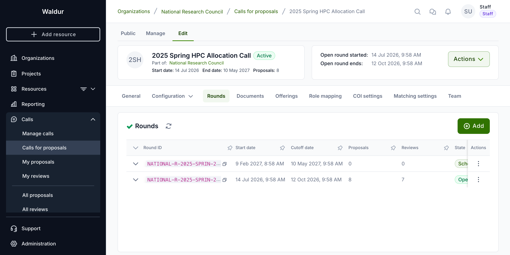

## Step 4: Call configuration and activation

**Performed by:** Call manager

Before activating a call, the Call manager must configure all necessary settings:

### Call configuration settings

#### 1. General configuration

Under **Configuration → General configuration**, set the basic call parameters:

- **Fixed duration for granted projects (in days)**: a proposal duration applied uniformly across all proposals. When set, the duration field becomes read-only in the proposal submission form.
- **Compliance checklist**: an optional checklist for proposal compliance evaluation. It can only be changed while the call has no proposals.
- **Reviewer identity visible to applicants**: whether applicants can see who is reviewing their proposals (Yes/No)
- **Reviews visible to applicants**: whether applicants can read the reviews and feedback (Yes/No)

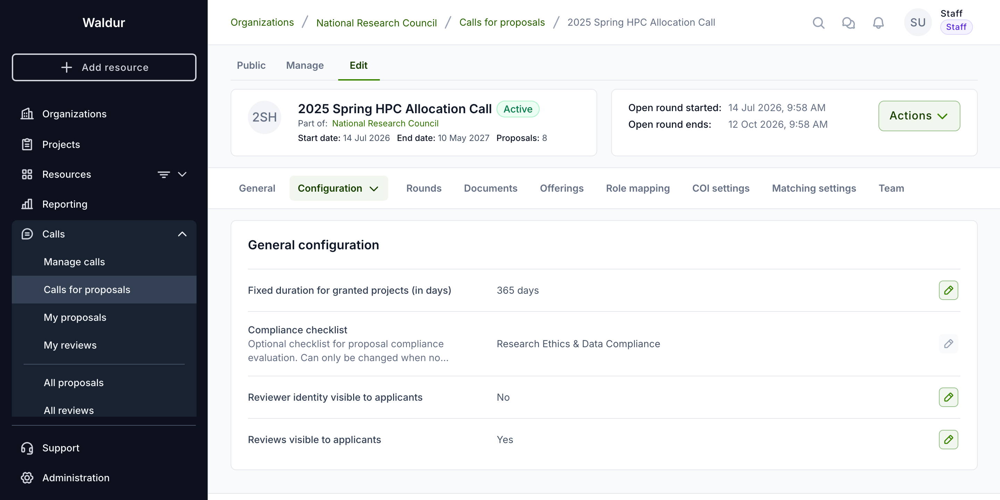

Further sub-tabs sit alongside it under **Configuration**:

- **Project details fields** — what this call asks applicants for (see below)
- **Applicant data visibility** — which applicant data is exposed during evaluation
- **Resource templates** — templates defining valid offering/plan combinations, so proposal creators can only select from those templates. Each template carries a name and offering, predefined attributes and usage limits, and a description.

#### 1a. Project details fields

Under **Configuration → Project details fields**, choose what the Project details
step asks the applicant for. Each field is one of:

| State | On the form | On submission |
|---|---|---|
| **Required** | shown, marked with a red asterisk | blocked while empty |
| **Optional** | shown | may be left empty |
| **Not asked** | not shown at all | — |

**Name** and **Project duration in days** are always required and are not
configurable: the name becomes the name of the awarded project, and the duration
states the length of the award. The configurable fields are **Summary**,
**Description**, **Science domain** and **Supporting documentation**.

Each row lists what the field feeds, so the cost of switching one off is visible
before you do. Fields marked with a warning have a functional consumer — the
summary and description are the text that **automatic reviewer matching** scores
against reviewer profiles, so a call that does not collect them gets less
accurate reviewer suggestions.

A field **cannot be made required once the call has proposals**. Drafts that were
complete under the published form would silently stop being submittable, and
nothing notifies the applicants who wrote them. Relaxing a field — making it
optional, or not asking for it at all — stays possible at any time. To run a
stricter round, duplicate the call: the copy starts in draft with no proposals,
and its field configuration is carried over ready to tighten.

New calls start from the deployment defaults, which an administrator sets under
**Proposal settings** in the Constance configuration
(`DEFAULT_PROPOSAL_REQUIRED_FIELDS`, `DEFAULT_PROPOSAL_HIDDEN_FIELDS`). Those
defaults are applied when the call is created; changing them later never alters
a call that already exists.

#### 2. Offerings configuration

Define available resources:

- **Add Offerings**: Select which service provider offerings will be available for this call
- Ensure all required offerings have been approved by service providers
- Offerings that require a purchase order pass that requirement on to the call — see [Purchase orders in calls](purchase-orders.md)

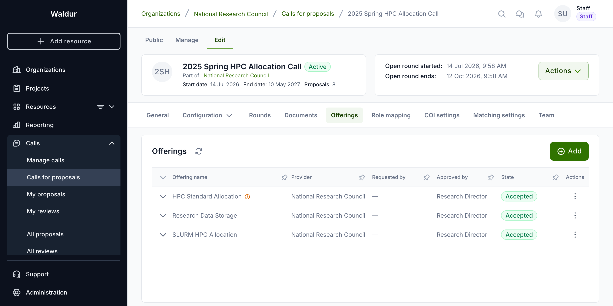

#### 3. Role mapping

Configure project role assignments:

- **Proposal project role mappings**: Map each proposal role to corresponding project roles
- Each proposal role must be mapped to a project role to ensure proper access when projects are created

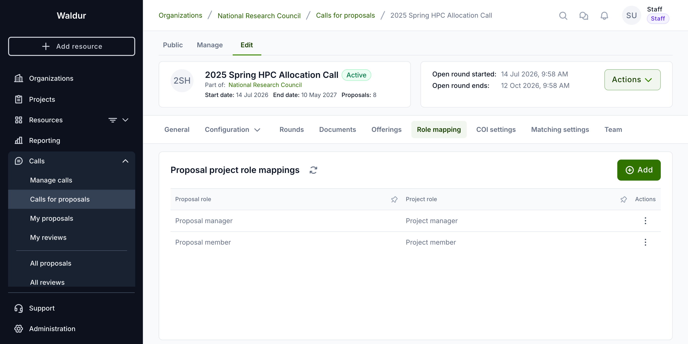

#### 4. Workflow steps

Under **Configuration → Steps & settings**, configure the evaluation pipeline that submitted proposals progress through. See [Workflow configuration](workflow-configuration.md) for details.

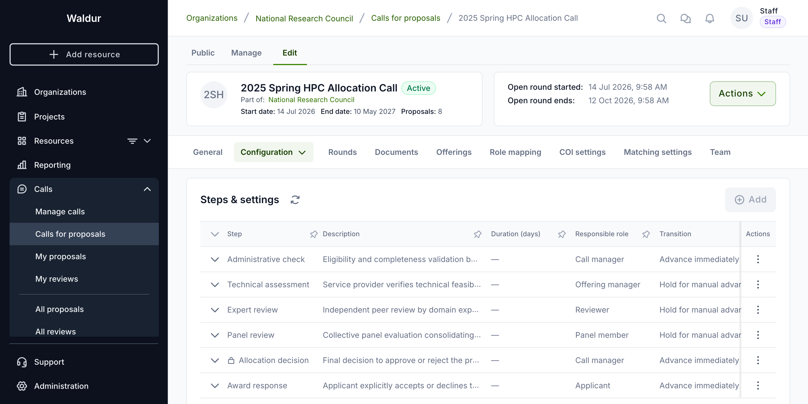

#### 5. COI settings

Configure conflict of interest detection parameters. See [Reviewer management](reviewer-management.md#conflict-of-interest-coi-detection) for details.

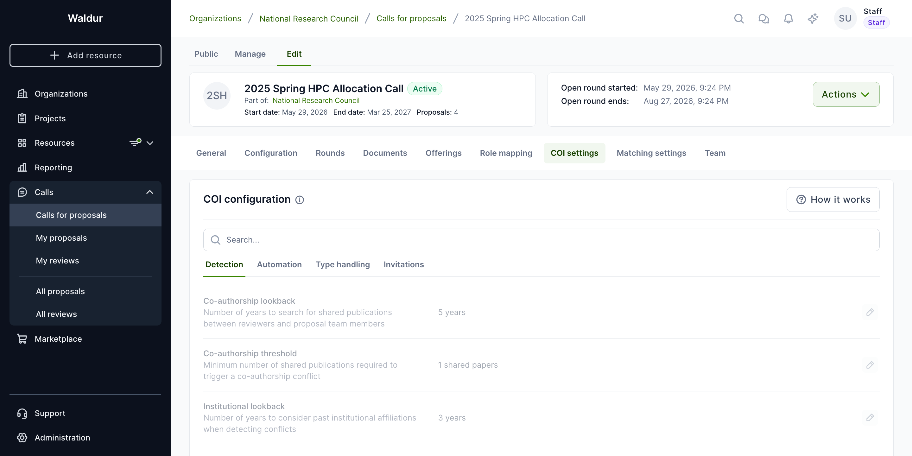

#### 6. Matching settings

Configure the reviewer-proposal matching algorithm. See [Reviewer management](reviewer-management.md#reviewer-proposal-matching) for details.

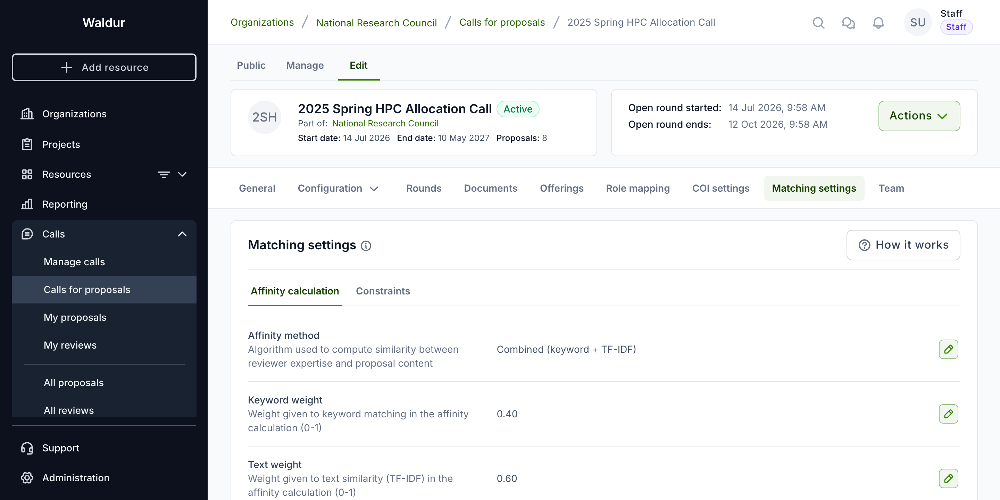

#### 7. Call team

The **Team** tab assigns **call managers** and **panel members** to the call.

  *Note: The primary Call manager is added by the Call organiser during call creation.*

Reviewers are not managed here — they are added to the call's reviewer pool on the call manage page. See [Reviewer management](reviewer-management.md#reviewer-pool-management).

*Important: The round must be created and configured first. Only after round configuration is complete can the call be fully configured and activated.*

### Call activation process

Once all configurations are complete:

1. **Review all configurations**:
      - Verify general settings are correct
      - Confirm team assignments are complete
      - Check that offerings are properly configured
      - Ensure role mappings are defined

2. **Activate the call**:
      - Click **"Activate call"** to open it for proposal submissions
      - Once activated, the call becomes visible to potential applicants
      - Applicants can now submit proposals during active rounds

## Step 5: Submit proposal  

**Performed by:** Call member (Applicant)

Applicants follow these steps to request resources through an active call:

1. Navigate to the **active call** in the public calls listing.

    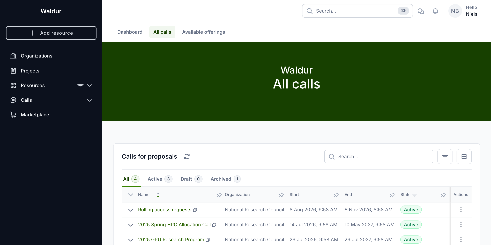

2. Click **"Apply to round"** on the call detail page.

    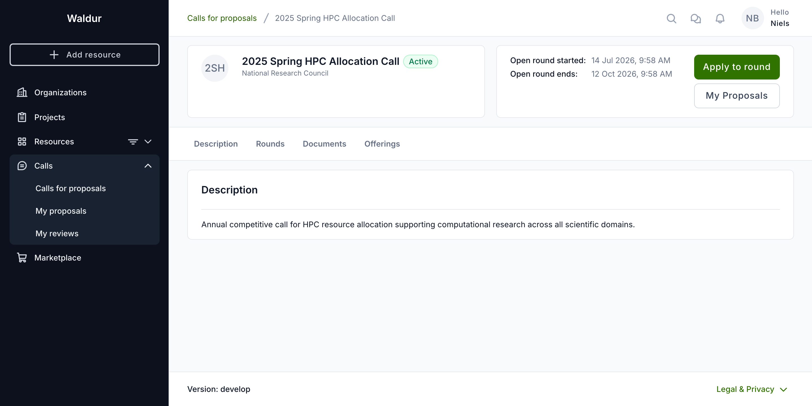

3. Fill in the required fields.
      -     When the call round has a fixed duration set by the Call manager, this duration (in days) is automatically applied to all proposals. The duration field becomes read-only for proposal creators in both creation and editing interfaces.
4. Select required **offerings and allocations**.
      -     When there is predefined resource templates, proposal creators now select resources based on predefined templates configured by the Call manager. These templates include specific offering and plan combinations, predefined attributes and resource limits.
5. Add **team members** (optional).
6. Upload required documentation.
      -     When an offering requires a purchase order, supply its reference or document on the resource request. The request can be saved without one, but the proposal cannot be submitted until it is there — see [Purchase orders in calls](purchase-orders.md).
7. Submit the proposal.

## Step 6: Review assignment and process  

### Building the reviewer pool

**Performed by:** Call manager

Before assigning reviews, the call manager builds a pool of qualified reviewers:

1. Navigate to the call manage page and select the **Reviewer pool** tab
2. Add reviewers by profile or email invitation
3. Review the pool members with their acceptance status

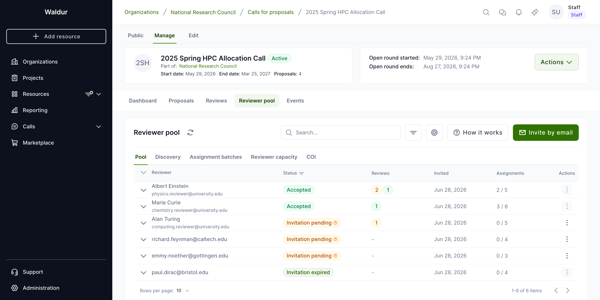

### Reviewer discovery and matching

Use the **Discovery** tab to find reviewers using algorithmic matching:

1. Click **Generate Suggestions** to run the matching algorithm
2. Review suggestions with affinity scores
3. Confirm or reject each suggestion

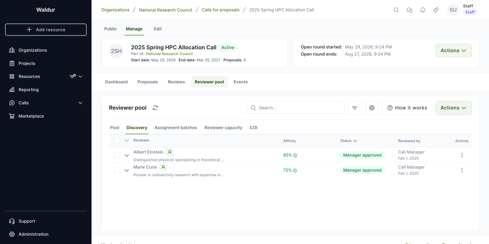

### Managing conflicts of interest

The **COI** tab shows detected conflicts between reviewers and proposals:

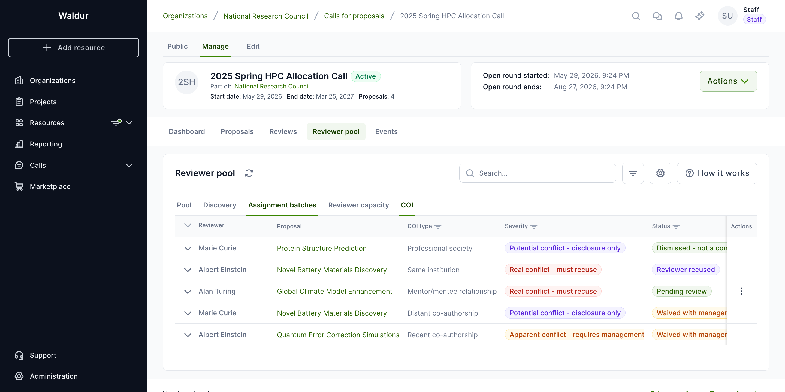

Expand a record to see evidence details and management options:

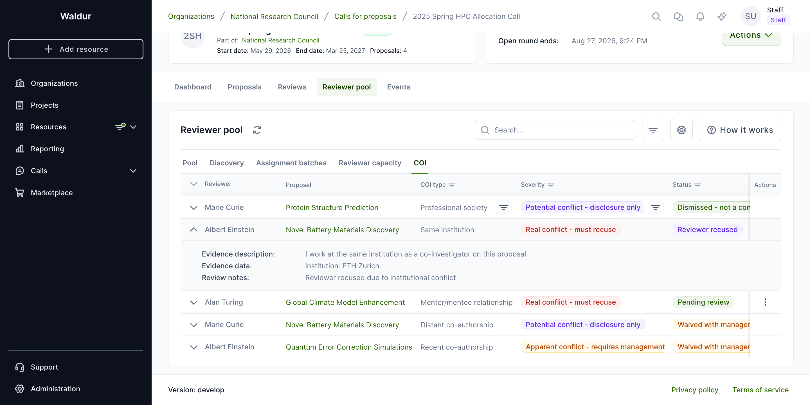

### Creating assignment batches

After matching, create formal assignment batches to assign proposals to reviewers:

1. Go to the **Assignments** tab in the reviewer pool
2. Create batches grouping proposals per reviewer
3. Send batches — reviewers receive email notifications

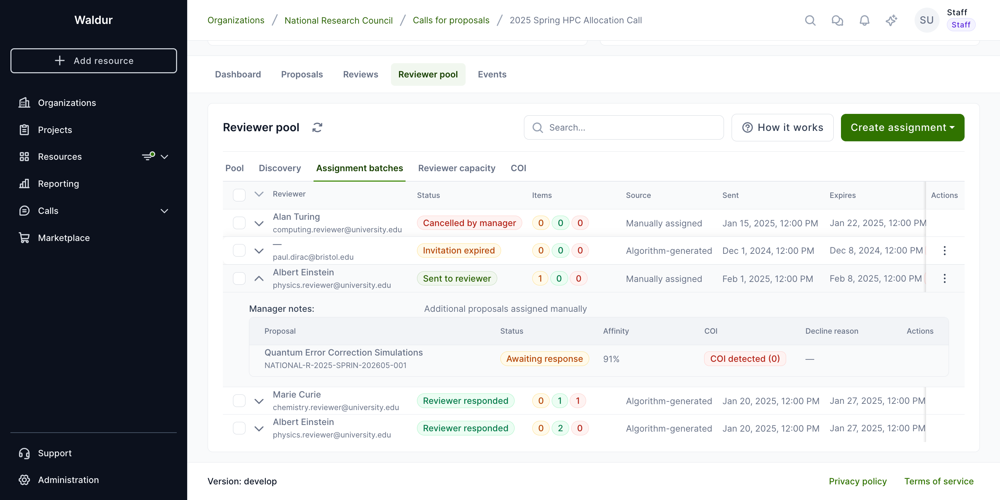

Reviewers can accept or decline each proposal. Expanded batches show individual item responses:

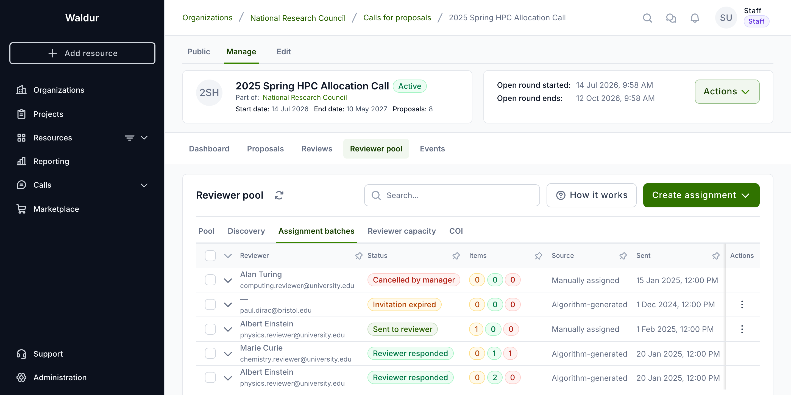

### Review process

**Performed by:** Reviewer

Reviewers see their assignments on the reviewer dashboard:

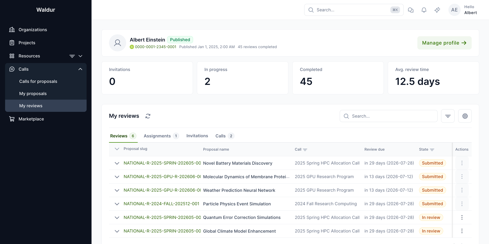

The **Assignments** tab shows pending batches with accept/decline actions:

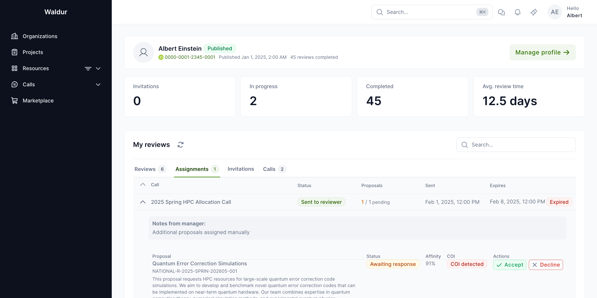

Reviewers evaluate proposals using a structured assessment process:

1. Open a review from the **My reviews** list
2. Read the proposal summary, team composition, and resource requests
3. Score each section and provide feedback
4. Submit the review

## Step 7: Decision and allocation

**Performed by:** Call manager (if configured) or Automatic system

The call manager monitors all proposals and their review status:

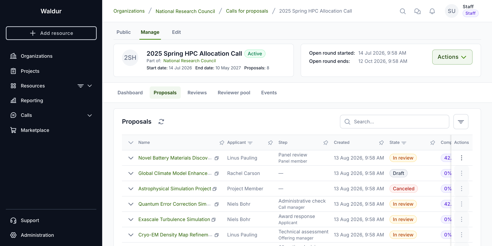

The reviews list shows every review with its reviewer, round and state:

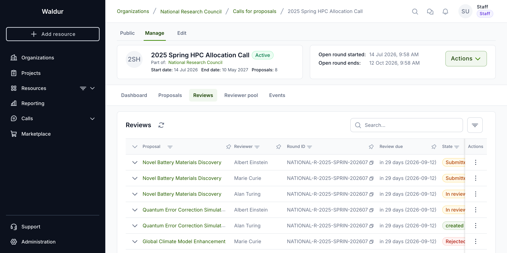

The final decision process determines which proposals receive resource allocations:

1. Decision entity evaluates reviews.
2. Proposal is **accepted** or **rejected**.
3. If accepted:
      - A **new project** is created under the proposing organization.
      - Requested resources are provisioned.
      - Team members are added to the project.

## Step 8: Monitoring and reporting  

**Performed by:** Call manager and Call organiser

The call dashboard provides an overview of the entire call:

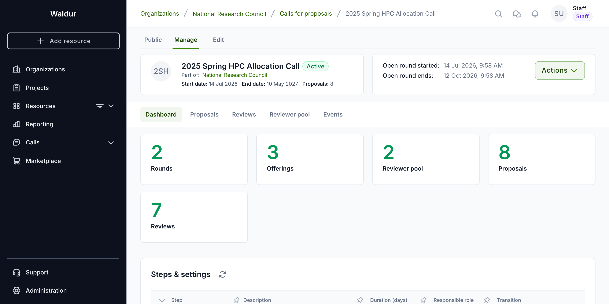

- Use the dashboard to monitor:
      - Round statuses
      - Proposal pipeline
      - Review progress
      - Reviewer pool capacity

### Admin reviews

Staff users can view all reviews across all calls from the admin reviews page:

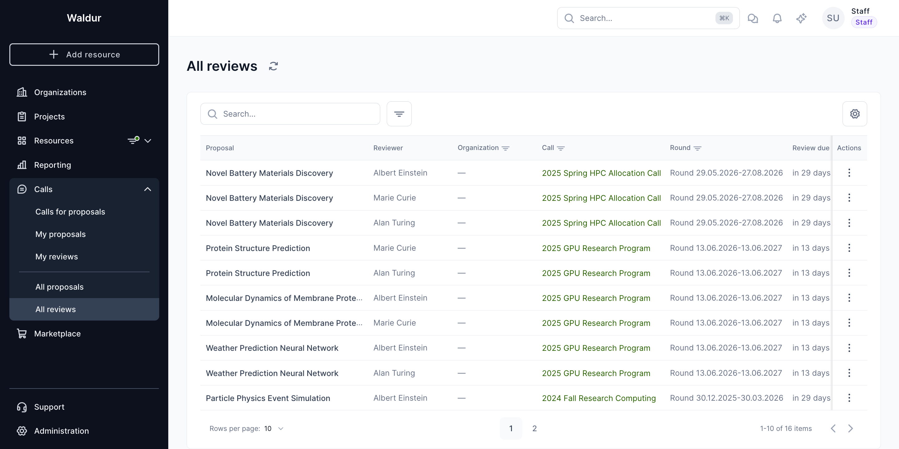

Reviews can be filtered by specific call:

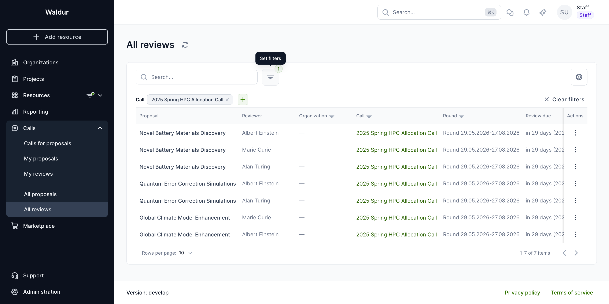

## Additional tips

- Always check round and call status before making edits.
- Assign enough reviewers early to avoid bottlenecks.
- Communicate with applicants when revisions are needed.
- Keep documentation clear and up to date.

## Troubleshooting

Solutions for common issues encountered during the call management process:

| Issue | Possible Cause | Solution |
| --- | --- | --- |
| Unable to create call | Insufficient permissions | Verify user has Call Organiser role |
| Round cannot be activated | Missing required configuration | Check that all mandatory fields are completed |
| Offering request pending | Service provider hasn't responded | Contact provider directly or through system notification |
| Reviewer cannot access proposal | Incorrect assignment | Verify reviewer assignment in call settings |
| Applicant cannot see active call | Call visibility settings | Check call publication status and visibility settings |
| Resource allocation failed | Insufficient provider capacity | Contact service provider to resolve capacity issue |

## FAQ

**Q: What's the difference between a Call Organiser and a Call Manager?**
A: A Call Organiser is appointed by the Organization Owner to create calls and assign Call Managers. The Call Manager is responsible for the detailed configuration of calls assigned to them including setting up rounds, assigning reviewers, and managing the review process.

**Q: Can a call have multiple rounds running simultaneously?**
A: No, Waldur supports multiple rounds within a single call, allowing for different resource types or applicant categories to be handled separately, but they cannot be active at the same time.

**Q: What happens if insufficient reviewers complete their evaluations?**
A: If the minimum number of reviews is not met by the deadline, the Call manager receives a notification and can either extend the review period or reduce the minimum requirement.

**Q: Can applicants edit their proposals after submission?**
A: By default, proposals cannot be edited after submission. However, if a reviewer or Call manager rejects a proposal with a request for revisions, the applicant can make the requested changes and resubmit.

**Q: Is it possible to transfer allocated resources between approved projects?**
A: Resource transfer between projects requires administrative approval. Contact your Call manager to request a resource transfer.

**Q: How are applicants notified about proposal decisions?**
A: Waldur automatically sends email notifications to all team members listed in a proposal when a decision (approval or rejection) is made.

**Q: Can a Call manager override reviewer scores?**  
A: When configured for Call manager decisions, the manager can approve or reject proposals regardless of review scores, though all reviewer feedback remains visible and documented.
