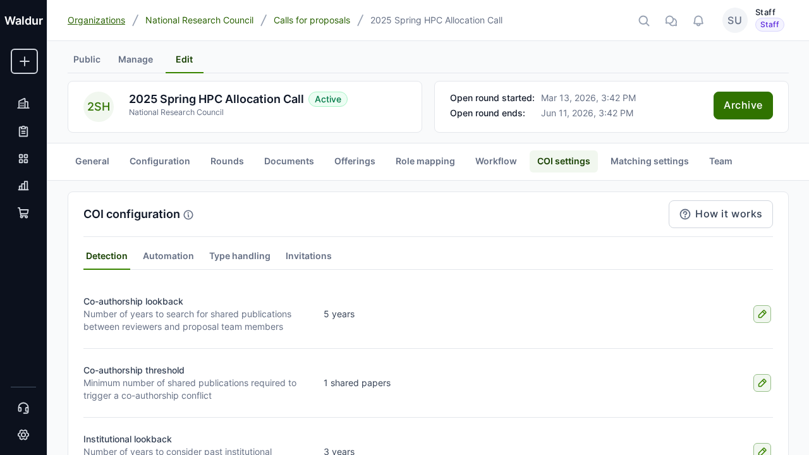

# Checklists and forms

Waldur uses a flexible checklist system to create customizable forms for proposals, compliance checks, and onboarding workflows. This guide covers how to configure and manage checklists within call management.

## Overview

Checklists in Waldur serve multiple purposes:

| Checklist Type | Purpose |
|---|---|
| **Proposal compliance** | Questions that proposal submitters must answer |
| **Offering compliance** | Compliance checks for service provider offerings |
| **Project metadata** | Additional project information collection |
| **Onboarding** | Data collection during organization onboarding |

## Supported question types

Waldur supports 16 question types for building forms:

| Question Type | Description | Validation |
|---|---|---|
| **Yes/No** | Boolean with Yes/No/N/A options | — |
| **Text input** | Single-line short text | — |
| **Text area** | Multi-line long text | — |
| **Number** | Numeric input (integer or decimal) | Optional min/max value |
| **Date** | Date picker (YYYY-MM-DD) | Date format validation |
| **Date and time** | Date with time picker | DateTime format validation |
| **File** | Single file upload | Optional: allowed types, MIME types, max size |
| **Multiple files** | Multi-file upload | Optional: allowed types, max count, max size |
| **Single selection** | Dropdown with one selectable option | Options defined via Question Options |
| **Multiple selection** | Dropdown with multiple selectable options | Options defined via Question Options |
| **Phone number** | Phone number input | Phone format validation |
| **Year** | Year input | Optional min/max year |
| **Email** | Email address input | Email format validation |
| **URL** | URL input | URL format validation |
| **Country** | Country selector (ISO 3166) | Country code validation |
| **Rating** | Numeric rating scale | Configurable min/max (e.g., 1-5 for Likert) |

## File upload configuration

For **File** and **Multiple files** question types, you can configure:

- **Allowed file extensions**: e.g., `.pdf`, `.doc`, `.docx`
- **Allowed MIME types**: e.g., `application/pdf`, `application/msword`
- **Maximum file size**: In megabytes
- **Maximum file count**: For multiple files type only

!!! tip
    When both extensions and MIME types are specified, files must match both criteria for security.

## Conditional visibility (question dependencies)

Questions can be shown or hidden based on answers to other questions, enabling dynamic forms.

### Setting up conditional visibility

1. Create the base question (the one that controls visibility)
2. Create the dependent question
3. Add a **dependency** linking the dependent question to the base question
4. Configure:
    - **Depends on question**: The base question
    - **Required answer value**: The answer that makes the dependent question visible
    - **Operator**: How to compare (equals, not equals, contains, in list, not in list)

### Dependency logic operators

When a question has multiple dependencies:

- **AND**: All dependencies must be satisfied for the question to be visible
- **OR**: At least one dependency must be satisfied

### Available comparison operators

| Operator | Description | Example |
|---|---|---|
| **Equals** | Exact match | Answer = "Yes" |
| **Not equals** | Inverse match | Answer ≠ "No" |
| **Contains** | Substring match | Answer contains "GPU" |
| **In list** | Value in set | Answer in ["Option A", "Option B"] |
| **Not in list** | Value not in set | Answer not in ["N/A"] |

!!! note
    The system prevents circular dependencies. If Question A depends on Question B, then Question B cannot depend on Question A (directly or through a chain).

## Review trigger configuration

Questions can be configured to flag answers for review by call managers:

- **Review answer value**: The answer that triggers a review flag
- **Operator**: Comparison method (same operators as above)
- **Always requires review**: Flag for review regardless of answer

When a triggered answer is submitted, the checklist completion is marked as requiring review.

## Attaching checklists to calls

**Performed by:** Call manager

1. Navigate to the **call configuration**
2. In the **General configuration** section, select a **compliance checklist**
3. The selected checklist will be presented to all proposal submitters

When a proposal is created, the system automatically creates a checklist completion record for that proposal. Submitters must answer all required questions before submitting.

## Checklist completion tracking

For each proposal with an attached checklist:

- **Completion percentage**: Tracks how many questions have been answered
- **Review status**: Indicates if any answers require manager review
- **Review notes**: Managers can add notes after reviewing flagged answers

## Managing checklists (administrators)

Administrators can manage checklists via the admin interface:

1. **Create checklist**: Define name, type, and description
2. **Add questions**: Create questions with type, ordering, required flag, and guidance text
3. **Add options**: For selection types, add option labels with sort order
4. **Add dependencies**: Configure conditional visibility between questions
5. **Attach to calls**: Link the checklist to specific calls via call configuration

!!! warning
    Modifying checklist questions after proposals have been submitted may affect existing answers. Consider creating a new checklist version for significant changes.
