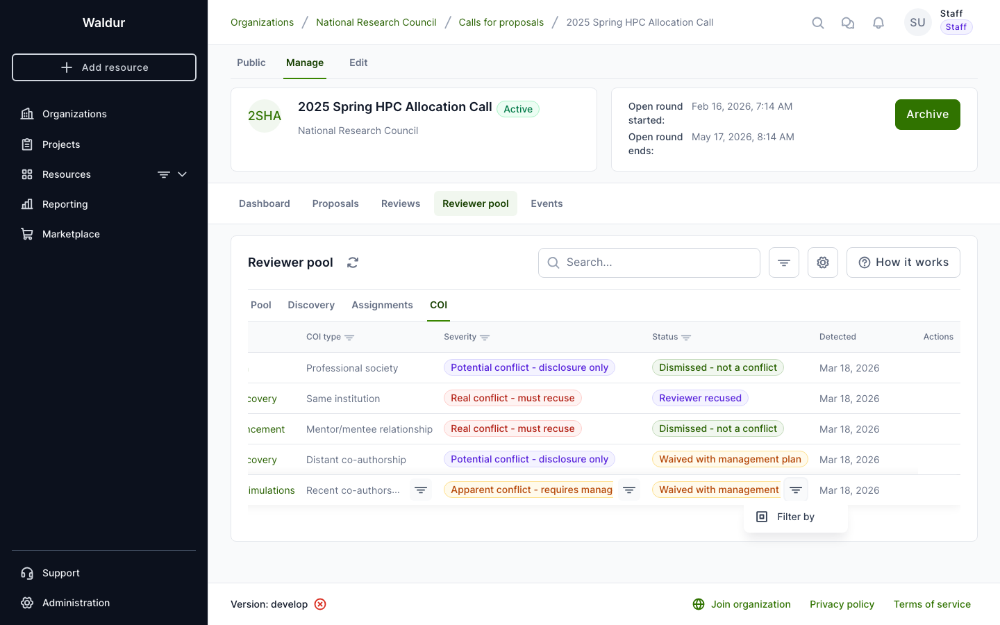
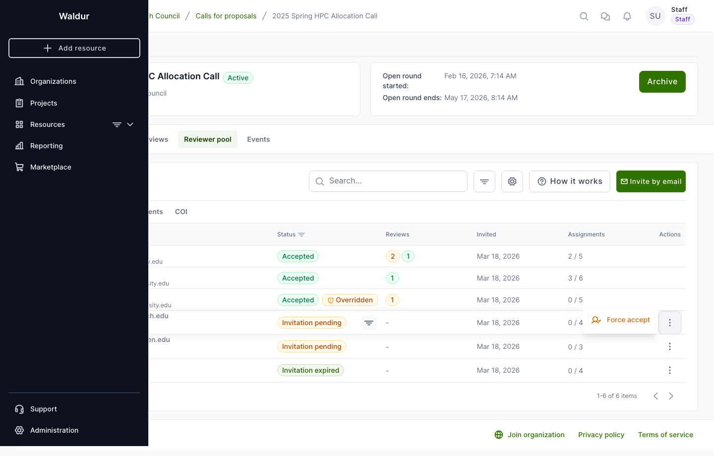
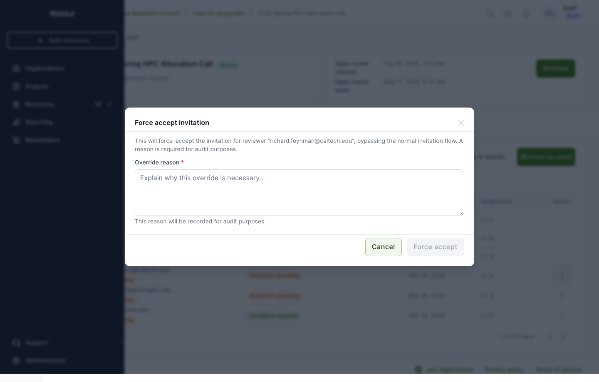

# Conflict of interest management

Waldur includes a conflict of interest (COI) detection and management system for the call-for-proposals workflow. This guide covers how call managers review COIs and use staff override capabilities when the automated workflow gets blocked.

## Overview

COIs are detected automatically or self-declared by reviewers when they accept pool invitations. Each COI has:

- **Type**: Same institution, co-authorship, family relationship, mentor/mentee, financial interest, etc.
- **Severity**: Real (must recuse), Apparent (requires management plan), or Potential (disclosure only)
- **Status**: Pending, Dismissed, Waived, or Recused

## Reviewing conflicts of interest

Navigate to your call's **Manage** page and select the **Reviewer pool** tab, then the **COI** sub-tab.

The COI table shows all detected conflicts with their type, severity, current status, and detection method. For each pending COI, the call manager can take one of three actions:

### Dismiss

Mark the COI as a false positive. The reviewer can continue reviewing the proposal without restrictions. Related assignment items that were blocked by this COI are automatically unblocked.

### Waive

Approve the reviewer to continue despite the conflict, but with a mandatory **management plan** describing the mitigation measures. Related blocked assignments are automatically unblocked.

### Recuse

Permanently remove the reviewer from the proposal. Any existing reviews are discarded, and assignment items are marked as blocked.

!!! note
    When a COI is dismissed or waived, any assignment items that were blocked solely because of that COI are automatically changed from "blocked" to "pending". If multiple COIs exist for the same reviewer-proposal pair, the assignment remains blocked until all COIs are resolved.

## Staff override capabilities

When the automated workflow gets stuck — for example, a reviewer's invitation expired or an assignment is blocked by a COI that the manager wants to override — staff and call managers can use manual overrides.

### Force-accepting reviewer pool invitations

If a reviewer's invitation is stuck in **pending**, **declined**, or **expired** status, a call manager can force-accept it.

1. Navigate to the **Reviewer pool** tab
2. Find the invitation with the stuck status
3. Click the three-dot action menu and select **Force accept**

4. In the dialog, provide a mandatory **override reason** explaining why the override is necessary

5. Click **Force accept** to confirm

The invitation status changes to "Accepted" with an "Overridden" badge indicating it was manually accepted.

!!! warning
    Force-accepting an invitation bypasses the reviewer's consent. Only use this when you have confirmed with the reviewer through other channels. The override reason is recorded for audit purposes.

### Force-unblocking COI-blocked assignments

If an assignment item is blocked due to a COI and the manager wants to proceed regardless:

1. Navigate to the **Assignments** sub-tab in the Reviewer pool
2. Expand the assignment batch to see individual items
3. Find the item with **COI blocked** status
4. Click the action menu and select **Force unblock**
5. Provide a mandatory **override reason**
6. The item status changes from "blocked" to "pending"

!!! warning
    Force-unblocking an assignment allows a reviewer with a known conflict of interest to review a proposal. Use this only when the conflict has been evaluated and the risk is acceptable. The override is recorded with the reason, user, and timestamp for compliance purposes.

## Audit trail

All override actions are recorded with:

- **Who** performed the override
- **When** it was performed
- **Why** (the mandatory override reason)

This information is visible in the reviewer pool table (as an "Overridden" badge with tooltip) and in assignment item details.
