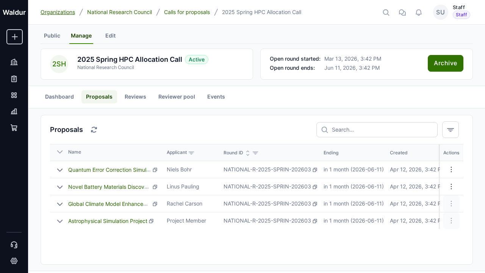

# Data export

Waldur provides multiple ways to export data from the platform. This guide covers the export capabilities available for call management.



## Table export

Every data table in Waldur supports direct export to multiple formats.

### Available formats

| Format | Description | Use Case |
|---|---|---|
| **CSV** | Comma-separated values | Data analysis in Excel, Google Sheets, or scripts |
| **Excel (XLSX)** | Microsoft Excel format | Formatted spreadsheets with styling |
| **PDF** | Portable document format | Reports and printable documents |
| **Clipboard** | Copy to clipboard | Quick paste into other applications |

### How to export

1. Navigate to any data table (proposals list, users list, reviews, etc.)
2. Click the **Export** button in the table toolbar
3. In the export dialog, choose:
    - **Format**: CSV, Excel, PDF, or Clipboard
    - **Apply filters**: Export only filtered data (if table has active filters)
    - **All pages**: Export all records or only the current page
4. Click **Export** to download the file

!!! tip
    Apply table filters before exporting to narrow down the data. The "Apply filters" checkbox will include only the filtered subset in the export.

## Saved filters

Table filters can be saved for reuse:

1. Configure your desired filters on any data table
2. Click the **Save filter** button
3. Enter a name for the saved filter
4. The saved filter appears in the filter dropdown for quick access

## Management command export

For administrators, Waldur provides management commands for comprehensive data export:

```bash
# Export full platform structure to JSON
waldur export_structure --output backup.json --verbose

# Export with event history
waldur export_structure --output full_backup.json --include-events
```

The structure export includes:

- Users and permissions
- Organizations and projects
- Marketplace data (categories, offerings, plans, resources, orders)
- Billing information (invoices, credits, usage)
- Checklists and answers

## API-based export

All data accessible through the Waldur REST API can be exported programmatically:

```bash
# Export proposals for a specific call
curl -H "Authorization: Token YOUR_TOKEN" \
  "https://waldur.example.com/api/proposal-proposals/?call_uuid=CALL_UUID&page_size=1000"
```

See the Integrator Guide for API documentation.
