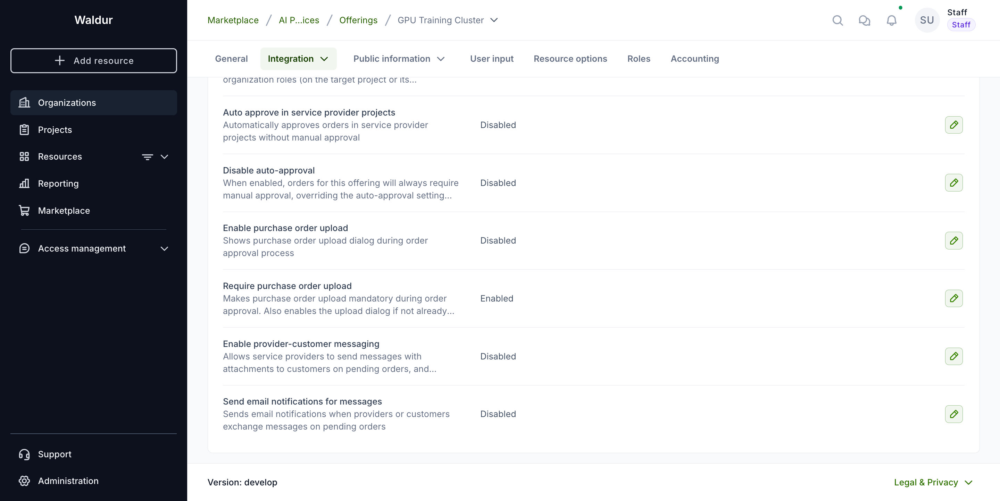
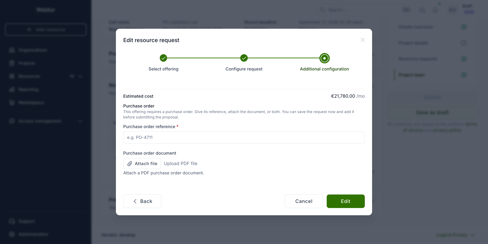
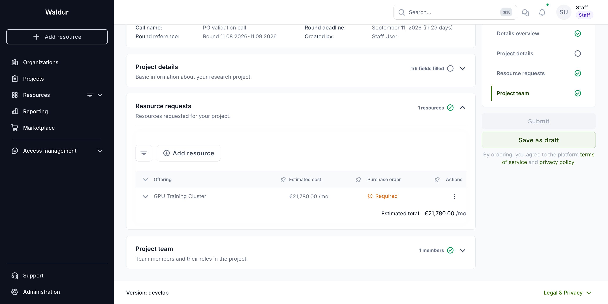
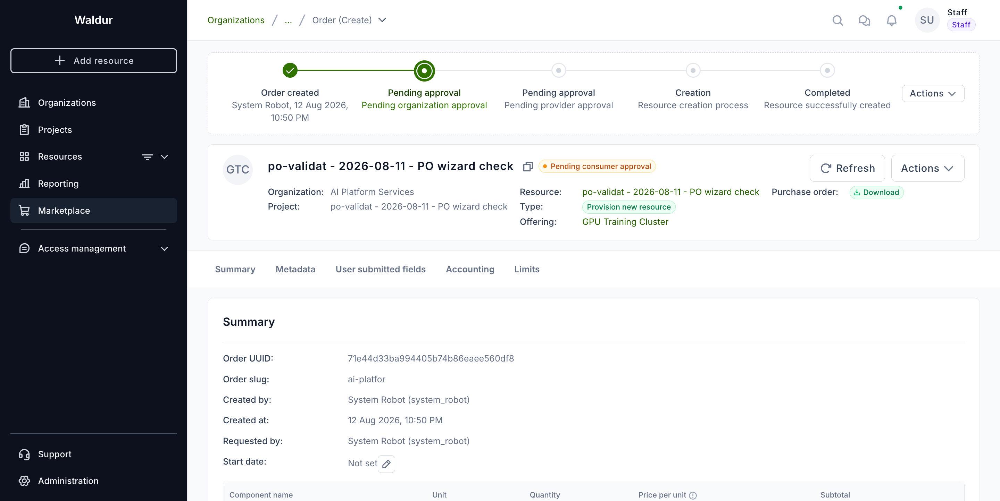

# Purchase orders in calls

Some offerings may not be provisioned until the applicant supplies a purchase order — the authorisation from their organisation to spend the money. When such an offering is part of a call, Waldur collects the purchase order during the proposal rather than after the allocation, so the reviewer sees the authorisation alongside the amounts and the applicant is not asked for it a second time.

## Setting the requirement

**Performed by:** Service provider (on the offering)

The requirement is a property of the offering:

1. Open the offering and go to **Integration** → **Operations**.
2. Set one of:
      - **Enable purchase order upload** — a purchase order may be supplied, but it is optional.
      - **Require purchase order upload** — a purchase order is mandatory. This also enables the upload if it was not enabled already.



When the offering is added to a call, the call entry inherits the requirement as it stands at that moment.

!!! note
    Changing the offering's setting afterwards does not rewrite calls that already include it. An offering that starts requiring purchase orders will not retroactively block proposals in a call that was configured before the change.

## Supplying a purchase order

**Performed by:** Call member (Applicant)

Purchase orders are supplied per resource request, in the **Additional configuration** step of the resource request form:

- **Purchase order reference** — the identifier from your organisation's finance system, for example `PO-4711`.
- **Purchase order document** — the purchase order itself, as a PDF.

Either one satisfies the requirement. Some providers want the document, others only need the reference, and supplying both is fine.



!!! tip
    You do not need the purchase order to save the request. Enter the amounts, save, obtain the purchase order from your organisation, then reopen the request and attach it. Only submitting the proposal requires it.

The **Purchase order** column in the resource requests list shows where each request stands — `Required` while one is still missing, and the reference (or `Attached`) once it is supplied.



Submitting the proposal is refused while any request is missing a purchase order the call demands, and the message names the offerings concerned:

```text
A purchase order is required for the following offerings: GPU Training Cluster.
```

## What happens after acceptance

When the proposal is accepted, the project is created and each requested resource becomes an order. The purchase order travels with it: the document is attached to the order and the reference is recorded as its **PO reference**, both visible on the order's page.



Because the authorisation was already collected and reviewed as part of the proposal, the consumer approval step on these orders is completed automatically and nobody is asked to upload the document again. Provider approval still applies where the offering requires it.

## Troubleshooting

| Symptom | Cause |
|---|---|
| The proposal cannot be submitted and names an offering | A resource request for that offering has neither a reference nor a document. Open the request and supply one. |
| The purchase order block is not shown on a request | The offering neither enables nor requires purchase orders, or it was added to the call before the setting was turned on. |
| A request still shows `Required` after a document was attached | The upload did not complete. Reopen the request — an attached document is shown as a download link in the purchase order step. |
