# Reviewer guide

This guide covers the reviewer experience in Waldur: managing your reviewer profile, accepting invitations, completing reviews, and tracking your workload.

## Getting started as a reviewer

To participate in proposal reviews, you need a published reviewer profile.

### Creating your profile

1. Navigate to the **Reviews** page from the sidebar
2. Click **Create profile** in the profile banner

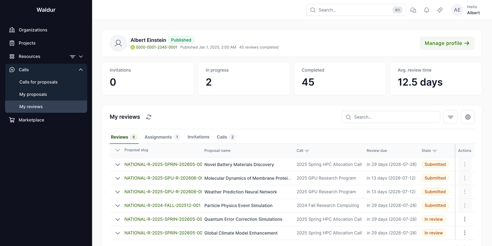

The profile editor is organised into four tabs:

| Tab | Content |
|---|---|
| **Profile info** | Biography, ORCID ID, alternative names, availability status |
| **Affiliations** | Current and past institutional affiliations with type (employment, education, visiting, honorary, consulting), organisation, department, and date range |
| **Expertise** | Self-declared expertise categories with a proficiency level for each (expert, familiar, basic) |
| **Publications** | Academic publications with title, authors, venue (journal, conference, preprint, book, thesis, report), and year |

Each list (affiliations, expertise, publications) uses a per-row **Add** dropdown for quick item creation, an inline edit button per row, and a **Bulk remove** action for clearing several rows at once.

!!! tip
    Keep your expertise and affiliations up to date. This data is used for automated reviewer-proposal matching and conflict of interest detection.

### Publishing your profile

Set the profile to **Published** when ready to receive review invitations. The status is shown as a badge next to your name on the Reviews page. Unpublished profiles are not visible to call managers and you will not receive new invitations until the profile is published.

### Accepting a pool invitation

When a call manager invites you to a reviewer pool you receive an email with a personal acceptance link. The link does **not** require an existing Waldur account. The acceptance page shows the call, the inviting manager, the call's conflict-of-interest policy, and an **Accept** / **Decline** pair; the buttons show a loading state while your response is recorded.

If you accept, the page checks that you have a **published** reviewer profile. If you do not, you are prompted to create or publish one before the acceptance can complete. Once you have accepted with a published profile, the invitation flips to **Accepted** and the call manager can assign you proposals.

!!! note
    Conflict-of-interest disclosure is handled at the assignment stage and through the call's COI policy, not on the pool-invitation page. The acceptance page only displays the COI policy for the call so you understand the rules before joining the pool.

## Review dashboard

The reviews page provides four tabs for managing your review workload: **Reviews**, **Assignments**, **Invitations**, and **Calls**.

### Reviews

The first tab (labelled **Reviews**) shows all reviews assigned to you with their status (in review, submitted, rejected) and deadlines, alongside your reviewer profile stats (Invitations / In progress / Completed / Avg. review time).

### Assignments

Shows pending assignment batches — proposals you've been asked to accept or decline for review.

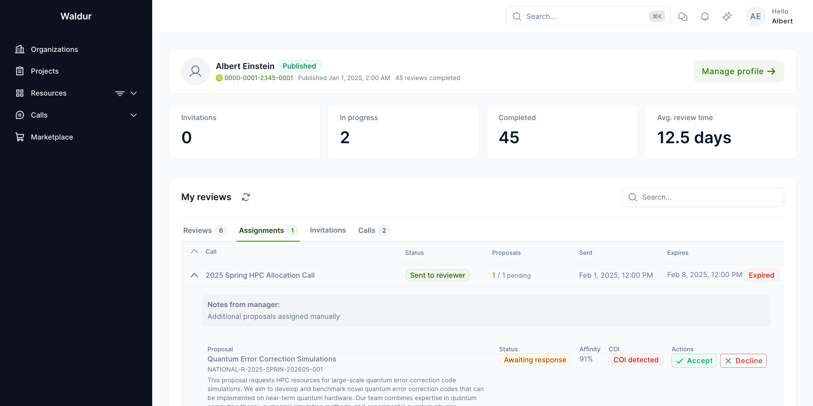

For each assignment, you can:

- **Accept** — creates a review in "in review" state; you can begin evaluation
- **Decline** — records your reason; the proposal may be reassigned to another reviewer

### Invitations

Shows pool invitations from call managers. You must accept an invitation before you can be assigned proposals.

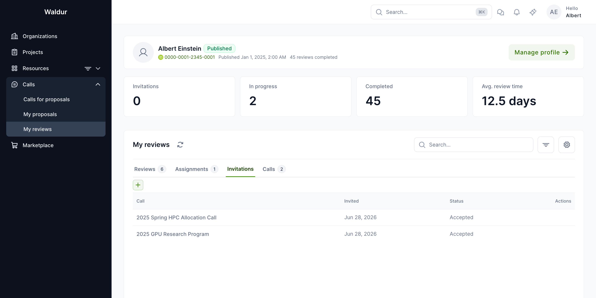

### Calls

Shows calls you are pooled for, with their current status and review deadlines.

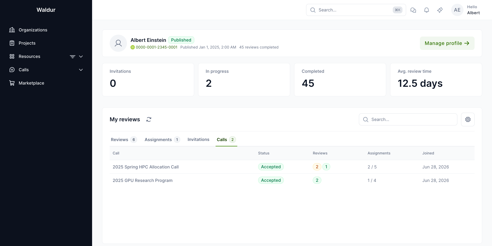

## Completing a review

When you accept an assignment and open a review:

1. Read the proposal summary, team composition, and resource requests
2. Score each section using the rating fields
3. Provide public feedback (visible to the applicant after decision) and private comments (visible to call managers only)
4. Click **Submit** to finalise the review

!!! warning
    Once submitted, a review cannot be edited. Make sure all scores and comments are complete before submitting.

### Review fields

Each review includes:

- **Summary score** — overall numeric rating
- **Summary public comment** — feedback shared with the applicant
- **Summary private comment** — internal feedback for call managers
- **Field-specific comments** — feedback on the project title, summary, description, duration, supporting documentation, resource requests, and team, plus confidentiality and civilian-purpose flags where the call requires them

### Proposal context during review

When reviewing a proposal, you can see the full proposal detail including team composition, resource requests, and any supporting documentation.

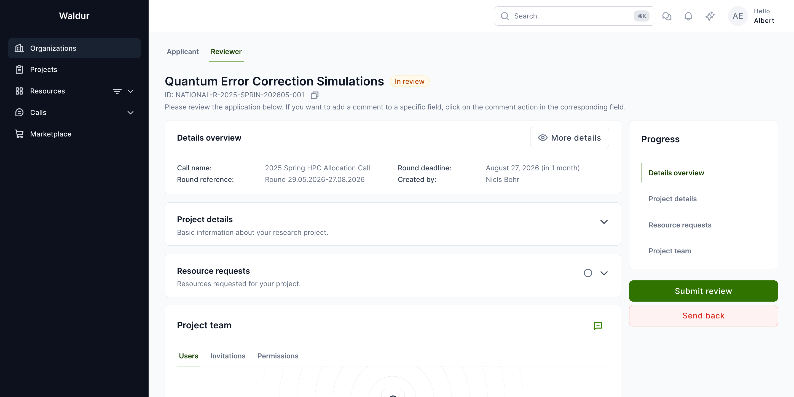

## Conflict of interest

Before starting a review, you may be asked to confirm that you have no conflict of interest with the proposal. This is required when the call has **CoI confirmation** enabled for the review step.

If you have a conflict, you should decline the assignment and notify the call manager so the conflict can be recorded.

### How conflicts are handled

When you accept a pool invitation, the acceptance page shows the call's **COI policy** so you understand the rules before joining. Conflicts of interest are then primarily **detected automatically** by the call manager's COI tooling — by cross-referencing your affiliations and publications against each proposal's team — and triaged by the call manager (see [Reviewer management](reviewer-management.md#conflict-of-interest-coi-detection)). You can also raise a conflict directly with the call manager at any time.

Each detected or declared conflict is stored with a **severity** and visually styled in the call manager's COI review interface:

| Severity | Meaning | Required action |
|---|---|---|
| **Real conflict — must recuse** | Confirmed conflict | Reviewer is recused from the proposal |
| **Apparent conflict — requires management** | Circumstantial conflict | Call manager waives with a written management plan, or recuses |
| **Potential conflict — disclosure only** | Possible conflict flagged for awareness | Acknowledge; review may proceed |

Keeping your reviewer profile (affiliations and publications) up to date helps the automated detector surface potential conflicts accurately.

## Reviewer pool management

Call managers build and manage a curated pool of reviewers for each call.

### Pool overview

The reviewer pool shows all invited reviewers with their acceptance status, expertise areas, and profile completeness.

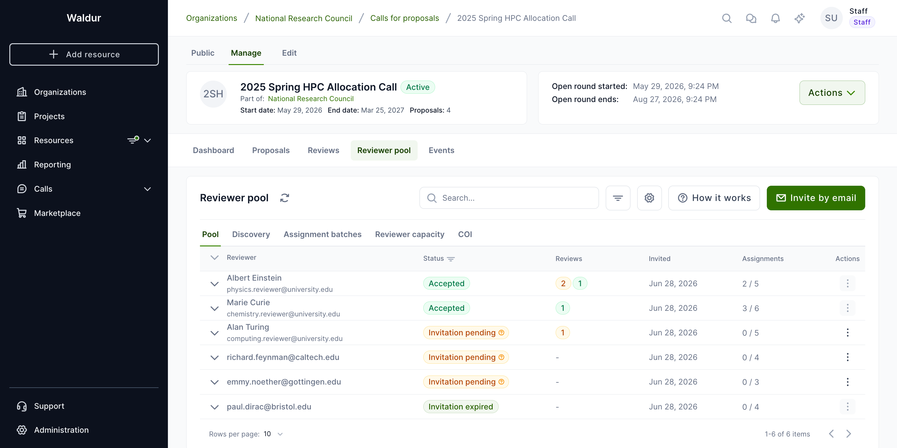

Pool statuses include:

- **Accepted** — reviewer has accepted the invitation and is ready for assignments
- **Invitation pending** — invitation sent, awaiting response (a reviewer may still need to create or publish a profile before they can accept)
- **Declined** — reviewer declined the invitation
- **Invitation expired** — the invitation lapsed without a response

### Matching suggestions

The system generates reviewer-proposal matching suggestions based on expertise overlap, publication similarity, and keyword analysis.

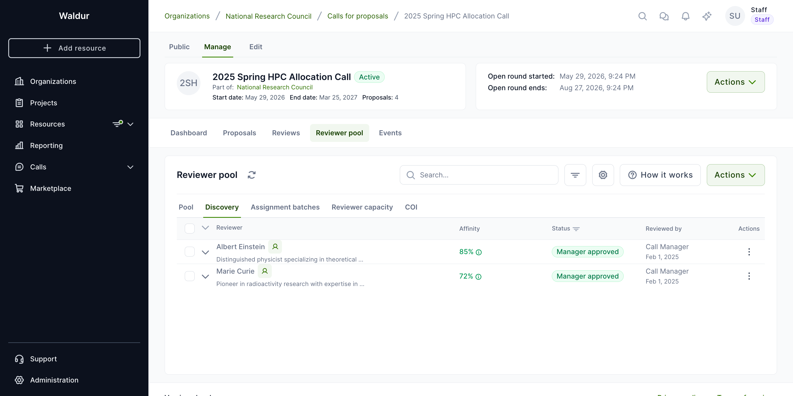

## Assignment workflow

After matching, call managers create formal assignment batches to assign proposals to reviewers.

### Assignment batches

Each batch groups proposals assigned to a single reviewer. The reviewer receives an email notification and can accept or decline each proposal individually.

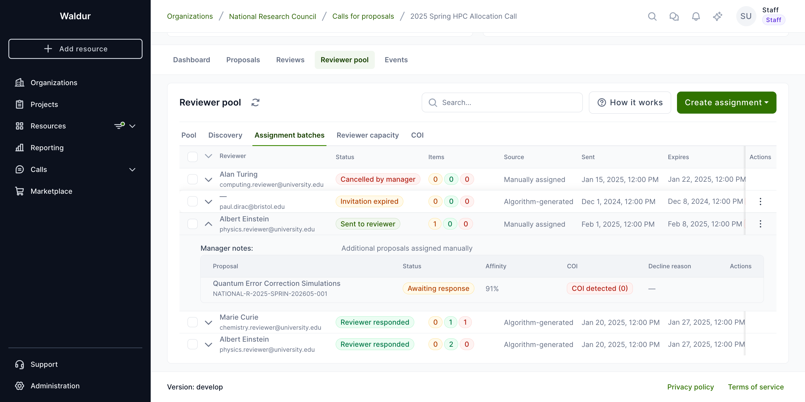

Batch lifecycle:

1. **Draft** — manager prepares the batch
2. **Sent** — invitation emailed to reviewer
3. **Responded** — reviewer accepted or declined all items
4. **Expired** — batch expired without full response
5. **Cancelled** — manager cancelled the batch

!!! tip
    Configure auto-reassignment in the call settings to automatically find the next-best reviewer when a reviewer declines an assignment.

## Conflict of interest management

Waldur includes automated COI detection to ensure fair peer review.

### COI settings

Call managers configure COI detection parameters per call, including detection sensitivity, publication matching parameters, and severity thresholds.

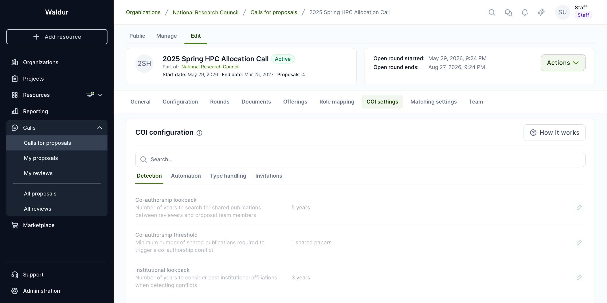

### Reviewing detected conflicts

After running COI detection, the conflicts tab shows all detected conflicts with their type, severity, and affected reviewer-proposal pairs.

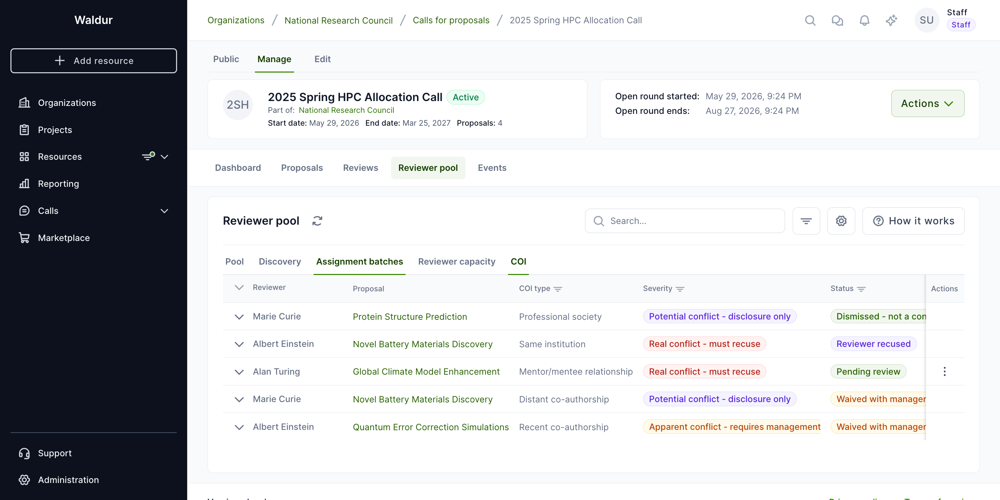

For each detected conflict, managers can:

- **Dismiss** — false positive, no action needed
- **Waive** — acknowledge but allow the assignment (requires justification)
- **Recuse** — remove the reviewer from the proposal

### COI types

Conflicts are grouped into broad families, each covering several more specific conflict types:

| Family | Examples |
|---|---|
| **Institutional** | Same institution, same department, former institution, consortium membership |
| **Co-authorship** | Recent or older co-authored publications |
| **Financial** | Direct financial interest related to the proposal |
| **Relational** | Family, supervisor, mentor/mentee, or editorial relationship |
| **Collaboration & role** | Active or grant collaboration, named on the proposal, conference organiser, competitor |

Call managers map each specific conflict type to a handling rule — recusal, management plan, or disclosure only — in the call's **Type handling** COI settings.

## Reviewer-proposal matching

### Configuring matching

Call managers configure the matching algorithm parameters including affinity method, weights, and constraints.

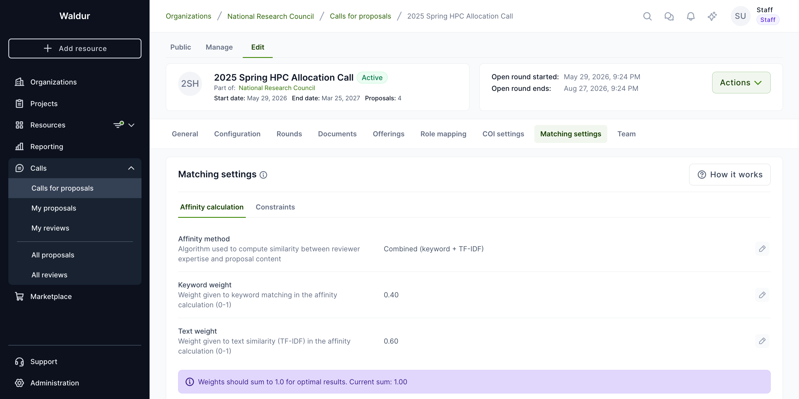

Available matching methods:

| Method | Description |
|---|---|
| **Keyword** | Matches reviewer expertise keywords against proposal text |
| **TF-IDF** | Text similarity using Term Frequency-Inverse Document Frequency |
| **Combined** | Weighted combination of keyword and TF-IDF scores (default) |

## Admin reviews overview

Staff users can view all reviews across all calls from the admin reviews page.

### All reviews

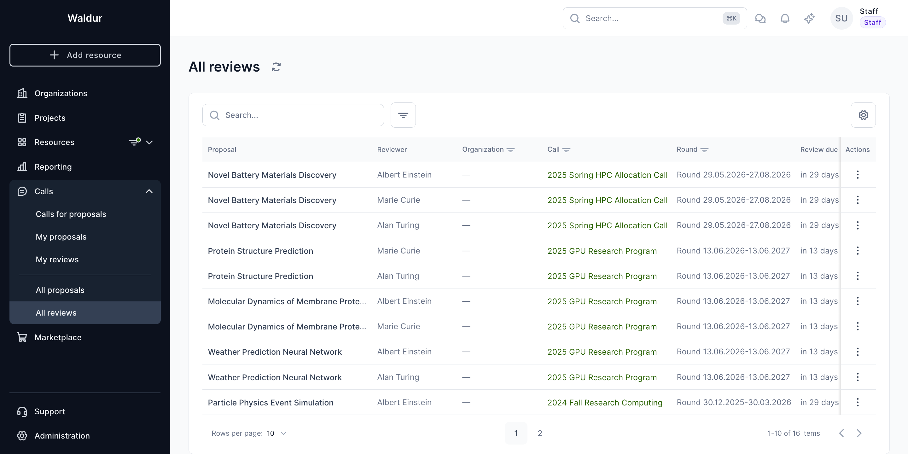

### Filtering by call

Reviews can be filtered by specific call to focus on a particular review round.

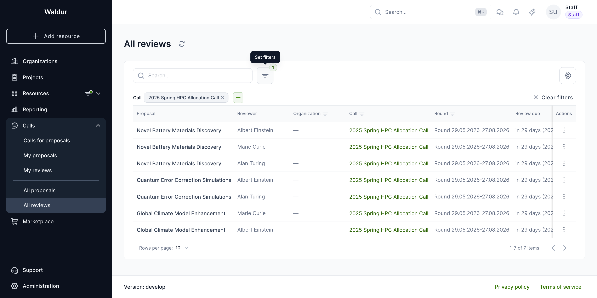

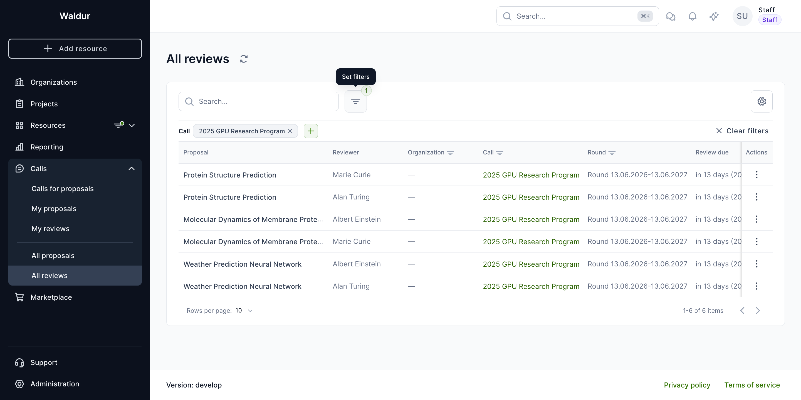

### All proposals

The admin proposals view lists every proposal with its call, round, and state, helping staff track which proposals are progressing through review.

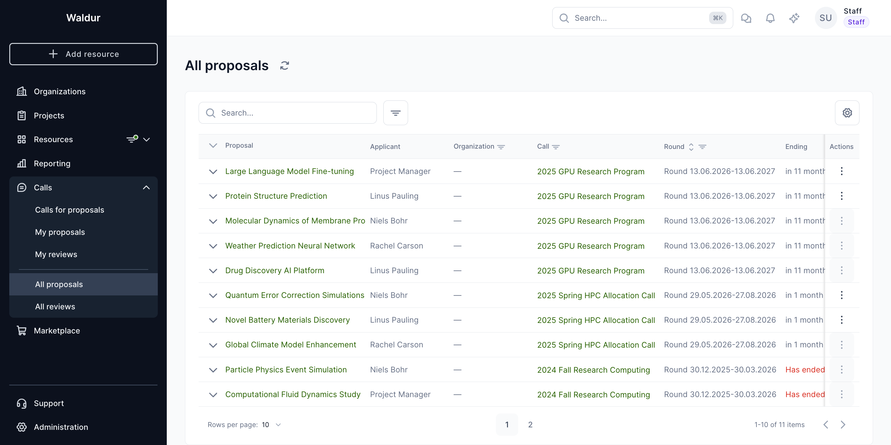
