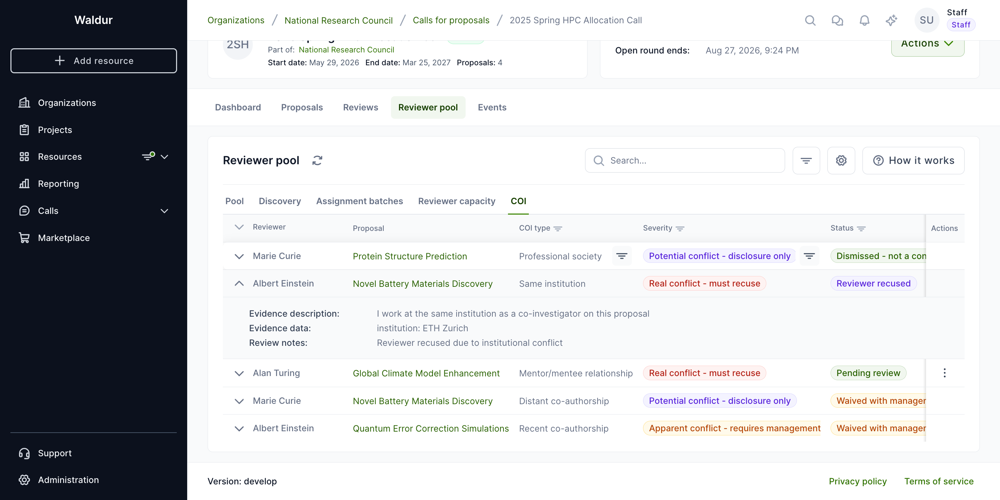

# Reviewer management

This guide covers the complete reviewer lifecycle in Waldur's call management system: building reviewer pools, managing reviewer profiles, configuring reviewer-proposal matching, and handling conflicts of interest.


## Reviewer profiles

Reviewers in Waldur maintain detailed profiles that enable intelligent matching with proposals.

### Profile components

Each reviewer profile includes:

- **Personal information**: Name, ORCID ID, biography, alternative names
- **Affiliations**: Current and past institutional affiliations with type (employment, education, visiting, honorary, consulting), organization identifier, and date range
- **Expertise**: Self-declared expertise categories with proficiency levels (expert, familiar, basic)
- **Publications**: Academic publications with title, authors, venue, venue type (journal, conference, preprint, book, thesis, report), and year
- **Availability**: Whether the reviewer is available for new review assignments

!!! tip
    Reviewers should keep their profiles up-to-date, especially expertise areas and affiliations. This data is used for automated reviewer-proposal matching and conflict of interest detection.

### Managing your reviewer profile

1. Open the **Reviews** page from the sidebar and create or open your reviewer profile from the profile panel
2. Fill in your biography, ORCID ID, and availability status
3. Add **affiliations** with your current and past institutions
4. Add **expertise categories** with your proficiency level for each
5. Add relevant **publications** for matching purposes
6. Set your profile to **Published** when ready to receive review assignments

The profile editor is organised into four tabs — **Profile info**, **Affiliations**, **Expertise**, and **Publications** — and you can connect and sync your **ORCID** record to import affiliations and publications automatically.

## Reviewer pool management

Call managers build a curated pool of reviewers for each call.


### Building a reviewer pool

**Performed by:** Call manager

1. Navigate to the **call** settings
2. Select the **Reviewer Pool** section
3. Add reviewers using one of these methods:
    - **By profile**: Search and select from published reviewer profiles
    - **By email**: Invite reviewers via email who may not yet have accounts

### Invitation workflow

When a reviewer is added to a pool:

1. An email invitation is sent with a unique acceptance token
2. The reviewer can **accept** or **decline** the invitation without logging in
3. On acceptance, the reviewer must have a published profile (they are prompted to create or publish one if they do not)
4. The call's COI policy is shown on the acceptance page

Invitation statuses: **Pending** | **Accepted** | **Declined** | **Expired**

!!! note
    Invitation tokens are generated using secure random bytes and do not require the reviewer to have an existing Waldur account to respond.

## Conflict of interest (COI) detection

Waldur includes an automated COI detection system to ensure fair and unbiased peer review.

### COI types detected

Waldur recognises around twenty specific conflict types, grouped into broad families:

| Family | Specific types (examples) |
|---|---|
| Institutional | Same institution, same department, former institution, consortium membership |
| Financial | Direct financial interest related to the proposal |
| Relational | Family, supervisor, mentor/mentee, or editorial relationship |
| Co-authorship | Recent or older co-authored publications |
| Collaboration & role | Active or grant collaboration, named on the proposal, conference organiser, competitor, professional-society membership |

Each specific type is mapped to a severity and a handling rule in the call's **Type handling** COI settings (see below).

### Severity levels

- **Real**: Confirmed conflict that must be addressed
- **Apparent**: Circumstantial conflict that may need review
- **Potential**: Possible conflict flagged for awareness

### Detection methods

- **Automated**: System cross-references reviewer affiliations and publications against proposal team data
- **Self-disclosed**: Conflicts declared by the reviewer
- **Reported**: Third parties report potential conflicts
- **Manager-identified**: Call managers manually flag conflicts

### Configuring COI detection

**Performed by:** Call manager

1. Open the call's **Edit** view
2. Select **COI settings**

The COI configuration is organised into four tabs:

| Tab | Purpose |
|---|---|
| **Detection** | Lookback periods (co-authorship, institutional), shared-publication thresholds, "same department" / "same institution" toggles |
| **Automation** | Auto-detect toggles per source (co-authorship search, institutional matching, declared conflicts) — determines what runs without manual triggering |
| **Type handling** | For each conflict type, choose whether it triggers **recusal**, requires a **management plan**, or is **disclosure only** — used by the detector when assigning severities |
| **Invitations** | Disclosure level shown to reviewers when they accept a pool invitation — controls how much of the proposal team and contents is exposed |

A summary dialog (from the section header) lists every setting at a glance, and inline tooltips explain each COI concept.


!!! note
    Once a call is **activated**, most COI configuration fields are locked to keep detection results reproducible. To change a locked setting, deactivate the call (and re-run detection afterwards).

### Running COI detection

1. Click **Run COI Detection** in the call management dashboard
2. The system runs a batch detection job (processed in the background)
3. Review detected conflicts in the **COI** tab of the Reviewer pool
4. For each conflict, choose to **Dismiss**, **Waive** (with justification), or **Recuse** the reviewer

### COI review interface

The **COI** tab is the operational view used to triage all detected and declared conflicts on the call.

- **Status filters** — narrow the list to *Pending*, *Dismissed*, *Waived*, or *Recused*.
- **Severity styling** — each row is styled by severity (Real conflict / Apparent conflict / Potential conflict) so high-severity rows stand out at a glance.
- **Expandable rows** — expand a row to see the evidence behind a detected conflict: shared publications with venues and years, shared affiliations with overlapping date ranges, and self-disclosed text.
- **Waive dialog** — choosing **Waive** opens a dialog that requires a written **justification** (the management plan) before the conflict can be cleared. The justification, the manager, and the timestamp are recorded on the conflict and stay visible to staff users.
- **Recuse** — removes the reviewer from the proposal and, if any review or assignment item already exists, marks it as cancelled.




### COI gating on assignments

When a conflict exists between a reviewer and a proposal, the corresponding assignment item is **blocked** until the conflict is resolved (dismissed, waived, or the reviewer recused). Staff users can **force-unblock** a blocked assignment when a strong operational reason exists; the override is flagged on the assignment.

!!! warning
    All staff overrides are recorded with the overriding user, reason, and timestamp, and remain visible to staff.

## Reviewer-proposal matching

Waldur uses algorithmic matching to suggest optimal reviewer-proposal assignments.

### Matching methods

| Method | Description |
|---|---|
| **Keyword** | Matches reviewer expertise keywords against proposal text |
| **TF-IDF** | Text similarity using Term Frequency-Inverse Document Frequency |
| **Combined** (default) | Weighted combination of keyword and TF-IDF scores |

### Configuring matching

**Performed by:** Call manager

1. Navigate to call settings
2. Select the **Matching Configuration** section
3. Configure:
    - **Affinity method**: Keyword, TF-IDF, or Combined
    - **Weights**: Keyword weight and text weight (the interface flags when they do not sum to 1.0, which is recommended for best results)
    - **Assignment algorithm**: how batches balance load — MinMax (balanced load), FairFlow, or Hungarian
    - **Constraints**: Min/max reviewers per proposal, max proposals per reviewer
    - **Threshold**: Minimum affinity score for suggestions
    - **Reviewer bids**: Whether to incorporate reviewer preferences, and their weight


### Generating suggestions

1. In the **Reviewer pool > Discovery** tab, click **Generate matches**
2. In the **Generate reviewer matches** dialog, choose what to match reviewers against:
    - **Call description** — match against the call's own description
    - **All proposals** — match each reviewer against every proposal
    - **Selected proposals** — match against a chosen subset
    - **Custom keywords** — supply your own keywords and pick a search mode (*Expertise keywords only* or *Full text search*)
3. Optionally open **Advanced options** to set a **Minimum match score (%)** cut-off
4. The system computes affinity scores and the results appear in the Discovery table


The Discovery table has **Reviewer / Affinity / Status / Reviewed by / Actions** columns. Each suggestion row shows:

- **Affinity score** as a percentage. Hovering the score reveals the **Score breakdown** tooltip — the *Keyword match*, *Text similarity*, and *Combined* components.
- **Status** — *Awaiting manager review* (newly generated), *Manager approved*, *Manager rejected*, or *Invitation sent*.
- **Reviewed by** — the manager who last actioned the suggestion.
- **Expand row** to see the full reviewer profile summary (biography, expertise, recent publications) without leaving the page.

For each suggestion you can **Confirm** (queue for invitation) or **Reject**, or use **Invite by email** to send a direct invitation to a candidate who is not yet in the pool. Bulk **Confirm all**, **Reject all**, and **Delete all** actions act on the whole table.

### Reviewer bidding

The matching configuration can incorporate **reviewer bids** — preference signals (*Eager to review*, *Willing to review*, *Not willing to review*, *Has conflict of interest*) weighted by a configurable **bid weight**. Bidding is part of the matching backend; there is no reviewer-facing bidding screen in the current interface, so bids are managed as configuration rather than collected from reviewers directly.

## Assignment workflow (Stage 2)

After matching, call managers create assignment batches to formally assign proposals to reviewers.

### Reviewer pool navigation

The **Reviewer pool** panel groups the call manager's reviewer-related views under a single tab strip:

- **Pool** — the curated list of invited reviewers and their status.
- **Discovery** — algorithm-suggested reviewers based on expertise and affinity.
- **Assignment batches** — the per-reviewer assignment batches you've created, with status, item counts, sent/expiry dates, and per-row actions.
- **Reviewer capacity** — how many active assignments each pool member has, with their configured maximum.
- **COI** — flagged conflicts of interest awaiting manager review.


The header buttons on **Assignment batches** are:

- **How it works** — open an explainer of the assignment flow.
- **Manual assignment** — create a draft batch for a single reviewer with hand-picked proposals.
- **Generate assignments** — let the matching algorithm build batches from the current reviewer pool and unassigned proposals.

### Creating a manual assignment batch

**Performed by:** Call manager

1. Click **Manual assignment** on the **Assignment batches** tab.
2. Pick a **reviewer** from the pool. The dropdown shows each reviewer's email and current load (e.g. `2/5 assigned`) so you can avoid over-allocating.
3. Pick one or more **proposals**. The selector keeps a single chip visible with a `+N more` indicator so the dialog stays compact when many proposals are added.
4. Optionally add **manager notes** — internal context visible to other managers but not to the reviewer.
5. Click **Create assignment**. A draft batch is created. The reviewer is **not** notified yet.


### Sending draft batches

Drafts give you a final review checkpoint before reviewers see the assignment.

1. Tick the checkbox next to one or more **Draft** batches. The toolbar shows `(N) Selected` and a **Send drafts (N)** button.
2. Click **Send drafts (N)** to dispatch the selected batches. Reviewers receive the invitation email with a unique token; the batch status moves from **Draft** to **Sent**.
3. Non-draft batches in the selection are ignored automatically.


You can also send a single batch from the per-row 3-dot menu (**Send**).

### Reviewing a batch

Expanding a batch row shows its items — proposals, status, affinity, COI flags, decline reasons — and any **manager notes** captured at creation time.


### Batch lifecycle

```text
DRAFT → SENT → RESPONDED / EXPIRED / CANCELLED
```

- **Draft**: Manager is preparing the batch
- **Sent**: Invitation sent to reviewer (email with unique token)
- **Responded**: Reviewer has accepted or declined all items
- **Expired**: Batch expired without full response (configurable expiration days)

### Assignment item responses

For each proposal in a batch, the reviewer can:

- **Accept**: Creates a Review in IN_REVIEW state — reviewer can begin evaluation
- **Decline**: Records decline reason; may trigger auto-reassignment if configured

### Auto-reassignment

If configured in the **Assignment Configuration**:

- When a reviewer declines, the system automatically finds the next-best reviewer
- Maximum auto-reassignment attempts are configurable (default: 3)
- Reminder emails sent before assignment expiry (configurable days before)

### Managing reviewer capacity

The **Reviewer capacity** tab lists every pool member and their current load. Use it to adjust the **Maximum assignments** per reviewer when workload, sabbaticals, or expertise concentration change during a call.


1. Switch to the **Reviewer capacity** tab in the Reviewer pool panel.
2. Open the row 3-dot menu and choose **Edit capacity**.
3. Update **Maximum assignments** and save.


!!! tip
    Lowering the maximum below a reviewer's current count won't unassign existing work — it just prevents new assignments until the load drops back below the cap.
