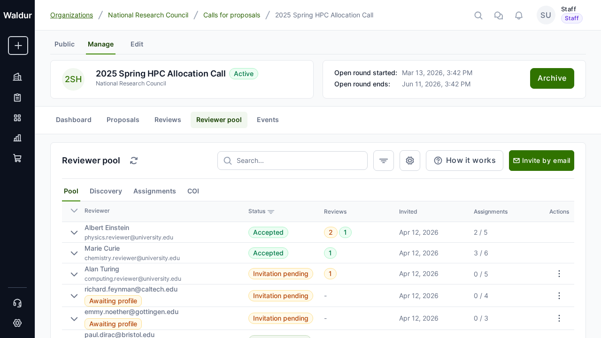
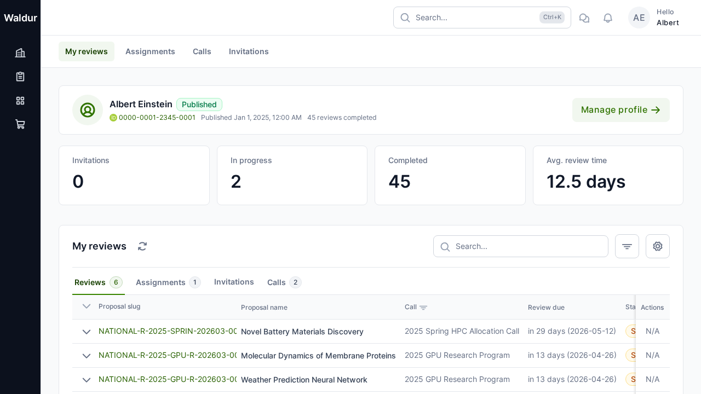
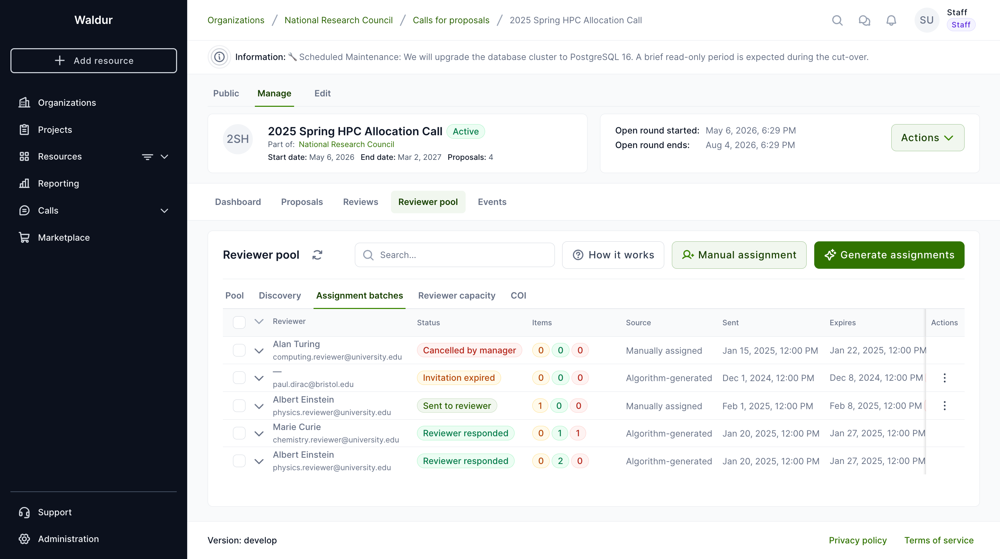
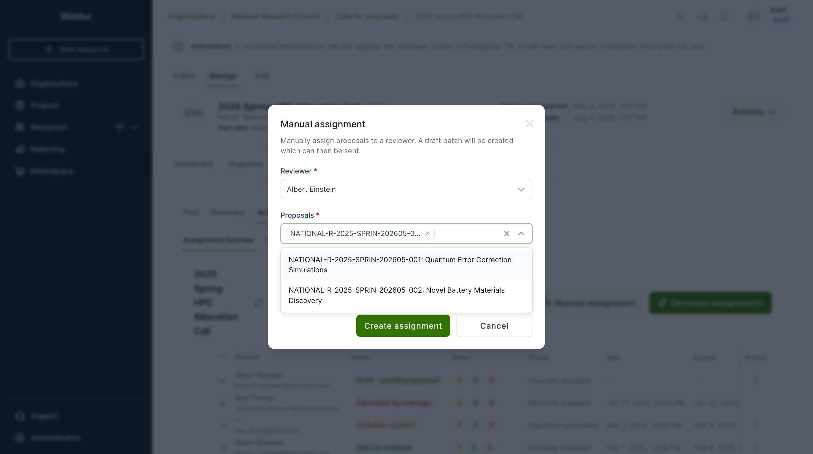
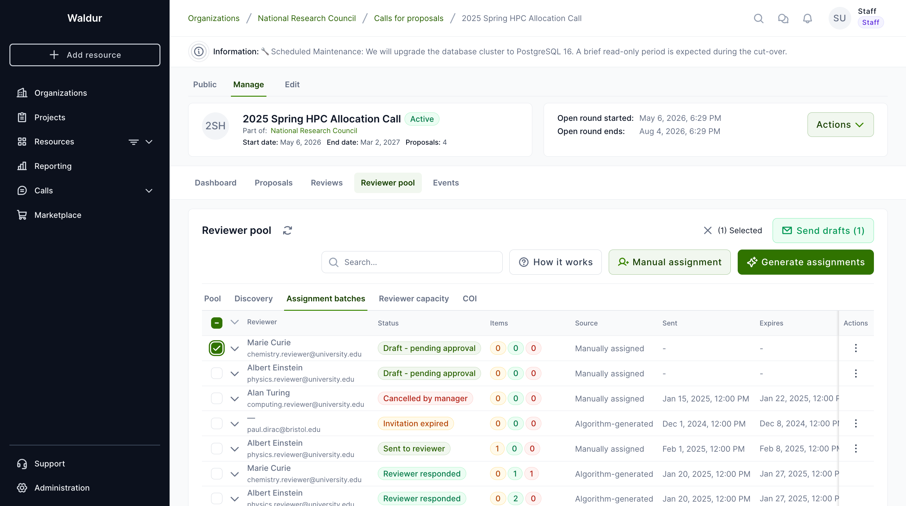
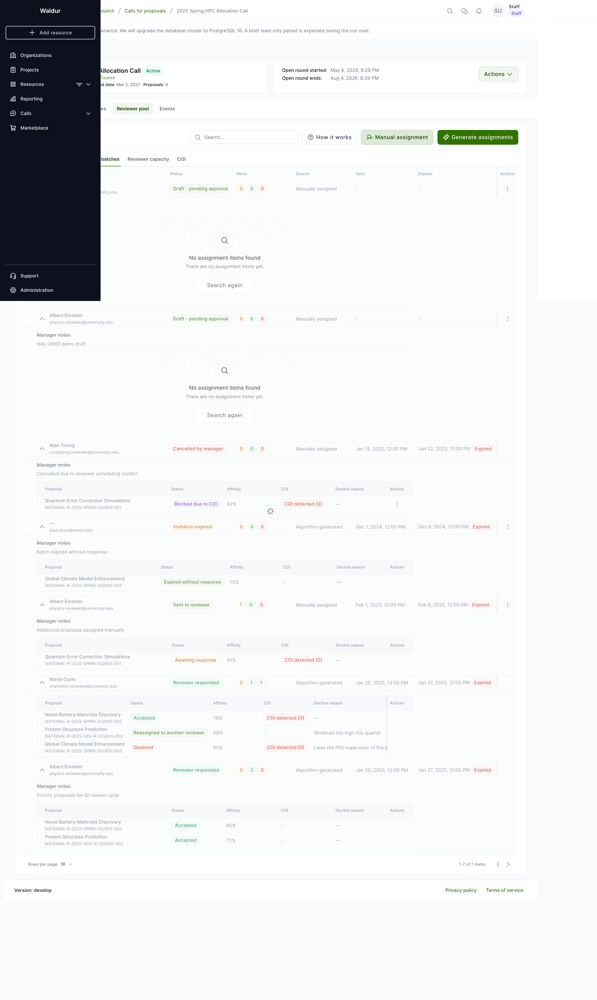
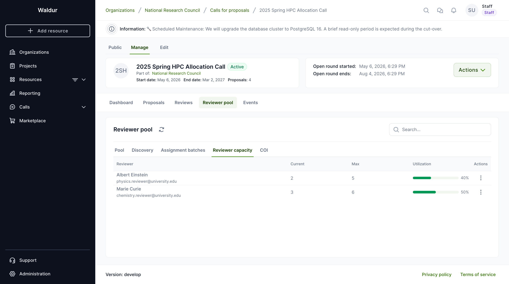
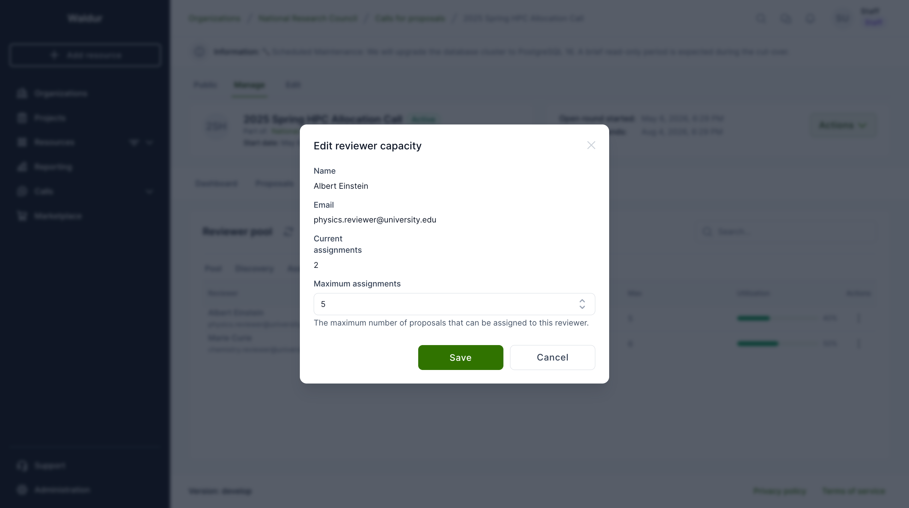

# Reviewer management

This guide covers the complete reviewer lifecycle in Waldur's call management system: building reviewer pools, managing reviewer profiles, configuring reviewer-proposal matching, and handling conflicts of interest.



## Reviewer profiles

Reviewers in Waldur maintain detailed profiles that enable intelligent matching with proposals.

### Profile components

Each reviewer profile includes:

- **Personal information**: Name, ORCID ID, biography, alternative names
- **Affiliations**: Current and past institutional affiliations with type (employment, education, visiting, honorary, consulting), organization identifier, and date range
- **Expertise**: Self-declared expertise categories with proficiency levels (expert, familiar, basic)
- **Publications**: Academic publications with title, authors, venue, venue type (journal, conference, preprint, book, thesis, report), and year
- **Availability**: Whether the reviewer is available for new review assignments

!!! tip
    Reviewers should keep their profiles up-to-date, especially expertise areas and affiliations. This data is used for automated reviewer-proposal matching and conflict of interest detection.

### Managing your reviewer profile

1. Navigate to your **User Profile**
2. Select the **Reviewer Profile** section
3. Fill in your biography, ORCID ID, and availability status
4. Add **affiliations** with your current and past institutions
5. Add **expertise categories** with your proficiency level for each
6. Add relevant **publications** for matching purposes
7. Set your profile to **Published** when ready to receive review assignments

## Reviewer pool management

Call managers build a curated pool of reviewers for each call.



### Building a reviewer pool

**Performed by:** Call manager

1. Navigate to the **call** settings
2. Select the **Reviewer Pool** section
3. Add reviewers using one of these methods:
    - **By profile**: Search and select from published reviewer profiles
    - **By email**: Invite reviewers via email who may not yet have accounts

### Invitation workflow

When a reviewer is added to a pool:

1. An email invitation is sent with a unique acceptance token
2. The reviewer can **accept** or **decline** the invitation without logging in
3. On acceptance, the reviewer must have a published profile
4. The reviewer is prompted to self-declare any conflicts of interest

Invitation statuses: **Pending** | **Accepted** | **Declined** | **Expired**

!!! note
    Invitation tokens are generated using secure random bytes and do not require the reviewer to have an existing Waldur account to respond.

## Conflict of interest (COI) detection

Waldur includes an automated COI detection system to ensure fair and unbiased peer review.

### COI types detected

| COI Type | Description |
|---|---|
| Institutional (same) | Reviewer and proposal PI share the same institution |
| Financial (direct) | Reviewer has financial interest related to the proposal |
| Relational (family) | Familial relationship between reviewer and applicant |
| Co-authorship | Recent co-authored publications between reviewer and applicant |

### Severity levels

- **Real**: Confirmed conflict that must be addressed
- **Apparent**: Circumstantial conflict that may need review
- **Potential**: Possible conflict flagged for awareness

### Detection methods

- **Automated**: System cross-references reviewer affiliations and publications against proposal team data
- **Self-disclosed**: Reviewers declare conflicts during pool acceptance
- **Reported**: Third parties report potential conflicts
- **Manager-identified**: Call managers manually flag conflicts

### Configuring COI detection

**Performed by:** Call manager

1. Navigate to call settings
2. Select the **COI Settings** section
3. Configure per-call settings:
    - COI type weights and severity thresholds
    - Publication matching parameters (year range, author matching method)
    - Automated detection sensitivity

### Running COI detection

1. Click **Run COI Detection** in the call management dashboard
2. The system runs a batch detection job (processed in the background)
3. Review detected conflicts in the **Conflicts** tab
4. For each conflict, choose to **Dismiss**, **Waive** (with justification), or **Recuse** the reviewer

### COI disclosure forms

Reviewers are presented with a disclosure form when accepting a pool invitation:

1. General conflict declaration
2. Financial interest details (entity type, relationship, amount range)
3. Self-declared conflicts with specific proposals

!!! warning
    Staff users can override COI blocks on specific assignments with an audit trail. All overrides are recorded with the overriding user, reason, and timestamp.

## Reviewer-proposal matching

Waldur uses algorithmic matching to suggest optimal reviewer-proposal assignments.

### Matching methods

| Method | Description |
|---|---|
| **Keyword** | Matches reviewer expertise keywords against proposal text |
| **TF-IDF** | Text similarity using Term Frequency-Inverse Document Frequency |
| **Combined** (default) | Weighted combination of keyword and TF-IDF scores |

### Configuring matching

**Performed by:** Call manager

1. Navigate to call settings
2. Select the **Matching Configuration** section
3. Configure:
    - **Affinity method**: Keyword, TF-IDF, or Combined
    - **Weights**: Keyword weight vs text weight (must sum to 1.0)
    - **Constraints**: Min/max reviewers per proposal, min/max proposals per reviewer
    - **Threshold**: Minimum affinity score for suggestions
    - **Reviewer bids**: Whether to incorporate reviewer preferences

### Generating suggestions

1. Click **Generate Suggestions** in the matching section
2. The system computes affinity scores for all reviewer-proposal pairs
3. Results appear in the **Suggestions** tab with:
    - Affinity score (0-1)
    - Matched keywords
    - Top matching proposals
4. Accept or reject each suggestion

### Reviewer bidding

If enabled, reviewers can express preferences for proposals:

- **Want to review**: Eager to evaluate this proposal
- **Cannot review**: Unable to review (workload, expertise mismatch)
- **Conflict**: Self-declared conflict with this proposal

Bids are factored into the matching algorithm with configurable weight.

## Assignment workflow (Stage 2)

After matching, call managers create assignment batches to formally assign proposals to reviewers.

### Reviewer pool navigation

The **Reviewer pool** panel groups the call manager's reviewer-related views under a single tab strip:

- **Pool** — the curated list of invited reviewers and their status.
- **Discovery** — algorithm-suggested reviewers based on expertise and affinity.
- **Assignment batches** — the per-reviewer assignment batches you've created, with status, item counts, sent/expiry dates, and per-row actions.
- **Reviewer capacity** — how many active assignments each pool member has, with their configured maximum.
- **COI** — flagged conflicts of interest awaiting manager review.



The header buttons on **Assignment batches** are:

- **How it works** — open an explainer of the assignment flow.
- **Manual assignment** — create a draft batch for a single reviewer with hand-picked proposals.
- **Generate assignments** — let the matching algorithm build batches from the current reviewer pool and unassigned proposals.

### Creating a manual assignment batch

**Performed by:** Call manager

1. Click **Manual assignment** on the **Assignment batches** tab.
2. Pick a **reviewer** from the pool. The dropdown shows each reviewer's email and current load (e.g. `2/5 assigned`) so you can avoid over-allocating.
3. Pick one or more **proposals**. The selector keeps a single chip visible with a `+N more` indicator so the dialog stays compact when many proposals are added.
4. Optionally add **manager notes** — internal context visible to other managers but not to the reviewer.
5. Click **Create assignment**. A draft batch is created. The reviewer is **not** notified yet.



### Sending draft batches

Drafts give you a final review checkpoint before reviewers see the assignment.

1. Tick the checkbox next to one or more **Draft** batches. The toolbar shows `(N) Selected` and a **Send drafts (N)** button.
2. Click **Send drafts (N)** to dispatch the selected batches. Reviewers receive the invitation email with a unique token; the batch status moves from **Draft** to **Sent**.
3. Non-draft batches in the selection are ignored automatically.



You can also send a single batch from the per-row 3-dot menu (**Send**).

### Reviewing a batch

Expanding a batch row shows its items — proposals, status, affinity, COI flags, decline reasons — and any **manager notes** captured at creation time.



### Batch lifecycle

```text
DRAFT → SENT → RESPONDED / EXPIRED / CANCELLED
```

- **Draft**: Manager is preparing the batch
- **Sent**: Invitation sent to reviewer (email with unique token)
- **Responded**: Reviewer has accepted or declined all items
- **Expired**: Batch expired without full response (configurable expiration days)

### Assignment item responses

For each proposal in a batch, the reviewer can:

- **Accept**: Creates a Review in IN_REVIEW state — reviewer can begin evaluation
- **Decline**: Records decline reason; may trigger auto-reassignment if configured

### Auto-reassignment

If configured in the **Assignment Configuration**:

- When a reviewer declines, the system automatically finds the next-best reviewer
- Maximum auto-reassignment attempts are configurable (default: 3)
- Reminder emails sent before assignment expiry (configurable days before)

### Managing reviewer capacity

The **Reviewer capacity** tab lists every pool member and their current load. Use it to adjust the **Maximum assignments** per reviewer when workload, sabbaticals, or expertise concentration change during a call.



1. Switch to the **Reviewer capacity** tab in the Reviewer pool panel.
2. Open the row 3-dot menu and choose **Edit capacity**.
3. Update **Maximum assignments** and save.



!!! tip
    Lowering the maximum below a reviewer's current count won't unassign existing work — it just prevents new assignments until the load drops back below the cap.
