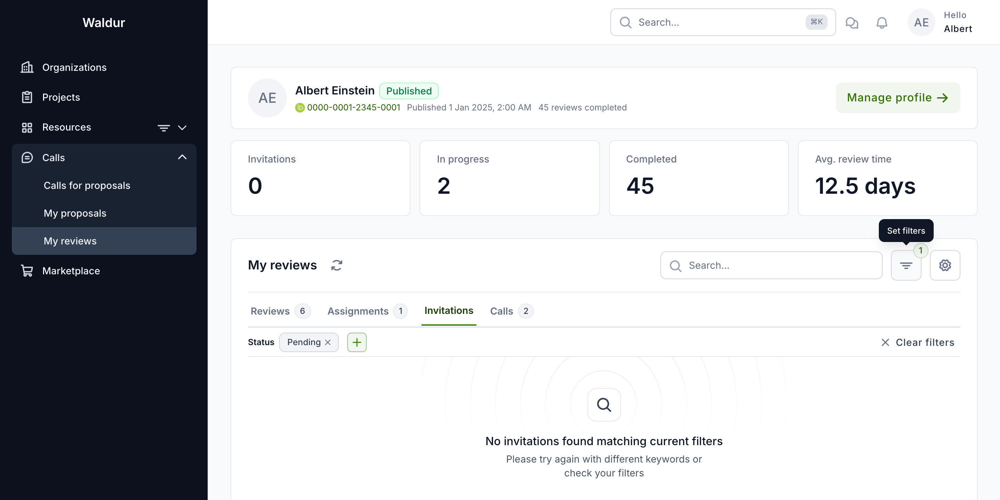
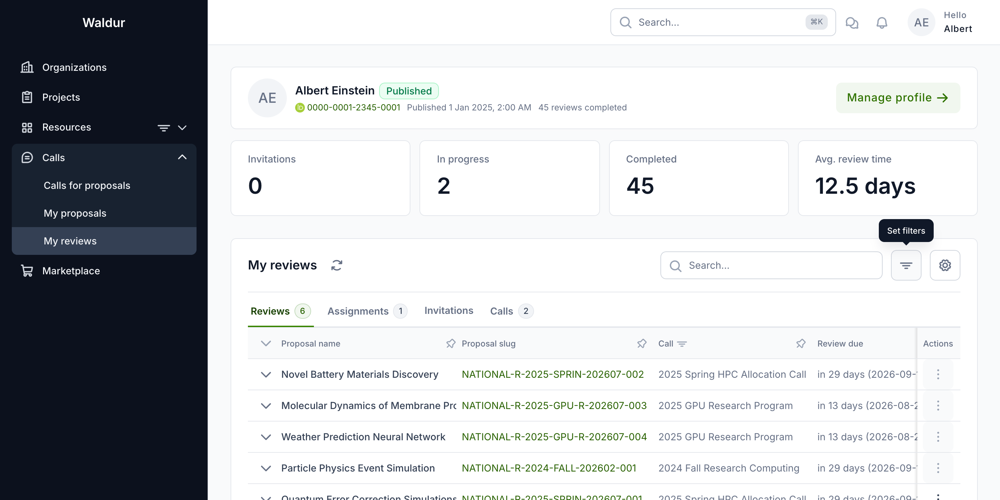
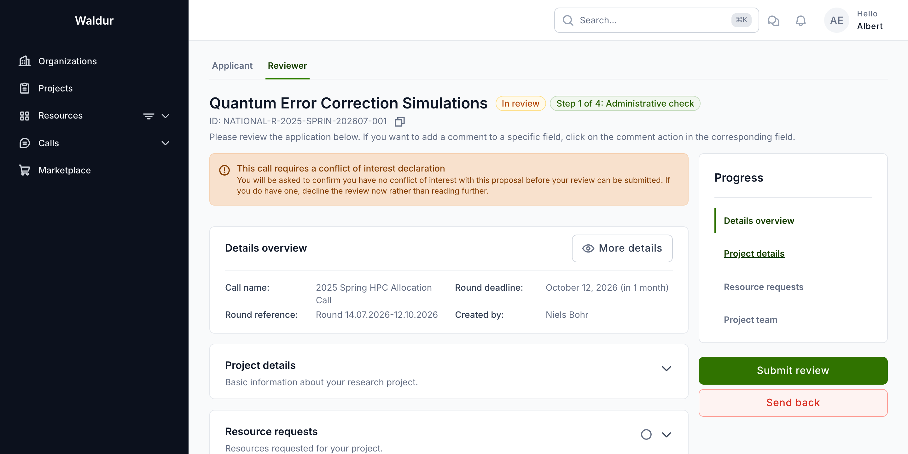
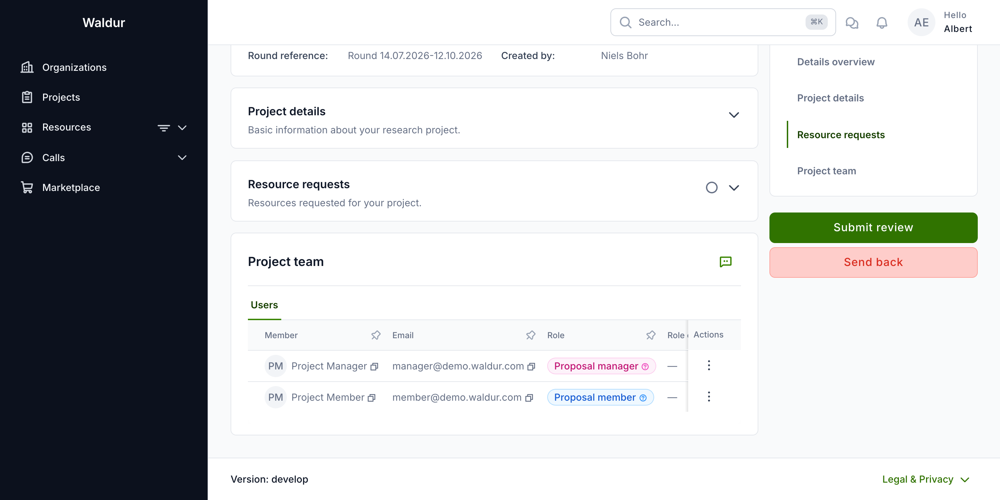
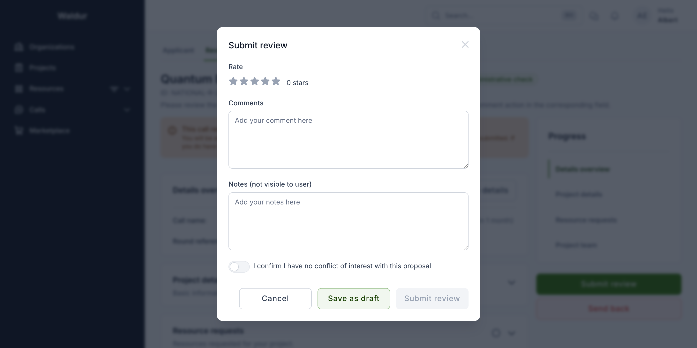
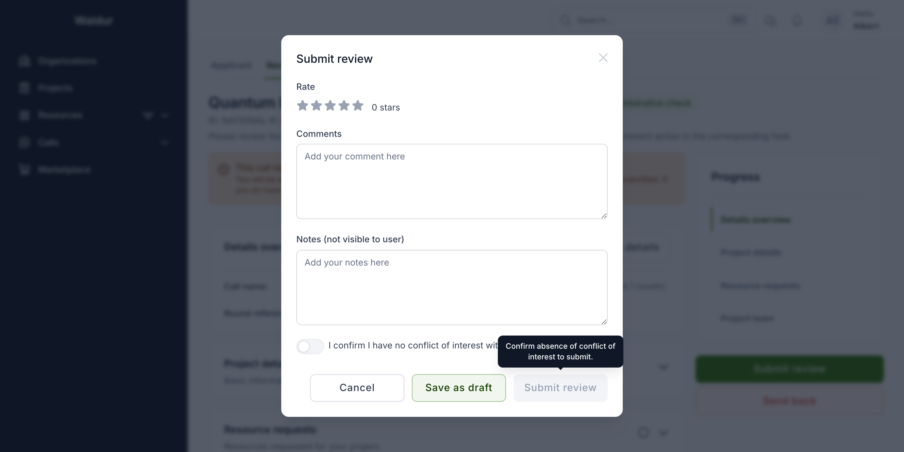
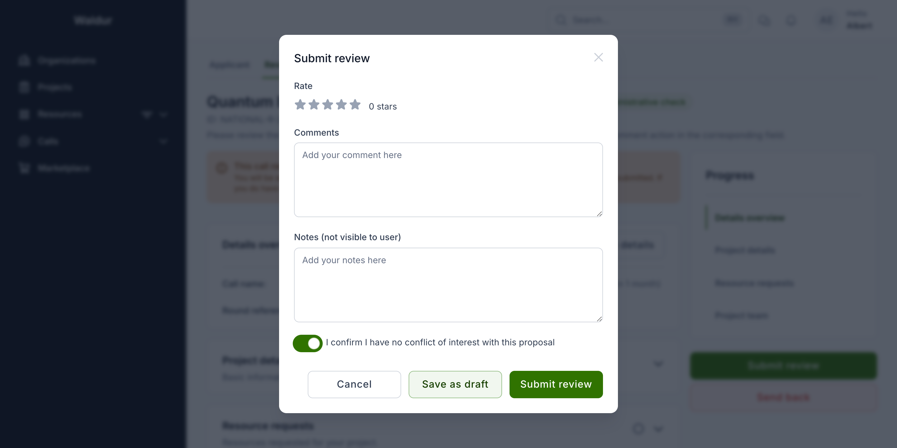

# Reviewer workflow

This guide follows a **reviewer** end to end: accepting an invitation to a call's
reviewer pool, declaring conflicts of interest, finding assigned proposals,
evaluating a proposal, and submitting a scored review — including the required
**conflict-of-interest (COI) confirmation** that some calls enforce before a
review can be submitted.

For the reviewer profile, pool and matching mechanics see the
[Reviewer guide](reviewer-guide.md); for the call manager's side of the same
workflow see the [Call manager workflow](call-manager-workflow.md).

!!! note
    Screenshots in this guide use the *2025 Spring HPC Allocation Call* demo
    call, whose **Expert review** step has both blind review and COI
    confirmation enabled. Your calls will show different names, proposals and
    reviewers, and the COI confirmation appears only when the call manager has
    enabled it for the review step.

## Before you start

To review proposals you need:

1. A **published** reviewer profile — see
   [Getting started as a reviewer](reviewer-guide.md#getting-started-as-a-reviewer).
2. An **accepted** invitation to the call's reviewer pool.
3. At least one proposal **assigned** to you by the call manager.

## Accepting a reviewer invitation

When a call manager adds you to a reviewer pool you receive an email with a
personal acceptance link, and the invitation also appears on the **Invitations**
tab of your **My reviews** page.

Each invitation shows the call, the date you were invited, and its status.
Opening the invitation link shows the call, who invited you and when the
invitation expires, along with the call's **COI policy** so you understand the
rules before joining, and a note that you will be able to disclose conflicts
later, when specific proposals are assigned to you. Choose **Accept invitation**
to join the pool; the status then flips to **Accepted** and the call manager can
begin assigning you proposals.

!!! tip
    You must be signed in to open the invitation link, and **Accept invitation**
    stays disabled until you have a **published** reviewer profile. If you do
    not, the page prompts you to create or publish one, and you can publish it
    without leaving the page.

Invitation statuses: **Invitation pending** | **Accepted** | **Declined** |
**Invitation expired**.

## Declaring a conflict of interest

Conflicts of interest are handled in two complementary ways:

- **Automatically** — the call manager's COI tooling cross-references your
  profile (affiliations and publications) against each proposal's team. Keeping
  your profile up to date makes this detection accurate.
- **By you** — if you know of a conflict with a proposal, decline that
  assignment and notify the call manager so it can be recorded. You can raise a
  conflict directly with the call manager at any time.

Detected conflicts are triaged by the call manager, who may dismiss, waive with
a management plan, or recuse you from the proposal. The conflict types,
severities and handling rules are described in
[COI management](coi-management.md).

## Finding your assigned proposals

Open **My reviews** from the sidebar. The page opens on the **Reviews** tab,
which lists every review assigned to you with its proposal, call, due date and
state, alongside your profile stats (Invitations / In progress / Completed /
Avg. review time).

The four tabs organise your workload:

| Tab | Content |
|---|---|
| **Reviews** | Reviews assigned to you, with state (*In review*, *Submitted*, *Rejected*) and deadline |
| **Assignments** | Pending assignment batches to accept or decline |
| **Invitations** | Pool invitations awaiting your response |
| **Calls** | Calls you are pooled for, with review deadlines |

Click a review in the **In review** state to open the proposal and start
evaluating.

## Evaluating a proposal

A review opens on the **Reviewer** view. The header shows the proposal name, its
current state, and its position in the call's workflow (for example
*Step 1 of 4: Administrative check*). The **Progress** panel on the right lets
you jump between sections and holds the **Submit review** and **Send back**
actions.

On a call that requires COI confirmation, a banner sits above the proposal —
*This call requires a conflict of interest declaration* — warning you that you
will have to confirm you have no conflict before the review can be submitted,
and advising you to decline now rather than read further if you do have one.

The sections you see mirror the call's configuration, so you evaluate exactly the
information the call manager expects reviewers to weigh:

- **Details overview** — call, round, deadline and applicant.
- **Project details** — name, summary, description, research field, duration and
  the civilian-purpose / confidentiality flags.
- **Resource requests** — the offerings and quantities requested.
- **Project team** — members and their roles.

To leave feedback on a specific field, click the **Add comment** action next to
it. Field-level comments are collected alongside your overall score when you
submit.

## Scoring and commenting

Click **Submit review** in the Progress panel to open the review dialog. It
collects your overall assessment:

- **Rate** — an overall score, set with the star control.
- **Comments** — public feedback, shared with the applicant after the decision.
- **Notes (not visible to user)** — private feedback for the call managers and
  panel only.
- **I confirm I have no conflict of interest with this proposal** — the COI
  confirmation toggle (only shown on calls that require it, see below).

## Confirming no conflict of interest before submitting

When the call's review step is configured with **Conflict of interest
confirmation** enabled, you must attest that you have no conflict with the
proposal before you can submit. Until the toggle is on, **Submit review** stays
disabled and explains why — *Confirm absence of conflict of interest to submit*:

Switch **I confirm I have no conflict of interest with this proposal** on and the
**Submit review** button becomes active:

!!! note
    The COI confirmation appears **only** when the call manager has turned on
    **Conflict of interest confirmation** for the review step (see
    [Configuring a workflow step](call-manager-workflow.md#configuring-a-workflow-step)).
    On calls without it, the dialog has no COI toggle. If you do have a
    conflict, do **not** confirm — decline the assignment and notify the call
    manager instead.

!!! warning
    Once submitted, a review cannot be edited. Make sure your score, comments and
    field-level notes are complete before submitting.

## Saving a draft vs submitting

The review dialog offers two ways to save:

- **Save as draft** — stores your score and comments without finalising. The
  review stays in the *In review* state so you can return and refine it. Draft
  saving is always available, even before you confirm the absence of a conflict.
- **Submit review** — finalises the review and moves it to the *Submitted*
  state. On COI-enabled steps this requires the confirmation toggle to be on.

Use **Send back** on the proposal (rather than the dialog) to return a proposal
to the applicant or the call manager when it cannot be evaluated as submitted.

## Panel review

Some calls add a **Panel review** step after expert review. Panel members
consolidate the individual expert reviews into a collective recommendation. The
panel step is owned by the **panel member** role and is completed from the call's
proposal workflow rather than the personal **My reviews** page; a panel member
does not receive individual expert-review assignments. See
[The evaluation workflow](call-manager-workflow.md#the-evaluation-workflow) for
how the panel step fits into the overall sequence.

## Related guides

- [Reviewer guide](reviewer-guide.md) — profile, pool invitations and the review dashboard
- [Reviewer management](reviewer-management.md) — pools, matching and assignment batches (manager side)
- [COI management](coi-management.md) — conflict types, severities and handling
- [Call manager workflow](call-manager-workflow.md) — configuring the review step and driving proposals
