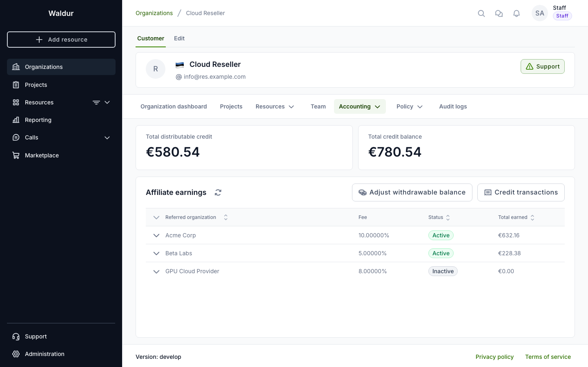
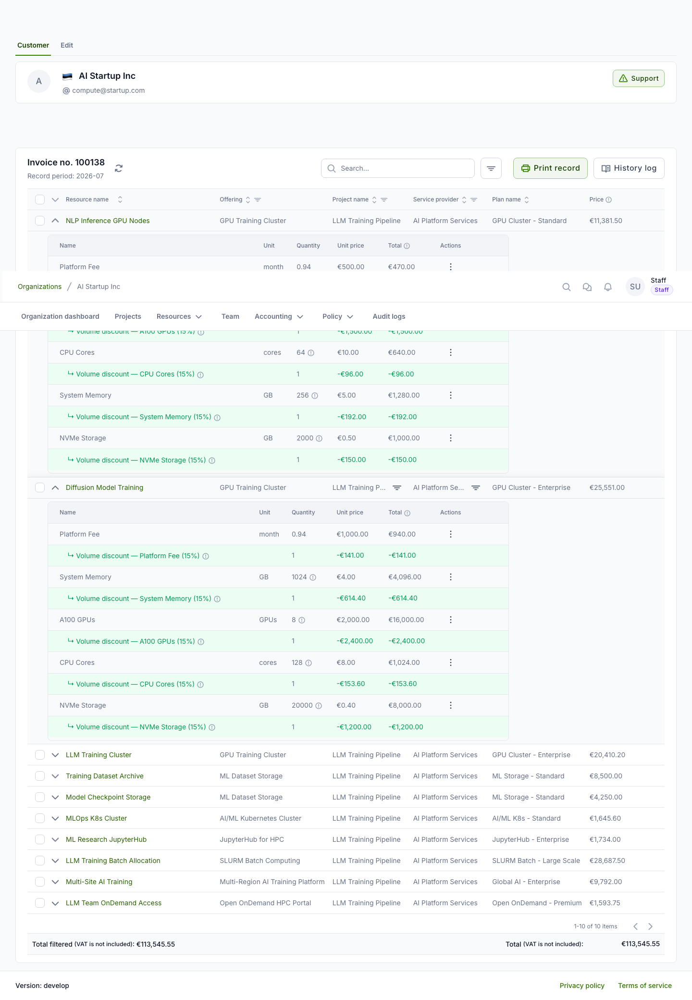

# Affiliate earnings and volume discounts

If your organization is an **affiliate** — you refer another organization under
the [affiliate program](../staff-users/affiliate-program.md) — you can track the
fees you have earned. If your organization receives **volume discounts**, they
appear on your invoices. Both are visible to organization owners.

## Viewing affiliate earnings

Open your organization's **Accounting → Affiliate earnings** page. The tab lists
one row per affiliate link, showing the referred organization, the fee
percentage, whether the link is active, and the total earned.

The page shows:

- **Total distributable credit** and **Total credit balance** — summary cards.
  The distributable credit is the **withdrawable balance**: the part of your
  credit that came from earnings, as opposed to promotional credit granted by
  staff.
- **Affiliate links** — one row per link; expand a row to see its **monthly
  accruals** (one row per fee, with the invoice period, amount and date).
- **Credit transactions** — a button that opens the full ledger of how your
  credit changed over time (earned fees, staff adjustments, payouts and more)
  with the type, amount, comment and date of each entry.

!!! note
    For privacy, the earnings view shows only the amount, the period, and the
    referred organization's name. It never exposes what the referred
    organization purchased.

Earned fees are added to your organization's credit. The **Adjust withdrawable
balance** button on this page is available to staff only.

## Volume discounts on invoices

When your organization qualifies for a volume discount, it is applied when the
invoice is finalized and appears as a separate discount line paired with each
discounted component. Open an invoice from **Accounting → Invoices** and expand
a resource to see the breakdown.

Each discount line is shown in green with a negative amount, indented directly
under the component it applies to (for example, *↳ Volume discount — CPU Cores
(15%)*). Hover over the information icon to see the discount percentage, the
formula, and the usage the discount was based on. The discount is distributed
across the individual components, so every project's share of the saving is
reflected in its own line items.

!!! tip
    Depending on how the service provider configured the component, a discount
    is calculated either on your **total** usage of that component across the
    whole organization — so consolidating usage can push you into a higher
    discount tier — or on each resource's own usage.
