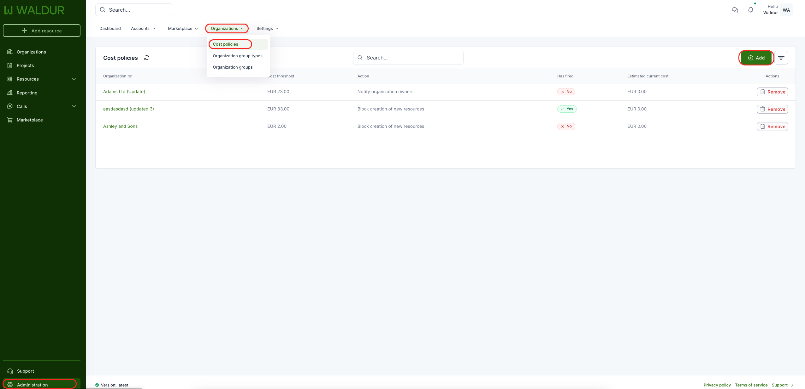
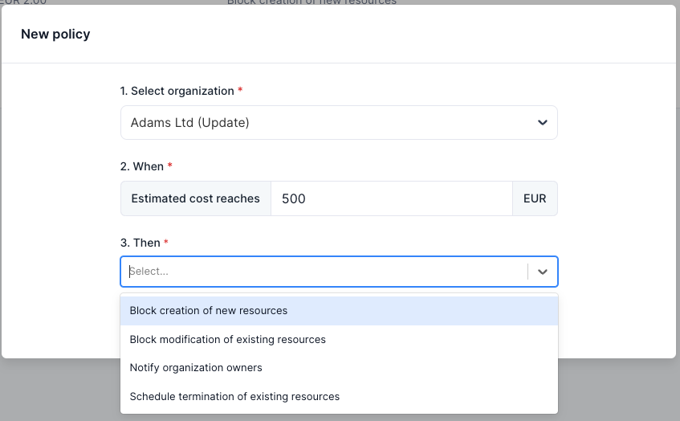
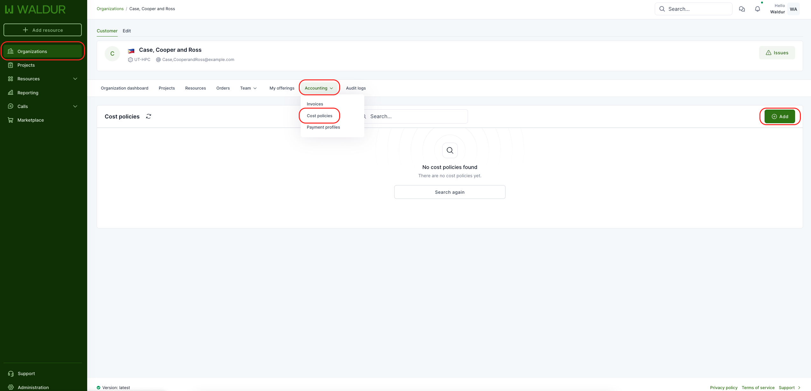
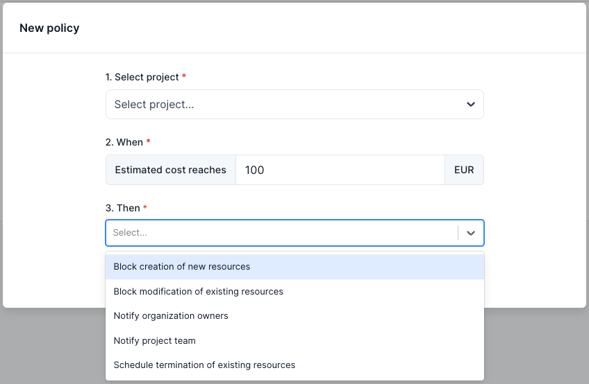
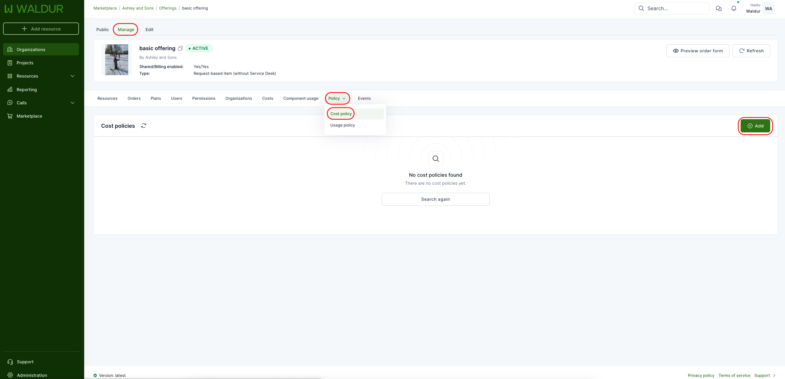
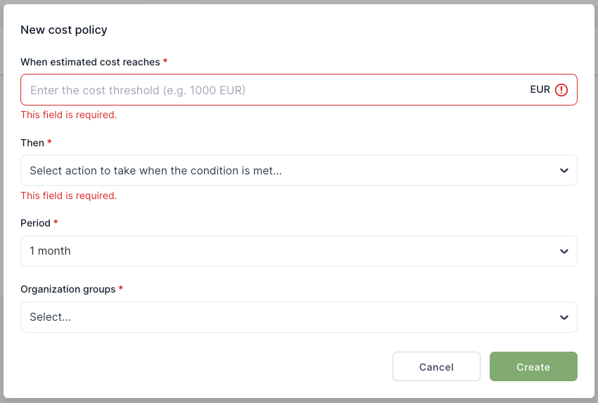
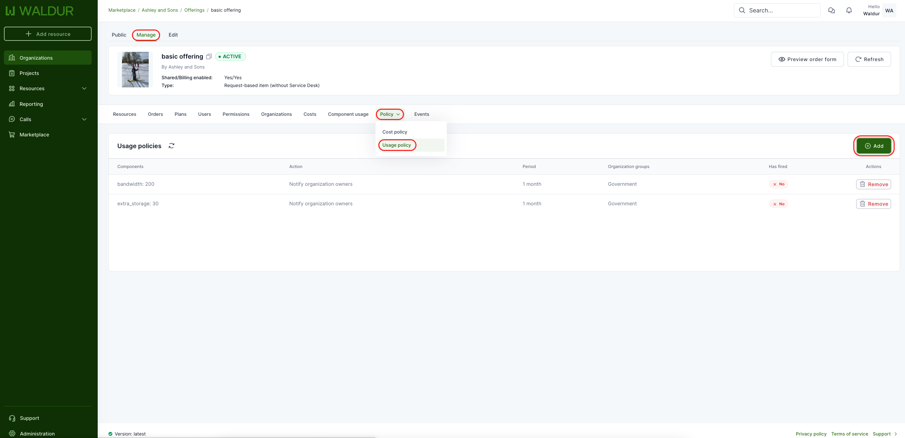
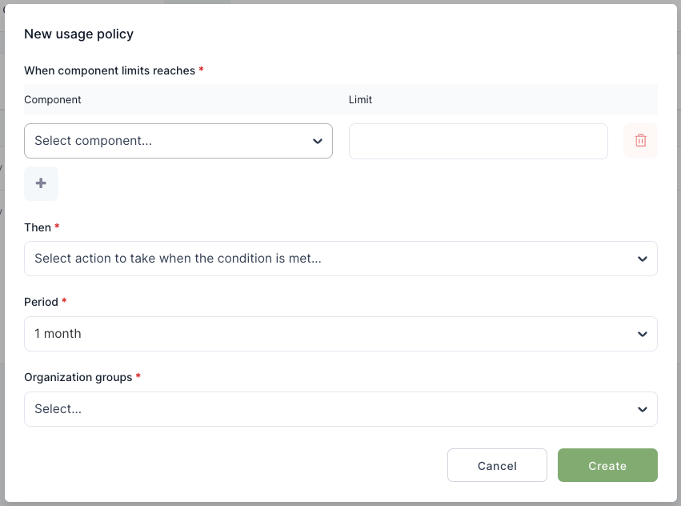

# Cost and usage policies

Define cost and usage policies on organization, project, or offering level to trigger
actions when consumption crosses a threshold. For the concept and the trigger / action
model, see [Policies](../../about/concepts/policies.md).

## Cost policies for organizations

Staff role can define cost policies for organizations. To add a new policy, open Administrations menu from the left and then Organizations -> Cost policies from the top. This view provides an overview about already defined policies. To create a new one, select "Add" from the right.
    

From the popup, select organization, then set estimated cost limit and finally choose the action (what happens, when the limit is reached).
    

## Cost policies for projects

Organization owners can set different cost policies for projects under particular organization. To add a new policy, open Organizations menu from the left and then Policy -> Cost policies from the top. This view provides an overview about already defined policies. To create a new one, select "Add" from the right.
    

From the popup, select project, then set estimated cost limit and finally choose the action (what happens, when the limit is reached).
    

When exactly one project is selected, the policy can optionally be limited to a single resource. Use the "Limit to resource" field to pick a resource: only that resource's cost is then measured against the limit, and the policy's actions (for example pausing, downscaling or scheduled termination) apply only to that resource. Leaving the field empty keeps the policy scoped to the whole project. Blocking the creation of new resources is not available for resource-scoped policies, since that action is project-wide.

By default, the policy accounts for any available project or organization credit — credit is subtracted before the limit is enforced, so a project with sufficient credit does not trigger the policy. Disable "Account for available credit" to enforce the limit against the raw invoice cost, regardless of credit balance.

## Cost policies for offerings

Offering managers can set cost policies for specific organization groups. This allows to trigger some actions, when cost is reached. To add new policy, offering manager should open offering management page (Organization from the left menu, then Service provider -> Marketplace -> Offering) and then Policy -> Cost policy from the top. This view provides an overview about already defined policies. To create a new one, select "Add" from the right.
    

From the popup, set estimated cost limit, choose the action what happens after cost is reached (block creation of new resources or notifying the organization owners). Then, it is needed to select period (is this policy per month, quarter, annual or total) and finally select organization group for which this policy applies to.
    

## Usage policies for offerings

Offering manager can set different usage policies for specific organization groups. This allows to trigger some actions, when usage of defined resource component is reached. To add new policy, offering manager should open offering management page (Organization from the left menu, then Service provider -> Marketplace -> Offering) and then Policy -> Usage policy from the top. This view provides an overview about already defined policies. To create a new one, select "Add" from the right.
    

From the popup, select accounting component and set limit for that. Several compoments can be defined in one policy. Then, it is needed to select period (is this policy per month, quarter, annual or total) and finally select organization group for which this policy applies to.
    
