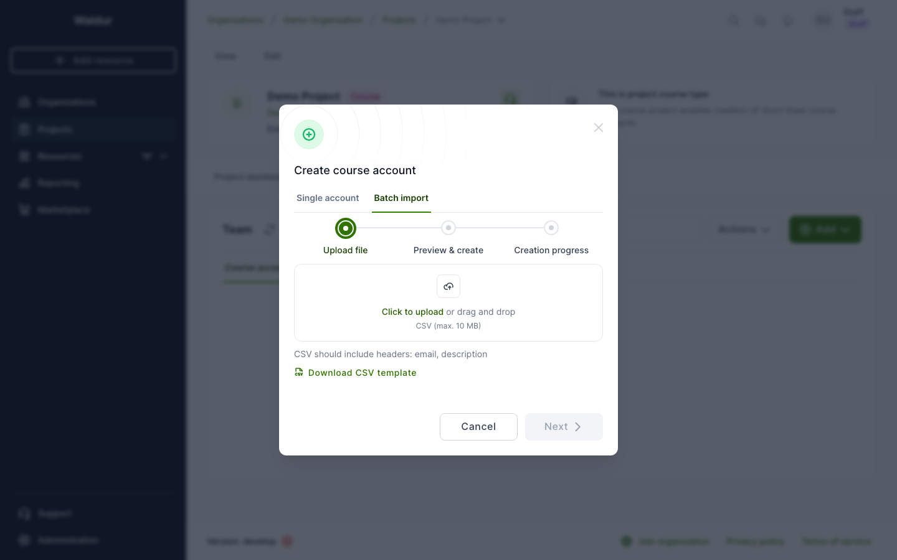
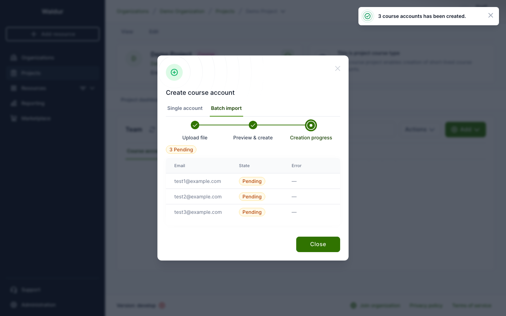

# Course accounts

Course accounts allow project managers to create temporary user accounts for course participants. Waldur supports both individual account creation and bulk import via CSV.

## Batch import

For courses with many participants, use the batch import feature to create multiple accounts at once from a CSV file.

### Preparing the CSV file

The CSV file must include these headers:

- **email** (required): participant's email address
- **description** (optional): a note about the participant

Example:

```csv
email,description
student1@university.edu,Physics 101 - Group A
student2@university.edu,Physics 101 - Group B
student3@university.edu,Physics 101 - Group A
```

You can also download a template from the upload dialog.

### Uploading accounts

1. Navigate to your course project's **Team** page
2. Click **Add** and select **Course account**
3. Switch to the **Batch import** tab



4. Upload your CSV file (drag and drop or click to browse)
5. Click **Next** to preview the imported data
6. Review the list — accounts with invalid emails are flagged
7. Click **Create** to submit

### Monitoring creation progress

After submitting, the wizard advances to the **Creation progress** step. This screen shows:

- **Summary badges** at the top: count of Pending, Created, and Failed accounts
- **Per-account table** with Email, State, and Error columns
- The view **polls automatically** every 3 seconds until all accounts finish processing



Once all accounts are processed, click **Close** to return to the main list.

!!! tip
    If some accounts fail, check the Error column for details. Common causes include duplicate emails or issues with the external account provisioning service. Failed accounts can be retried individually from the course accounts list.

### Retrying failed accounts

If an account fails during creation (shown as "Erred" in the list):

1. Find the failed account in the course accounts table
2. Click the action menu (three dots) and select **Retry**
3. The account returns to "Pending" state and the system retries the creation

!!! note
    The retry action re-enqueues the account creation task. If the underlying issue (e.g., external service unavailability) is not resolved, the account will fail again.
