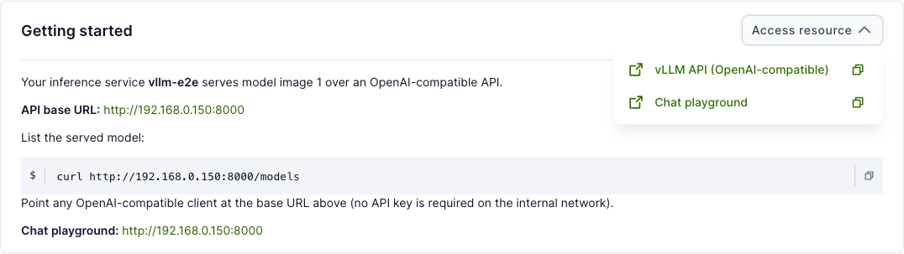
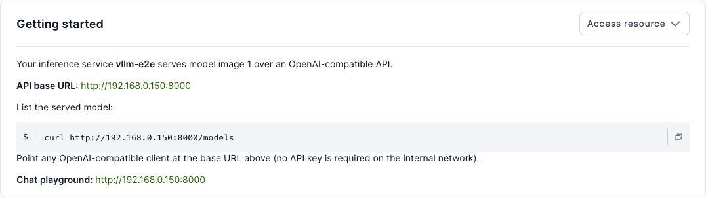
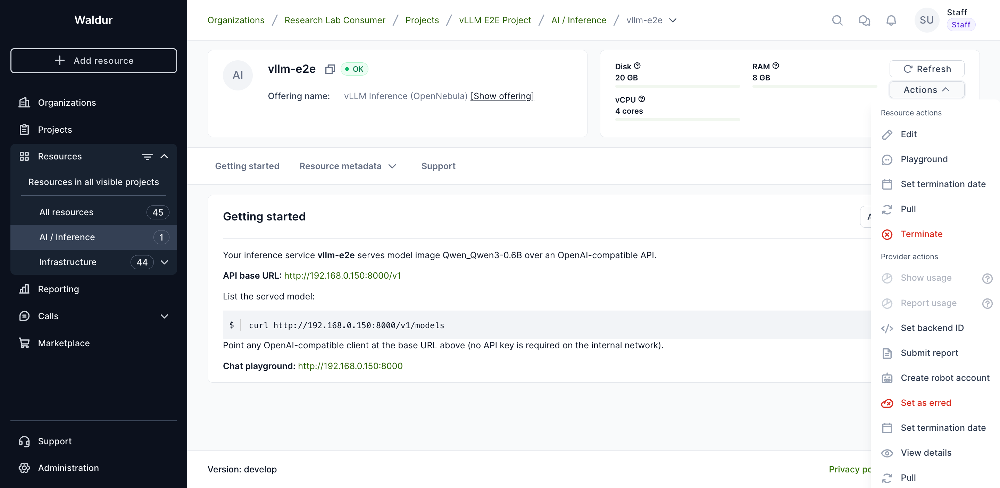
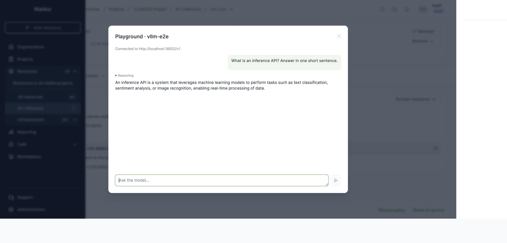

# Inference services

An **inference service** runs a large language model (LLM) for you and exposes
it through an **OpenAI-compatible API**. You pick a model and a few options, and
Waldur provisions the service and hands you a ready-to-use endpoint — you do not
manage the serving stack yourself.

Inference services are **provider-agnostic**: ordering and access work the same
way regardless of which provider backend fulfils the request. Only the available
models, options, and provider differ from one offering to the next.

!!! info "Supported backends"
    Inference services are currently provided by the **OpenNebula** backend,
    which runs the model on a virtual machine using a vLLM engine. Support for
    additional backends may be added over time — this guide applies to all of
    them. The screenshots below are from an OpenNebula-backed offering.

## Ordering an inference service

1. Open the **Marketplace** and select an inference offering (for example
   *vLLM Inference*).
2. Choose the **model** from the dropdown. The list contains the models the
   provider has made available.
3. (Optional) Adjust any serving options the provider exposes. Depending on the
   backend these may include the **API port**, a **web chat interface**, and
   advanced tuning such as **quantization**, **context length**, or **GPU memory
   utilisation** — leave them at their defaults unless you have a specific need.
4. Pick a **plan** (this determines the compute size — vCPU, RAM, and disk).
5. Give the resource a name and click **Add to cart**, then **Request**.

Once the order is approved and provisioned, the resource state becomes **OK** and
the endpoint is ready.

## Accessing the endpoint

Open the resource and use the **Access resource** button in the top-right of the
*Getting started* card. It lists two entries:

- **vLLM API (OpenAI-compatible)** — the API base URL (ends in `/v1`). Use the
  copy icon to copy it, or the open icon to open it in a new tab.
- **Chat playground** — a browser chat UI for the model (when the web interface
  option was enabled).



The **Getting started** card also shows the API base URL and a ready-to-run
snippet:



### Calling the API

The endpoint is OpenAI-compatible, so any OpenAI client works — point its base
URL at the address shown. For example, to list the served model:

```bash
curl <API base URL>/models
```

Any OpenAI SDK works the same way by setting its base URL to the address above.

!!! note
    The API base URL already includes the `/v1` suffix expected by OpenAI
    clients.

!!! warning
    The inference API is **not authenticated** — access is controlled by network
    reachability of the service's private network. Treat the endpoint as
    internal: do not share it outside your trusted network, and do not expose it
    on a public address without putting your own authentication in front of it.

## Playground

If the provider enabled it (the **Expose inference playground** offering
option), the resource's **Actions** menu includes a **Playground** action for
chatting with the model directly in the browser — no external client needed.



Open it, type a prompt, and the reply streams back from the model. Models that
emit reasoning show it in a collapsible **Reasoning** section above the answer.



!!! note
    The playground calls the endpoint directly from your browser, so it works
    only when the endpoint is reachable from your network — the same
    prerequisite as the access URLs above.

## Managing the service

The service is an ordinary virtual-machine resource: you can pause, resume and
terminate it from the resource page, and its usage is billed according to the
plan you selected.
