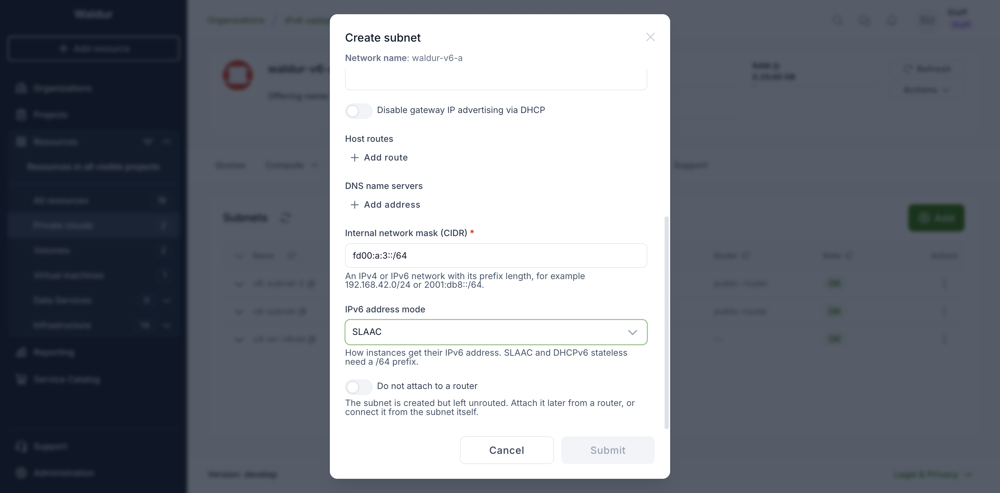
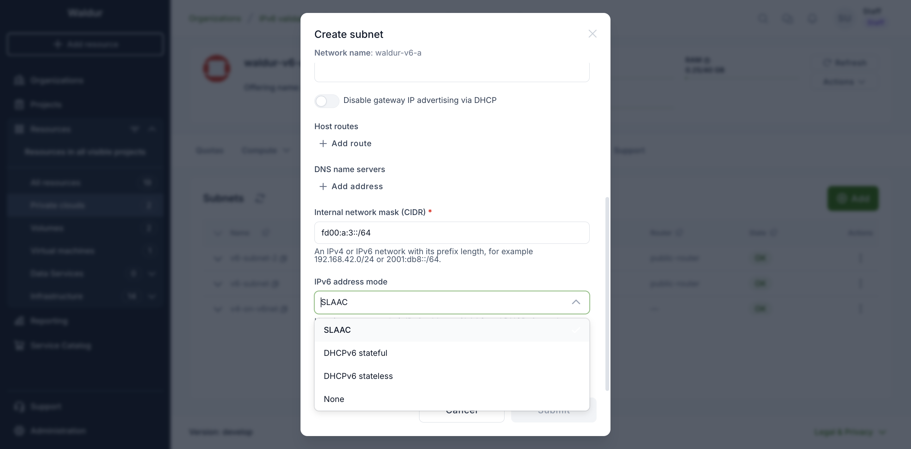
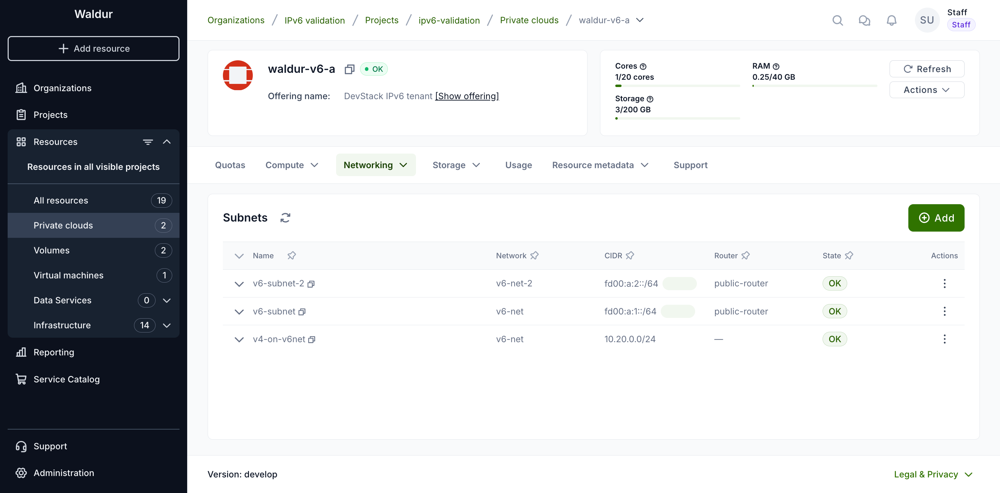
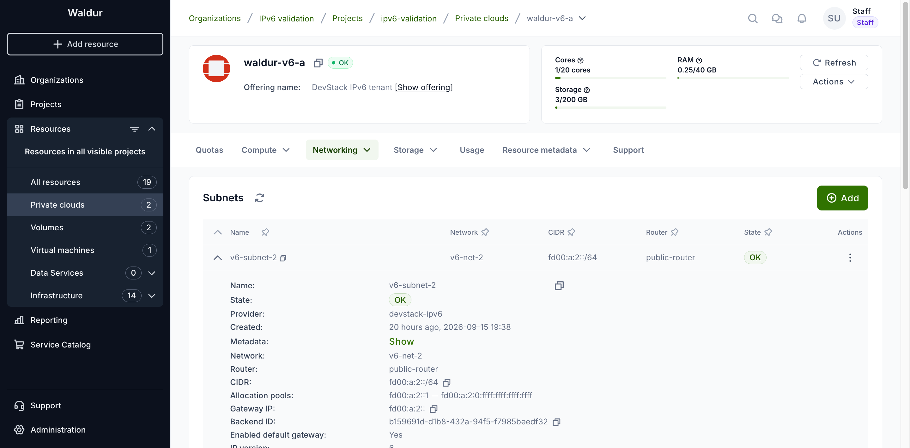
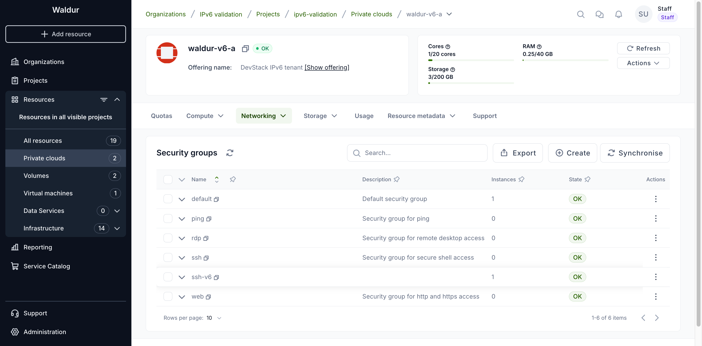
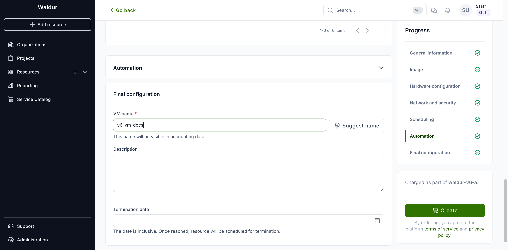
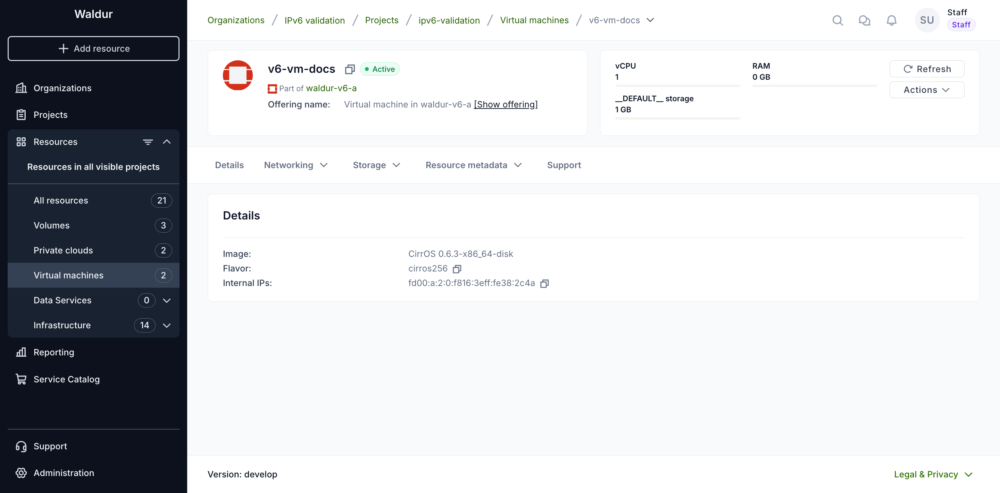
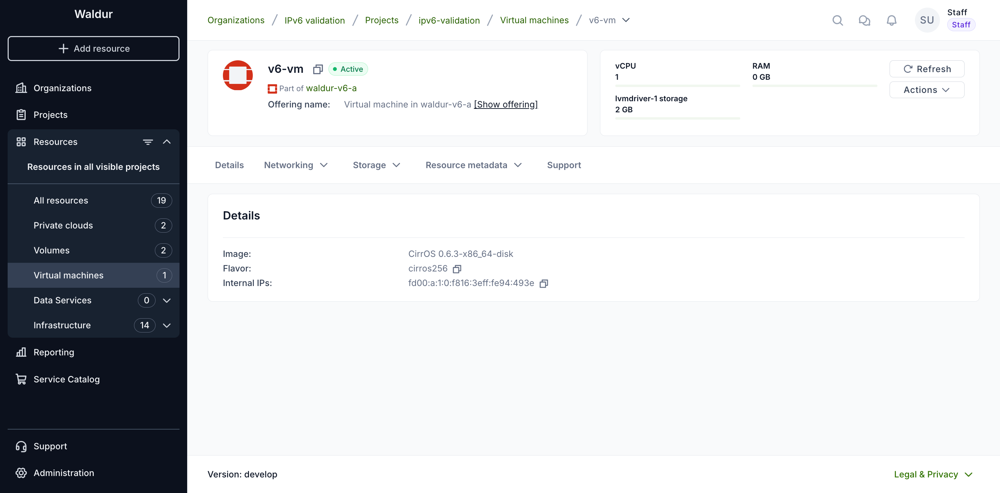
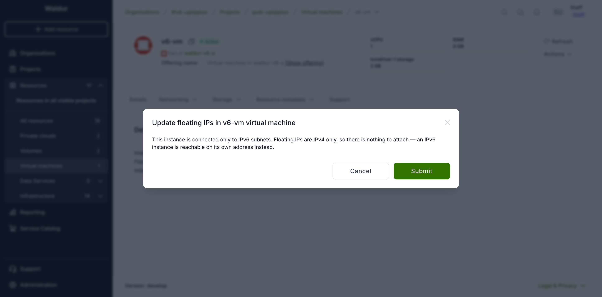

# IPv6 in OpenStack tenants

Waldur can manage OpenStack tenants that use IPv6, including clouds where
every network is IPv6-only. Most of the tenant workflow is unchanged — this
page covers the places where IPv6 behaves differently from IPv4.

## Creating an IPv6 subnet

1. Open the OpenStack tenant resource and go to **Networking → Subnets**.
2. Click **Add**.
3. Choose the **Network**, give the subnet a **Name**, and enter the prefix in
   **Internal network mask (CIDR)**.

    The field accepts either family, for example `192.168.42.0/24` or
    `2001:db8::/64`.

    

4. As soon as the CIDR is an IPv6 prefix, an **IPv6 address mode** field
   appears. It controls how instances on the subnet obtain their address.

    

    | Mode | How instances get an address |
    |---|---|
    | SLAAC | The instance builds its own address from the subnet prefix and its MAC address. |
    | DHCPv6 stateful | A DHCPv6 server hands out the address. |
    | DHCPv6 stateless | The instance builds its own address; DHCPv6 supplies only extra options such as DNS. |
    | None | No automatic addressing — addresses are configured on the instance itself. |

    !!! note
        SLAAC and DHCPv6 stateless require a `/64` prefix, because the
        instance derives the host part of its address from the prefix. The
        API rejects any other prefix length for those two modes.

5. Optionally pick a **Router** to attach the subnet to. Leaving it empty lets
   Waldur choose one.
6. Click **Submit**.

!!! note
    The allocation pool fields shown for IPv4 subnets are not offered for
    IPv6. A subnet that assigns addresses automatically does not take a fixed
    range.

!!! warning
    An internal network can hold only one subnet. To add another subnet,
    create another network first.

## Reviewing subnets

The **Subnets** tab lists each subnet with its prefix, so both families are
visible at a glance. A tenant can mix them: the network below carries an IPv6
subnet and an IPv4 one side by side.

An IPv6 subnet carries its address mode as a badge next to the prefix, so the
mode each subnet was created with is visible without opening anything. IPv4
subnets have no badge — the mode does not apply to them.

Expand a row to see the rest of the subnet, including the router advertisement
mode alongside the address mode. An IPv4 subnet shows no mode rows at all.

!!! note
    Choose the address mode deliberately at creation time. Changing it later
    means recreating the subnet, because OpenStack treats the address modes as
    immutable.

## Security groups

The security groups created with a new tenant carry rules for both families,
so IPv6 traffic is covered by the same defaults as IPv4. You can add your own
IPv6 rules — including ICMPv6, which IPv6 relies on far more heavily than IPv4
relies on ICMP.

When writing a rule, give the remote prefix in the same family as the rule's
ethertype — for example `::/0` for "anywhere" on an IPv6 rule, rather than
`0.0.0.0/0`.

## Virtual machines

### Creating a virtual machine

1. Open the project, click **Add resource** and choose the virtual machine
   offering of the OpenStack tenant.
2. Pick an **Image** and a **Flavor**, then set the **System volume type** and
   **System volume size**.
3. Under **Network and security**, choose the **Subnet**. Which subnet you pick
   decides what the **Floating IP** field beside it can offer.

    

    !!! note
        On an IPv6 subnet, **Auto-assign floating IP** is disabled and says why,
        leaving **Skip floating IP assignment** selected. The choice is made per
        row, so on a tenant holding both families an IPv4 subnet added to the
        same order can still take a floating IP.

4. Select the **Security groups** to join, enter a **VM name**, and click
   **Create**.

Once the order is approved, the instance is provisioned and reaches **Active**
with no floating IP. **Internal IPs** carries the address it built for itself
from the subnet prefix.

### Details and actions

An instance on an IPv6 subnet reaches the network through its own address.
The **Details** tab shows it under **Internal IPs** — with SLAAC the host part
is derived from the instance's MAC address, which is why the address ends in a
recognisable `f816:3eff:fe…` pattern.

Everything else in the **Actions** menu works as it does on IPv4: start, stop,
restart, rescue, edit, change flavor, update security groups, the console, and
the provider and billing actions. Nothing is hidden or disabled because the
tenant is IPv6 — the usual rules still apply, so **Start** is unavailable while
the instance is running and **Change flavor** requires it to be stopped.

Two operations deserve a closer look.

### Attaching security groups

**Update security groups** behaves exactly as on IPv4. The only restriction is
that a group must belong to the same tenant as the instance; there is no rule
about address families, because a single security group can hold rules for both.
An instance can therefore carry the tenant's `default` group alongside a group
whose rules are IPv6-only.

### Floating IPs

Floating IPs exist only for IPv4 in OpenStack: a floating IP is mapped onto a
fixed IPv4 address of a port, so a port with only IPv6 addresses has nothing to
map it to.

The **Update floating IPs** action is still listed for an instance on an IPv6
subnet, but it offers no subnet to choose. It says so instead:

That is the intended outcome, not a failure to work around. An IPv6 instance is
reached on the address shown under **Internal IPs**, and there is nothing to
attach in its place.

!!! note
    **Internal IPs** lists the addresses an instance holds on the tenant's own
    networks, as opposed to a floating IP. It is a statement about where the
    address comes from, not about who can reach it. Whether the address is
    reachable from outside depends on the prefix the subnet was created with: a
    global prefix routed by the tenant router is reachable directly, while a
    unique local prefix (`fd00::/8`, as in the screenshots on this page) stays
    within the deployment. In both cases security group rules decide what may
    reach the instance.

If a request does reach the API — from a script, or on a tenant with a mix of
subnets — it is refused before anything is created, with the reason spelled
out:

> External network *name* has no IPv4 subnet, so no floating IP can be
> allocated from it. Floating IPs are IPv4 only: IPv6 addresses are routed
> rather than floating, so reach the instance on its own IPv6 address instead.

!!! note
    An instance that has both an IPv4 and an IPv6 subnet is a normal case: the
    dialog lists the IPv4 subnets and hides the IPv6 ones, so a floating IP can
    still be attached to the IPv4 side.

## Load balancers

A load balancer's virtual IP can be IPv6. Note that the OVN provider does not
support mixing families within one load balancer — the members must be in the
same family as the VIP.
