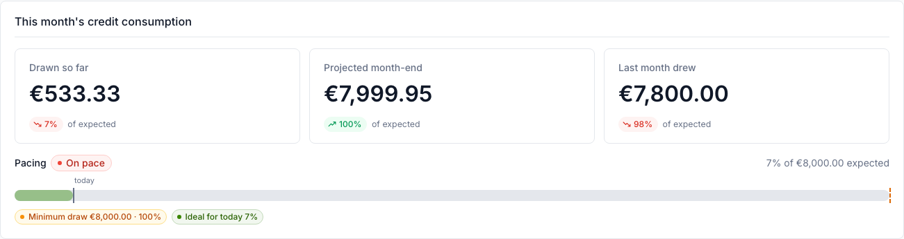
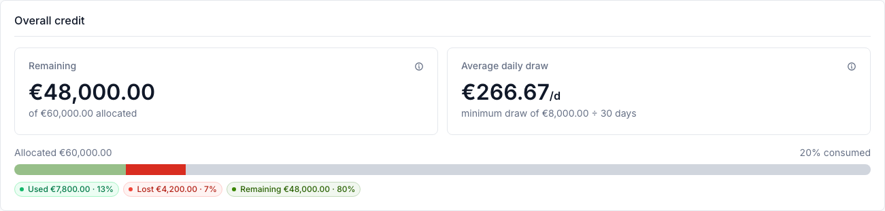
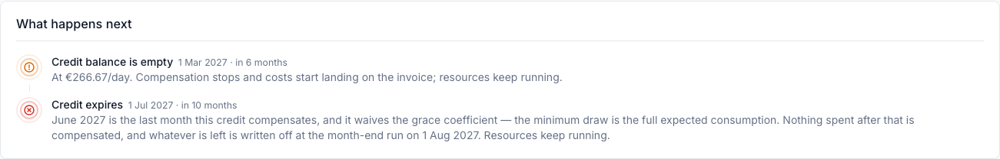

# Credit consumption dashboard

A project funded by a credit shows a **Credit consumption** block on its dashboard. It answers three
questions: how this month is going, how much of the allocation is left, and what is going to happen.

!!! note
    The block appears only for projects that have a credit allocation. A project without one shows
    nothing — there is no credit to report on. See
    [Credit management](credit-management.md) for how allocations are made.

## This month's credit consumption

| Figure | Meaning |
|--------|---------|
| **Drawn so far** | Cost booked this month that this credit will be drawn against. Not yet a draw: compensation is written when the month closes. |
| **Projected month-end** | That figure extended to the end of the month at the current rate. Early in the month it moves a lot, because it is dividing by very few days. |
| **Last month drew** | What the credit actually paid out last month, from the closed invoice. |

Each is shown as a percentage of **expected consumption** — the monthly figure the credit was set up
with, not the balance.

The **Pacing** bar underneath compares where consumption stands against where a linear ramp says it
should stand today. *Ahead of pace* means the credit is being used faster than the ramp, *behind
pace* slower.

!!! warning
    The **minimum draw** is taken whether or not it is used. If a project consumes less than the
    minimum in a month, the shortfall still comes off the balance — it is simply not spent on
    anything. That is why a project can be "behind pace" and still lose credit.

## Overall credit

**Remaining** is the balance against the total allocated. **Average daily draw** is the rate the
projections below are built from, and the caption states where it comes from — usually the minimum
draw divided over a nominal 30-day month.

The bar splits the allocation three ways, and the distinction matters:

- **Used** — credit drawn against real consumption. It bought something.
- **Lost** — credit taken by the minimum draw, or written off at expiry, with no consumption behind
  it. It bought nothing.
- **Remaining** — still available.

A large *Lost* share means the credit's expected consumption is set higher than the project actually
uses.

## What happens next

Everything with an end date, soonest first. Each row states what it *does*, because the consequences
differ sharply:

| Row | What it does |
|-----|--------------|
| **Credit balance is empty** | Compensation stops and costs start landing on the invoice. Resources are unaffected. |
| **Credit expires** | Compensation stops on the expiry date. Anything left is written off at the month-end run **a month later** — the balance visible in between is a residue, not something to spend. |
| **Project reaches its end date** | Resources are paused for the grace period; offerings that opt out of the grace period are terminated immediately. |
| **Grace period ends** | Every remaining resource is terminated. |
| **Last resource ends** | Nothing is left running, so the credit stops being drawn — but the minimum monthly draw still applies to whatever is left. |
| **A cost policy** | Either an estimate of when the policy will fire, or — dated today — a threshold that has already been reached. |

!!! note
    A row marked *policy* is an estimate, and says so. A cost policy dated **today** is not an
    estimate: the threshold has been reached and the policy is triggered. Note that a cost policy
    does not fire on cost alone — the credit balance must also have fallen to the policy's limit —
    so a project can be over its cap and still not be firing.

Where a policy that pauses or terminates resources has reached its threshold, the credit rows say so
rather than claiming resources keep running.

## Charts

Additional charts — a credit burn-down with a projected exhaustion date, usage treemaps, per-offering
bars — are turned off by default. An administrator enables them per deployment; see
[Feature flags](../../admin-guide/mastermind-configuration/features.md) for the `dashboard.*`
options.
