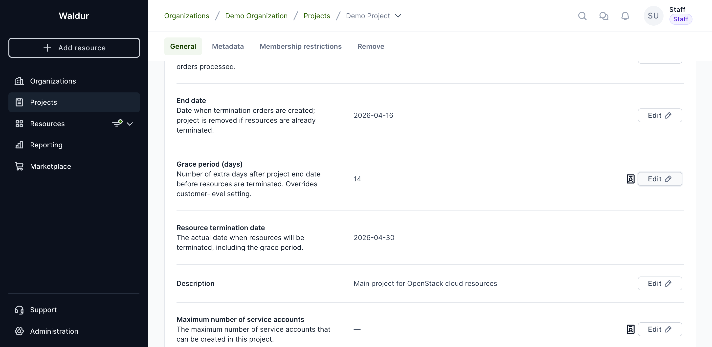
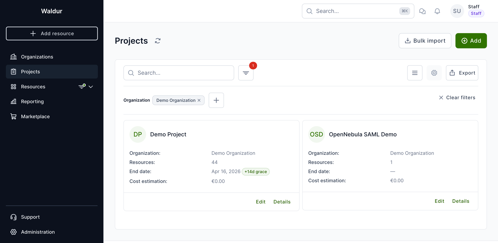
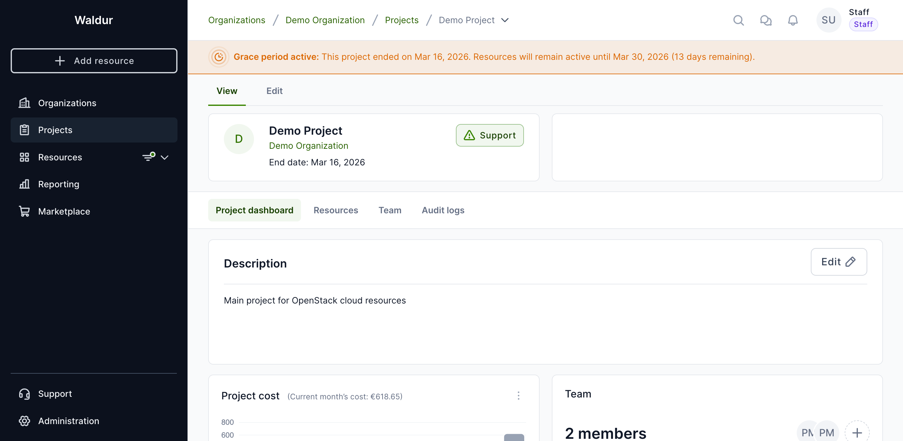

# Project management

Project creation is allowed for organization owners in their organizations and staff users.

!!! note
    User must have an account in Waldur instance to create projects.

1. Select your home organization.
2. Under the **Project** tab, click on **Add**.
3. Fill the necessary fields (fields marked with * are mandatory) and click **Create**.

    - **Project name** - The original title of the project.
    - **Project description** - A brief description about the project.
    - **OECD FoS code** - OECD science field code ([more info](https://joinup.ec.europa.eu/collection/eu-semantic-interoperability-catalogue/solution/field-science-and-technology-classification/about))
    - **Start date** - once reached, marks the date when prepared user invitations are sent out and triggers the processing of previously made resource orders.
    - **End date** – once reached (plus any configured grace period), triggers the creation of termination orders for the existing resources. If the resources have already been terminated by this time, the project will be removed. The date is inclusive.

4. If you need to edit project details later, open your project and select the **Edit** tab.

!!! note
    1. If a resource has a termination date that comes after the project's end date, the project's end date will automatically become that resource's termination date.
    2. If a resource has a termination date that comes before the project's end date, we'll use the resource's original termination date.
    3. Important: Setting any end date (either the project's or a resource's) only creates a termination request. The resource remains active in the project until the termination process is fully completed.

## Grace period

A grace period adds extra days after the project's end date before resources are actually terminated. This gives project members time to back up data or request an extension.

Grace period can be configured at two levels:

- **Organization level** – applies to all projects in the organization by default.
- **Project level** – overrides the organization-level setting for a specific project.

### Setting the grace period

Staff users can set the grace period on the project's **Edit** tab under **General** settings. Enter the number of days in the **Grace period (days)** field.

Once a grace period is set, a **Resource termination date** row appears showing the actual date when resources will be terminated (end date + grace period days).

### How it works

When a project has a grace period configured:

- The **project list** shows a badge next to the end date indicating the grace period (e.g., "+14d grace").

- When the project's end date has passed but the grace period is still active, an **"In grace period"** badge appears.
- A warning bar is displayed at the top of the project pages showing the original end date, the resource termination date, and the number of days remaining.

- Notification emails about project ending include grace period details when applicable.

!!! warning
    Once the grace period expires (i.e., the resource termination date is reached), all project resources will be scheduled for termination, just as they would on the regular end date.

## Order auto-approval

Project owners and managers with the order-approval permission can configure a project-level rule that auto-approves marketplace orders on the consumer side when the order's estimated monthly cost is at or below a configured ceiling. This removes a manual step for predictable, low-value orders while keeping anything unusual under human review.

!!! note
    Only orders for plans whose components have predictable cost qualify. If the offering has any usage-based component, the order will always require manual review regardless of the configured limit.

### Configuring the rule

1. Open the project and switch to the **Edit** tab.
2. Select **Order approval** in the tab strip.
3. Click **Configure** (or **Edit** if a rule already exists).
4. Toggle **Enable auto-approval** and enter the **Monthly cost limit** in the platform currency.
5. Click **Save**. The card immediately reflects the new state: a green **Enabled** badge, the configured limit, and an audit row showing who saved it and when.

The same dialog has a **Remove rule** action to delete the rule entirely. To temporarily pause auto-approval without losing the configured limit, save the rule with the toggle off — the card will show a grey **Disabled** badge and the limit is preserved for re-enabling later.

### Discovery from the project dashboard

The project dashboard's **Project cost** widget overlays the configured limit as a horizontal mark-line on the cost chart so members can see at a glance how the project's current spend compares to the auto-approval ceiling. Hovering the line shows the configured limit.

The widget's actions menu also exposes a **Manage order auto-approval** shortcut that jumps straight to the Order approval tab.

### What members see when placing an order

When a project member submits a new order through the marketplace, the deploy page's total card shows one of these notices based on the order's estimated monthly cost:

- **Order will be auto-approved** — recurring monthly cost is at or below the project limit and the offering's plan has no usage-based components. The order skips manual consumer review on submission.
- **Order will need consumer approval** — either the recurring monthly cost exceeds the project limit, or the offering has usage-based components (in which case the rule never applies).

**Terminate orders** auto-approve unconditionally whenever a rule is enabled — terminating a resource removes future billing, so the cost check is always satisfied. Update orders use the same recurring monthly cost check as new orders.

Once the order is created, the orders list shows an **Auto-approved** badge next to the approver name for any order that the rule fired on, and a filter is available to narrow the list to auto-approved orders only.

### Permissions

The Order approval tab is visible to:

- **Project managers** and **organization owners** with the order-approval permission — full read/write access.
- **Staff** and **support** users — full read/write access. When a staff user without scope permission opens the edit dialog, a yellow warning banner reminds them they are configuring the rule on someone else's project.
- **Project members** without order-approval permission — tab is hidden, but they still see the mark-line on the cost chart and the notice on the deploy page so they know what to expect when they submit an order.

!!! warning
    If the user who saved the rule later loses their order-approval permission on the project, the rule will stop firing automatically and a warning will be logged on the server. Re-create the rule (or re-grant the permission) to restore auto-approval.
