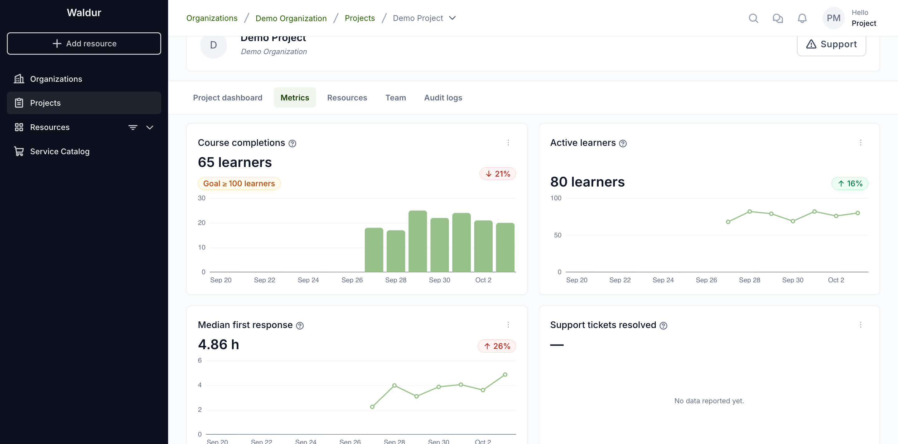
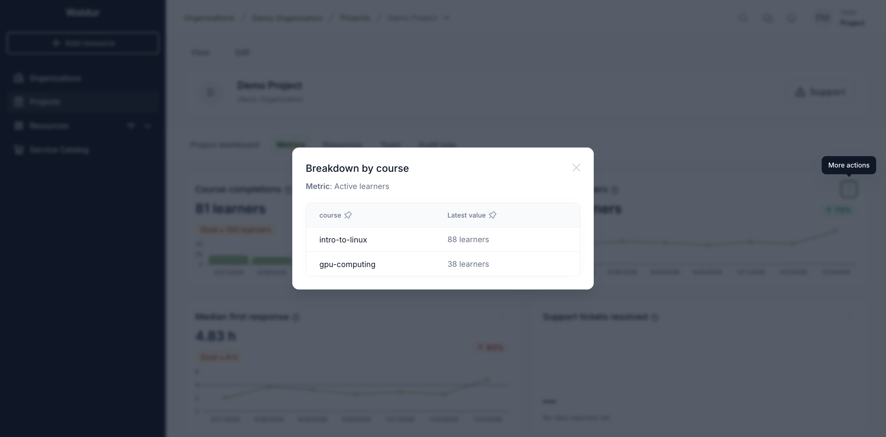
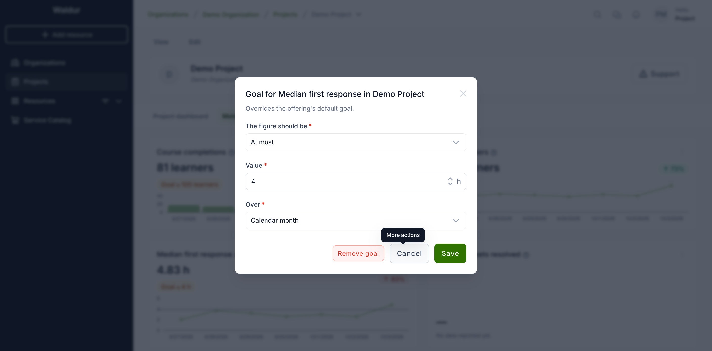

# Project metrics

Some services report metrics about what they do for your project — how many
learners completed a course, how many tickets were resolved, how fast support
answered. When a resource in your project comes from such a service, the
project gets a **Metrics** tab.

## The Metrics tab

Open the project and select **Metrics**. The tab appears when one of the
project's resources comes from a service that has adopted metrics — even before
the service has reported anything.

Each card is one metric:

- **The figure** — for a count (completions, tickets), the total for the
  current period; for a level (active learners, response time), the latest
  value. When several resources report the same metric, their figures are
  added up or averaged, as the service decided.
- **The change** — compared with the previous period. For a metric where
  higher is better a rise is green; where lower is better, such as a response
  time, a rise is red. Metrics with no preferred direction show a rise in green.
  The badge appears only when both periods have a figure.
- **The goal**, if one is set — green when the figure meets it.
- **The chart** — one point per day (in UTC), from the first day with data, up
  to 90 days back. Counts are bars; levels are a line, with the goal drawn across
  it. Days without data are left empty.

The question mark next to a metric's name says which service reports it and
how the figure is computed. A metric the service has adopted but not reported
yet says **No data reported yet**.

Figures are recomputed every 15 minutes, so a fresh report can take that long
to appear.

## Resources report, the project sees the total

A service reports a metric for each of its resources: the course environment,
the support desk, the cluster allocation. The project's card combines the
resources of that service in the project into one figure, the way the
service decided: added up (three course environments with 10, 15 and 12
active learners show 37) or averaged (two support desks with median response
times of 4 and 6 hours show 5). Goals apply to that combined figure, so a
project has one goal per metric, whatever number of resources it has.

Each card belongs to one service. If two services in the project report the
same metric, the tab shows two cards, each with its own figure and goal.

## Breaking a figure down

When a metric carries attributes, such as the course or the support queue,
choose **Breakdown by …** in the card's menu.

Each value is computed the same way as the card. For metrics the service adds
up across resources, the values add up to the card's figure; for metrics it
averages, each value is the average of its own resources.

## Looking at one resource

To see which resource drives a figure, choose **Breakdown by resource** in
the card's menu. It lists the project's resources of that service with their
figure for the card's period. For metrics the service adds up, the figures
add up to the card's; for metrics it averages, each is that resource's own
average.

Select a resource to open its **Metrics** tab. It shows the resource's own
figures for the current month, the change from last month, the daily chart
and the breakdown by attribute. A resource has no goal of its own: goals
apply to the project's combined figure.

## Setting the project's goal

The service may set a default goal for every project. Users who may edit the
project, such as project managers and organization owners, can set the
project's own goal instead: choose **Set project goal** (or
**Edit project goal**) in the card's menu.

- **The figure should be** — **At least** for metrics where more is better,
  **At most** for metrics where less is better.
- **Value** — in the metric's unit.
- **Over** — a calendar month, a calendar quarter, or the last 30 days. The
  card's figure and change are computed over this period.

**Remove goal** asks for confirmation and goes back to the service's default
goal, if there is one.

## Related pages

- [Custom metrics for service providers](../service-provider-organization/custom-metrics.md)
- [Custom metrics catalogue](../staff-users/custom-metrics-catalogue.md)
