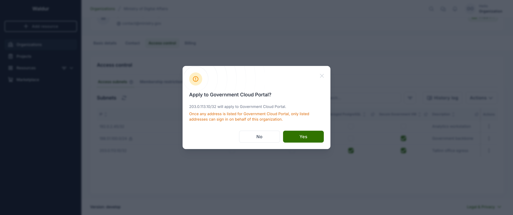
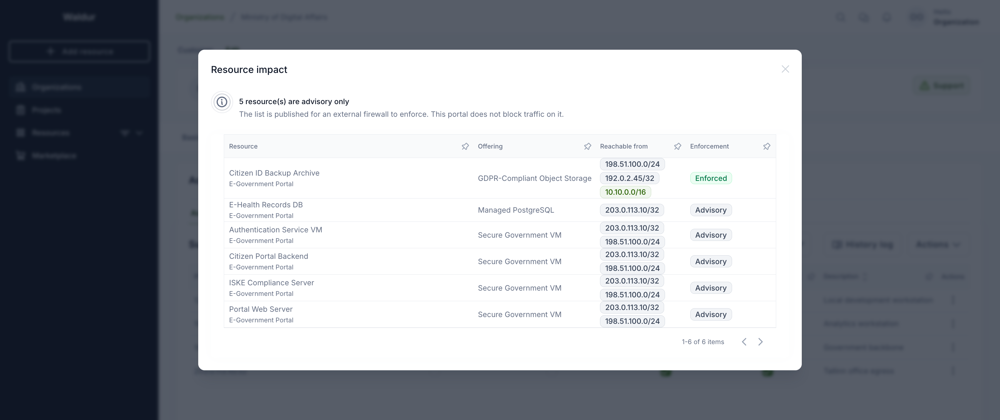

# Access subnets

An organization keeps one list of **trusted networks**. Each entry is an IP
address or range, and says what it is trusted *for*:

- **signing in to the portal** on behalf of the organization, and/or
- **reaching the resources** the organization holds of a particular offering —
  the backend entity behind each resource, such as an object storage bucket, a
  database, or a compute allocation.

An address is therefore described once ("office egress") rather than maintained
in two separate places.

!!! warning
    The two scopes do very different things. Portal sign-in is enforced by
    Waldur itself. Offering scopes are, by default, **advisory data** — they are
    published through the API so that an external firewall (or the provider's
    automation) can build an allow-list and enforce it on the actual backend.
    Waldur only blocks traffic on them if the offering enables
    [concealment](#concealing-restricted-resources-optional).

## Managing the list

Open **Organization → Manage → Access control** and select the **Access
subnets** tab. The table has one row per address and one column per thing it
can be trusted for: your Waldur site, then each offering your organization
consumes that supports access subnets.


To add an address, use **Actions → Add access subnet**. Enter the CIDR, an
optional description, and tick what it should apply to. Leaving **Applies to**
empty is fine — the entry is then trusted for nothing until you tick a column
in the table.


Ticking or unticking a cell asks for confirmation and names the change, so it
is clear what is about to happen before anything is saved.



!!! danger "Enabling the sign-in column"
    As soon as **any** address is trusted for portal sign-in, only listed
    addresses can sign in on behalf of the organization. Everyone signing in
    from elsewhere loses access to it.

    This is why the sign-in column is off by default, and why adding an address
    to reach a bucket never restricts sign-in as a side effect.

### What you may enter

| Who | Allowed |
|-----|---------|
| Organization owners | a single IP address — `/32`, or `/128` for IPv6 |
| Staff | any width except `/0` |

A bare address such as `192.168.1.5` is treated as `192.168.1.5/32`.

A network with host bits set (for example `203.0.113.5/24`) is rejected rather
than silently widened to `203.0.113.0/24` — that would grant a whole range
where a single host was written.

!!! note "Entries added by staff"
    An entry created by staff is marked with a lock and cannot be changed or
    removed by anyone else, whatever its width. It stays visible so you can see
    why an address is allowed. If staff later widens an entry you created, it
    becomes staff-managed for the same reason.

### Offerings you no longer use

If your organization terminates its last resource of an offering, entries
trusted for it are **kept** — reprovisioning then restores your protection
without reconfiguring anything.

Such a column is marked as no longer in use. You can untick it to remove the
entry's scope, but you cannot add it back until the organization holds a
resource of that offering again. While dormant, the addresses are not published
to the firewall allow-list.

### Addresses published by the provider

Below the table, **Also allowed by the service provider** lists ranges the
provider publishes on its own offerings. They widen what may reach your
resources, they are included in the exported allow-list, and they cannot be
changed here — only the provider can edit them.

## Checking what it means for your resources

**Actions → Show resource impact** lists every resource your organization
holds, the addresses that can reach each, and whether the list is actually
enforced. The row menu on an address answers the reverse question — which
resources that one address reaches.



Only resources of offerings that support access subnets are listed. The rest
have no allow-list that could apply to them, so including them would bury the
resources whose exposure is actually in question.

The view calls out two things the table cannot show:

- resources that are **reachable from anywhere**, because their offering
  supports access subnets but nothing is listed for them;
- resources whose list is **advisory only**, published for an external firewall
  but not enforced by Waldur.

## Enabling the feature (service provider)

Offering scopes are available only for offerings that opt in.

1. Open the offering and go to **Edit → Integration → Operations**.
2. Select the **Resource lifecycle** tab.
3. Turn on **Enable resource access subnets**.


Once enabled, consumers can trust addresses for that offering, each of its
resources shows a read-only **Access subnets** tab, and the offering's
**Manage** view gains an **Access subnets** tab with two sub-tabs — **Default
allowed subnets** (the provider's own ranges, editable here) and **Access
subnets by organization** (a read-only roll-up of what consumers have listed)
— plus a **Firewall allow-list** button showing the merged list ready to copy
or download.

!!! note
    Editing this setting requires permission to manage the offering — the
    offering's service manager or the provider organization owner.

### Concealing restricted resources (optional)

The **Resource lifecycle** tab has a second toggle, **Conceal
subnet-restricted resources**, which opts the offering into enforcement by
Waldur itself.

When it is on, a resource of this offering is **hidden from the consumer API**
unless the caller's IP address is trusted for it. The resource disappears from
resource lists and returns *not found* on direct access.

!!! warning
    This is the one place the feature changes Waldur's own behaviour. It
    applies to the **consumer** side only — service providers and the
    site-agent keep full visibility — and **staff and support are exempt**.

    An organization that has listed nothing for the offering is not restricted,
    so enabling this does not lock anyone out on its own. Turn it on only if
    consumers are expected to reach the portal from the same networks they
    list, or you may lock them out of their own resources.

### Provider default subnets (optional)

Besides what consumers list, the provider can publish **default allowed
subnets** on the offering — broader ranges (`/24`, `/16`, …), not just single
hosts. Manage them on the offering's **Manage → Access subnets** view, under
**Default allowed subnets**.

These defaults:

- are shown **read-only to consumers**, so they can see which networks are
  already allowed;
- **widen the concealment allow-list** — a caller within a default range can
  reach the resource even without a matching consumer entry;
- are **included in the exported firewall allow-list**, merged with consumer
  entries.

## Getting the allow-list

The allow-list — consumer entries and provider defaults, merged and collapsed
into the minimal set of CIDRs — is available three ways, all producing the same
result:

- **From the UI** — on the offering's **Manage → Access subnets** view, click
  **Firewall allow-list**. The dialog shows the merged CIDRs with **Copy** and
  **Download** actions.

    

- **From the API** — `GET /api/marketplace-provider-offerings/{uuid}/access_subnets/`
  returns `expanded` (every address with its organization and offering),
  `packed` (the merged allow-list) and `defaults` (the provider ranges). An
  organization's own entries are at `/api/access-subnets/`, filterable by
  `customer_uuid` and `offering_uuid`.

    To build one allow-list spanning **several offerings**, use
    `GET /api/marketplace-provider-offerings/aggregated_access_subnets/` with a
    repeated `offering_uuid` query parameter
    (`?offering_uuid=<uuid>&offering_uuid=<uuid>`). It returns the same
    `expanded`, `packed` and `defaults` fields across all requested offerings,
    plus `organization_subnets` — the sign-in addresses of organizations owning
    non-terminated resources of those offerings, populated when
    `include_organization_subnets=true` is passed and merged into `packed`. The
    caller must have provider-side access to every requested offering.

- **From the command line** — `resource_access_subnets` dumps the merged list
  for one offering, several, or all:

    ```bash
    # merged allow-list for a single offering
    waldur resource_access_subnets --offering <offering-uuid>

    # several offerings at once (repeat the flag)
    waldur resource_access_subnets --offering <uuid-1> --offering <uuid-2>

    # also merge in the sign-in addresses of organizations
    # holding non-terminated resources of the selected offerings
    waldur resource_access_subnets --offering <offering-uuid> --include-organization-subnets

    # all offerings, written to a file
    waldur resource_access_subnets --output allow-list.txt
    ```

An external firewall typically pulls the API endpoint's `packed` list, or runs
the command on a schedule and reloads the resulting file.

!!! note "Sign-in addresses are exported separately"
    `organization_access_subnets` dumps only the addresses trusted for **portal
    sign-in**. Addresses trusted only for reaching resources are not included —
    those belong to `resource_access_subnets` above.

!!! warning
    Getting the allow-list does not change access on its own. Unless the
    offering enables **concealment**, Waldur only stores and publishes the
    addresses — the external firewall or provider automation that consumes the
    list is responsible for enforcing it on the backend.
