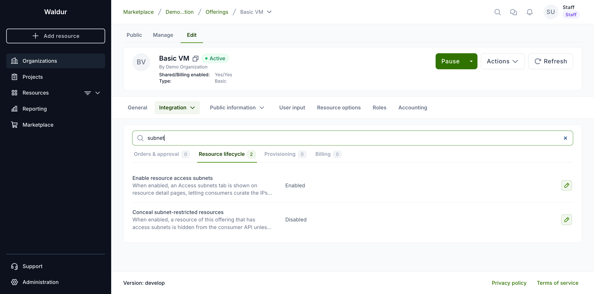
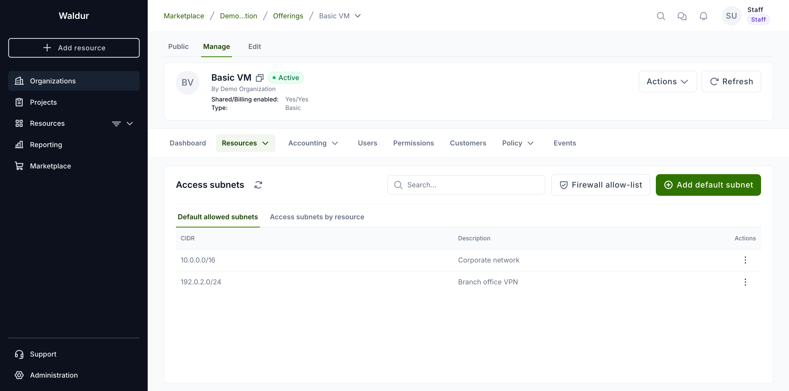
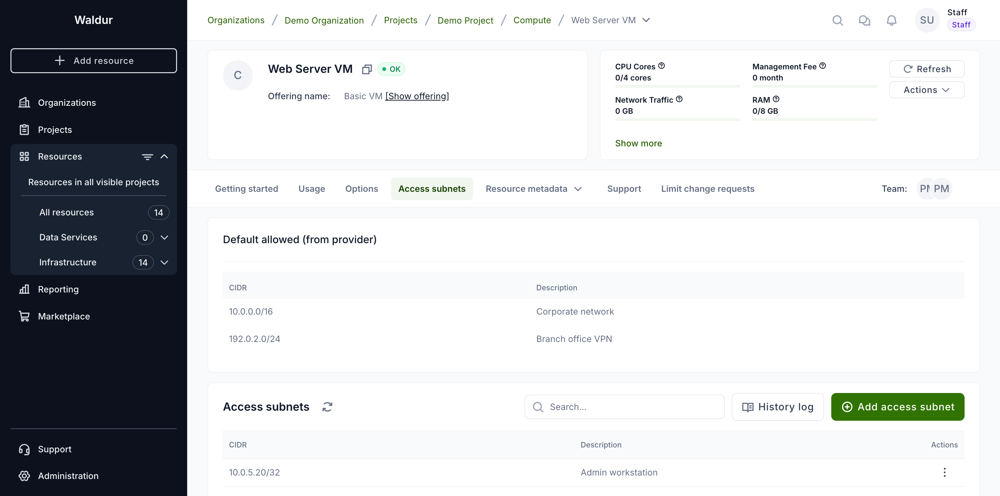
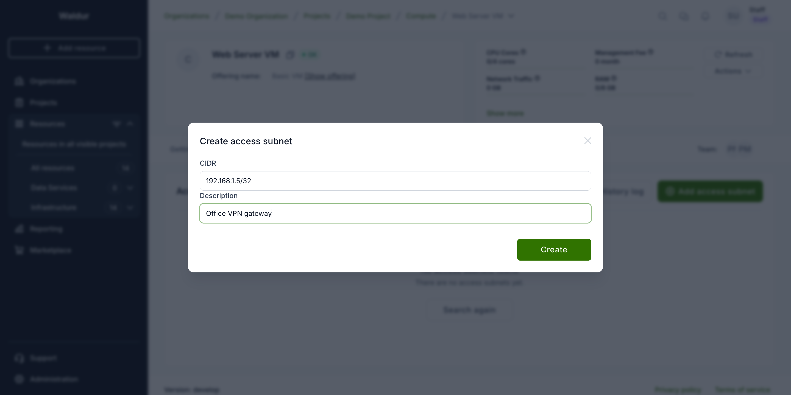
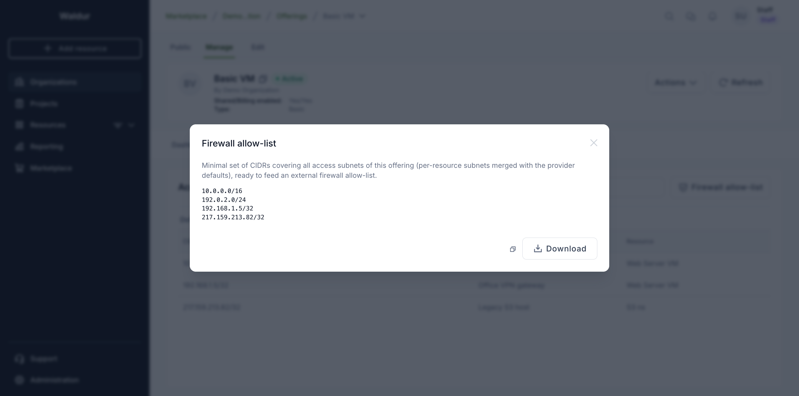

# Resource access subnets

Some offerings let you attach a list of **allowed access subnets** to each
resource — the IP addresses that should be allowed to reach the backend entity
the resource represents (for example the object storage bucket, database, or
virtual machine behind the resource). Consumers add single hosts (`/32`), and
the service provider can additionally publish wider **default** ranges on the
offering (see below).

Waldur itself does not block traffic based on this list. The subnets are
**advisory data**: they are published through the API so that an external
firewall (or the service provider's automation) can build an allow-list and
enforce it on the actual backend. Think of it as a curated allow-list that
travels with the resource.

## Enabling the feature (service provider)

Access subnets are available only for resources whose offering opts in. The
service provider enables it on their offering.

1. Open the offering and go to **Edit → Integration → Operations**.
2. Select the **Resource lifecycle** tab.
3. Turn on **Enable resource access subnets**.



Once enabled, every resource created from that offering shows an **Access
subnets** tab, and the offering's **Manage** view gains an **Access subnets**
tab. That view is a single table with two sub-tabs — **Default allowed subnets**
(the provider's own ranges, editable here) and **Access subnets by resource**
(a read-only roll-up of every resource's subnets) — plus a **Firewall
allow-list** button that shows the merged, collapsed list ready to copy or
download.

!!! note
    Editing this setting requires permission to manage the offering (the
    offering's service manager or the provider organization owner).

### Concealing restricted resources (optional)

By default the subnets are advisory only — Waldur stores and publishes them but
does not act on them. The **Resource lifecycle** tab has a second toggle,
**Conceal subnet-restricted resources**, that opts the offering into enforcement:

When it is on, a resource of this offering that has one or more access subnets is
**hidden from the consumer API** unless the caller's IP address is in that
resource's allow-list. The resource disappears from resource lists and returns
*not found* on direct access.

!!! warning
    This is the one place the feature changes Waldur's own behaviour. It applies
    to the **consumer** side only — service providers and the site-agent keep
    full visibility — and **staff and support are exempt**. Resources that have
    no access subnets are never concealed. Turn it on only if consumers are
    expected to reach the portal from the same networks listed in the allow-list,
    or you may lock them out of their own resources.

### Provider default subnets (optional)

Beside the per-resource entries curated by consumers, the service provider can
publish **default allowed subnets** on the offering — broader CIDR ranges
(`/24`, `/16`, …), not just single hosts. Manage them on the offering's
**Manage → Access subnets** view, under the **Default allowed subnets** tab
(use **Add default subnet**, or the row menu to edit or remove one).



These defaults:

- are shown **read-only to consumers** on each resource's **Access subnets** tab,
  above their own entries, so users see which networks are already allowed;
- **widen the concealment allow-list** — when concealment is on, a caller whose IP
  falls in a default range can reach the resource even without a matching
  per-resource `/32`;
- are **included in the exported firewall allow-list** (both the packed list and
  the command-line dump), merged with the per-resource subnets.

!!! note
    Provider defaults may be any CIDR width; consumer per-resource entries remain
    single hosts (`/32`). Only the provider can edit the defaults.

## Managing access subnets (organization owners and project teams)

Open a resource of an opted-in offering and select the **Access subnets** tab.
The tab lists the currently allowed subnets with their CIDR and a description.



To add an entry:

1. Click **Add access subnet**.
2. Enter the IP address as a `/32` CIDR (for example `192.168.1.5/32`) and an
   optional description such as the host or office it belongs to.
3. Click **Create**.



Use the three-dots menu on a row to edit or remove an entry. Changes are
recorded in the resource's history log.

!!! tip
    Only single IP addresses (`/32`) are accepted. A bare address such as
    `192.168.1.5` is treated as `192.168.1.5/32`.

Managing the list requires resource management permission — organization
owners, project managers, and project administrators can edit it. Other users
see the list read-only.

## Getting the allow-list

The allow-list — the per-resource subnets and the offering defaults, merged and
collapsed into the minimal set of CIDRs — is available three ways, all producing
the same result:

- **From the UI** — on the offering's **Manage → Access subnets** view, click
  **Firewall allow-list**. The dialog shows the merged CIDRs with **Copy** and
  **Download** actions.

    
- **From the API** — `GET /api/marketplace-provider-offerings/{uuid}/access_subnets/`
  returns `expanded` (every subnet with its resource, project and organization),
  `packed` (the merged allow-list), and `defaults` (the provider ranges). The
  raw per-resource entries are also available at
  `/api/marketplace-resource-access-subnets/` (filterable by `offering_uuid`),
  each carrying the resource's backend identifier so a firewall can map an entry
  to the backend it guards.
- **From the command line** — run the `resource_access_subnets` management
  command to dump the merged list, for one offering or all:

    ```bash
    # merged allow-list for a single offering
    waldur resource_access_subnets --offering <offering-uuid>

    # all offerings, written to a file
    waldur resource_access_subnets --output allow-list.txt
    ```

An external firewall typically pulls the API endpoint's `packed` list, or runs
the command on a schedule (e.g. via cron) and reloads the resulting file.

!!! warning
    Getting the allow-list does not change access on its own. Unless the offering
    enables **concealment** (above), Waldur only stores and publishes the
    subnets — the external firewall or provider automation that consumes the list
    is responsible for enforcing it on the backend.
