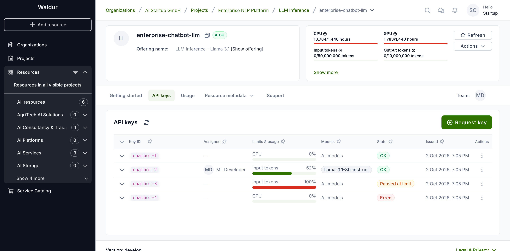
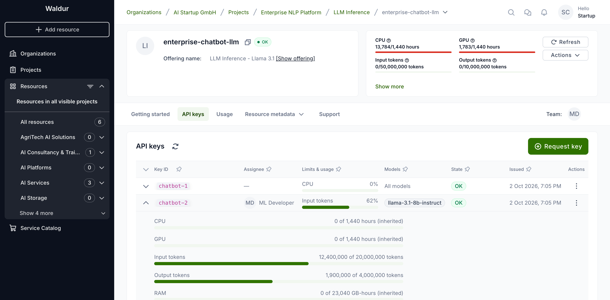
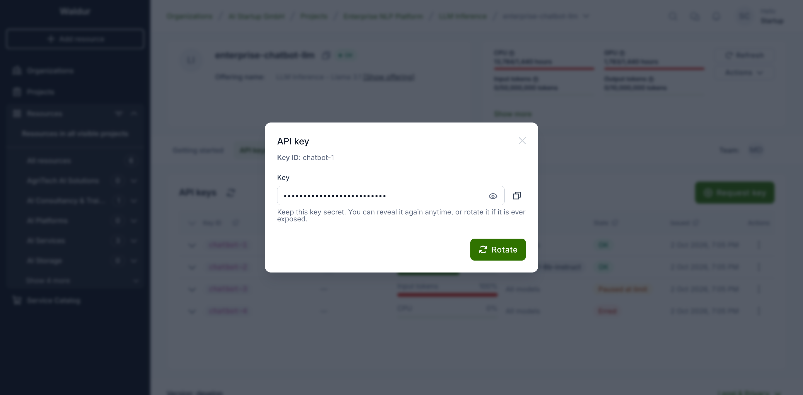
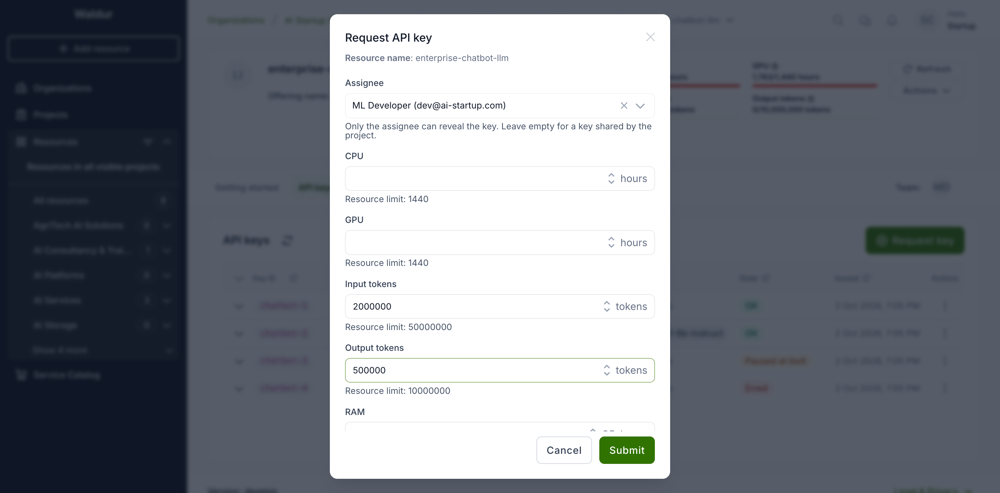
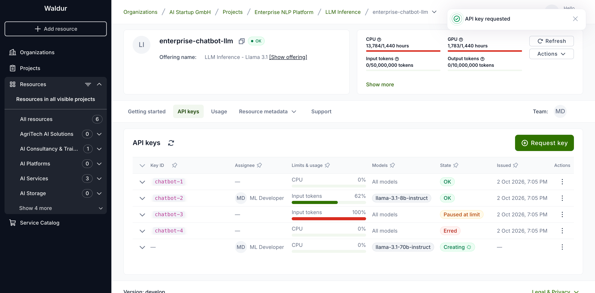
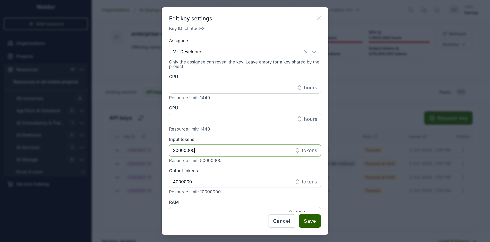
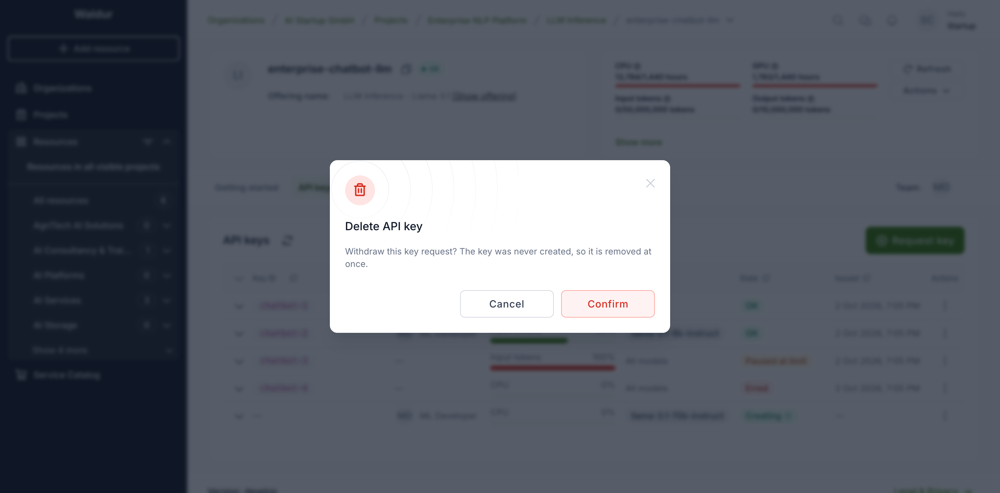
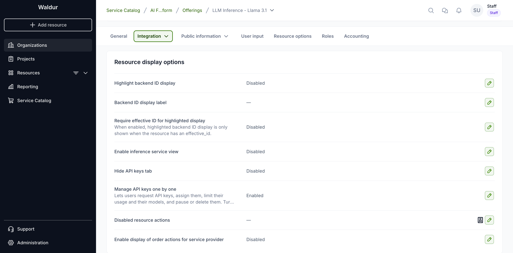

# Resource API keys

Some resources — inference services and other API gateways — are reached with an
**API key**. Waldur lists a resource's keys on its **API keys** tab. There you
can reveal and rotate a key, and, where the provider supports it, request new
keys, hand a key to one person, cap how much it may use, restrict it to some
models, and pause or delete it.

Waldur never generates key material itself. Every change is sent to the
provider's site agent, which carries it out on the backend and reports back. A
key therefore shows a transitional state (**Creating**, **Rotating**,
**Pausing**, **Resuming**, **Updating**, **Deleting**) until the agent confirms the change.

## The API keys tab

Open the resource and select the **API keys** tab.

Each row is one key:

- **Key ID** — the identifier the backend knows the key by.
- **Assignee** — the person the key belongs to, or a dash for a key shared by
  the project.
- **Limits & usage** — how much of its monthly limit the key has used, for the
  component closest to its limit.
- **Models** — the models the key may call, or **All models**.
- **State** — **OK**, **Paused**, **Paused at limit**, **Erred**, or a
  transitional state while a change is in progress.
- **Issued** — when the current key value was created or last rotated.

Expand a row to see every component. A limit marked *(inherited)* is the
resource's own limit: the key has no limit of its own for that component.

The **Actions** menu at the end of each row offers what the key's state allows.

## Revealing a key

Choose **Reveal** to see the key value. The value is masked until you click the
eye icon, and the copy button puts it on the clipboard.

Any member of the resource's project can reveal a shared key. A key with an
**assignee** can be revealed only by that person (and by staff and support).

!!! tip
    If a key may have been exposed, use **Rotate**. The backend issues a new
    value and the old one stops working. Anything using the key needs the new
    value afterwards.

## Requesting a key

Project managers and organization owners can request additional keys with
**Request key**:

1. Optionally choose an **Assignee** — only project members are offered. Leave
   it empty for a key shared by the project.
2. Optionally set **limits** per component. Each field shows the resource's
   limit; leave a field empty to let the key use up to the resource limit.
3. Optionally tick the **Models** the key may call. Leave all unticked to allow
   every model.
4. Click **Submit**.

The new key appears as **Creating** and turns **OK** once the provider has
created it. Its key ID is assigned at that point.

## Changing a key's assignee, limits and models

Choose **Edit key settings**. **Save** stays disabled until you change
something.

- The **assignee** can be changed at any time, except while the key is being
  deleted.
- **Limits** and **models** can be changed while the key is **OK** or
  **Paused**. On an active key the change is sent to the provider and the key
  shows **Updating** until it is applied. On a paused key the change is stored
  and applied when the key is resumed.

## Limits

Limits are **monthly** and enforced by Waldur:

- When a key's usage this month reaches one of its limits, Waldur pauses that
  key only. The resource and its other keys keep working. The key shows
  **Paused at limit**.
- A key paused at its limit is resumed automatically once it is under its
  limits again — when a new month begins, or when you raise or remove the limit
  that stopped it.
- If you resume such a key by hand while it is still over its limit, it is
  paused again on the next usage report.

!!! note
    Usage is reported by the provider periodically, so a key can go somewhat
    over its limit before it is paused.

## Pausing, resuming and deleting

- **Pause** stops the backend accepting the key. The key keeps its value, and
  **Resume** brings it back.
- **Delete** revokes the key at the backend. A deleted key disappears from the
  list, but the usage it reported still counts towards the resource.
- A requested key that has not been created yet can be withdrawn with
  **Delete**. It is removed at once, without waiting for the provider.

## When a change fails

If the provider cannot carry out a change, the key shows **Erred** and the row
keeps the error message. An erred key offers **Retry**, which repeats the failed
change, and **Delete**. A key whose settings update failed can also be corrected
with **Edit key settings**, which sends the update again.

## For service providers

Two options in the offering's **Integration → Resource display options**
control the tab:

- **Manage API keys one by one** turns on everything above apart from
  revealing, rotating and resuming: requesting keys, assignees, limits, model
  restrictions, pausing and deleting. It is available on site-agent offerings.
  Turn it on only if the backend behind the site agent supports per-key
  management, such as the Envoy AI Gateway. Other backends, such as Ceph S3,
  fail those actions.
- **Hide API keys tab** removes the tab from the offering's resources.

The models offered in the key dialogs are the choices of the offering's
`models` resource option, narrowed to the resource's own selection when it has
one. Without that option, the key dialogs show no model list.

!!! warning
    Without **Manage API keys one by one**, consumers can only reveal and rotate
    keys, and resume keys that were paused earlier. Per-key usage is not
    recorded, so limits are no longer enforced, but a key keeps its assignee:
    only that person can still reveal it. Project managers and organization
    owners can share such a key with the project again with **Unassign**.
