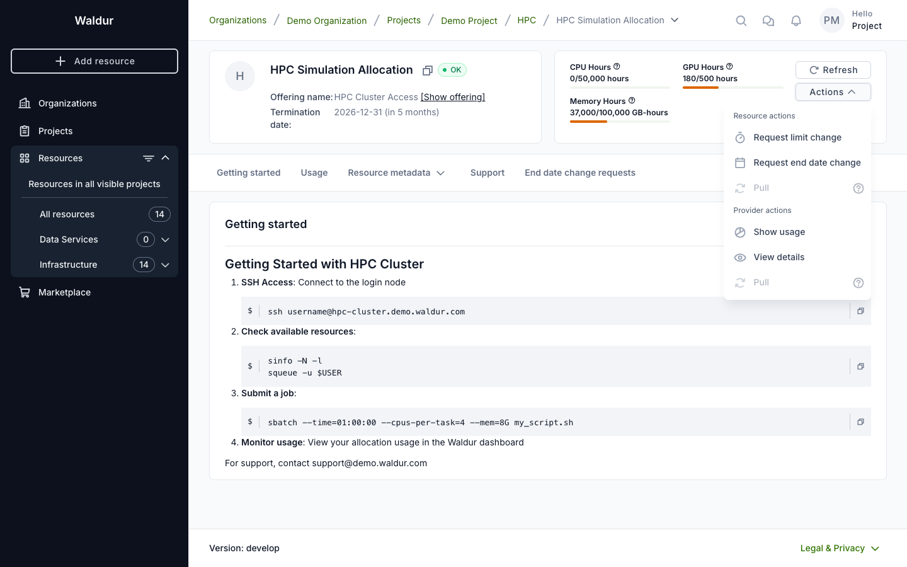
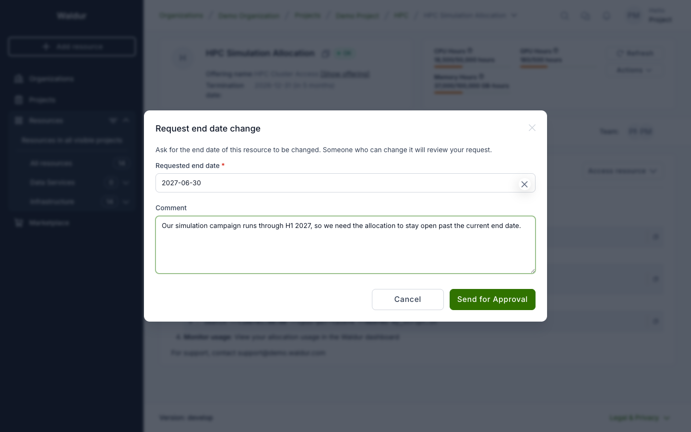
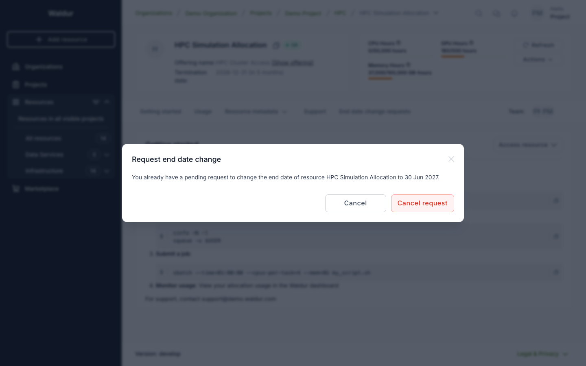
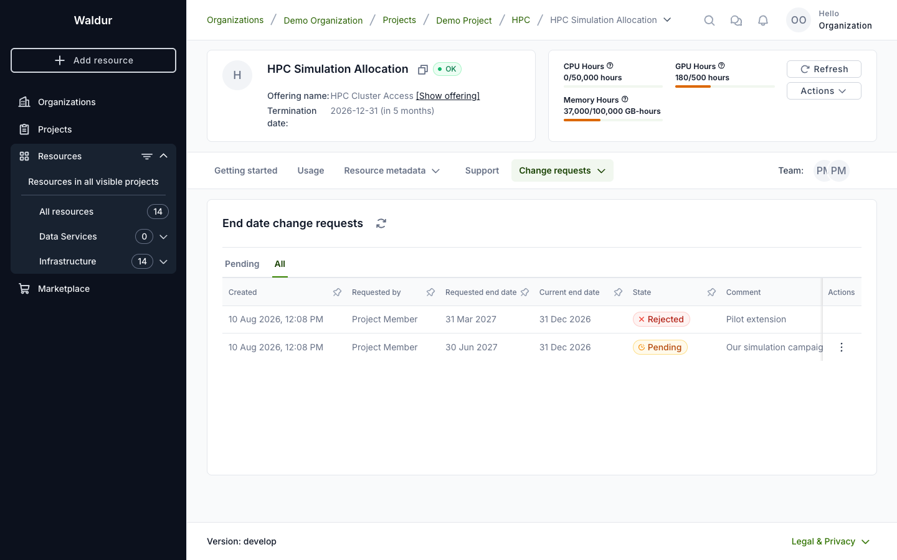
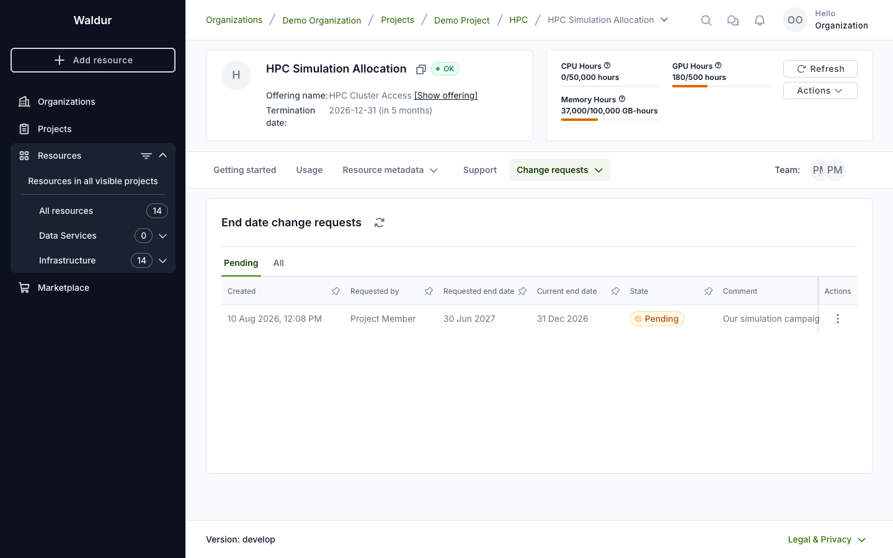
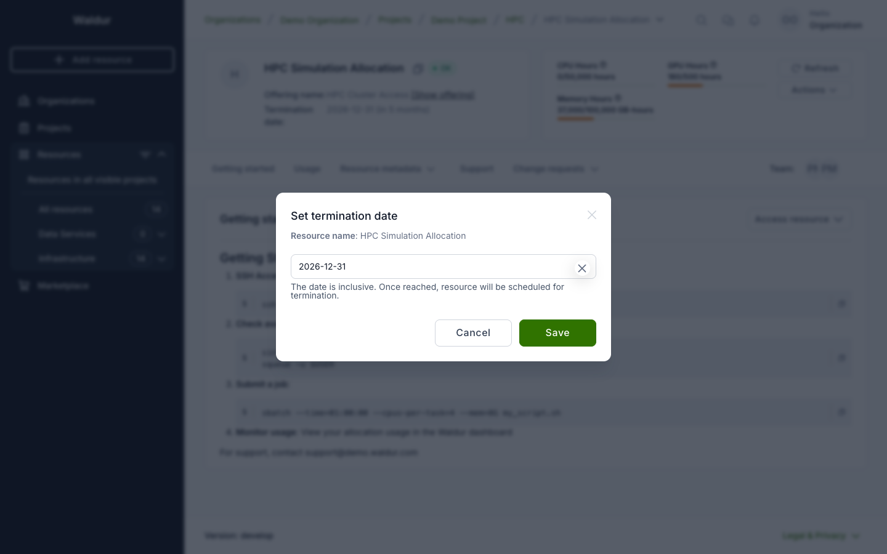
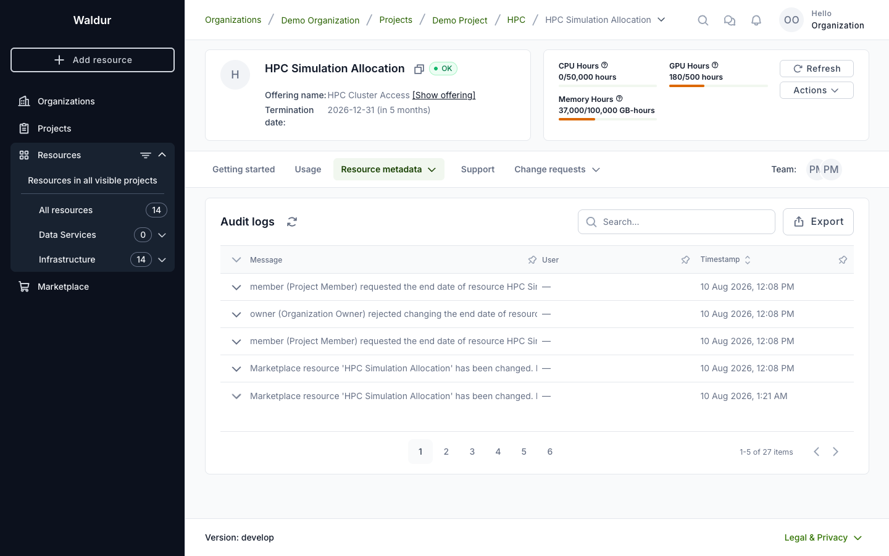
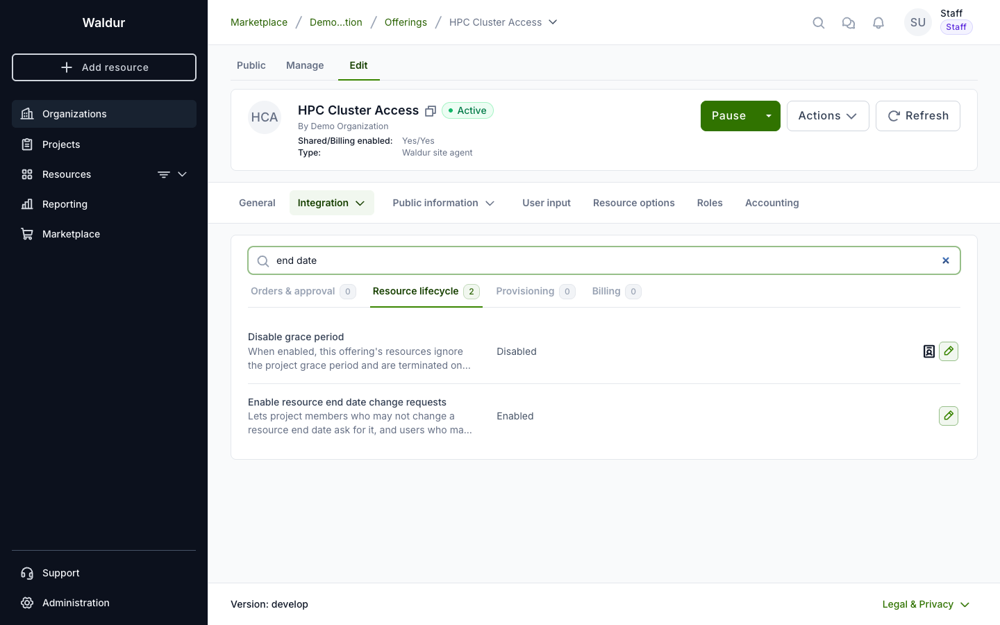

# Changing a resource end date

A resource's **termination date** (end date) decides when it is scheduled for
termination. Setting it takes one permission, and only that one. Everyone else —
project managers included — asks for the change, and someone holding the
permission decides.

| Who | What they see | What happens |
|-----|---------------|--------------|
| Holders of the end date permission (by default, organization owners) | **Set termination date** | The date changes immediately |
| Everyone else with access to the resource | **Request end date change** | A request is raised for someone to approve |

The request flow has to be enabled per offering. Where it is off, only the
permission holders have any end date action at all — the behaviour Waldur has
always had.

!!! note
    Prepaid offerings are not covered. They extend through **renewal**, which
    prices the extra period upfront — an arbitrary date would bypass that. The
    setting cannot be switched on for them.

## Asking for a change

Use **Actions → Request end date change** on the resource.

Pick the date you need and say why — the comment is what the approver reads when
deciding, so it is worth filling in.

You can have one open request per resource. Opening the action again shows the
pending one and lets you withdraw it if the date is no longer what you need.

## Following your request

Requests appear on the resource under **Change requests → End date**, or as an
**End date change requests** tab when the resource has no limit change requests
to group it with.

You see the requests on any resource you can see. **Pending** is shown first;
**All** keeps the history, so you can tell whether something was approved or
rejected and by whom.

Only someone who may decide gets the Approve and Reject actions on a row.

## Deciding a request

Approving **changes the end date immediately** — there is no further step and no
order to follow.

Rejecting closes the request and changes nothing. Either way the requester can
see the outcome under **All**.

A request is re-checked at the moment it is approved, not trusted from when it
was raised. If the date has become unacceptable in the meantime — the project
end date moved in, or the offering stopped accepting these requests — approval
is refused and the request stays pending.

## Setting the date directly

Holders of the end date permission use **Actions → Set termination date** and
the change applies on save.

They cannot raise a request instead: it would be an approval they could grant
themselves.

## What is recorded

Every step lands in the resource's audit log — who asked, for what date, and who
approved, rejected or withdrew it. A rejected request leaves a trace too, which
is the point of routing the change through a request rather than a silent edit.

## Enabling the flow (service provider)

Requests are off by default; every offering keeps the permission-only behaviour
until it opts in.

1. Open the offering and go to **Edit → Integration → Operations**.
2. Select the **Resource lifecycle** tab.
3. Turn on **Enable resource end date change requests**.

!!! note
    Editing this setting requires permission to manage the offering — the
    offering's service manager or the provider organization owner. It cannot be
    enabled on a prepaid offering.

## Approving outside Waldur

Requests are published as events, so an external approval system can take the
decision instead of a Waldur user — a purchasing or ticketing workflow, for
instance.

Such a system subscribes to the `resource_end_date_change_request` event type,
records its own reference on the request, and calls approve or reject when its
verdict is known. Nothing changes for the requester: they raise the request the
same way and see the same outcome.

!!! note
    Both routes stay open. A request can be decided in Waldur by anyone holding
    the permission even while an external system is still considering it.
