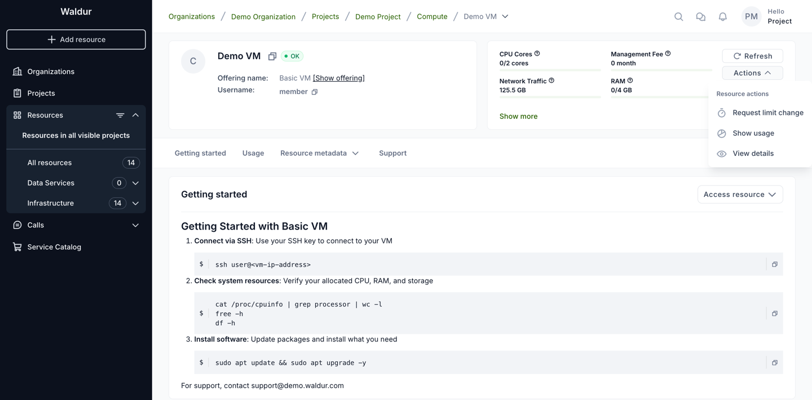
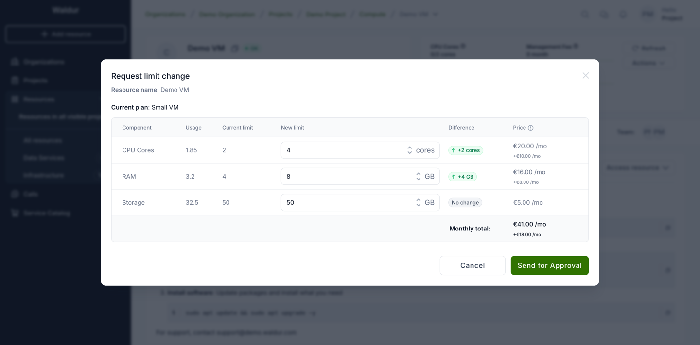
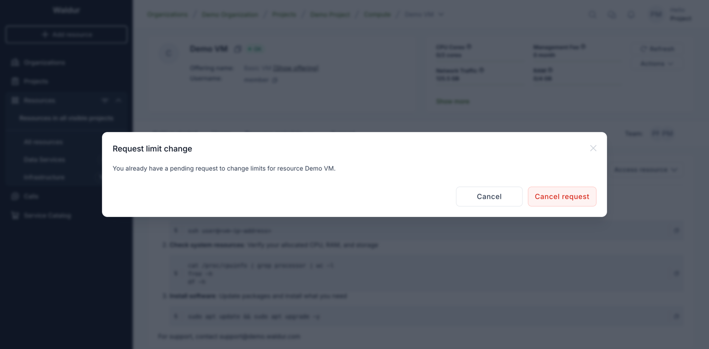
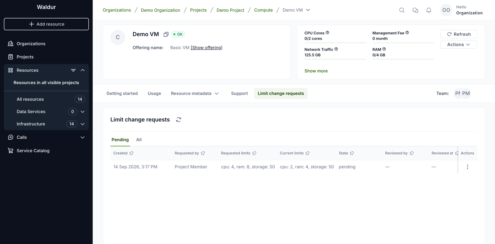
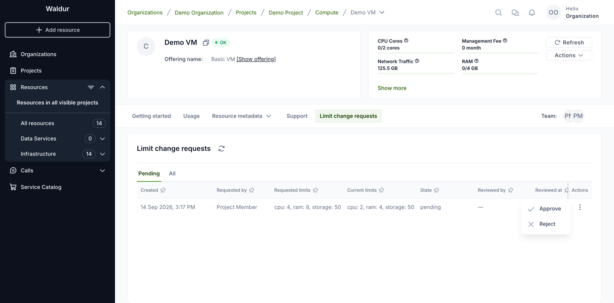
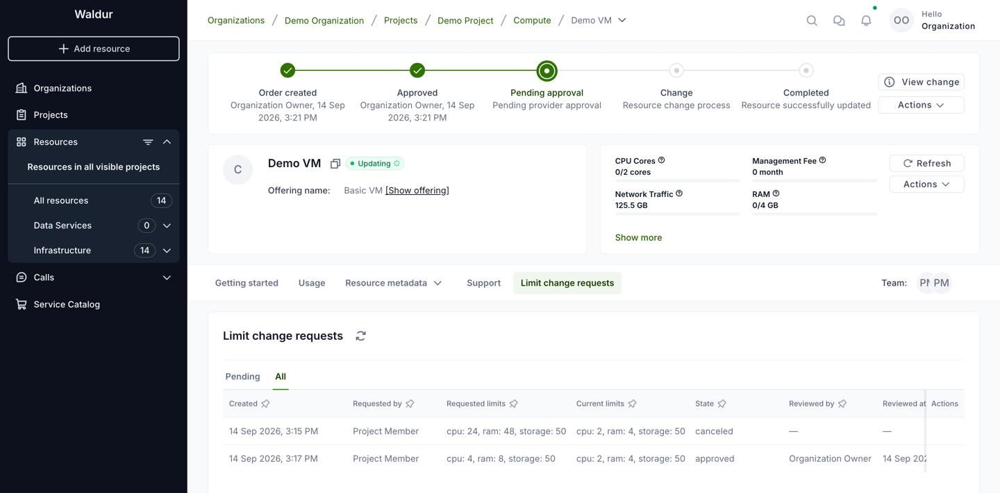
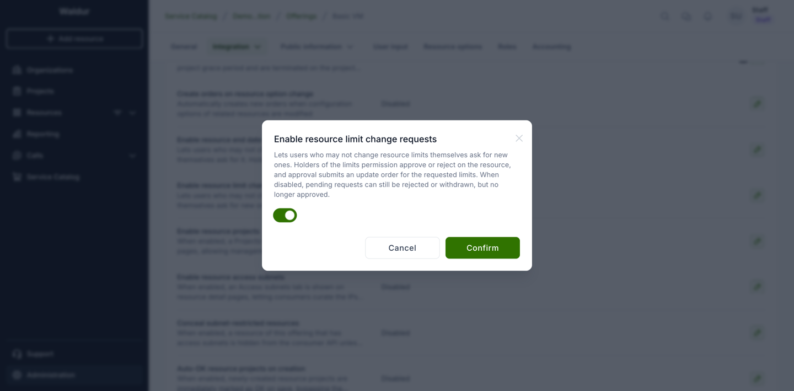
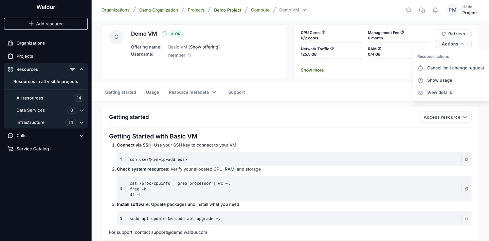
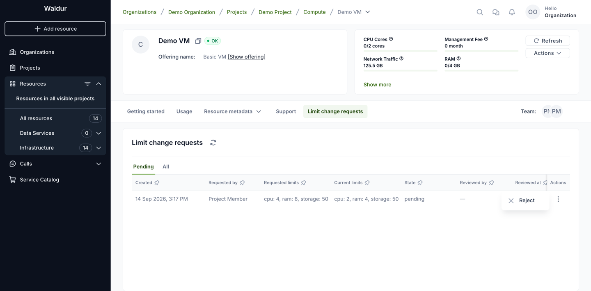

# Requesting resource limit changes

Changing a resource's **limits** directly takes two permissions: the limits
permission and the right to create orders in the project. Where an offering
enables it, users who can see the resource but lack them can ask for new limits
instead, and someone holding those permissions decides.

| Who | What they see | What happens |
|-----|---------------|--------------|
| Holders of the limits permission and order creation, staff and support | **Change limits** | An update order is submitted |
| Other users with access to the resource, on offerings that enable requests | **Request limit change** | A request is raised for someone to approve |

The request flow has to be enabled per offering — see
[Enabling the flow](#enabling-the-flow-service-provider). Where it is off, only
the permission holders have any limit action at all.

!!! note "Who this reaches with the default roles"
    With the default roles, everyone who can see a resource — organization
    owners, project administrators and project managers — already holds both
    permissions and changes limits directly. Requests matter for users who can
    see a resource without holding them: project members (a role that is
    switched off by default), resource-level roles, and custom roles a
    deployment defines.

## Asking for a change

Use **Actions → Request limit change** on the resource.

The action is offered on resources that have a plan and limit-based components.
It is enabled while the resource is in the OK state; on a resource without a plan
it is shown disabled.

The dialog shows the current plan, usage and limits. Set the new limits — the
difference and the resulting monthly price are shown per component — and submit
with **Send for Approval**.

You can have one open request per resource. Opening the action again shows the
pending one and lets you withdraw it with **Cancel request**.

There is no list of your own requests. You are emailed when a request is
approved or rejected, provided email notifications are enabled for your account.

## Deciding a request

Organization owners are emailed when a request is raised. Project administrators
and managers can decide requests too, but are not emailed.

Requests appear on the resource as a **Limit change requests** tab, or under
**Change requests → Limits** when end date change requests are shown on the
resource as well. The tab is shown to holders of the limits permission, staff
and support. **Pending** is shown first; **All** keeps the history.

Each pending row has **Approve** and **Reject** in its actions menu.

- **Approve** needs the limits permission and the right to create orders, and
  any role restriction the offering has. It submits an **update order** for the
  requested limits, in the approver's name. That order then follows the
  offering's usual approval flow — it may still wait for consumer or provider
  approval — so the limits change once the order has been processed, not at the
  moment of approval.
- **Reject** needs only the limits permission. It closes the request and changes
  nothing.

After approval the request is listed as approved under **All**, and the update
order's progress is shown at the top of the resource page — here it still waits
for the provider.

A request is re-checked when it is approved, not trusted from when it was
raised. Approval is refused, and the request stays pending, if the resource is
no longer in the OK state, the requested limits equal the current ones or are no
longer valid for the offering, or the offering stopped accepting these requests.

## What is recorded

Raising, approving and rejecting a request are recorded in the resource's audit
log.

## Enabling the flow (service provider)

Requests are off by default.

1. Open the offering and go to **Edit → Integration → Operations**.
2. Select the **Resource lifecycle** tab.
3. Edit **Enable resource limit change requests**, switch it on and confirm.

!!! note
    Editing this setting requires permission to manage the offering's
    integration, held by the provider organization's owners, service provider
    managers and offering managers.

## Switching the setting on and off

The setting decides whether **new** requests are accepted and whether pending
ones can be **approved**. It never cancels, rejects or approves anything by
itself, and switching it sends no emails.

| Situation | What happens |
|-----------|--------------|
| Switched on | **Request limit change** appears for users who cannot change limits directly, on resources with a plan and limit-based components. Pages that are already open pick it up on reload. |
| Switched off, nothing pending | The action and the **Limit change requests** tab disappear. |
| Switched off, requests pending | Pending requests are kept. The requester sees **Cancel limit change request** instead of the request action and can still withdraw it. Approvers keep the tab while requests are pending, with **Reject** only; approving is refused with *This offering no longer accepts limit change requests.* The tab disappears once nothing is pending. |
| Switched on again | Requests that stayed pending can be approved again — approval checks the setting at the moment of the decision. |
| Already approved requests | Their update orders are separate from the request and continue through the order flow whatever the setting says. |

When the setting is off and a request is still pending, the requester can only
withdraw it:

and approvers can only reject it:

Other points to keep in mind:

- **Direct changes are unaffected.** **Change limits** for users holding both
  permissions works the same with the setting on or off.
- **Child offerings follow their parent.** For an offering that belongs to a
  parent offering, the parent's setting applies.
- **Offerings imported from another Waldur keep the local choice.** Once set
  here, the setting is not overwritten when the offering is synchronized; if it
  was never set locally, it follows the remote offering.
- **Prepaid offerings are included.** Unlike end date change requests, limit
  change requests can be enabled on prepaid offerings.
- **Upgrade.** Offerings that had received limit change requests before the
  setting was introduced were switched on automatically, so resources using the
  flow keep it. Every other offering starts with it off.
