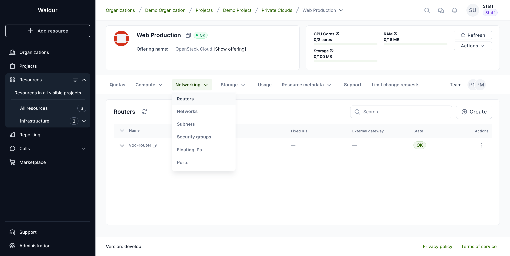
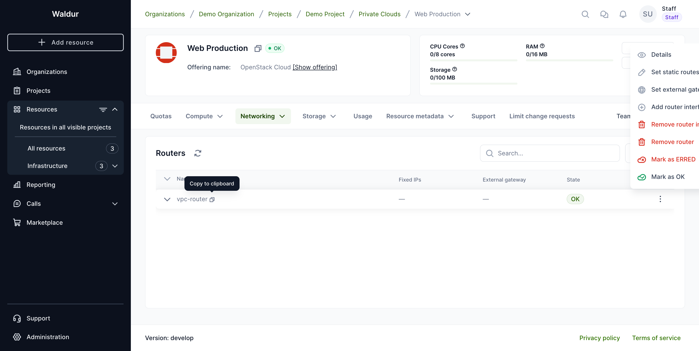
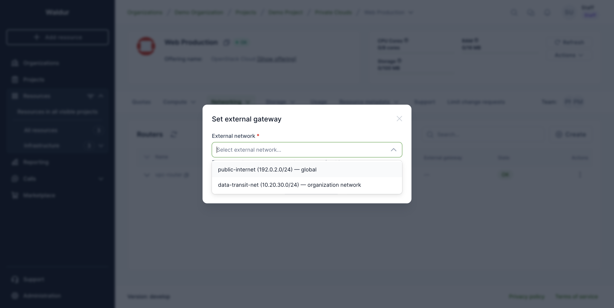
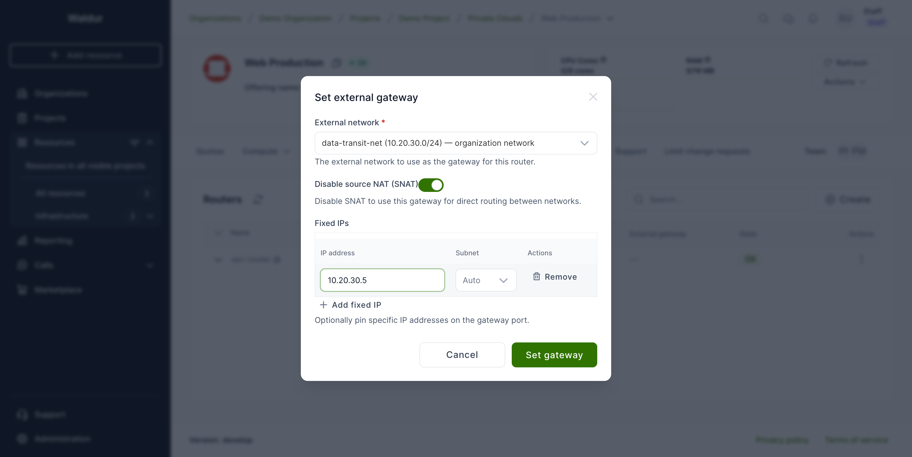
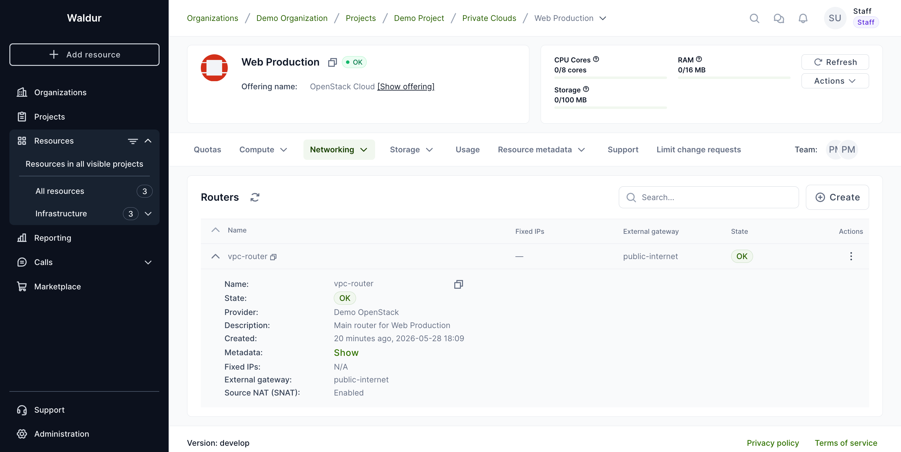
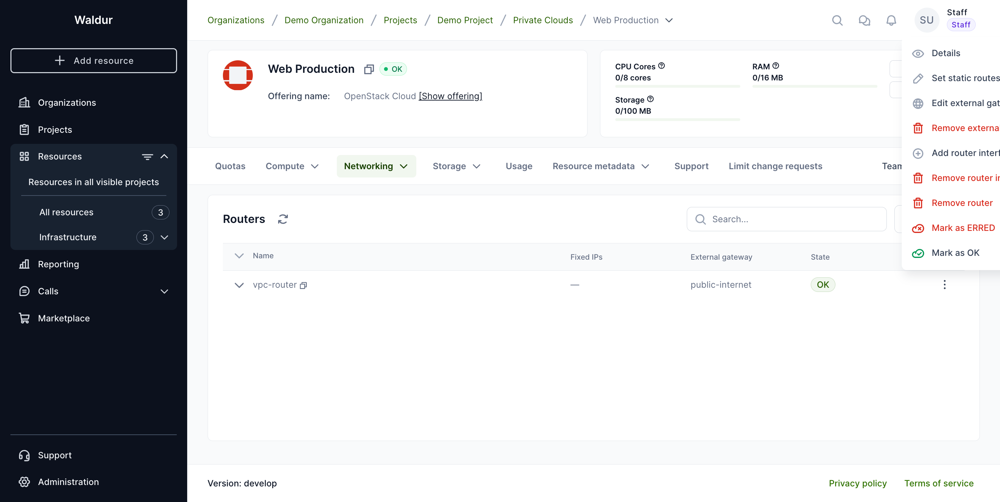
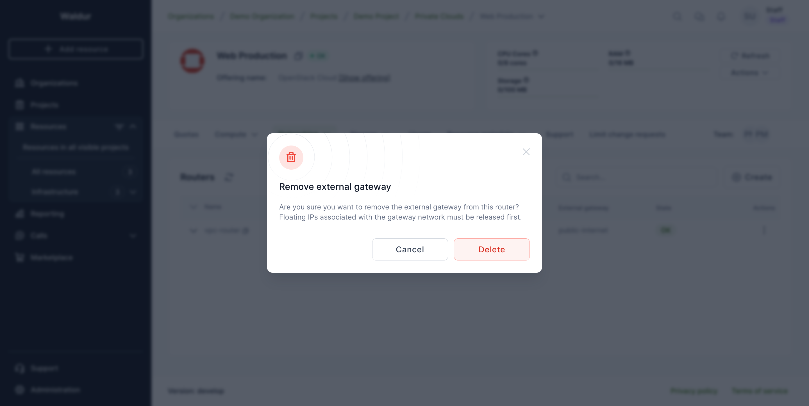

# Router external gateway management

OpenStack VPC routers can be connected to an **external network** to give the
tenant outbound connectivity and act as the entry point for floating IPs. A
router with an external gateway acts as the L3 boundary between the tenant's
private subnets and the outside world (or another tenant's network, when the
gateway is on an RBAC‑shared network).

This page describes how to set, edit, and remove the external gateway on a
router from the Waldur UI.

## Where to find it

Open the OpenStack tenant resource, then navigate to **Networking → Routers**.
The Routers table has an **External gateway** column showing the network
currently attached to each router as its gateway (or `—` when none is set).

## Setting an external gateway

Open the row's action menu (three‑dot icon at the end of the row) and choose
**Set external gateway**.

A dialog opens listing the networks that are available to this router's tenant
as an external gateway. There are two kinds:

- **Global** networks — provider‑owned external networks (typically the
  carrier‑grade or floating‑IP pool), available to every tenant on the
  platform.
- **Organization networks** — networks owned by another tenant that have been
  shared to your tenant via an `access_as_external` RBAC policy. Use these for
  controlled L3 interconnection between tenants or with an organization's
  off‑site infrastructure (dark fibre, MPLS, etc.).

Each entry shows the network name, its subnet CIDR(s), and which kind it is.

### Advanced options (organization networks only)

When you pick an **organization network**, two extra controls become available
that let you fine‑tune the gateway:

- **Disable source NAT (SNAT)** — by default the gateway translates source
  addresses (every outbound packet appears to come from the gateway IP).
  Disabling SNAT preserves the original source addresses so the gateway can be
  used as a direct routing hop between subnets. This is the typical
  configuration for inter‑tenant or site‑to‑site routing.
- **Fixed IPs** — pin one or more specific IP addresses on the gateway port,
  optionally tied to a particular subnet on the chosen network. Useful when
  the IP of the gateway must be predictable (peers' static routes,
  documentation, monitoring).

!!! note
    The advanced controls are deliberately not offered for **global** networks
    in the UI: pinning a fixed IP or disabling SNAT on a provider‑level
    network has system‑wide effects and is reserved for service‑provider
    operators. Choose an organization network if you need this level of
    control.

Click **Set gateway** to submit. The operation is scheduled and the router
moves through *Updating* before returning to *OK* with the new gateway in
place.

## Where the result appears

Once the gateway is set, it shows up in two places:

- The **External gateway** column in the Routers list — the network's name.
- The expanded **router summary** under the row, with extra detail: the
  gateway network, the SNAT state, and any pinned fixed IPs.

The action menu also changes once a gateway is present: **Set external
gateway** becomes **Edit external gateway**, and a **Remove external gateway**
entry appears.

## Removing the external gateway

Choose **Remove external gateway** from the row's action menu and confirm.

!!! warning
    A gateway cannot be removed while floating IPs are still allocated on the
    gateway network. **Release any floating IPs first**, then remove the
    gateway. Waldur will report an error rather than silently dropping
    in‑use floating IPs.

## Who can do what

The basic operation — set or remove the gateway, choose which network to use —
is available to anyone with router management permission on the project
(project administrator, project manager, organization owner, staff).

The **advanced options** (disabling SNAT or pinning fixed IPs) require
elevated access, evaluated per‑network:

| Network source | Who can set advanced options |
|---|---|
| **Global** external network | Service provider (or staff) |
| **Organization** (RBAC‑shared) network | An administrator or manager on the project that owns the source network (or staff) |

If you don't have the required permission for the advanced controls, the
basic gateway action still works — your request will simply be rejected if
you include unauthorised advanced fields.
