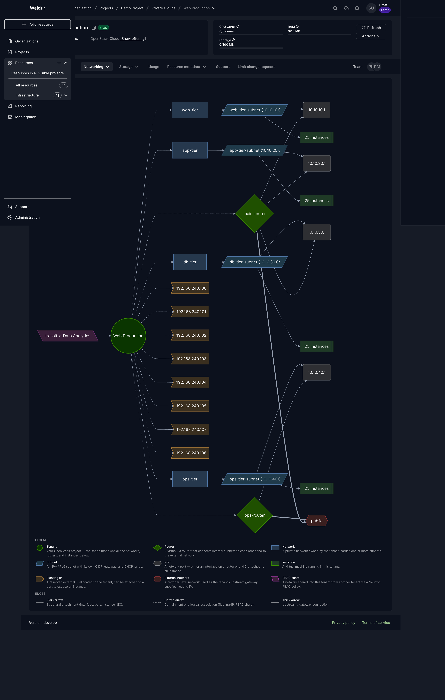

# Tenant network topology

The **Topology** tab in an OpenStack tenant gives you a single-screen view of
how the tenant's networking is wired together — routers, networks, subnets,
ports, instances, floating IPs, external networks and inbound RBAC shares —
rendered as a static diagram with a legend and per-node tooltips.

It is intended to answer questions like "which router does this subnet use as
gateway?", "which ports belong to which subnet?" or "which networks are shared
with us from another tenant?" without clicking through six separate tables.

## Where to find it

Open the OpenStack tenant resource and switch to **Networking → Topology**.
The tab is the first item under Networking.

## What the diagram shows

Each node represents an object in your tenant; each edge a relationship
between two objects. Both the **colour** and the **shape** encode the
object's type — the legend at the bottom of the panel is the visual key.

| Node type | Shape | What it represents |
| --- | --- | --- |
| Tenant | green circle | The tenant resource itself — the root of the diagram. |
| Router | green rhombus | An OpenStack router managed in this tenant. |
| Network | blue rectangle | An internal (private) network owned by the tenant. |
| Subnet | blue parallelogram | A subnet within an internal network (with its CIDR). |
| Port | grey rounded box | A network port — either a router interface or an instance NIC. |
| Instance | green subroutine box | A virtual machine running in this tenant. |
| Floating IP | orange asymmetric box | A floating IP allocated to the tenant (attached or free). |
| External network | red hexagon | A provider-level external network used as a gateway. |
| RBAC share | purple back-parallelogram | A network shared *into* this tenant from another tenant. |

Edges are styled by relation type:

| Arrow style | Meaning |
| --- | --- |
| **Plain arrow** | Structural attachment (interface, port, instance NIC). |
| **Dotted arrow** | Containment or a logical association (floating-IP, RBAC share). |
| **Thick arrow** | Upstream / gateway connection. |

## Hover for details

Hover over any node to see a tooltip with its key attributes. The cursor
changes to a help cursor (`?`) over nodes that carry extra information.

Examples of what each node type surfaces:

- **Tenant** — backend ID.
- **Router** — backend ID, whether an external gateway is set, SNAT state,
  external fixed IPs.
- **Subnet** — CIDR, gateway IP, IP version, connection status, backend ID.
- **Instance** — runtime state, state, flavor, backend ID.
- **Floating IP** — public address, external address, runtime state, the
  network it was allocated from.
- **RBAC share** — policy type, source tenant name, source-network UUID.
- **`N instances`** (collapsed cluster) — the count, plus a hint that the
  cluster was collapsed for readability and the **Instances** tab shows the
  detail.

## Aggregation for busy tenants

A tenant with more than a handful of instances on one subnet would render as
dozens of identical boxes — both slow and hard to read. When a subnet has
**more than 8 instance-bearing ports**, the diagram collapses the instances
and their ports into a single `N instances` node connected directly to the
subnet. The router interfaces themselves stay individually visible because
they carry routing information.

So a tenant with 100 VMs spread evenly across four subnets renders as four
clean `25 instances` boxes — not 100 separate instance nodes.

## When to use it

- **Debugging connectivity** — confirm at a glance that a subnet is attached
  to a router and that the router has an external gateway.
- **Reviewing inbound shares** — RBAC shares from other tenants appear
  explicitly as their own node and are linked into your tenant.
- **Documenting your VPC** — the diagram is a deterministic snapshot you
  can screenshot for handovers or change reviews.

!!! note
    The topology is a read-only view. To make changes, use the dedicated
    tabs (Routers, Networks, Subnets, Ports, Floating IPs) or the per-row
    actions on the relevant lists.

!!! tip
    The diagram is composed entirely from data that Waldur has already
    pulled from OpenStack — opening the tab does not trigger any extra
    Neutron calls. Refresh the page to re-fetch from Waldur's cached
    state; use **Pull** on the parent tenant resource if you want to
    refresh the cache itself.
