# VMware virtual machines

If your service provider offers VMware vSphere, you can order virtual machines from the
marketplace and manage them from Waldur: power, resize, disks, network adapters and console.
The provider sets the offering up as described in the
[VMware vSphere admin guide](../../admin-guide/providers/vmware.md).

## Ordering a virtual machine

1. Click **Add resource** in the sidebar, or open the offering in the **Service Catalog** and
   click **Request**.
2. Under **General information**, pick the organization and the project the VM belongs to.
3. Under **Plan**, pick a plan. The table below it shows what each component costs per month.

    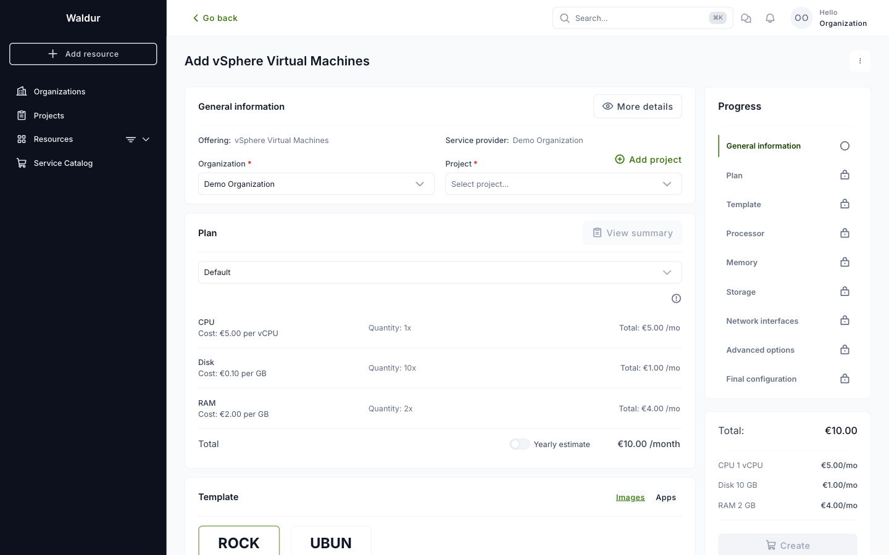

4. Under **Template**, pick the operating system image. The template's hardware fills in the
   **Processor**, **Memory** and **Storage** steps.
5. Adjust the number of cores, cores per socket and memory if needed. The sliders stop at the
   maximums the provider allows. The storage size and guest OS come from the template; add
   more disks after the VM is created.

    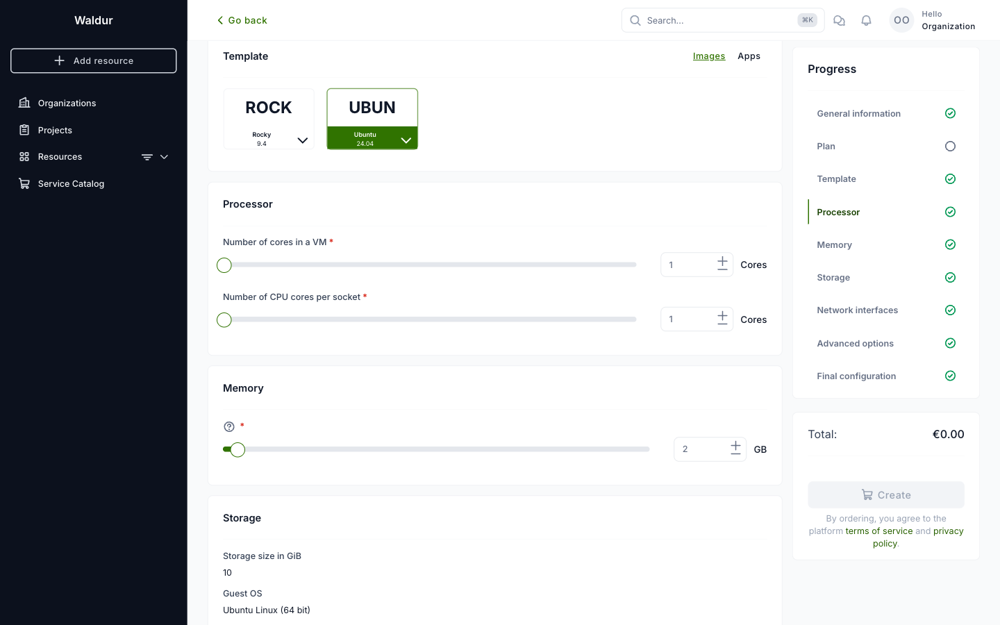

6. Under **Network interfaces**, tick the networks the VM should be connected to. Only the
   networks your organization is allowed to use are listed.
7. **Advanced options** lets you pick a cluster, datastore and folder. Leave them empty to use
   the provider's defaults. Your provider may hide these options.

    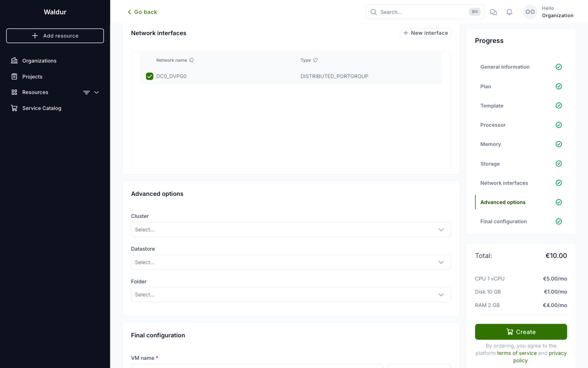

8. Under **Final configuration**, enter the **VM name**, an optional description and an
   optional termination date. The name is also the VM's name in vCenter.

    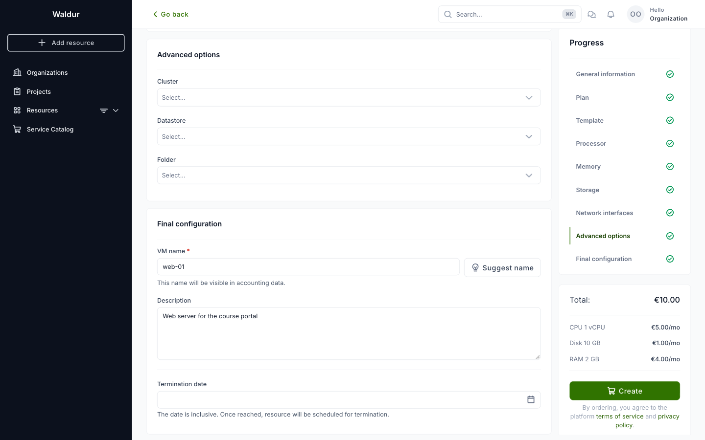

9. Check the monthly total on the right and click **Create**, then confirm.

The VM is deployed from the template and starts out **powered off**. The resource page opens
once provisioning finishes.

!!! note
    Depending on the organization's settings, an order may need approval before it is
    provisioned. See [Resource management](resource_management.md).

## The resource page

The badge next to the VM name shows its power state: **Powered on**, **Powered off** or
**Suspended**. The panel on the right shows the VM's CPU, RAM and disk limits, which are
what you are billed for. The **Details** menu switches between the VM's **Disks** and
**Network adapters**.

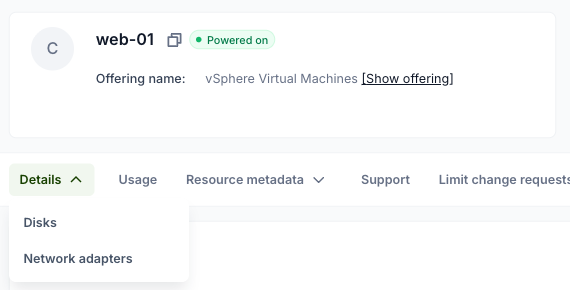

All VM operations are in the **Actions** menu. An action that cannot run right now is greyed
out; hover over its question mark to see why.

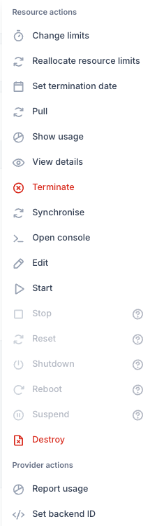

## Power operations

| Action | Effect | Available when |
|--------|--------|----------------|
| **Start** | Powers the VM on; also resumes a suspended VM. | Powered off or suspended |
| **Stop** | Powers the VM off immediately, like pulling the plug. | Powered on or suspended |
| **Reset** | Hard-resets the VM. | Powered on |
| **Suspend** | Saves the VM's memory to disk and pauses it. | Powered on |
| **Shutdown** | Asks the guest OS to shut down cleanly. | Powered on, VMware Tools running |
| **Reboot** | Asks the guest OS to restart cleanly. | Powered on, VMware Tools running |

**Shutdown** and **Reboot** go through VMware Tools inside the guest. If the template has no
VMware Tools, or they are not running yet, use **Stop** and **Reset** instead.

## Changing CPU and memory

1. **Stop** the VM. vCenter changes CPU and memory only while the VM is powered off.
2. Choose **Actions → Change limits**.
3. Enter the new number of vCPUs and the memory in GB. The **Difference** and **Price** columns
   show what changes on your bill.

    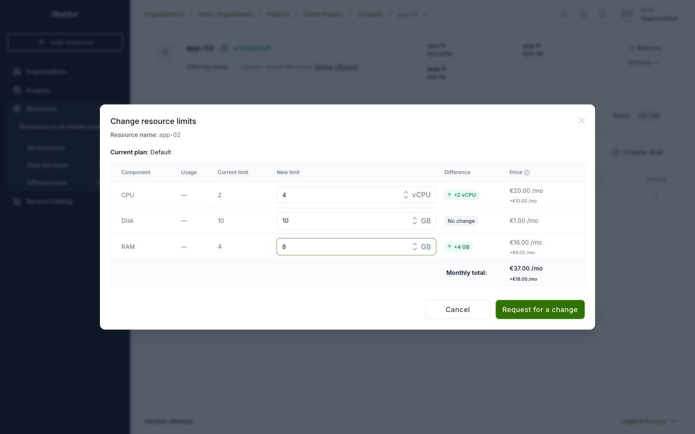

4. Click **Request for a change**, then **Start** the VM again.

The **Disk** row reflects the total size of the VM's disks and cannot be changed here. Use
the disk actions below instead.

## Disks

The **Disks** tab lists the VM's disks with their size and state.

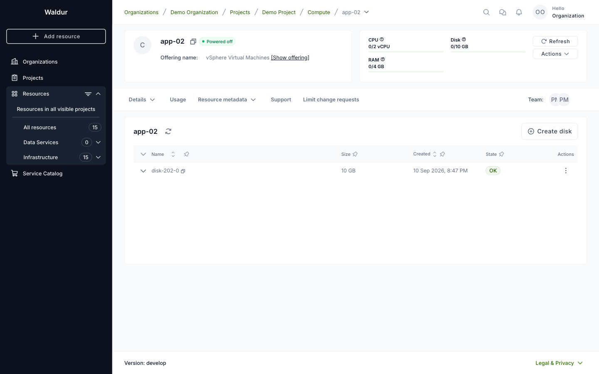

- **Add a disk**: click **Create disk**, enter the size in GB and click **Submit**.

    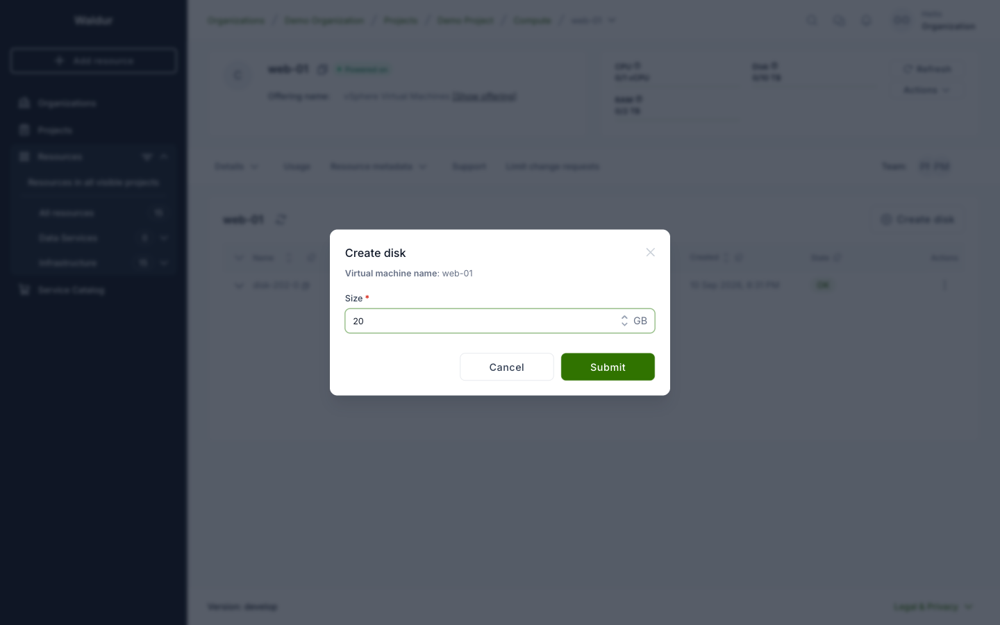

- **Extend a disk**: open the disk's **⋮** menu, choose **Extend** and enter the new, larger
  size. Then grow the partition and file system inside the guest OS.

    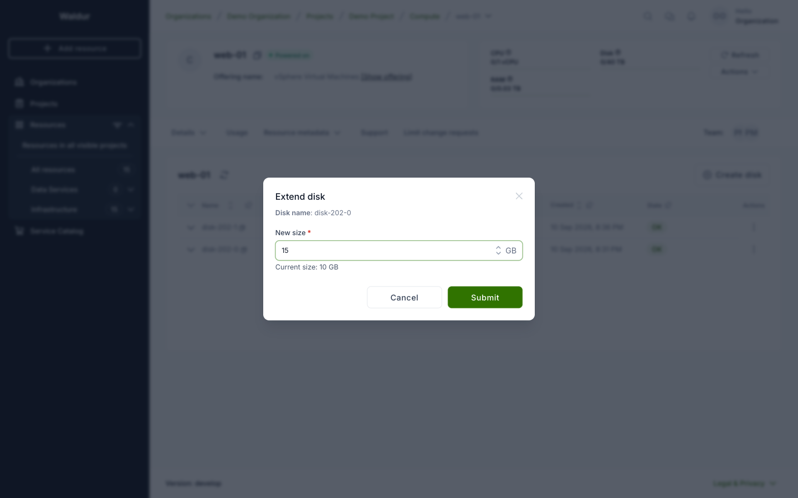

- **Delete a disk**: open the disk's **⋮** menu and choose **Destroy**. The disk and its data
  are deleted in vCenter.

A disk cannot be shrunk. The provider may cap the size of a single disk and the total size of
all disks of a VM; a request over either cap is refused with a message saying which one.

### When a change fails

Disk and adapter changes are carried out by vCenter after Waldur accepts them: a new disk is
listed as **Creation scheduled** and turns **OK** once vCenter has added it. If vCenter
refuses the change, the disk turns **Erred** instead. Hover over the **Erred** badge, or
expand the row, to see the error vCenter returned.

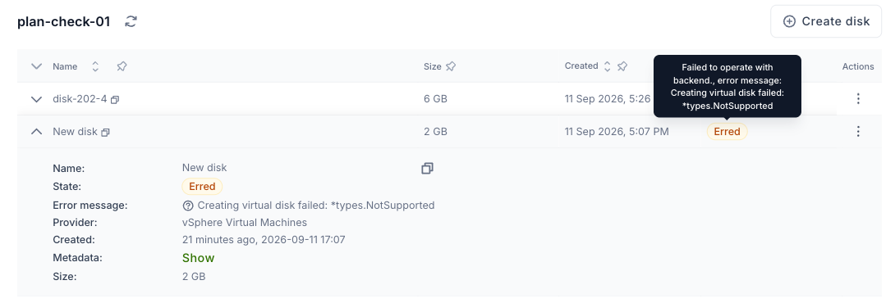

An Erred disk that vCenter never created can be removed with **Destroy** in its **⋮** menu.
If the reason is not clear from the message, contact your provider's support with it.

## Network adapters

The **Network adapters** tab lists the VM's adapters with their network and MAC address.

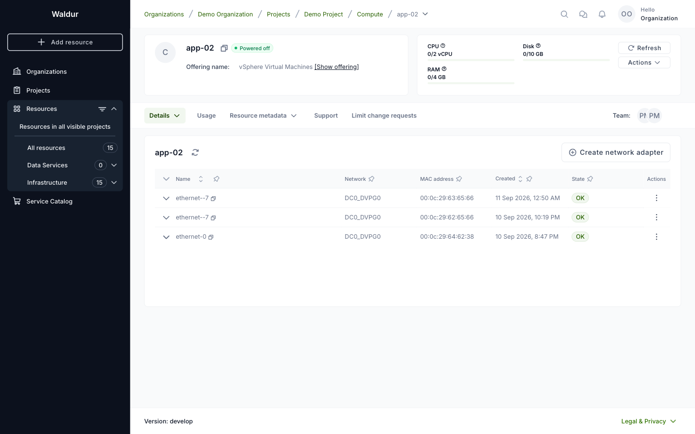

To connect the VM to another network, click **Create network adapter**, pick the network and
click **Submit**. Only networks the provider has enabled for your organization are offered,
and a VM can have at most 10 adapters.

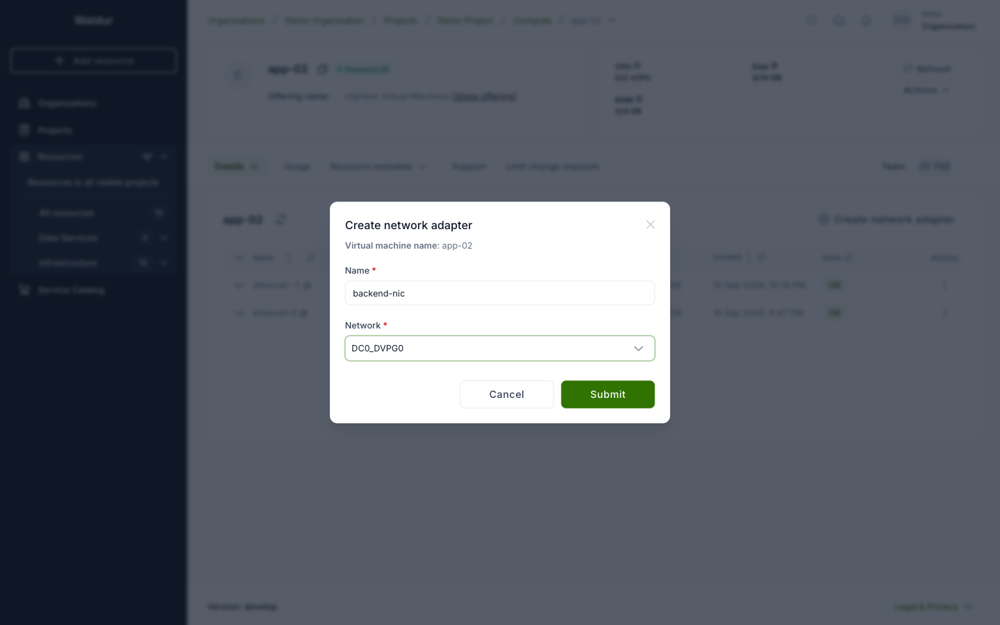

The list shows each adapter under the label vCenter gives it (for example *Network adapter
2*), not the name entered in the dialog.

## Console

**Actions → Open console** opens the VM in VMware Remote Console (VMRC), which must be
installed on your computer. Waldur hands VMRC a one-time ticket, so you do not need a vCenter
account. Your computer must be able to reach the vCenter address the provider configured.

## Terminating a virtual machine

1. **Stop** the VM. A VM is deleted only while it is powered off.
2. Choose **Actions → Terminate** and confirm with **Request for a termination**.

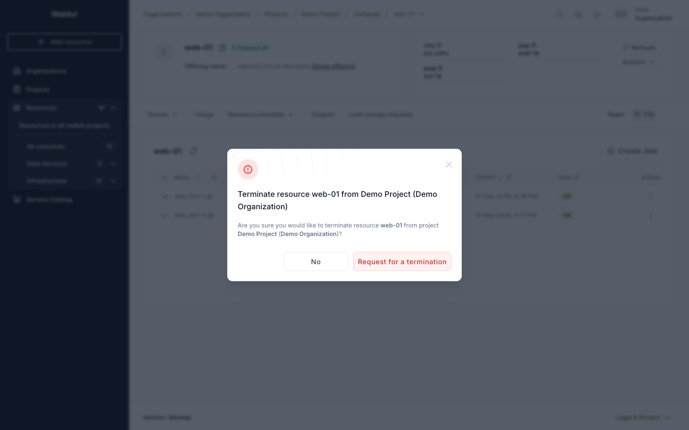

The VM and all its disks are deleted from vCenter, and billing stops.

!!! warning
    Termination cannot be undone. Copy any data you need off the VM first.

!!! tip
    The **Destroy** action in the same menu also deletes the VM, but directly, without a
    termination order. Use **Terminate**: it goes through your organization's approval
    settings and is recorded in the order history.
