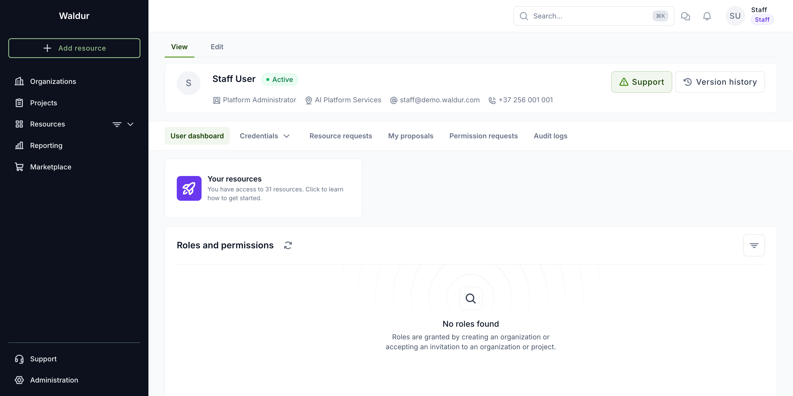
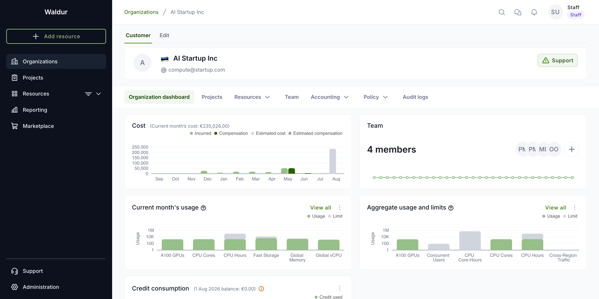
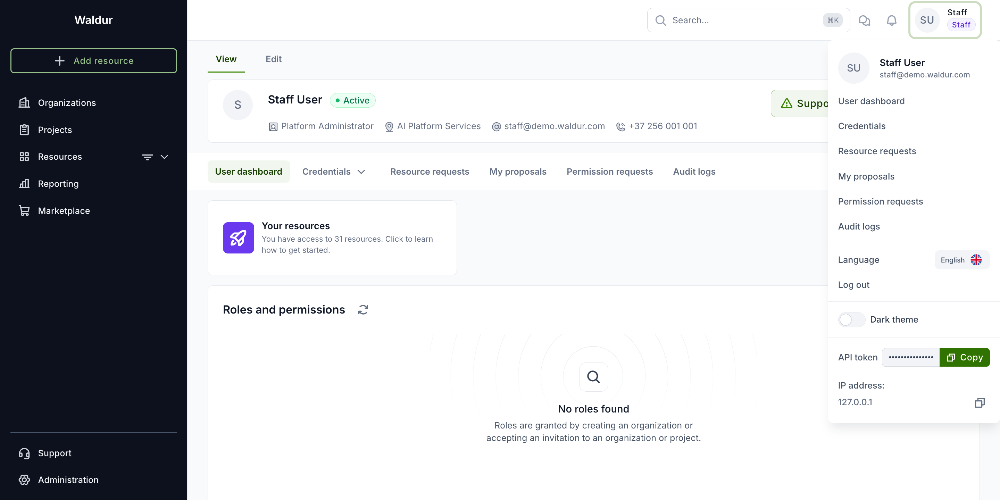
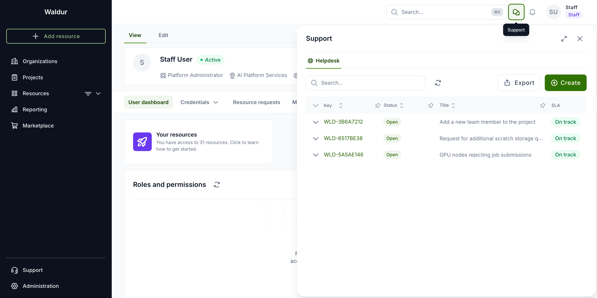

# Interface introduction

This page is a tour of the Waldur interface: what each part of the screen is for, and where to
find the things you will use most often.

## The main screen

After signing in you land on your **user dashboard** — a summary of your profile, the resources
you can reach and the roles you hold.

Three areas make up every page:

- **Sidebar** (left) — your main working tool. **Organizations** and **Projects** list the ones
  you belong to, **Resources** filters everything you have access to, and **Reporting**,
  **Marketplace**, **Support** and **Administration** appear according to your role.
  **Add resource** at the top starts an order.
- **Top bar** — search (`⌘K` or `Ctrl+K`), the support drawer, pending tasks, and your user menu.
- **Workspace** — the page content itself, with its own menu of tabs just underneath the title.

## Organization and project workspaces

Selecting an organization or a project switches the workspace to it. The tabs under the name are
scoped to that object — for an organization: its dashboard, projects, resources, team, accounting
and policies.

!!! note
    Which tabs you see depends on your role. Organization-level tabs are only available if you
    hold a role in that organization; a project member sees the project workspace instead.

## User menu

Click your name in the top-right corner to open the user menu.

| Entry | What it is for |
|-------|----------------|
| **User dashboard** | Your profile, resources and roles |
| **Credentials** | Password, SSH keys and personal access tokens |
| **Resource requests** | Resources you have requested |
| **My proposals** | Proposals you have submitted to calls |
| **Permission requests** | Requests to join an organization or project |
| **Audit logs** | A record of your own actions |
| **Language**, **Dark theme** | Interface language and colour mode |
| **API token** | Your token for the REST API, with a copy button |

## Getting help

The speech-bubble icon in the top bar opens the **Support** drawer: your requests, their status,
and a **Create** button for raising a new one — without leaving the page you are on.

The bell icon beside it opens **Pending tasks**, listing the confirmations waiting on you — orders
to approve, invitations to accept, requests to review. It is empty when there is nothing to act on.
