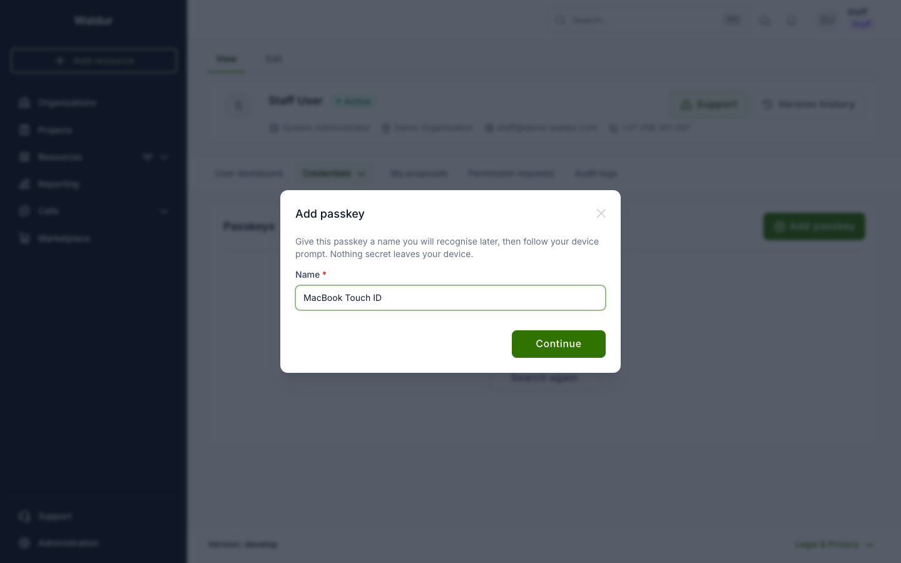
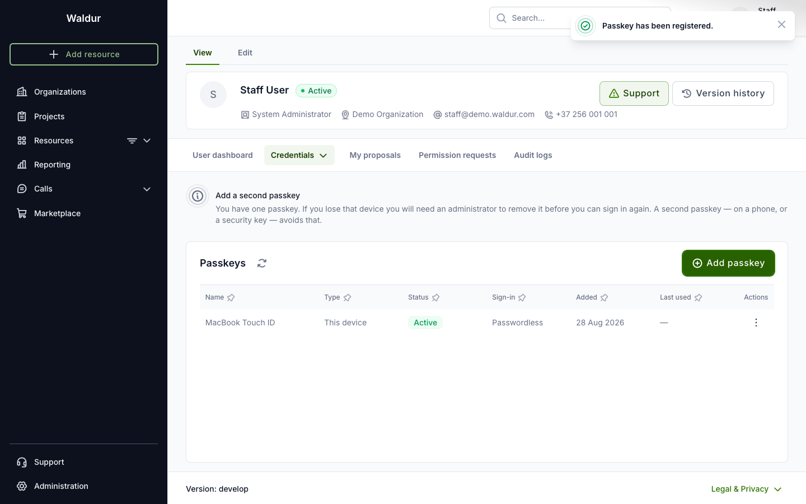
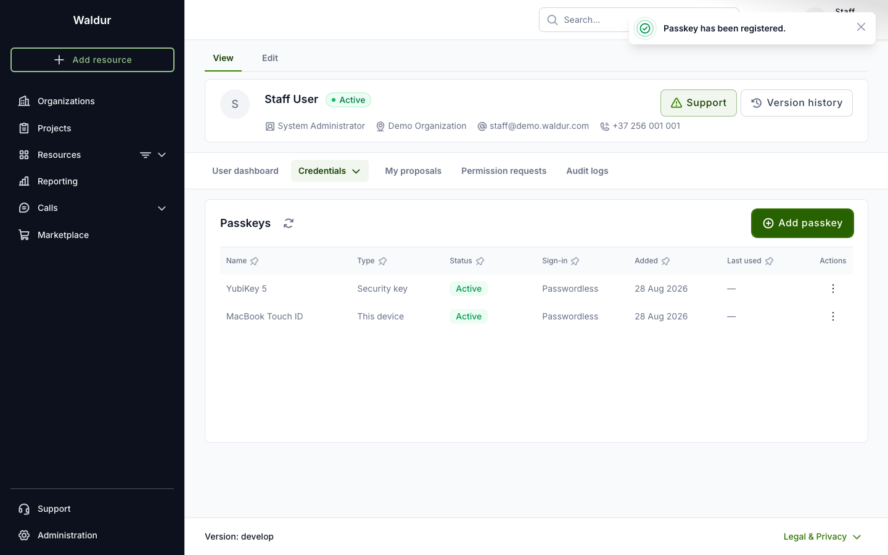
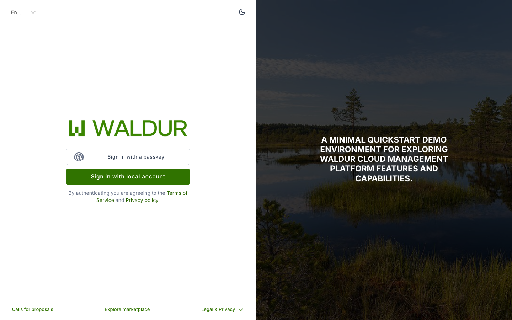
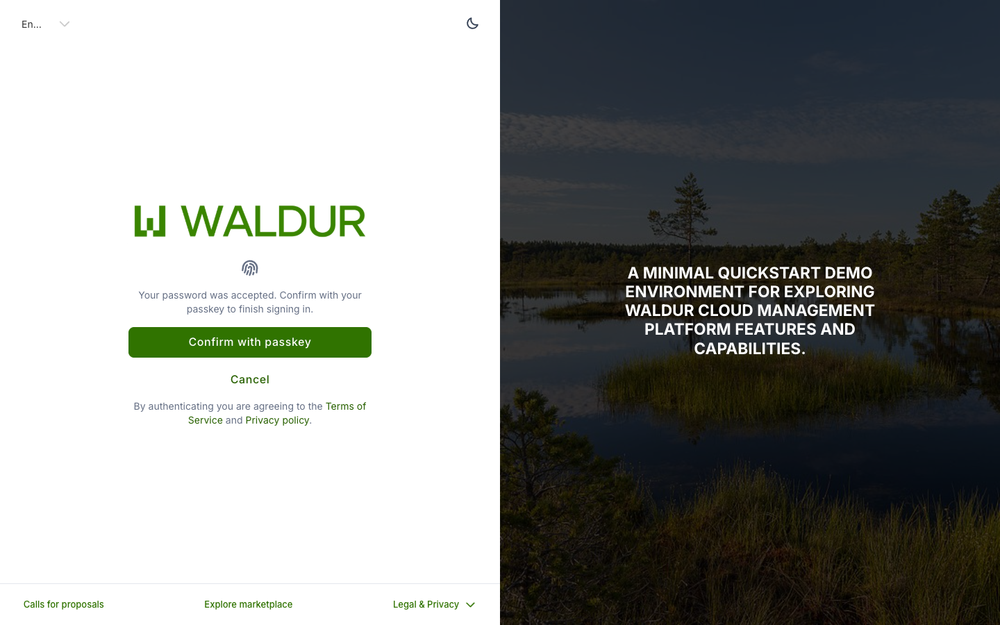

# Passkeys

A passkey lets you sign in with your device — a fingerprint, your face, your
screen lock, or a security key — instead of typing a password. Nothing secret
leaves your device, and a passkey cannot be phished: it only works on the site
it was created for.

## Prerequisites

- An administrator must have enabled passkeys for your deployment. If the
  **Passkeys** section is not in your profile, they have not.
- A device with an authenticator: Touch ID or Face ID on Apple devices,
  Windows Hello, an Android screen lock, or a USB security key.

## Adding a passkey

1. Go to **Profile > Credentials > Passkeys**.

2. Click **Add passkey**.

3. Give it a name you will recognise later — "MacBook Touch ID" is more useful
   than "passkey 1", especially once you have two.

    

4. Follow the prompt from your browser or operating system.

The new passkey appears in the list with the type of authenticator, whether it
can be used for passwordless sign-in, when it was added and when it was last
used.

!!! tip "Add a second one"
    If you lose the only device holding your passkey, you will need an
    administrator to remove it before you can sign in again. A second passkey
    — on your phone, or a security key you keep somewhere else — avoids that.
    Waldur reminds you while you have only one — the reminder disappears once
    you add another.

## Signing in

How you sign in depends on what your administrator enabled.

### Passwordless

On the login page, choose **Sign in with a passkey**. There is no username and
no password: your browser offers the passkeys it holds for this site, and you
confirm with your device.

### As a second step after your password

Enter your username and password as usual. Instead of signing you straight in,
Waldur asks you to confirm with your passkey. Your password alone does not
produce a working session.

## Renaming and removing

From **Profile > Credentials > Passkeys**, the menu on each row lets you:

- **Rename** it — useful when "security key" stops being distinguishable from
  your other security key.
- **Revoke** it — the passkey stops working immediately and cannot be
  restored. The entry stays in the list, marked revoked, so the history is
  visible.

## If you lose a device

Ask an administrator to revoke the passkey on that device. They must record a
reason, and you can see it in your own audit log under **Profile > Audit
logs**.

If you have another passkey, carry on using it. If it was your only one and
your account requires a passkey, you will be asked to add a new one before you
can continue.

## Troubleshooting

**The browser shows a QR code and asks about a phone, with no fingerprint
option.** That is the prompt for signing in with a passkey held on *another*
device. It appears when this device has no passkey for Waldur yet. Sign in
with your password first and add one from your profile.

**The prompt appears and immediately closes.** Usually the prompt was
dismissed, or the browser refused it. Waldur will say which; try again, and if
it keeps happening, check with your administrator that the site address
matches the one passkeys are configured for.

**A passkey is listed as "Unusable".** It was created for a different site
address than the one you are on now. It cannot be recovered — remove it and
add a new one.

**A passkey is listed as "Second factor only".** Uncommon — it means your
device reported that it created a credential it cannot look up on its own, so
it cannot be used for passwordless sign-in. It still works as a second step
after your password. Add another passkey, on a different device, if you want
passwordless.
