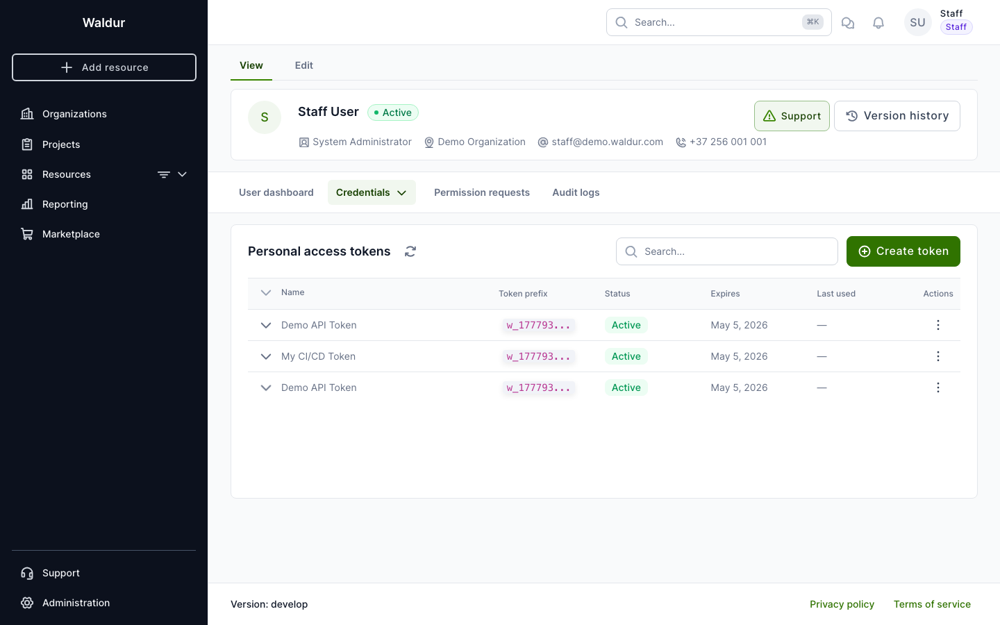
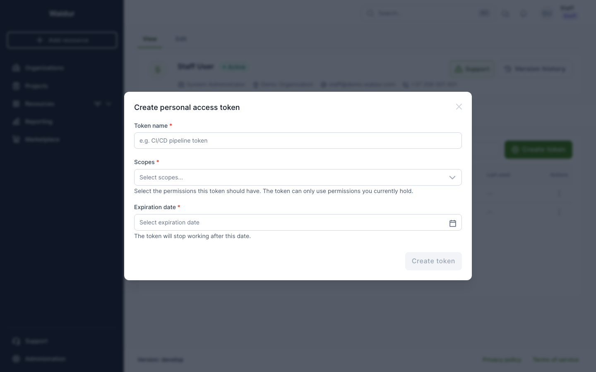
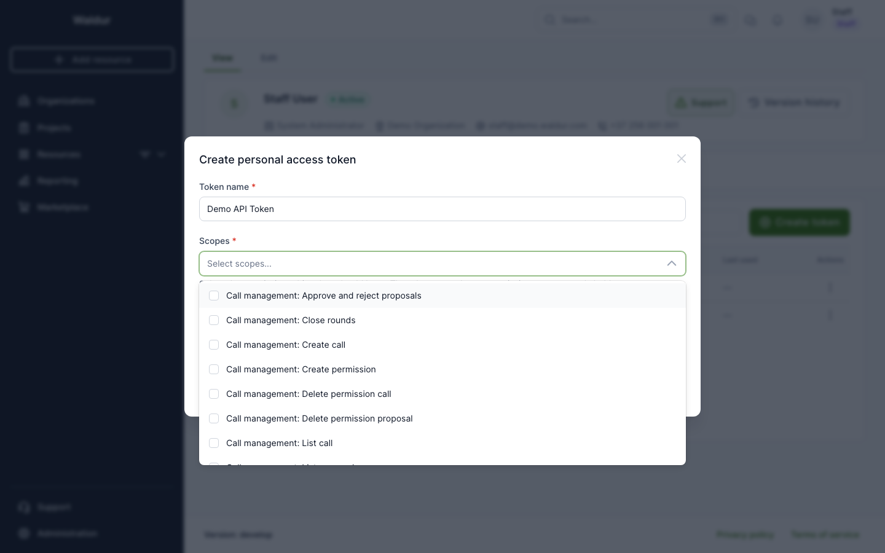
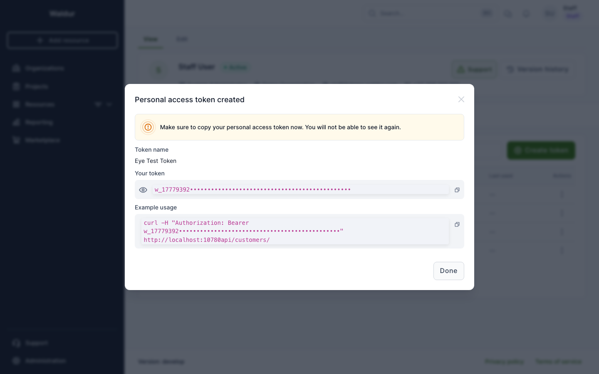
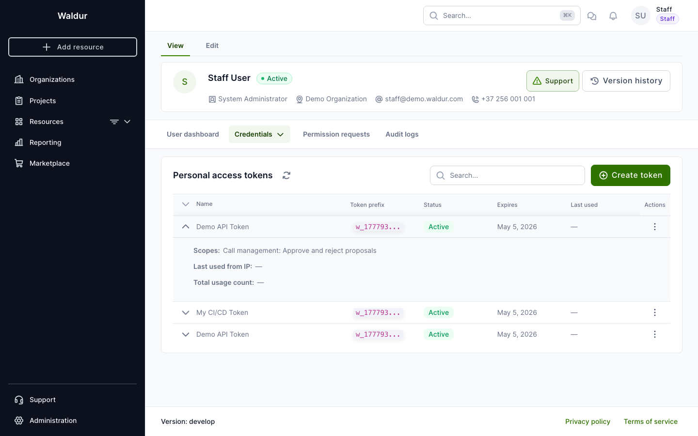

# Personal access tokens

Personal access tokens (PATs) provide a secure way to authenticate with the Waldur API for programmatic access. Unlike session-based authentication, PATs are scoped, time-limited, and can be revoked independently.

## Prerequisites

- A staff user must enable the PAT feature in **Administration > Configuration > Personal access tokens**.
- Your account must be active.

## Creating a token

1. Navigate to **Profile > Credentials > Personal access tokens**.

    

2. Click **Create token**.

3. Fill in the form:
    - **Token name** — a descriptive name (e.g., "CI/CD pipeline token").
    - **Scopes** — select the permissions this token should have. Only permissions you currently hold are available.
    - **Expiration date** — the token will stop working after this date.

    

    Scopes are displayed with human-readable labels organized by category:

    

4. Click **Create token**. A dialog shows your new token:

    

!!! warning
    Copy your token immediately. It will not be shown again. Use the copy button or copy the curl example directly.

## Using a token

Authenticate API requests by passing the token in the `Authorization` header:

```bash
curl -H "Authorization: Bearer YOUR_TOKEN" https://waldur.example.com/api/customers/
```

The token respects the **scope ceiling model**: effective permissions are the intersection of the token's scopes and your current roles. A token cannot grant more access than you have.

## Managing tokens

### Viewing token details

Click on a token row to expand it and see:

- **Scopes** — human-readable list of granted permissions.
- **Last used from IP** — the IP address of the most recent API call.
- **Total usage count** — how many times the token has been used.



### Rotating a token

Open the row actions menu and select **Rotate**. This atomically revokes the current token and generates a new one with the same scopes and expiration. The old token stops working immediately.


### Revoking a token

Open the row actions menu and select **Revoke**. The token is permanently deactivated. Revoked tokens remain visible in the list with a red "Revoked" badge for audit purposes.

## Security notes

- Tokens are stored as SHA-256 hashes — Waldur never stores the plaintext.
- Expired tokens are automatically deactivated by a background process.
- If your account is deactivated, all your tokens are revoked automatically.
- You cannot create, rotate, or revoke tokens when authenticated via a PAT (session authentication required).
