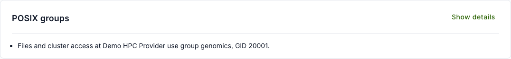
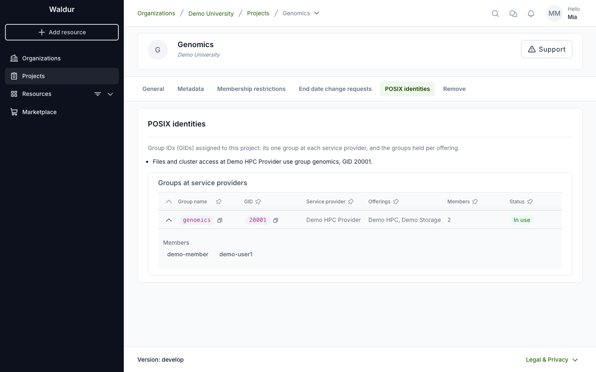
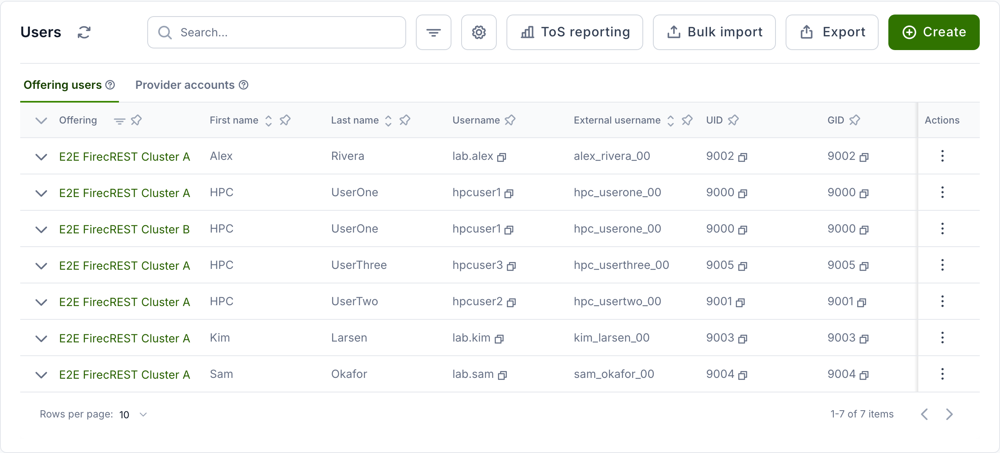

# Your POSIX identity on Linux and HPC offerings

When you get access to a Linux or HPC offering — for example a SLURM cluster
or a storage service that provisions a Unix account for you — the service
provider assigns you two numeric identifiers:

- a **UID** (user id), which identifies your personal account, and
- a **primary GID** (group id), which identifies your default group.

These numbers are how the underlying systems track file ownership, disk
quotas and job scheduling. You normally never type them yourself: you log in
with your username and SSH key, and the cluster maps you to your UID and GID
behind the scenes.

## Your project's POSIX groups

Besides your personal identifiers, a service provider may give each project one
**project group**: a POSIX group, named after the project's short name, whose
members are the accounts that the project's members hold at that provider.
Clusters grant access through it, and files the project shares on storage are
owned by its GID. Your account becomes a member when you join the project and
leaves the group when you leave it.

The project overview shows the groups in a **POSIX groups** panel: one line per
service provider, with the group name and GID.

**Show details** opens the project's **Settings → POSIX identities** tab with
the full list. **Groups at service providers** lists the project's
group at each provider with its GID, the offerings the project uses there, the
number of members and whether the group is in use. Expand a row to see the
members' usernames.

The group's name and GID do not change when the project is renamed. A group is
marked **Not in use** when the project no longer has resources at that
provider; it keeps its GID, so files owned by it stay readable to the project
when it comes back. Every project member and the organization's owners can see
these groups; only the service provider manages them.

## What to expect

- **They are stable.** Your UID and primary GID stay the same for the lifetime
    of your account, so files you create keep their ownership and your jobs are
    accounted to you consistently.
- **They are unique within a provider.** Each service provider keeps its own
    pool of identifiers, so no two people on that provider's systems share a
    UID, and a user's id never collides with a project or role group id.
- **They are managed for you.** You do not request or change these numbers —
    the provider allocates them automatically from a reserved pool when your
    account is created.

Your service provider can look up the UID and primary GID that were assigned to
your account, which is useful when you open a support request about file
permissions or scheduling.

!!! note
    If you have accounts with more than one service provider, your UID and GID
    may differ between them — each provider numbers its own users
    independently. Within a single provider they stay consistent across all of
    that provider's offerings.
