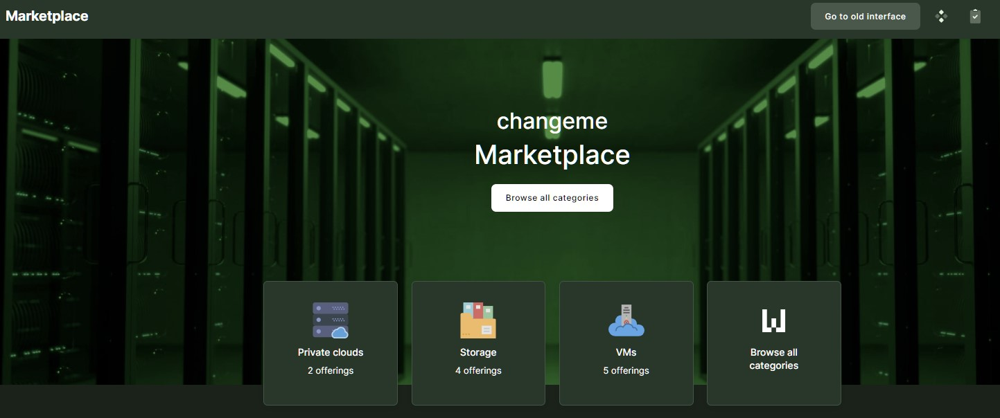

# Resource management

## VPC management

!!! Info
    There are several Virtual Private Cloud providers available on the ´Marketplace´.
    You need to provision at least one VPC package from a suitable provider in order to be able to create virtual machines.

- Virtual Private Cloud (VPC) resource package can be added by clicking to ´Marketplace´ and selecting ´Private Clouds´ from the menu to go to the list of VPC.

- Currently, there are three VPC component names listed: ´Cores´, ´Ram´, and ´Storage´. For configuration of a VPC resource please fill in a suitable quantity for each component and click on the ´Add to cart´ button. Here by changing the quantities of components, you can see Prices accordingly per day, per 30 days, per 365 days, and finally the total price of the VPC.

- It is mandatory to input ´Tenant name´ to order a VPC.
- We also strongly suggest filling the ´Tenant description´ field.

- Finally click on Add to cart and Request on the next page.

### Request approval

a) If your role in the Project is ´Project Manager´ or ´System Administrator´, please ask your Organization Owner to approve the order.

b) If your role is ´Organization Owner´ you are able to complete the purchase to final approval (click the ´Purchase´ button). Hereafter the system will need a couple of minutes to execute the order. Once the system changes the state to ´Done´, your VPC is ready to use.

!!! Info
    Provisioned VPC resource package will be automatically enabled for the project as a VM provider. For other projects it can be enabled by the organization owner under Provider management within organization workspace.

## VM management

!!! Info
    Projects need to have at least one VPC resource package enabled before any virtual machines can be created. You can follow this guide to add a new VPC.

- VMs can be added by clicking to ’Marketplace’ and selecting ’Virtual machines’ from the menu to go to the list of Virtual Machines.

- Ordering a ’Virtual Machine’ requires a VM name and selection of a VM image.
- Please select the ’Image’ for a VM and click on the ’Select’ button, returning to the form.

- Selecting the initial VM resource profile, the flavor, by clicking on the ’Flavor: Show choices’ selector is mandatory.
- The flavor will set the initial resource profile for a VM - how much RAM, vCPU cores, and storage it will have.

!!! Warning
    VM images contain their minimum requirements information, and non-matching VM flavors are disabled automatically.

- Selecting VM flavor will also update ’System volume size’ with the option to override it manually (to a higher custom value). The size of ’Data Volume’ can be customized and incremented in 1 GB steps. ’System volume’ must be at least 10 GB, whereas ’System volume’ and ’Data volume’ must be equal to or less than VPC’s total Storage.

- By default, provisioned virtual machines expect users to log in using SSH keys. The initial SSH key for login should be selected by clicking on the ’SSH public key: Show choices’ selector.

!!! Warning
    There has to be at least one SSH public key added to the user profile for it to appear in the SSH key selector list.

!!! Info
    In order to log in to your newly created VM over SSH, you need to use a username depending on your choice of VM Image type and your SSH-RSA key-pair. By default password authentication is disabled.

- Default usernames for login are as follows:
  - CentOS images: CentOS
  - Ubuntu images: Ubuntu
  - Debian images: Debian
  - FreeBSD images: FreeBSD
- By default, no incoming connections will be allowed for a VM. Predefined Security Groups (firewall rules) must be linked to a VM in order to open up access (like ssh, HTTP, etc.). By clicking the ’Details’ button, you can see the details about the available ’Security Groups’. ’Security Groups’ can be added while ordering the VM or afterward by editing.

!!! Info
    VM create form will automatically include a ’default’ security group that enables egress (outgoing) traffic for a VM and which is required in order to reply to any of the incoming packets.

- VM needs to be connected to at least one of the VPC (internal) networks and an external network via floating IP - if external/public access to VM is required.

!!! Info
    Floating IP is technically realized as 1:1 NAT between VM internal IP and public network IP.

- We strongly suggest also adding ’VM description’. In order to provision the VM, please click on the “Add to cart” button.

!!! Info
    On the right pane, there will be a ’Checkout summary’ with the purchase overview and indicative VM cost (as part of the VPC package cost).

- VM should reach into “Active” status when successfully provisioned. The “Access” field will show the IP address to access VM over SSH (Linux) or over RDP (Windows).

!!! Info
    VM access over SSH or RDP should be permitted by ’Security Groups’ linked to VM.

## HPC resource management

- HPC resources can be added by clicking to ´Marketplace´.
- Select organization and project (if not filled in yet) from the upper right corner.
- selecting ´HPC´ category or some other option which represent HPC resources.
- Select desired resource and click 'Deploy'.
- Fill in request form fields and click 'Create' on the right.

## Resource components update

If it turns out that initial limits for the resource are too low or higher than expected, then it is possible to change the limits after the resource creation. This can be done by opening the resource management section. Again, like in the resource creation phase, same approval flow applies.

