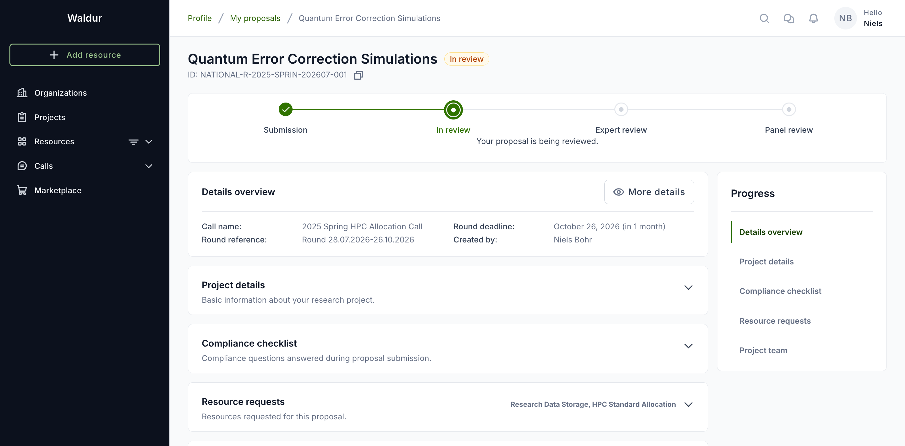
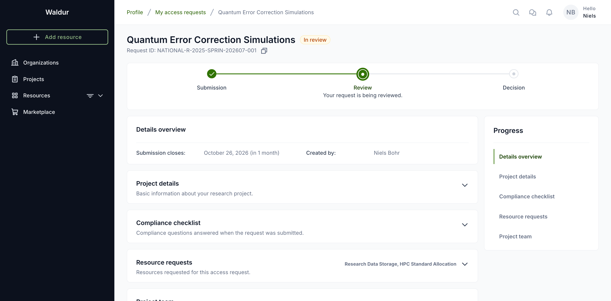
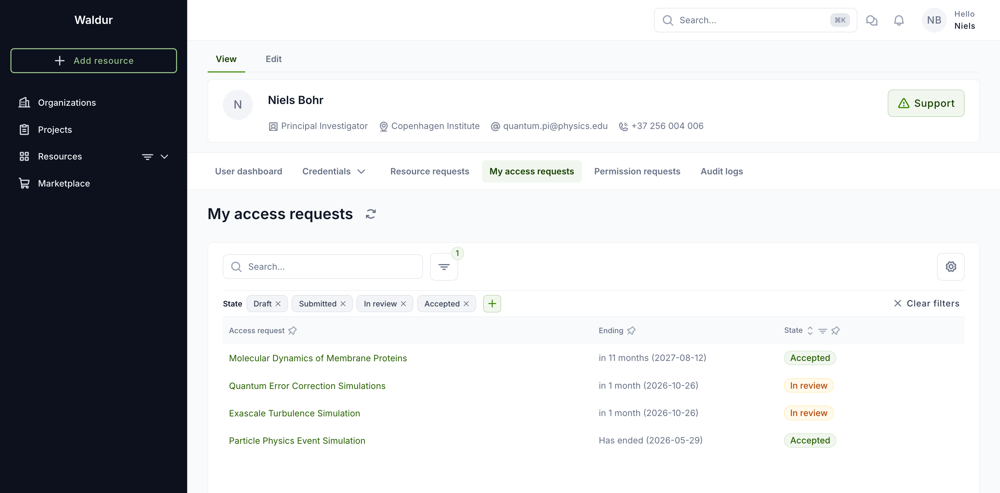

# How you reach services

Waldur can be set up to hand out services in two different ways, and a deployment picks one. The
difference is only in navigation and wording — the same requests, the same reviews, the same
resources underneath — but it changes enough of what you see that it is worth knowing which one
you are looking at.

Your deployment administrator chooses this with the **SERVICE_ACCESS_MODE** setting. You cannot
change it yourself, and there is no switch in the interface to tell you which is active. The
quickest way to tell is the sidebar: if it has a **Calls** section, calls are browsable.

| Mode | How you get a service |
|---|---|
| `both` | Browse the marketplace, or browse open calls. Both are in the sidebar. (Default.) |
| `calls` | Only through calls for proposals. No marketplace navigation. |
| `marketplace` | The marketplace is the only entry point. You reach a call through an offering, without meeting it as a concept. |

## `both` and `calls` — the call is visible

You browse **Calls for proposals**, pick a call and a round, and submit a proposal to it. The
proposal names the call it belongs to and the round it was submitted under, and your submissions
are listed under **My proposals**.

This is the vocabulary the rest of this guide uses, and the
[applicant guide](../call-managing-organization/applicant-guide.md) describes the flow in full.

## `marketplace` — the call is behind the offering

You browse offerings as you would any catalogue. When an offering is available through a call, its
**Request** button offers **Apply for access** alongside the ordinary **Order now**, and choosing it
opens a submission deadline to pick rather than a call to choose.

Everything after that drops the parts that only make sense inside a call:

- Your submissions are **access requests**, not proposals, and live under **My access requests** in
  your profile — there is no calls section to hold them.
- The call name and the round reference are not shown; the round's cutoff appears as
  **Submission closes**.
- The progress tracker is the coarse **Submission → Review → Decision** one, with a line under it
  saying what is happening.
- There is no project-duration field: it is a question a call asks, and the allocation takes each
  resource request's own end date regardless.

!!! note
    Reviewers, call managers and service providers keep the call vocabulary in every mode. Calls,
    rounds and proposals are the objects they manage, so hiding the words from them would only make
    their own screens harder to read. The change is for the applicant's side of the flow.

## What does not change

The API serves the same data in every mode, and so does everything below the navigation:

- Resource requests, their amounts and their purchase orders.
- The compliance checklist and the project team.
- Reviews, the decision, and the project created when a request is accepted.
- The state badges — draft, submitted, in review, accepted, rejected.

A request submitted while the deployment ran in one mode continues to work if the mode changes; it
is only presented differently.
