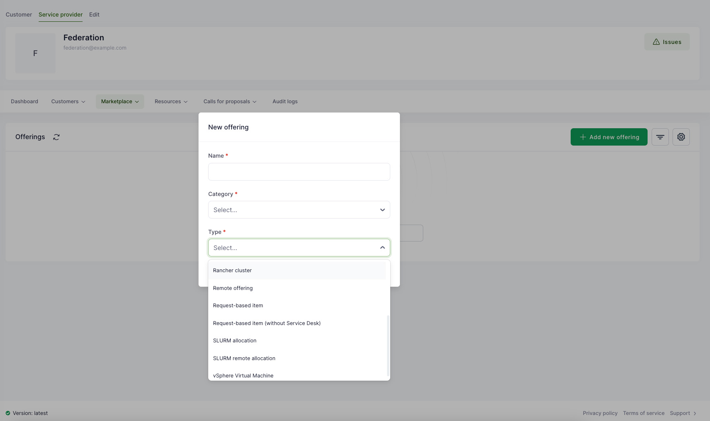
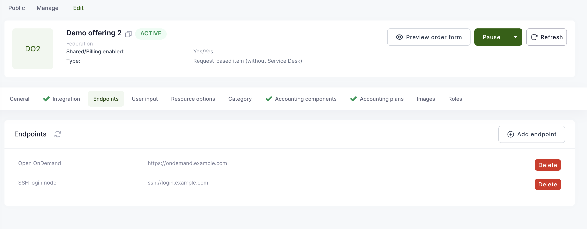
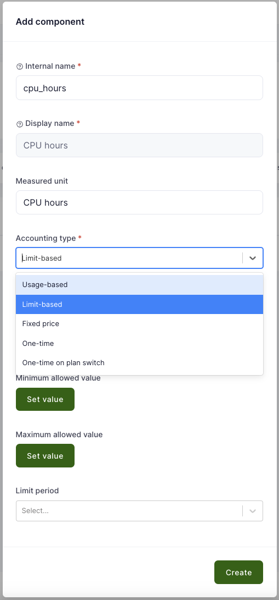
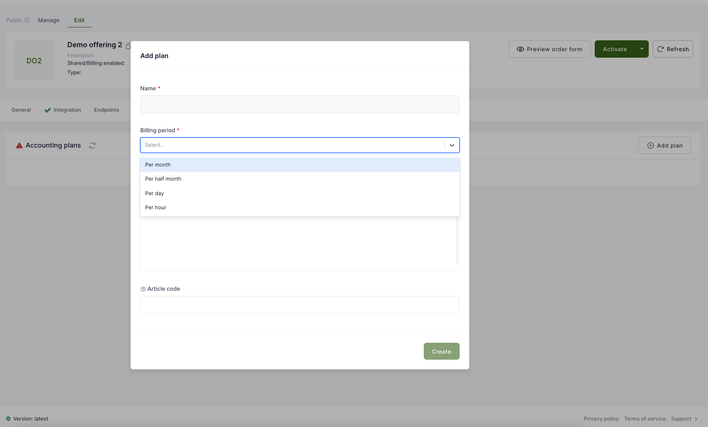

# Offerings

To create a new Offering in the Marketplace, you need to:

- Assure that categories are configured in the Marketplace.
- Create at least one service provider.
- Create and activate a public offering.

Waldur supports a number of different types of service providers when creating a shared offering. A common way of
creating an offering is through a HomePort.

## OpenStack offering creation

1. Select organization, which will provide the offering.

2. Go to Provider dashboard, click **Marketplace** -> **Offerings** from the top menu and then **Add** from the left.
    

3. A popup opens, fill in the name for the offering, category (e.g. Private clouds) and type (**OpenStack tenant**) and click **Create**.
    

4. An offering configuration page opens with an option to edit different attributes.

    

5. For the OpenStack integration, select **Integration** -> **Credentials** from the top menu. Fill in requested parameters.

    - **API URL** - OpenStack deployment keystone URL
    - **Domain name** - OpenStack domain name
    - **Username** - Tenant user username
    - **Password** - Tenant user password
    - **Tenant name** - OpenStack tenant name
    - **External network ID** - OpenStack extnet UUID

    

6. If everything is filled in, click on **Synchronize** in the top left corner. After few seconds, the **State** field will show **OK** if the integration is completed between Waldur and OpenStack.

7. To adjust the accounting, select **Accounting** from the top menu and then **Plans** -> **Edit prices**. Default accounting components are already defined.

    

8. If everything is completed and ready, click on **Activate** in the upper right corner to publish the offering.

## SLURM offering creation

1. Select organization, which will provide the offering.

2. Go to Provider dashboard and click on **Marketplace** -> **Offerings** from the top menu and then click **Add** from the right.
    

3. A popup opens, fill in the name for the offering, category and type.
    

4. An offering configuration page opens with an option to edit different attributes.
    

5. Under Endpoints section, you can add access endpoints for the offering, for example, management consoles, SSH login nodes or similar.
    

    This configuration will display then to resource of the offering a menu for easier navigation to the corresponding services. For SSH protocol this would trigger
    opening of an SSH client if configured for the browser. Out of the box works on OS X and Linux, requires configuration of the default application on Windows.
    

6. To add accounting components, select "Accounting components" from the top menu and then "Add component" from the right side. Accounting component is a measurable unit of a resource. For example, it can be CPU hours, GPU hours, storage hours, RAM etc.
    

7. A popup opens with possibility to configure fields and select the accounting type (whether the component is billed by the usage, max limit or it has a fixed price).

    - Usage-based - billing is applied according to the actual usage of the resource during the billing period defined in the accounting plan after the submission of a usage report;
    - Limit-based - billing is applied according to the requested/updated limits of a resource, actual usage can be below the limits and it is not the basis of the billing;
    - Fixed price - billing is applied according to the exact values defined by the service provider in the accounting plan, limits and usage are not the basis for the accounting;
    - One-time - billing is applied once on resource activation;
    - One-time on plan switch - billing is applied once on resource activation and everytime a plan has changed, using pricing of a new plan.

    

8. To configure accounting frequency and prices, select "Accounting plans" from the top menu and then "Add plan" from the right. Select a name for the plan and accounting frequency.
    

9. To define prices for the components, select "Actions" and then "Edit prices". Set new price and save. If there is a need to provide higher priority access to resources with different prices, then it is advised to create another offering for this kind of cases.
    

    

10. If all set, click "Activate" on the top-right side to make it visible to everybody.
    

!!! tip
    For more advanced cases of management of offerings, take a look at how a SLURM offering can be managed using
    [Ansible module](https://github.com/waldur/ansible-waldur-module/blob/develop/waldur_batch_offering.py).

## Offering management

It is possible to temporarily unpublish the offering. For example, if the service is down for a longer maintenance. To do that, open the offering edit page and click on **Pause** from the right.


If the offering is not needed anymore, then it is possible to archive it by selecting **Archive** from the offering edit page.


## Configuring Getting Started Templates

When setting up an offering, you can configure a "Getting Started" guide that will be shown to users after they provision a resource. This guide supports dynamic variables that are automatically replaced with actual resource values.

### Available Template Variables

- `{resource_name}` - The name of the resource
- `{resource_username}` - The username associated with the resource
- `{backend_id}` - The backend identifier (e.g., SLURM account name)
- `{backend_metadata_key}` - Any metadata fields from the backend (e.g., `{backend_metadata_state}`)
- `{options_key}` - Any custom options set for the resource (e.g., `{options_custom_field}`)

### Example Template

For SLURM allocations, you might want to create a comprehensive guide like this:

```markdown
# Getting Started with your SLURM Allocation

Welcome to your new SLURM allocation. Here are your access details:

- Account name: {backend_id}
- Username: {resource_username}
- Resource name: {resource_name}

## Status

Current state: {backend_metadata_state}
```

To configure this template:

1. Go to your offering's page
2. Select "Edit" from the top menu
3. Scroll down and find the "Getting started instructions" and click the "Edit" button
4. Enter your desired template information using the variables above
5. Save the changes

The template will be rendered with retreived values when users access their resources.
