# Offerings

To create a new Offering in the Marketplace, you need to:

- Assure that categories are configured in the Marketplace.
- Create at least one service provider.
- Create and activate a public offering.

Waldur supports a number of different types of service providers when creating a shared offering. A common way of
creating an offering is through a HomePort.

## OpenStack offering creation

1. Select organization, which will provide the offering.

2. Go to Provider dashboard, click **Marketplace** -> **Offerings** from the top menu and then **Add** from the left.
    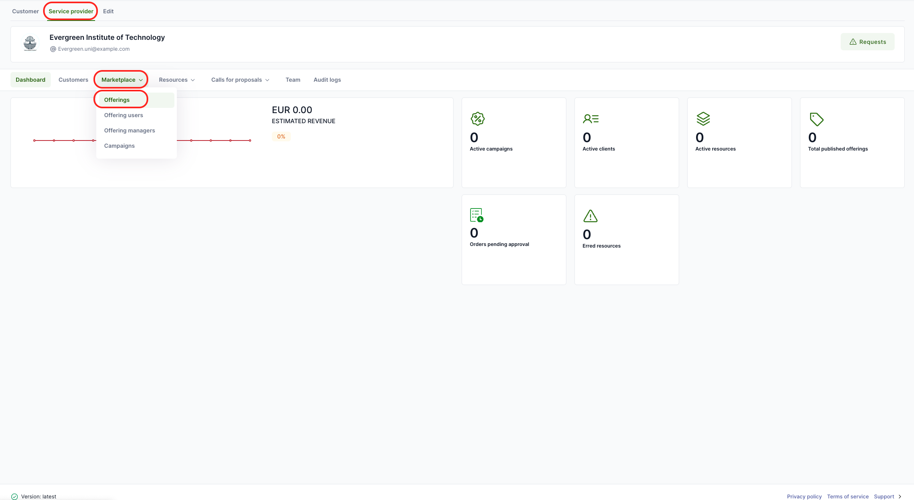

3. A popup opens, fill in the name for the offering, category (e.g. Private clouds) and type (**OpenStack tenant**) and click **Create**.
    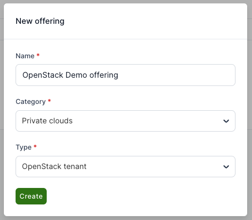

4. An offering configuration page opens with an option to edit different attributes.

    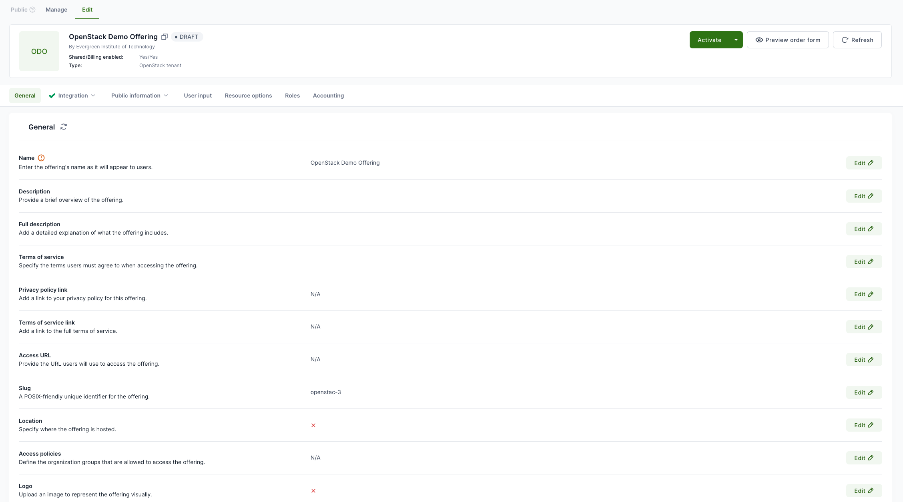

5. For the OpenStack integration, select **Integration** -> **Credentials** from the top menu. Fill in requested parameters.

    - **API URL** - OpenStack deployment keystone URL
    - **Domain name** - OpenStack domain name
    - **Username** - Tenant user username
    - **Password** - Tenant user password
    - **Tenant name** - OpenStack tenant name
    - **External network ID** - OpenStack extnet UUID

    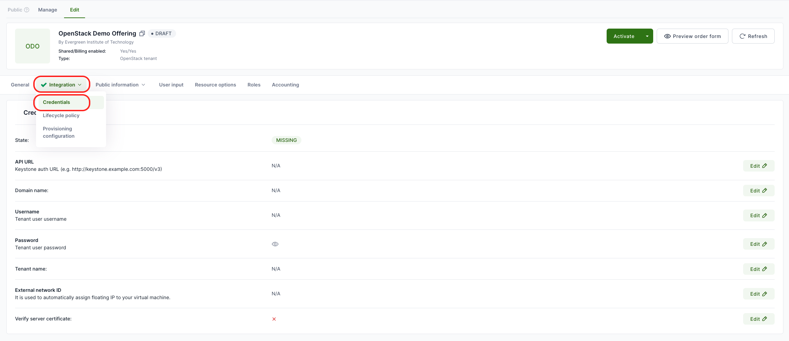

6. If everything is filled in, click on **Synchronize** in the top left corner. After few seconds, the **State** field will show **OK** if the integration is completed between Waldur and OpenStack.

7. To adjust the accounting, select **Accounting** from the top menu and then **Plans** -> **Edit prices**. Default accounting components are already defined.

    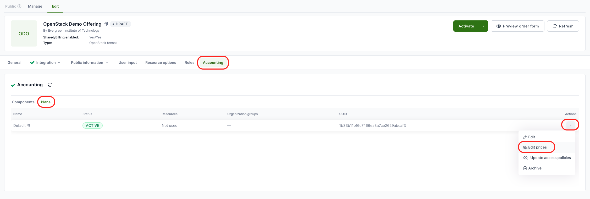

8. If everything is completed and ready, click on **Activate** in the upper right corner to publish the offering.

### Provisioning configuration

The **Integration** → **Provisioning configuration** card groups options that change how instances and volumes are provisioned on the OpenStack backend. Most operators only need to touch a few of these; defaults are sensible.

The card is split into tabs — Filtering, Console access, Network, **Operations**, Limits, IP mapping.

#### Config drive

The **Operations** tab includes a **Config drive enabled by default** toggle. A config drive is a small read-only disk attached to the instance at boot. Cloud-init reads metadata, the SSH key and any user-supplied start script from it, without going through the OpenStack metadata service on the network (`http://169.254.169.254`).

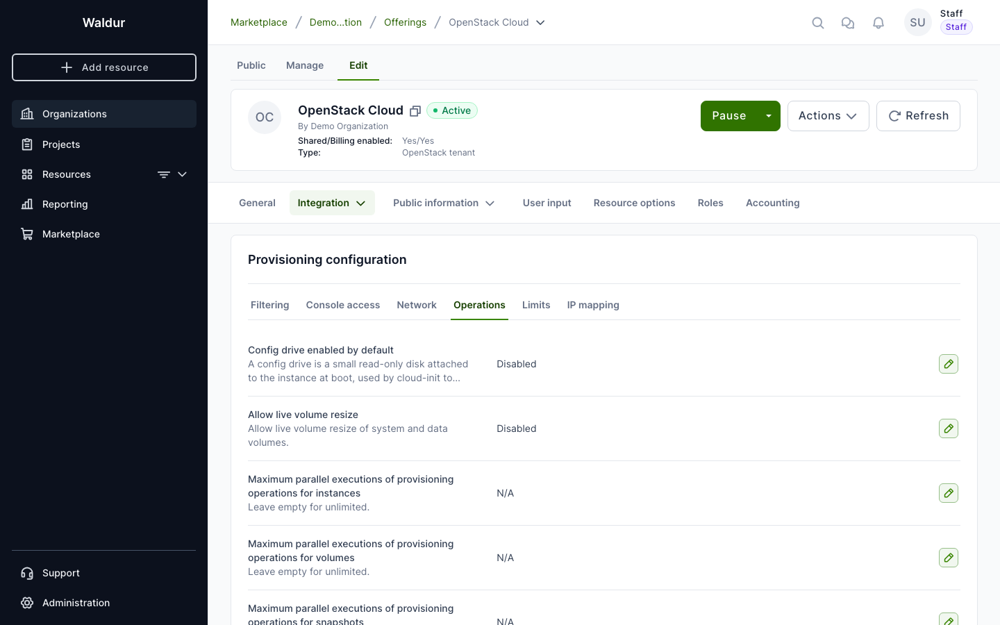

- Enable this when guests typically cannot reach the metadata service — for example, when tenant networks have no DHCP, or sit on an isolated segment.
- Leave it off when the metadata service is reachable, which is the usual case.

The toggle sets the **provider-wide default**. Users can override it per instance at order time (see [Config drive](../customer-organization/resource_management.md#config-drive) in the customer guide).

## SLURM offering creation

1. Select organization, which will provide the offering.

2. Go to Provider dashboard and click on **Marketplace** -> **Offerings** from the top menu and then click **Add** from the right.
    

3. A popup opens, fill in the name for the offering, category and type.
    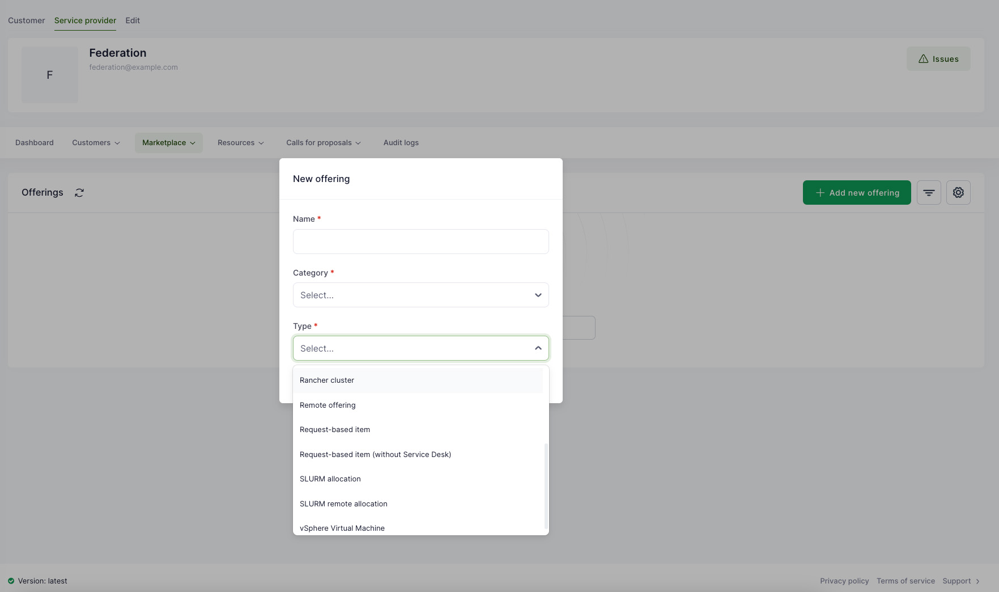

4. An offering configuration page opens with an option to edit different attributes.
    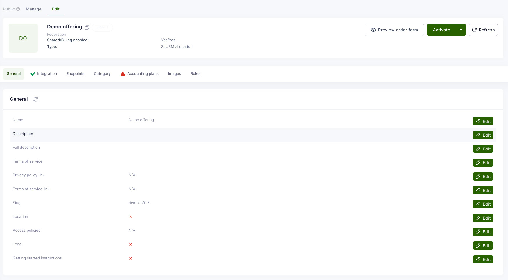

5. Under Endpoints section, you can add access endpoints for the offering, for example, management consoles, SSH login nodes or similar.
    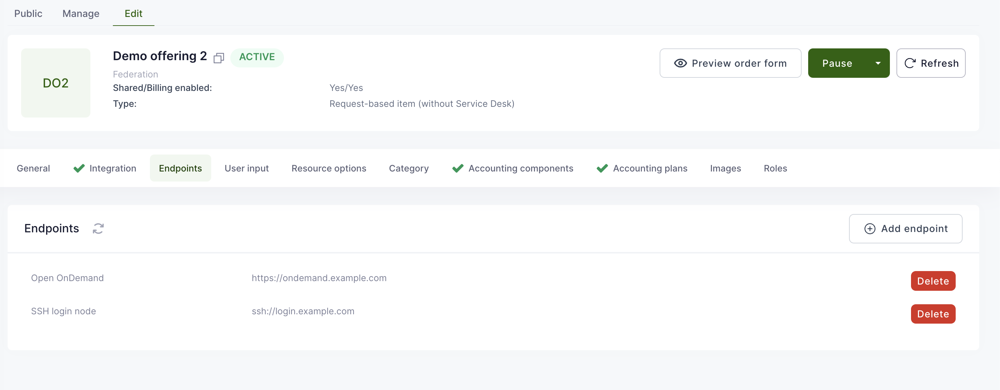

    This configuration will display then to resource of the offering a menu for easier navigation to the corresponding services. For SSH protocol this would trigger
    opening of an SSH client if configured for the browser. Out of the box works on OS X and Linux, requires configuration of the default application on Windows.
    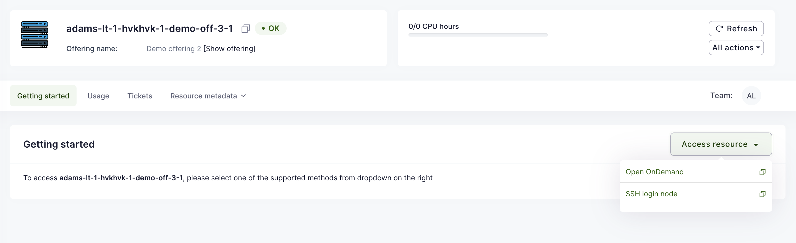

6. To add accounting components, select "Accounting components" from the top menu and then "Add component" from the right side. Accounting component is a measurable unit of a resource. For example, it can be CPU hours, GPU hours, storage hours, RAM etc.
    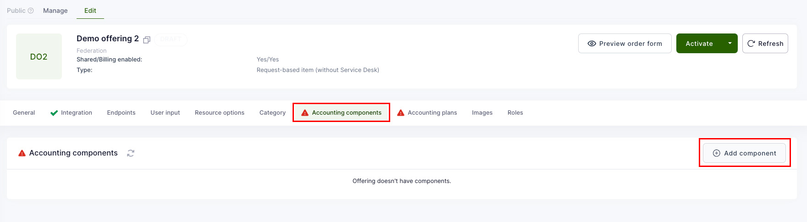

7. A popup opens with possibility to configure fields and select the accounting type (whether the component is billed by the usage, max limit or it has a fixed price).

    - Usage-based - billing is applied according to the actual usage of the resource during the billing period defined in the accounting plan after the submission of a usage report;
    - Limit-based - billing is applied according to the requested/updated limits of a resource, actual usage can be below the limits and it is not the basis of the billing;
    - Fixed price - billing is applied according to the exact values defined by the service provider in the accounting plan, limits and usage are not the basis for the accounting;
    - One-time - billing is applied once on resource activation;
    - One-time on plan switch - billing is applied once on resource activation and everytime a plan has changed, using pricing of a new plan.

    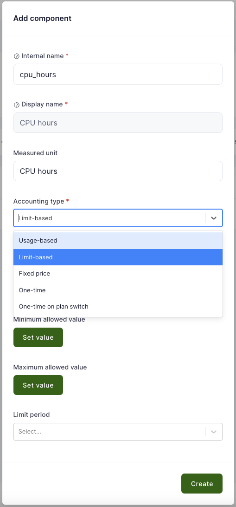

8. To configure accounting frequency and prices, select "Accounting plans" from the top menu and then "Add plan" from the right. Select a name for the plan and accounting frequency.
    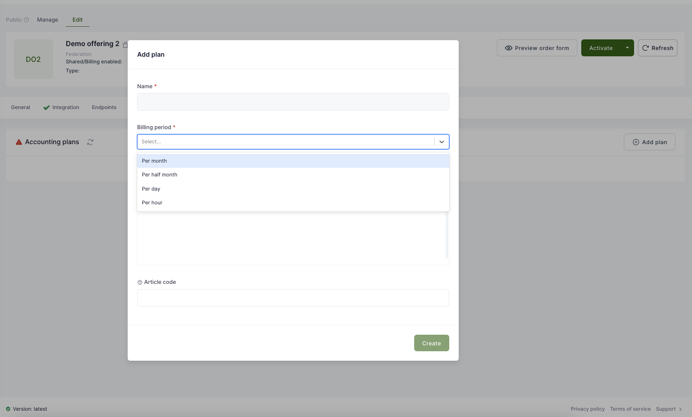

9. To define prices for the components, select "Actions" and then "Edit prices". Set new price and save. If there is a need to provide higher priority access to resources with different prices, then it is advised to create another offering for this kind of cases.
    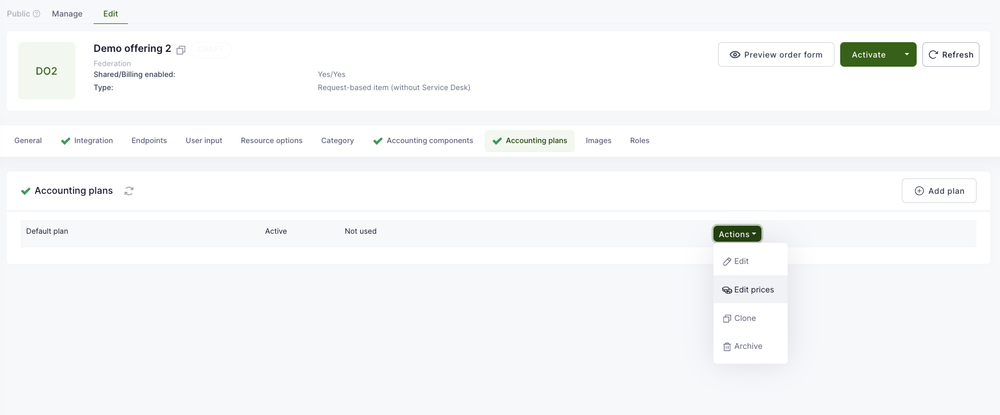

    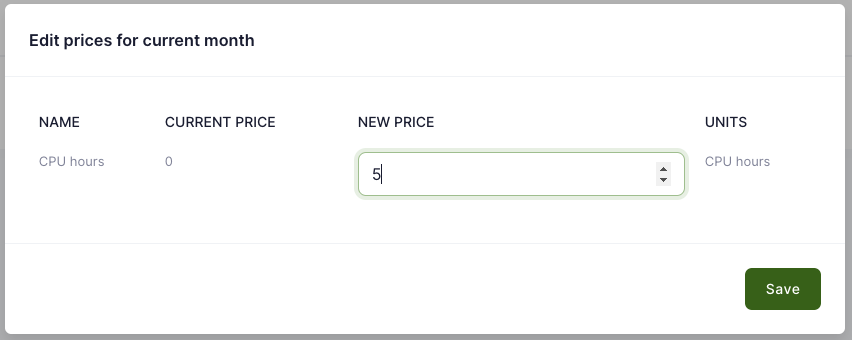

10. If all set, click "Activate" on the top-right side to make it visible to everybody.
    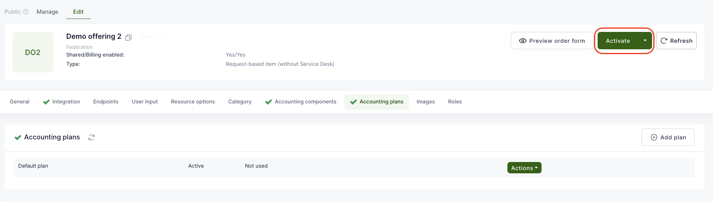

!!! tip
    For more advanced cases of management of offerings, take a look at how a SLURM offering can be managed using
    [Ansible module](https://github.com/waldur/ansible-waldur-module/blob/develop/waldur_batch_offering.py).

## Configuring billing model per component

Waldur supports configuring the billing model for each component individually. The same OpenStack Tenant offering type can have different billing configurations depending on the use case:

- **Monthly billing** (default): Components use **Limit-based** accounting type. Customers are billed monthly based on their reserved limits (e.g., 4 cores × €1/core/month).
- **Prepaid billing**: Components use **One-time** accounting type with the **Pre-paid** option enabled. Customers pay upfront for the full duration (e.g., 4 cores × €1/core/month × 3 months = €12 total).

### Default: Limit-based (monthly billing)

By default, OpenStack Tenant offerings come with three built-in components — Cores, RAM, and Storage — all configured as **Limit-based** with monthly billing.

### Switching all components with "Switch modes"

The fastest way to switch between monthly and prepaid billing is the **Switch modes** dropdown on the Accounting → Components tab. It combines both billing mode and storage mode options in one menu:

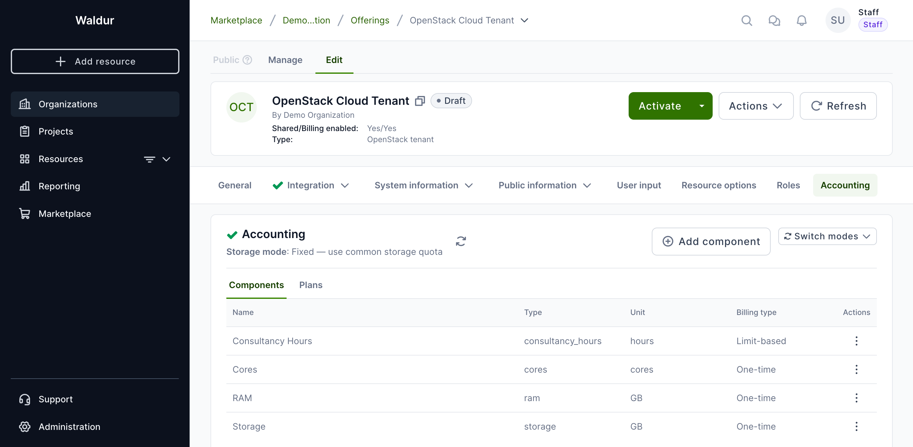

Click **Switch modes** → **Billing mode** to open a dialog where you can select the billing model for all infrastructure components at once:

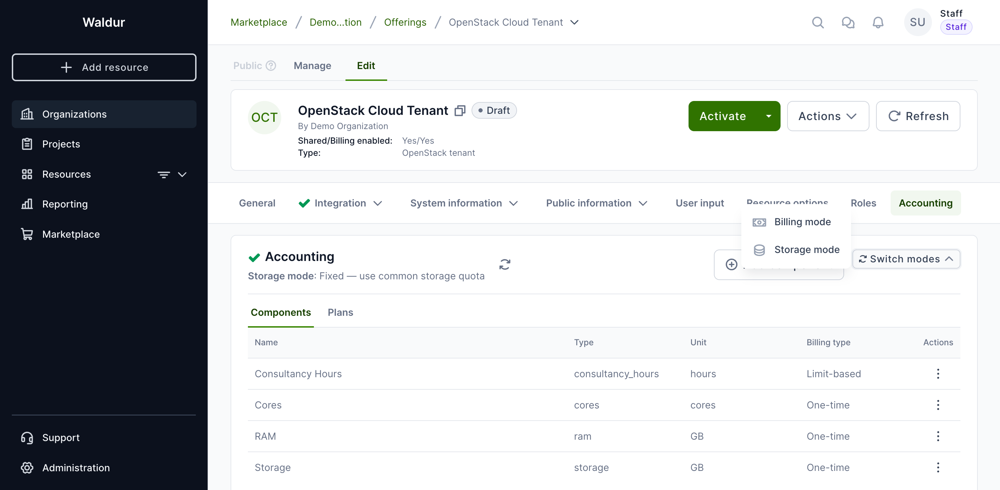

After selecting "Prepaid (One-time)" and saving, all built-in components (Cores, RAM, Storage) switch to "One-time" (prepaid). Custom components like "Consultancy Hours" are not affected.

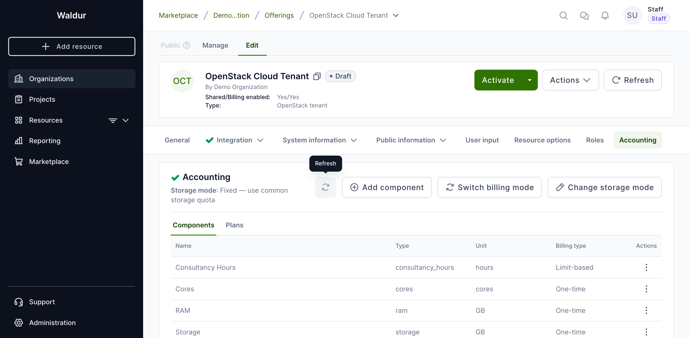

### Switching individual components

You can also configure each component individually:

1. Navigate to the offering's **Edit** → **Accounting** → **Components** tab.
2. Click the action menu (⋮) on the component you want to change and select **Edit**.
3. Change the **Accounting type** from "Limit-based" to **"One-time"**.
4. Enable the **Pre-paid component** toggle.
5. Optionally configure duration constraints (min/max duration, renewal settings).
6. Click **Save**.

This allows mixed configurations — for example, CPU and RAM as prepaid while Storage remains monthly.

One-time components also support **Min value** and **Max value** constraints, which limit the quantity a customer can order. These fields appear alongside the Pre-paid toggle in the component edit dialog.

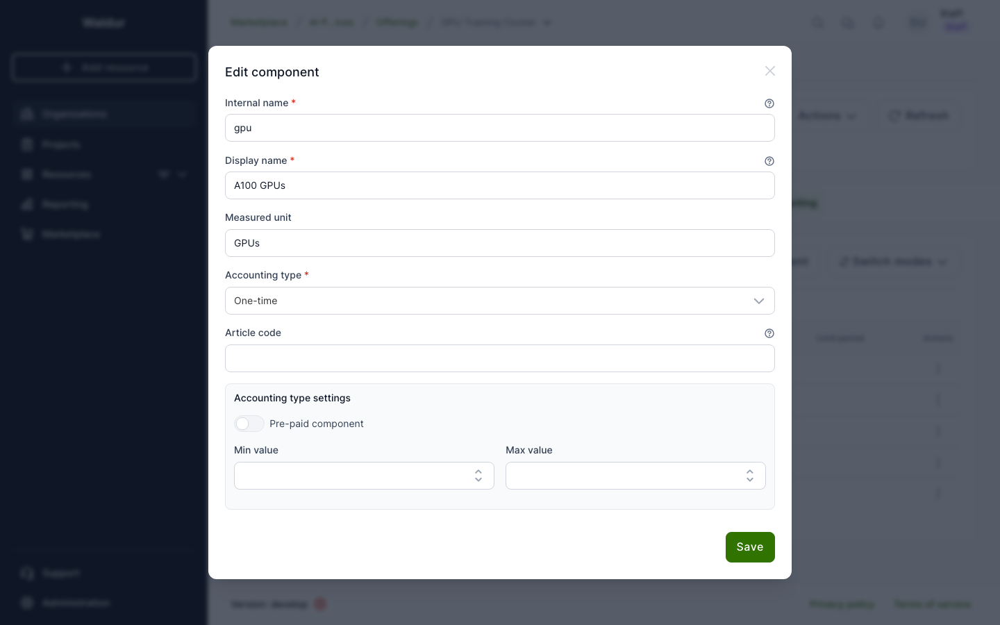

!!! note
    For prepaid offerings, the **Termination date** (end date) is required when ordering. The total upfront charge is calculated as `price × limit × months`.

### How billing works for each model

| Billing model | Invoice frequency | Formula | Limit changes |
|---------------|-------------------|---------|---------------|
| **Limit-based** (monthly) | Every month | `price × limit` per month | Adjusted on current month's invoice |
| **One-time + prepaid** (upfront) | Once at creation | `price × limit × months` | Supplementary charge for `(new - old) × remaining months` |
| **Limit-based / Total** (one-time) | Once at creation | `price × limit` | Incremental charge for difference |

## Adding custom components

Service providers can add custom accounting components to any offering alongside the built-in ones. This is useful for non-infrastructure services like consultancy hours, support packages, or training credits.

To add a custom component:

1. Navigate to the offering's **Edit** → **Accounting** → **Components** tab.
2. Click **Add component**.
3. Fill in:
    - **Internal name**: a machine-readable identifier (e.g., `consultancy_hours`)
    - **Display name**: shown to users (e.g., "Consultancy Hours")
    - **Measured unit**: the unit label (e.g., "hours")
    - **Accounting type**: select the billing model (e.g., "Limit-based" with "Maximum total" for one-time flat charges)
4. Click **Confirm**.

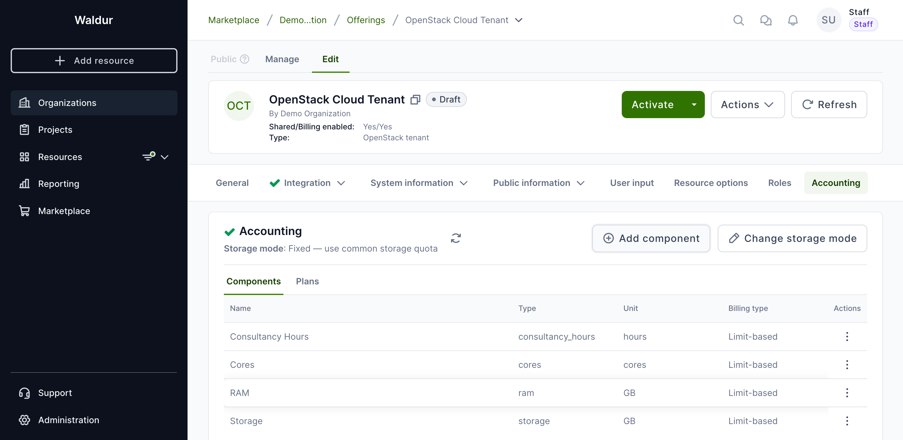

Custom components appear alongside built-in components in the order form and pricing views. They are billed according to their configured accounting type but are not pushed to the OpenStack backend as quotas.

!!! tip
    Use **Limit-based** with **Maximum total** period for one-time flat-rate services like consultancy hours. Use **One-time + Pre-paid** for subscription-based add-ons that scale with duration.

## Volume discounts

Service providers can configure volume discounts on plan components to incentivize larger orders. When a customer orders a quantity that meets or exceeds a configured threshold, a percentage discount is automatically applied.

### Configuring discounts

1. Navigate to the offering's **Edit** → **Accounting** → **Plans** tab.
2. Select a plan and click the **Discounts** button.
3. For each component, set:
    - **Discount threshold**: the minimum quantity required to trigger the discount
    - **Discount rate**: the percentage discount (0–100%)
4. Save changes.

For example, setting a threshold of 16 cores and a rate of 10% means customers ordering 16 or more CPU cores receive a 10% price reduction on that component.

### How customers see discounts

During order creation, discount information is displayed directly on the component:

- **Before threshold is met**: the discount hint appears in gray text (e.g., "10% off for 16+ cores"), informing the customer about the available discount.

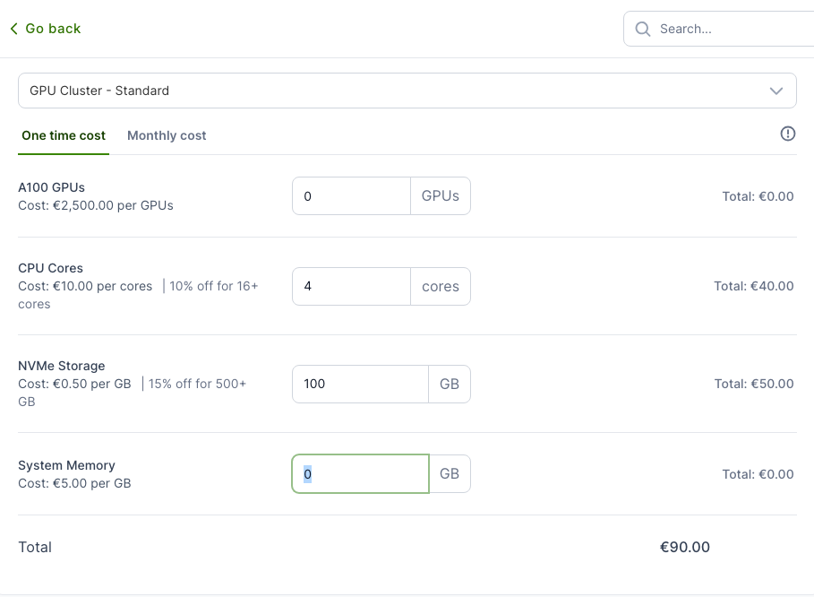

- **When threshold is met**: the hint turns green and the total price reflects the discounted rate. A "Volume discount savings" row appears in the order summary.

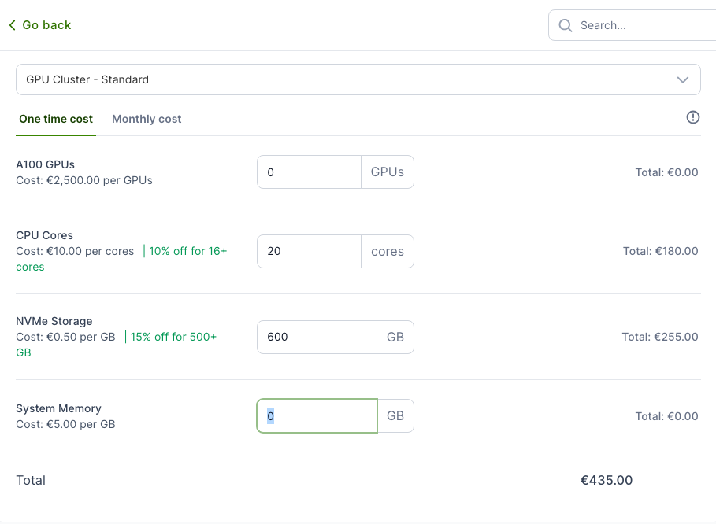

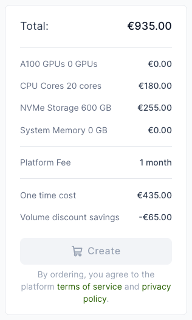

!!! tip
    Volume discounts are applied per component. You can set different thresholds and rates for different components within the same plan to create tiered pricing structures.

## Offering management

It is possible to temporarily unpublish the offering. For example, if the service is down for a longer maintenance. To do that, open the offering edit page and click on **Pause** from the right.

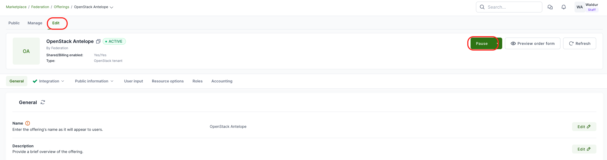

If the offering is not needed anymore, then it is possible to archive it by selecting **Archive** from the offering edit page.

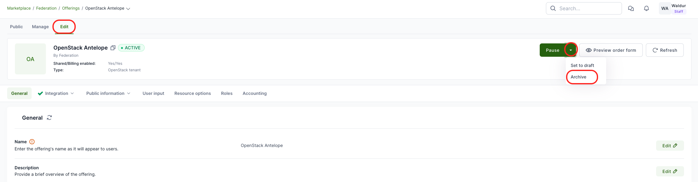

## Configuring Getting Started Templates

When setting up an offering, you can configure a "Getting Started" guide that will be shown to users after they provision a resource. This guide supports dynamic variables that are automatically replaced with actual resource values.

### Available Template Variables

- `{resource_name}` - The name of the resource
- `{resource_username}` - The username associated with the resource
- `{backend_id}` - The backend identifier (e.g., SLURM account name)
- `{backend_metadata_key}` - Any metadata fields from the backend (e.g., `{backend_metadata_state}`)
- `{options_key}` - Any custom options set for the resource (e.g., `{options_custom_field}`)

### Example Template

For SLURM allocations, you might want to create a comprehensive guide like this:

```markdown
# Getting Started with your SLURM Allocation

Welcome to your new SLURM allocation. Here are your access details:

- Account name: {backend_id}
- Username: {resource_username}
- Resource name: {resource_name}

## Status

Current state: {backend_metadata_state}
```

To configure this template:

1. Go to your offering's page
2. Select "Edit" from the top menu
3. Scroll down and find the "Getting started instructions" and click the "Edit" button
4. Enter your desired template information using the variables above
5. Save the changes

The template will be rendered with retreived values when users access their resources.

## Service offering configuration guide

### Overview

This guide provides a structured approach for integrators to define an Offering. Offerings represent services, resources, or products made available through the platform.

### General information

The General Information section defines the core attributes of an offering, including its identity, accessibility, and governance policies.

#### Required fields

- **Name** – The title of the offering, displayed across the platform
- **Description** – A concise summary outlining the offering's purpose
- **Full description** – A detailed explanation, including technical aspects and potential use cases
- **Terms of service** – Any contractual obligations or usage restrictions
- **Privacy policy link** – URL linking to the privacy policy
- **Terms of service link** – URL linking to the terms of service
- **Access URL** – The main entry point for users to access the offering
- **Slug** – A unique identifier used in URLs (readonly)
- **Location** – The geographical or virtual location of the offering
- **Access policies** – Defines access control rules and user eligibility
- **Logo** – A graphical representation of the offering
- **Getting started instructions** – Guidelines on how users can begin using the offering

### Public information

The Public Information section ensures visibility and accessibility for end users. It includes Endpoints, Categories, and Images.

#### Endpoints

Endpoints provide connectivity to the offering's services. Each endpoint requires:

- **Name** – A human-readable identifier for the endpoint
- **URL** – The direct link to access the service

#### Images

Images provide visual representation and marketing appeal. Each image requires:

- **Name** – A descriptive title
- **Description** – A brief explanation of the image content
- **Attached image file** – The image file itself
