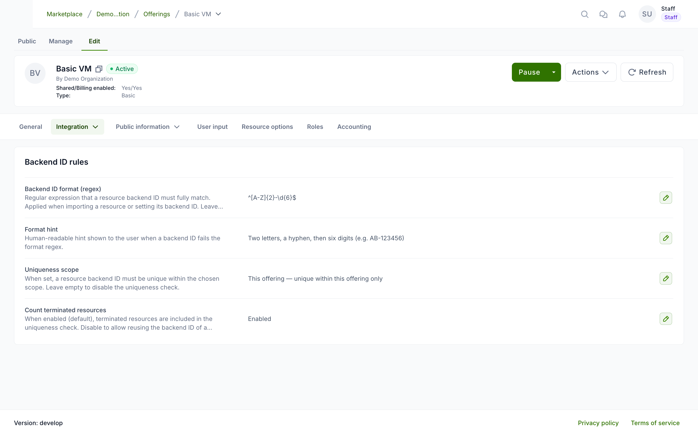

# Backend ID rules

Waldur lets service providers control the **backend ID** of resources created from an offering. A backend ID is the identifier a resource has on the provider's backend (for example, the account or project name created on a SLURM cluster). Per offering, you can require this identifier to match a **format** and to be **unique** within a chosen scope.

These rules are checked when a backend ID is assigned — when importing an existing backend resource into Waldur, or when setting or changing a resource's backend ID.

The rules are set under **Edit** → **Integration** → **Backend ID rules**.

## Configuring the rules

**Performed by:** Service provider (offering owner)

1. Open the offering and select **Edit** → **Integration**.
2. Open the **Backend ID rules** card.
3. Edit any of the fields below with its pencil button. Each field is saved on its own.

## Fields

### Backend ID format (regex)

A regular expression that a resource backend ID must fully match. For example, `^[A-Z]{2}-\d{6}$` accepts identifiers such as `AB-123456`. Leave it empty to allow any value.

### Format hint

A human-readable message shown to the user when a backend ID fails the format regex — use it to explain the expected format in plain language.

### Uniqueness scope

When set, a resource backend ID must be unique within the chosen scope. Leave it empty to disable the uniqueness check.

| Scope | A backend ID must be unique across… |
|---|---|
| **This offering** | resources of this offering only |
| **Offering group** | all offerings that share this offering's backend ID |
| **Service provider** | all offerings owned by this organization |
| **Service provider & category** | this organization's offerings in the same category |

### Count terminated resources

When enabled, terminated resources are included in the uniqueness check. Disable it to allow a new resource to reuse the backend ID of a terminated one. This applies only when a uniqueness scope is set.

!!! note
    If no value is set, the uniqueness check includes terminated resources by default.

## How the rules are applied

- The rules take effect only where a backend ID is assigned: importing a backend resource, or setting/changing a resource's backend ID. Resources without a backend ID are not affected.
- An empty **format** allows any value; an empty **uniqueness scope** disables the uniqueness check. The two are independent — you can require a format without uniqueness, or vice versa.
- If the format regex is invalid, the format check is skipped rather than blocking assignment.

!!! tip
    You can also validate a backend ID against these rules before assigning it, using the offering's backend ID check — helpful for catching duplicates or malformed identifiers early.
