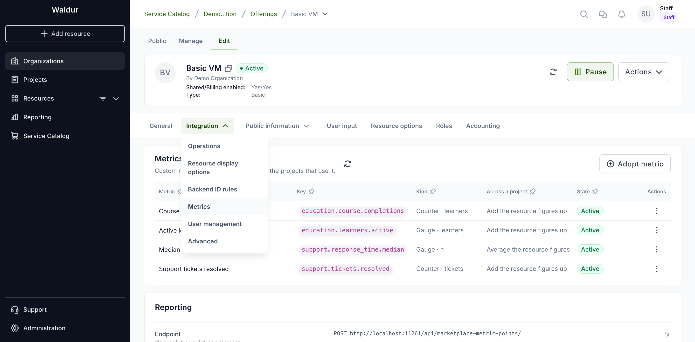
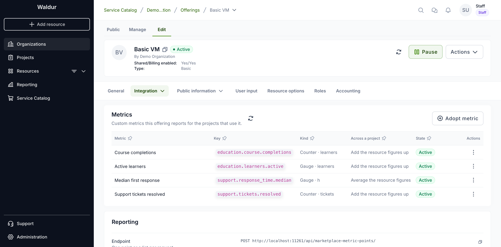
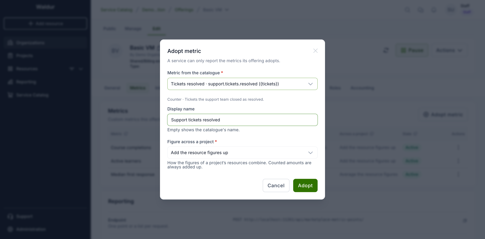
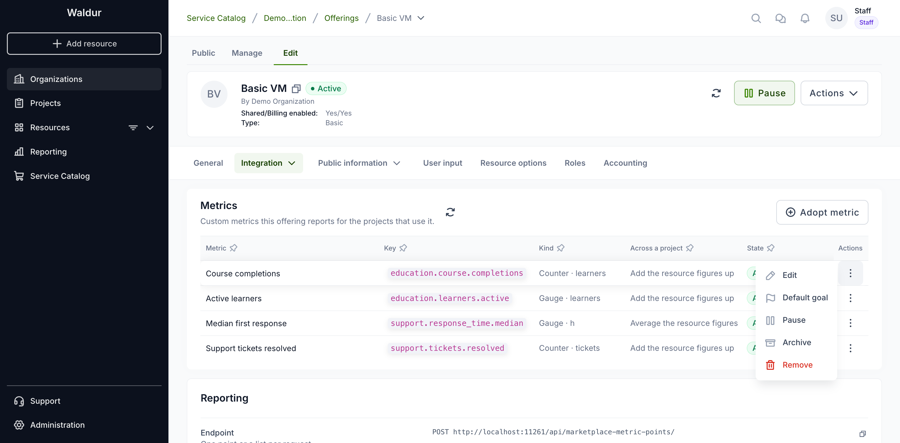
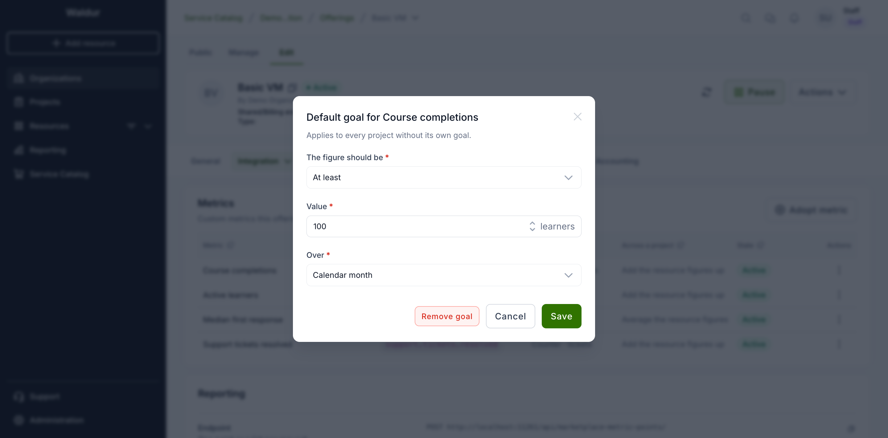
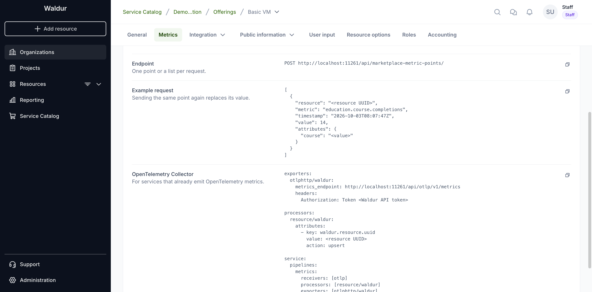

# Custom metrics

A service can report its own metrics for the resources it provides — courses
completed, learners active, tickets resolved, a median response time — and the
projects using those resources see them on their **Metrics** tab, with a trend,
a breakdown and a goal.

As a service provider you choose which metrics an offering reports, and your
service (or its site agent, or an OpenTelemetry Collector) sends the numbers.

## Where to find it

Open the offering, switch to **Edit**, and choose **Integration → Metrics**.



The table lists the metrics the offering reports.



- **Kind** — a **Gauge** is a level read at a moment; a **Counter** counts
  things that happened. The unit follows.
- **Across a project** — how the figures of a project's resources combine:
  added up, or averaged. Counted amounts are always added up. An average is
  unweighted: every resource counts once.
- **State** — **Active**, **Paused** or **Archived**.

## Adopting a metric

Organization owners, service provider managers and offering managers can
adopt and manage an offering's metrics.

Metrics come from the [catalogue](../staff-users/custom-metrics-catalogue.md),
so the same metric means the same thing on every offering. Choose
**Adopt metric**, pick the metric, and optionally give it a display name of
your own.



A service can only report metrics its offering has adopted. If the catalogue
lacks a metric you need, ask staff to add it, or add a private definition for
your organization through the API (`POST /api/marketplace-metric-definitions/`
with `owner_customer` set to your organization).

## Managing a metric

The actions menu at the end of each row:



- **Edit** — change the display name or how resources combine.
- **Default goal** — the target every project using the offering aims for,
  unless it sets its own.
- **Pause** — refuse new points; what was reported stays visible.
- **Archive** — stop collecting and hide the metric from projects. The data is
  kept for a grace period (30 days by default) and then purged.
- **Resume** — make a paused or archived metric active again.
- **Purge data** — on an archived metric, delete everything it collected
  straight away, then the metric itself.
- **Remove** — only for a metric that never received data.

### Default goals



A goal says what the figure should be — **at least** or **at most** a value —
over a calendar month, a calendar quarter or the last 30 days. Projects see
whether they meet it, and a project manager can set a project's own goal
instead.

## Reporting data

Below the table, the **Reporting** card shows where and how to send points,
with examples built from the offering's metrics.



The caller authenticates with a Waldur API token of a user who may report
usage for the offering — an organization owner, a service provider manager or
an offering manager, as for [usage reporting](reporting-usage.md). Every resource
in a request must be one the caller may report for, or nothing is recorded and
the request fails with 403.

Requests to both endpoints together are limited to 600 a minute per
reporting user. Above that Waldur answers 429 with a `Retry-After` header,
which OpenTelemetry exporters honour; send points in batches rather than one
request per point.

### Native endpoint

`POST /api/marketplace-metric-points/` takes one point or a list:

```json
[
  {
    "resource": "<resource UUID>",
    "metric": "education.course.completions",
    "timestamp": "2026-10-03T08:00:00Z",
    "value": 14,
    "attributes": {"course": "intro-to-linux"}
  }
]
```

The response says how many points were accepted and which were refused, and
why:

```json
{"accepted": 1, "rejected": []}
```

- A point is identified by resource, metric, attributes and timestamp.
  Sending it again replaces the value, so retries never count twice and a
  corrected value can be sent. Running totals are the exception: a total at
  the same or an earlier time than the last one is refused, unless it repeats
  that last total exactly.
- A **counter** is reported either as the amount since the previous point, or
  as a running total with `start_time` — when the total started counting.
  Running totals are turned into increments; a new `start_time` or a smaller
  total is read as a restart. The first total of a counter that started more
  than the late-data window ago is taken as a baseline, not counted, so adopting
  a metric for a long-running service does not credit months of activity to one
  moment.
- A point is refused when:
    - its metric is not adopted by the resource's offering, or is paused or
      archived;
    - the resource is not in a working state (OK, Updating or Terminating);
    - an attribute is not declared by the metric, or its value is not a finite
      number, a boolean or a text without NUL characters;
    - it would exceed the attribute or series caps;
    - its timestamp is more than an hour ahead or older than the late-data
      window (7 days by default).

!!! tip
    A median, percentile or average cannot be rebuilt from summed data.
    Compute it in the service and report it as a gauge — for example
    `support.response_time.median` — rather than sending individual
    response times.

### OpenTelemetry

Services that already emit OpenTelemetry metrics can export them to
`POST /api/otlp/v1/metrics` (OTLP over HTTP, JSON or protobuf, optionally
gzip-compressed). Each OpenTelemetry resource must carry the attribute
`waldur.resource.uuid`, and a metric's name must be its catalogue key. Gauge
and Sum (delta or cumulative) are accepted; histograms, summaries and data
points without a value are counted as rejected data points in the response's
partial-success field. A body larger than 20 MB after decompression is refused
with 413.

An OpenTelemetry Collector configuration that adds the resource attribute and
exports to Waldur:

```yaml
exporters:
  otlphttp/waldur:
    metrics_endpoint: https://waldur.example.com/api/otlp/v1/metrics
    headers:
      Authorization: Token <Waldur API token>

processors:
  resource/waldur:
    attributes:
      - key: waldur.resource.uuid
        value: <resource UUID>
        action: upsert

service:
  pipelines:
    metrics:
      receivers: [otlp]
      processors: [resource/waldur]
      exporters: [otlphttp/waldur]
```

!!! note
    Offerings whose source has reported metric data or goals cannot be merged
    into another offering yet.

## Related pages

- [Custom metrics catalogue](../staff-users/custom-metrics-catalogue.md)
- [Project metrics](../customer-organization/project-metrics.md)
- [Reporting usage](reporting-usage.md)
