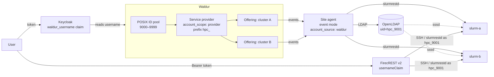

# POSIX identity with OpenLDAP and FirecREST

This page puts the pieces described on
[POSIX ID pools](posix-id-pools.md) and
[Waldur-authoritative accounts in OpenLDAP](openldap-sssd-accounts.md) into
one reference architecture: a service provider with **two SLURM clusters**, one
directory, and an HTTP API in front of both, where a person is one identity
everywhere — the same username, the same UID and GID, on the cluster's login
node, in the directory, in the OIDC token and in the job record.

Use it when a provider wants to expose its clusters through
[FirecREST](https://eth-cscs.github.io/firecrest-v2/) and needs the user that
FirecREST acts as to be the user Waldur provisioned.

## The architecture



| Component | Role in the chain |
|---|---|
| **POSIX ID pool** on the service provider | Allocates one UID and one primary GID per person across both offerings |
| **Provider-scoped accounts**, `anonymized` usernames | Waldur holds one account per person per provider and names it `hpc_<uid>` — identical on both offerings |
| **Site agent** in event mode | Receives order, role and offering-user events; creates the SLURM association on the right cluster and writes the account into OpenLDAP without minting anything itself |
| **OpenLDAP** | The provider's directory; one `posixAccount` per person, shared by both clusters |
| **sssd** on both clusters | Resolves `hpc_<uid>` to the pool UID/GID for `id`, job submission and accounting |
| **Keycloak** with the Waldur username mapper | Puts the person's Waldur offering username into a token claim on every token issued |
| **FirecREST v2** | Reads that claim as the username and acts on the clusters — SSH and slurmrestd — as that user |

## Configuring Waldur

!!! tip "Step by step"
    The Waldur and site-agent parts of this section are covered as an ordered
    checklist, with screenshots, in
    [Shared POSIX identity, step by step](posix-identity-step-by-step.md).
    This page adds the Keycloak and FirecREST layers on top.

On the service provider:

- Attach a [POSIX ID pool](posix-id-pools.md) with a UID range and a GID range.
- On the service provider's **Account settings** page (**Accounts → Account settings**), set
  **Account scope** to *Per service provider* so one person is one account
  across the provider's offerings, **Username generation policy** to
  *Anonymized*, and the **Anonymized username prefix** once (for example
  `hpc_`).

On each SLURM offering, under **Edit → Integration → User management**:

- Leave the naming fields unset. They show the values inherited from the
  provider, so the two offerings compute the same `hpc_<uid>` for the same
  person.
- **Enable automatic deletion of offering users**: on, so that a person who
  loses their last project role has their account's deletion requested and the
  agent can release the directory entry.

See [naming the accounts](openldap-sssd-accounts.md#naming-the-accounts) for the
details.

## Configuring the site agent

One agent serves both offerings. It runs in event mode so that a marketplace
order, a project role change or an offering-user state change reaches it as it
happens rather than on the next polling pass, with the periodic reconcile kept
as a safety net. Each offering talks to its cluster over slurmrestd and shares
the LDAP username backend in Waldur-authoritative mode:

```yaml
offerings:
  - name: "Cluster A"
    waldur_api_url: "https://waldur.example.com/api/"
    waldur_api_token: "<provider token>"
    waldur_offering_uuid: "<offering A uuid>"
    stomp_enabled: true
    backend_type: "slurm"
    username_management_backend: "ldap"
    order_processing_backend: "slurm"
    membership_sync_backend: "slurm"
    backend_settings:
      execution_mode: "rest"
      cluster_name: "cluster-a"
      rest_api:
        url: "https://slurm-a.example.com:6820"
        api_version: "v0.0.44"
        username: "root"
        token_env: "SLURM_JWT"
      ldap:
        uri: "ldap://ldap.example.com"
        bind_dn: "cn=admin,dc=example,dc=com"
        bind_password: "<password>"
        base_dn: "dc=example,dc=com"
        account_source: "waldur"
        on_departure: "disable"
  - name: "Cluster B"
    # identical apart from the offering uuid and the slurmrestd URL
```

The agent writes the standard `posixAccount` entries that
[Connecting SSSD](openldap-sssd-accounts.md#connecting-sssd) describes; the
`sssd.conf` there applies to every login and compute node of both clusters,
plus `ldap_account_expire_policy = shadow` so that a parked entry cannot log in.

## Configuring Keycloak

FirecREST identifies the caller from a claim in the bearer token. The
[Waldur Keycloak mapper](../../integrations/waldur-keycloak-mapper/index.md) supplies
that claim: on every token it asks Waldur for the person's offering username
and writes it into the token. Add it as a protocol mapper on the client
FirecREST's users authenticate with:

| Mapper setting | Value |
|---|---|
| `url.waldur.api.value` | The Waldur API root, **with the trailing slash** — `https://waldur.example.com/api/` |
| `uuid.waldur.offering.value` | The UUID of one of the provider's offerings. With provider-scoped accounts the username is the same on both, so either offering serves both clusters |
| `token.waldur.value` | An API token that can read the offering's users — the provider token the agent uses is a natural choice |
| `claim.name` | `waldur_username` |

Enable the claim on the access token, the ID token and the userinfo response.

!!! warning "The Keycloak username must equal the Waldur username"
    The mapper looks the person up in Waldur by the username Keycloak knows them
    under. When Waldur is the identity source for Keycloak (or both federate the
    same identity provider) this holds automatically; if Keycloak users are
    created separately, their usernames must match Waldur's, or the mapper finds
    nobody and emits no claim.

## Configuring FirecREST

In FirecREST v2's configuration, point `usernameClaim` at the claim the mapper
writes, and register the clusters:

```yaml
auth:
  authentication:
    tokenUrl: "https://keycloak.example.com/realms/hpc/protocol/openid-connect/token"
    publicCerts:
      - "https://keycloak.example.com/realms/hpc/protocol/openid-connect/certs"
    usernameClaim: "waldur_username"

clusters:
  - name: "slurm-a"
    ssh:
      host: "slurm-a.example.com"
      port: 22
    scheduler:
      type: "slurm"
      connection_mode: "hybrid"
      version: "25.11.7"
      api_url: "https://slurm-a.example.com:6820"
      api_version: "0.0.44"
  - name: "slurm-b"
    # ...
```

FirecREST then runs `id` over SSH and submits jobs over slurmrestd with
`X-SLURM-USER-NAME` set to `hpc_<uid>`; sssd on the cluster resolves it, and
the job carries the pool's `user_id` and `group_id`.

!!! note "Slurm dialect"
    FirecREST 2.6.0 speaks Slurm's `data_parser` up to **v0.0.44**, which is
    Slurm **25.11**. Its scheduler health probe reads a field that 26.05
    (v0.0.45) removed, so against a newer slurmrestd it marks the cluster
    unhealthy and refuses every compute call. Keep three settings aligned with
    the FirecREST release: the cluster's Slurm version, `scheduler.api_version` in the
    FirecREST cluster entry, and `rest_api.api_version` in the site agent's
    offering.

## The lifecycle of one identity

```mermaid
sequenceDiagram
  participant U as User
  participant W as Waldur
  participant AG as Site agent
  participant S as SLURM (A or B)
  participant L as OpenLDAP
  participant K as Keycloak
  participant F as FirecREST

  U->>W: Joins a project, allocation ordered
  W->>W: Pool UID 9001 → account hpc_9001 (provider scope)
  W-->>AG: ORDER / USER_ROLE / OFFERING_USER events
  AG->>S: Create association for hpc_9001
  AG->>L: Write posixAccount uid=hpc_9001 (9001:9001)
  AG-->>W: Order done, offering user OK
  U->>K: Log in
  K->>W: Offering username for this user?
  W-->>K: hpc_9001
  K-->>U: Token with waldur_username=hpc_9001
  U->>F: GET /status/{cluster}/userinfo, POST job
  F->>S: id / sbatch as hpc_9001 (sssd → 9001:9001)
  S-->>F: uid 9001, job accepted
  U->>W: Loses last project role
  W-->>AG: OFFERING_USER: requested deletion
  AG->>S: Remove association
  AG->>L: Park entry (nologin, shadowExpire 1, out of groups)
  AG-->>W: Offering user deleted
  U->>F: POST job with a still-valid token
  F->>S: sbatch as hpc_9001
  S-->>F: Refused — no association
  U->>W: Re-added to the project
  W->>W: Same account, same hpc_9001
  W-->>AG: OFFERING_USER event
  AG->>S: Recreate association
  AG->>L: Re-enable the same entry
  U->>F: POST job
  S-->>F: Accepted under 9001:9001
```



| Stage | Waldur | Cluster | Directory | Token / FirecREST |
|---|---|---|---|---|
| **Join** — project role granted, allocation exists | Offering user *OK*, username `hpc_9001`, UID 9001 | Association on the allocation's account | `posixAccount` `hpc_9001` 9001:9001, in access groups | Claim `waldur_username=hpc_9001`; `userinfo` reports uid 9001; jobs accepted |
| **Second offering** — same person, other cluster | Second offering user reading the same provider account: same name, same UID | Association on that cluster too | The same entry, untouched | Same claim works on both clusters |
| **Leave** — last project role on an offering removed | Offering user *Requested deletion* → *Deleted* | Association removed | Entry parked: `nologin`, `shadowExpire: 1`, removed from groups, UID kept | Existing tokens still name `hpc_9001`; the name still resolves, but a job is refused for lack of an association |
| **Return** — re-added to a project with an allocation | Offering user restored with the same username and UID | Association recreated | The same entry re-enabled and back in its groups | Jobs accepted again under 9001:9001 |

Two consequences of this design are worth stating plainly:

- **Access is the association, not name resolution.** Because the directory is
  shared, a person's name resolves on *every* cluster of the provider, including
  one they hold no allocation on. `userinfo` works there; a job is refused with
  an invalid-account error. Membership is enforced by SLURM, not by whether
  `getent` answers.
- **A UID is never reissued.** A departed person's entry stays in the directory
  in a parked state, so files they owned keep a name and the pool's reservation
  and the directory agree. The same person coming back lands on the same UID
  and the same entry.

## A runnable reference

The `waldur-integration-testing` repository carries this architecture as a
Docker Compose profile — Waldur, a site agent in event mode, OpenLDAP, two
SLURM emulator clusters resolving users through sssd, Keycloak with the mapper,
and FirecREST v2 — together with a test suite (`firecrest` marker) that walks a
person through every row of the table above: order, name, directory entry,
token claim, `userinfo`, job, departure, refusal and return. Its
`docs/firecrest-posix-identity.md` describes the profile and how to run it.
