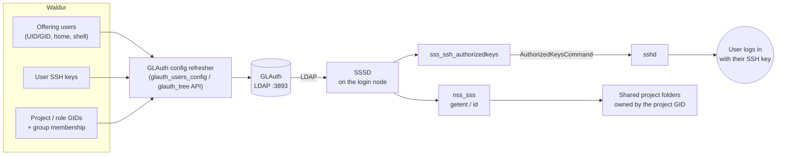

# Shared project storage with GLAuth and SSSD

Waldur assigns each offering user a POSIX **UID** and **primary GID** and each
project (and resource role) a shared **GID**, then exposes them — together with
group membership — through a [GLAuth (LDAP) directory](glauth-user-accounts.md).
A Linux backend such as an HPC login node consumes that directory with
[SSSD](https://sssd.io/) so that ordinary POSIX tooling (`getent`, `id`, file
ownership) resolves Waldur identities. This page shows how to connect such a host
and use the project GIDs to own **shared project folders** with the correct group
permissions.

## How the pieces fit together

Identities flow one way — from Waldur, through GLAuth, to the login node — and
POSIX tooling and `sshd` consume them there:



Note that the login name a user types is the GLAuth **`cn`** (the generated POSIX
login name), and their SSH keys reach `sshd` as GLAuth's `sshPublicKey` attribute
— both details drive the SSSD settings below.

## Connecting an SSSD client to GLAuth

Point SSSD at the GLAuth server as an LDAP identity provider. GLAuth serves users
as `posixAccount` entries named by `cn` and groups as `posixGroup` entries named
by `ou`, carrying `memberUid`, so three attribute-mapping settings differ from
the SSSD defaults:

```ini
# /etc/sssd/sssd.conf   (mode 0600, root-owned)
[sssd]
config_file_version = 2
services = nss, pam, ssh     # ssh backs sss_ssh_authorizedkeys (see below)
domains = glauth

[ssh]

[domain/glauth]
id_provider = ldap
auth_provider = ldap
ldap_uri = ldap://glauth.example.org:3893
ldap_search_base = dc=glauth,dc=com
ldap_default_bind_dn = cn=serviceuser,ou=svcaccts,dc=glauth,dc=com
ldap_default_authtok = <service-account-password>

# GLAuth specifics:
ldap_schema = rfc2307        # groups list members via memberUid
ldap_user_name = cn          # users are cn=<user>, no uid attribute
ldap_group_name = ou         # groups are ou=<group>, no cn attribute
ldap_user_ssh_public_key = sshPublicKey   # keys for sss_ssh_authorizedkeys
```

!!! warning "Use `cn`, not `preferredUsername`"
    The login name must be `ldap_user_name = cn`. GLAuth cannot filter searches
    on custom attributes, so `ldap_user_name = preferredUsername` matches no one
    — `getent` returns nothing and key-based SSH login fails. `cn` already holds
    the generated login name.

Add `sss` to the `passwd`, `group` and `shadow` databases in
`/etc/nsswitch.conf` and start SSSD. Users and their **full group membership**
now resolve — `id` lists a user's project groups, not just their primary group:


!!! note "Why rfc2307"
    GLAuth's own documentation warns that SSSD "does not properly list users
    belonging to a given group" under `rfc2307bis`. Use `rfc2307` (which resolves
    membership via `memberUid`) so that `id <user>` returns the project groups
    and group-based file permissions work.

## SSH key login

Each Waldur user's SSH public keys are exported as GLAuth's `sshPublicKey`
attribute. With the `ssh` responder enabled above, `sss_ssh_authorizedkeys`
returns them, so `sshd` can authorise key-based logins **straight from the
directory** — no per-user `authorized_keys` file on the node:

```bash
# The keys GLAuth serves for a user — exactly what sshd will authorise:
sss_ssh_authorizedkeys <login-name>
```

Point `sshd` at that command with a drop-in under `/etc/ssh/sshd_config.d/`:

```text
AuthorizedKeysCommand /usr/bin/sss_ssh_authorizedkeys
AuthorizedKeysCommandUser nobody
PubkeyAuthentication yes
```

Reload `sshd`. A user can now `ssh <login-name>@<node>` with the private key
matching any SSH key on their Waldur account.

## Shared project folders

Because every project has a stable, provider-unique GID, a shared directory owned
by that GID — with the **setgid** bit — becomes a project folder that only its
members can write to, and every file created inside inherits the project group:

```bash
# for a project whose Waldur GID is 8501
mkdir -p /shared/myproject
chgrp 8501 /shared/myproject
chmod 2770 /shared/myproject      # rwxrws--- : group members read/write, setgid
```

A project member can then write to the folder and their files stay group-owned by
the project; a non-member is denied (see the screenshot above). Drive this from
the [`glauth_tree`](glauth-user-accounts.md) export (the authoritative list of
project/role groups and their GIDs) so folders appear automatically as projects
are created.

## Troubleshooting

When users do not resolve or cannot log in, work outwards from GLAuth. The
commands and output below were captured against a live GLAuth + SSSD pair.

**1. Is GLAuth reachable and serving accounts?** Bind as the service account and
list users. A failure here is a GLAuth, bind-DN or password problem — not SSSD:

```console
$ ldapsearch -x -H ldap://glauth.example.org:3893 \
    -D "cn=serviceuser,ou=svcaccts,dc=glauth,dc=com" -w '<password>' \
    -b "dc=glauth,dc=com" "(objectclass=posixAccount)" cn uidNumber
cn: dig_00038
uidNumber: 10028
# numEntries: ...
```

**2. Does a specific user carry the expected attributes**, including its key?

```console
$ ldapsearch -x -H ldap://glauth.example.org:3893 \
    -D "cn=serviceuser,ou=svcaccts,dc=glauth,dc=com" -w '<password>' \
    -b "dc=glauth,dc=com" "(cn=dig_00038)" \
    cn uidNumber gidNumber homeDirectory loginShell sshPublicKey
cn: dig_00038
uidNumber: 10028
gidNumber: 1028
homeDirectory: /home/dig_00038
loginShell: /bin/bash
sshPublicKey: ssh-ed25519 AAAA...
```

**3. Does SSSD resolve the user and their keys?**

```console
$ getent passwd dig_00038
dig_00038:*:10028:1028:dig_00038:/home/dig_00038:/bin/bash

$ id dig_00038
uid=10028(dig_00038) gid=1028(dig_00038) groups=1028(dig_00038)

$ sss_ssh_authorizedkeys dig_00038
ssh-ed25519 AAAA...
```

If steps 1–2 succeed but these return nothing, SSSD is misconfigured — most
often `ldap_user_name` is not `cn`, `ldap_schema` is `rfc2307bis`, or the cache
is stale.

**4. Inspect SSSD directly**, then force a fresh lookup after changing config or
Waldur data:

```console
$ sssctl domain-status glauth
Online status: Online
Active servers:
LDAP: glauth.example.org

$ sssctl user-checks dig_00038
pam_acct_mgmt: Success
...
SSSD nss user lookup result:
 - user name: dig_00038
 - user id: 10028

$ sss_cache -E && systemctl restart sssd
```

## Cleaning up orphaned folders

When a project or resource is deleted its group disappears from Waldur and from
the directory, but any shared folder it owned remains on disk, owned by a GID
nobody can be a member of any more. Reconcile the folders against the current
`glauth_tree` (and `getent group`) periodically: a folder whose GID is gone from
Waldur **and** no longer resolvable over LDAP is an **orphan** and can be
archived or removed.


!!! warning
    Treat a folder as an orphan only when the group is authoritatively gone from
    Waldur — not merely unresolved. If the directory or API is temporarily
    unreachable, quarantine (move aside) rather than delete, so a transient
    outage never destroys live project data.

## Reference implementation

A complete, runnable example of this pipeline — a GLAuth server fed by Waldur, an
SSSD client container, automatic shared-folder provisioning and an orphan
detector — lives in the
[`glauth-sssd-demo`](https://code.opennodecloud.com/waldur/waldur-integration-testing/-/tree/main/glauth-sssd-demo)
directory of the integration-testing repository.
