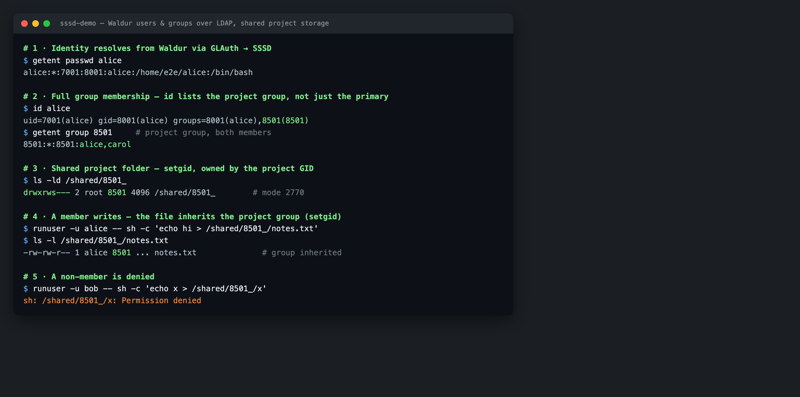
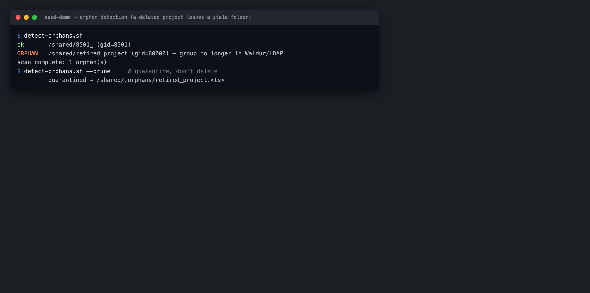

# Shared project storage with GLAuth and SSSD

Waldur assigns each offering user a POSIX **UID** and **primary GID** and each
project (and resource role) a shared **GID**, then exposes them — together with
group membership — through a [GLAuth (LDAP) directory](glauth-user-accounts.md).
A Linux backend such as an HPC login node consumes that directory with
[SSSD](https://sssd.io/) so that ordinary POSIX tooling (`getent`, `id`, file
ownership) resolves Waldur identities. This page shows how to connect such a host
and use the project GIDs to own **shared project folders** with the correct group
permissions.

## Connecting an SSSD client to GLAuth

Point SSSD at the GLAuth server as an LDAP identity provider. GLAuth serves users
as `posixAccount` entries named by `cn` and groups as `posixGroup` entries named
by `ou`, carrying `memberUid`, so three attribute-mapping settings differ from
the SSSD defaults:

```ini
# /etc/sssd/sssd.conf   (mode 0600, root-owned)
[sssd]
config_file_version = 2
services = nss, pam
domains = glauth

[domain/glauth]
id_provider = ldap
auth_provider = ldap
ldap_uri = ldap://glauth.example.org:3893
ldap_search_base = dc=glauth,dc=com
ldap_default_bind_dn = cn=serviceuser,ou=svcaccts,dc=glauth,dc=com
ldap_default_authtok = <service-account-password>

# GLAuth specifics:
ldap_schema = rfc2307        # groups list members via memberUid
ldap_user_name = cn          # users are cn=<user>, no uid attribute
ldap_group_name = ou         # groups are ou=<group>, no cn attribute
```

Add `sss` to the `passwd`, `group` and `shadow` databases in
`/etc/nsswitch.conf` and start SSSD. Users and their **full group membership**
now resolve — `id` lists a user's project groups, not just their primary group:



!!! note "Why rfc2307"
    GLAuth's own documentation warns that SSSD "does not properly list users
    belonging to a given group" under `rfc2307bis`. Use `rfc2307` (which resolves
    membership via `memberUid`) so that `id <user>` returns the project groups
    and group-based file permissions work.

## Shared project folders

Because every project has a stable, provider-unique GID, a shared directory owned
by that GID — with the **setgid** bit — becomes a project folder that only its
members can write to, and every file created inside inherits the project group:

```bash
# for a project whose Waldur GID is 8501
mkdir -p /shared/myproject
chgrp 8501 /shared/myproject
chmod 2770 /shared/myproject      # rwxrws--- : group members read/write, setgid
```

A project member can then write to the folder and their files stay group-owned by
the project; a non-member is denied (see the screenshot above). Drive this from
the [`glauth_tree`](glauth-user-accounts.md) export (the authoritative list of
project/role groups and their GIDs) so folders appear automatically as projects
are created.

## Cleaning up orphaned folders

When a project or resource is deleted its group disappears from Waldur and from
the directory, but any shared folder it owned remains on disk, owned by a GID
nobody can be a member of any more. Reconcile the folders against the current
`glauth_tree` (and `getent group`) periodically: a folder whose GID is gone from
Waldur **and** no longer resolvable over LDAP is an **orphan** and can be
archived or removed.



!!! warning
    Treat a folder as an orphan only when the group is authoritatively gone from
    Waldur — not merely unresolved. If the directory or API is temporarily
    unreachable, quarantine (move aside) rather than delete, so a transient
    outage never destroys live project data.

## Reference implementation

A complete, runnable example of this pipeline — a GLAuth server fed by Waldur, an
SSSD client container, automatic shared-folder provisioning and an orphan
detector — lives in the
[`glauth-sssd-demo`](https://code.opennodecloud.com/waldur/waldur-integration-testing/-/tree/main/glauth-sssd-demo)
directory of the integration-testing repository.
