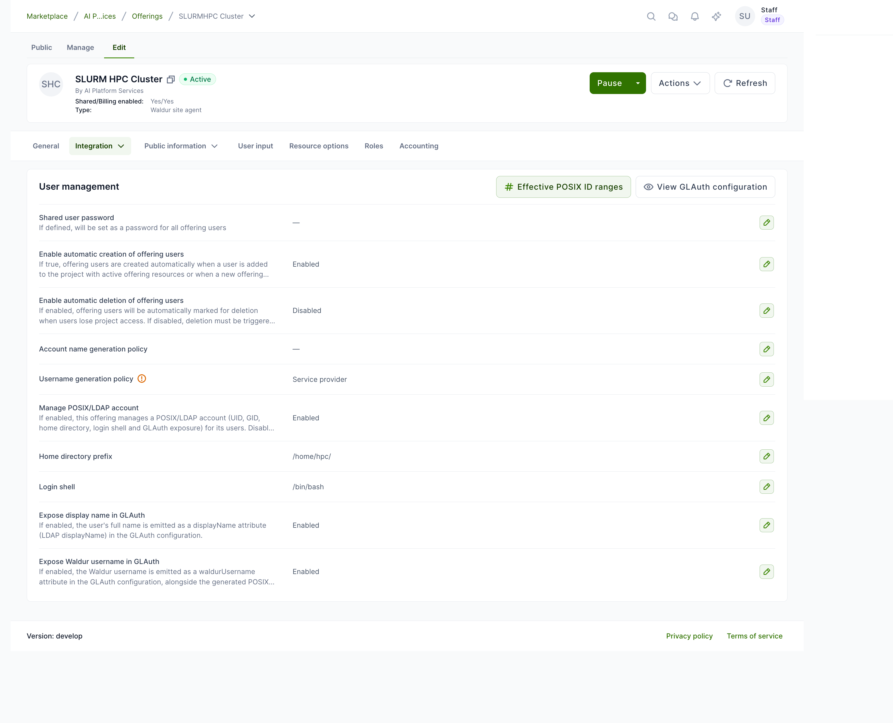
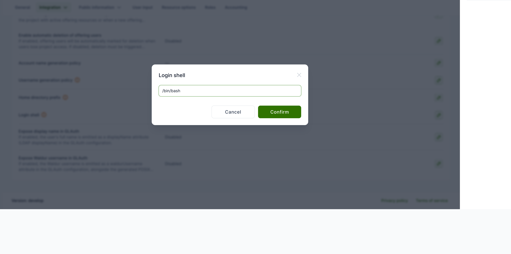
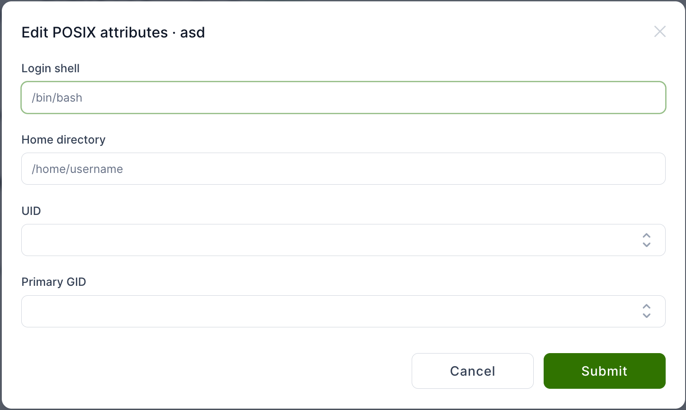
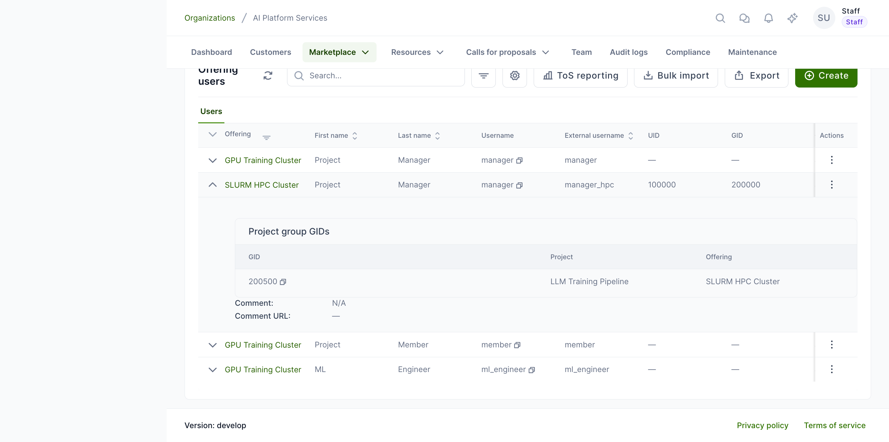
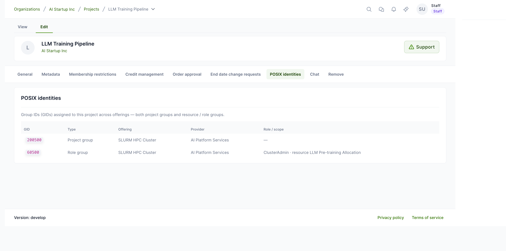
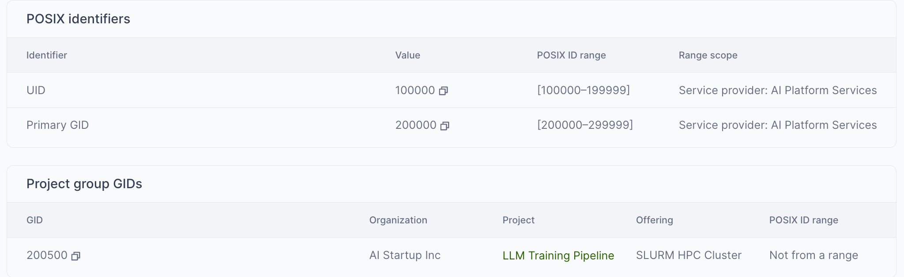
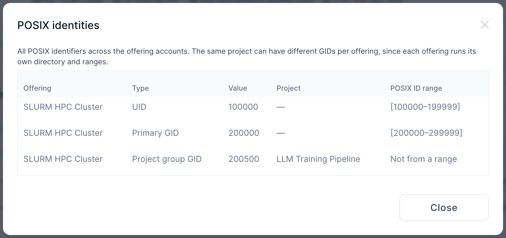

# GLAuth (LDAP) user accounts

Linux and HPC offerings provisioned through the Waldur site agent expose their
offering users to a [GLAuth](https://glauth.github.io/) (LDAP) directory, so
that clusters and other backends can authenticate them. Each account is
rendered with a numeric **UID/GID** (see
[Managing POSIX ID pools](posix-id-pools.md)) plus a set of LDAP attributes
derived from the Waldur user.

This page describes the account attributes a service provider can control and
how they map to LDAP.

## Where the settings live

Open the offering and go to **Edit → Integration → User management**. The
panel collects every option that affects how offering users and their GLAuth
records are generated.



## Account attributes

| Setting | Effect |
|---------|--------|
| Manage POSIX/LDAP account | Master switch (default on). When **off**, the offering's users carry only a username — no UID/GID, home directory, login shell or GLAuth exposure — and the POSIX settings below are hidden. Turn it off for offerings that only need a username. |
| Shared user password | If set, becomes the password (`passsha256`) for every offering user. |
| Enable automatic creation of offering users | Create offering users automatically when a user gains project access to an active resource. |
| Enable automatic deletion of offering users | Mark offering users for deletion automatically when project access is lost. |
| Account name / Username generation policy | How the POSIX login name (and `preferredUsername`) is generated — from the Waldur username, a service-provider-assigned name, an anonymized prefix, or an identity claim. |
| Home directory prefix | Prepended to the username to form `homeDir` (LDAP `homeDirectory`); defaults to `/home/`. |
| Login shell | Default login shell assigned to every account (LDAP `loginShell`); defaults to `/bin/bash`. |
| Expose display name in GLAuth | Emit the user's full name as a `displayName` custom attribute (LDAP `displayName`). |
| Expose Waldur username in GLAuth | Emit the Waldur username as a `waldurUsername` custom attribute, alongside the generated POSIX login name. |

To change a value, click the pencil on its row and confirm. For example, the
**Login shell** can be set to any path your backend expects:



## How attributes map to LDAP

For each offering user, the GLAuth record is built from the Waldur user and the
settings above:

| LDAP attribute | Source |
|----------------|--------|
| `cn` (`name`) | The generated POSIX login name (per the **Account/Username generation policy**). GLAuth serves no `uid` attribute. |
| `givenName` | The user's first name. |
| `sn` | The user's last name. |
| `mail` | The user's email. |
| `uidNumber` / `gidNumber` | Allocated from the offering's [POSIX ID pool](posix-id-pools.md). |
| `homeDirectory` | `Home directory prefix` + the generated login name. |
| `loginShell` | The `Login shell` setting. |
| `preferredUsername` | The generated POSIX login name — the same value as `cn`, kept as a custom attribute for compatibility. |
| `displayName` | The user's full name — only when **Expose display name** is enabled. |
| `waldurUsername` | The Waldur username — only when **Expose Waldur username** is enabled. |

!!! note "Login name vs. directory identity"
    The LDAP `cn` (`name`) **is** the generated POSIX login name — the value
    produced by the **Account/Username generation policy** — and `homeDir`
    follows it. The original **Waldur** username is exposed only through the
    optional `waldurUsername` attribute; enable **Expose Waldur username** if
    downstream systems need to correlate the POSIX login back to the Waldur
    account.

!!! warning "Key SSSD off `cn`, not `preferredUsername`"
    On the client set `ldap_user_name = cn` (see
    [Shared project storage with GLAuth and SSSD](glauth-sssd-shared-storage.md)).
    GLAuth **cannot filter searches on custom attributes**, so
    `ldap_user_name = preferredUsername` matches nothing and no user ever
    resolves (empty `getent`, failed key-based SSH login). `cn` already carries
    the generated login name, so keying off it is correct and sufficient.

To inspect the rendered output at any time, use **View GLAuth configuration**
on the User management panel.

## Sourcing UID and GID

By default both the `uidNumber` and the `gidNumber` of every account are
allocated from the offering's [POSIX ID pool](posix-id-pools.md). An offering can
instead take either identifier from the **Waldur user's own attributes** —
`uid_number` and `primary_gid` — which are typically populated from an
identity-provider claim (an OIDC/SAML `uidNumber`/`gidNumber`) during login. Two
per-offering options control this:

| Option | Values | Effect |
|--------|--------|--------|
| `uid_source` | `pool` (default) / `user_attribute` | Where each account's UID comes from: the pool, or the user's `uid_number` attribute. |
| `gid_source` | `pool` (default) / `user_attribute` | Where each account's primary GID comes from: the pool, or the user's `primary_gid` attribute. |

This is how a **federated deployment** keeps a user's UID stable and identical
across every provider (it belongs to the identity, not to any one site) while
still letting each provider allocate project and role **GIDs** locally.

!!! tip "Collision-free pairing"
    Set `uid_source = user_attribute` **together with a GID-only pool** (a pool
    whose UID range is left empty — see
    [Managing POSIX ID pools](posix-id-pools.md#how-a-pool-works)). Waldur then
    never allocates a UID that could clash with the externally-supplied one, and
    the GIDs still come from the pool. When an account is sourced from a user
    attribute that is missing, Waldur leaves that identifier unset and logs a
    warning rather than falling back to the pool.

This pairing is also one of the two supported answers when a site arrives with
**legacy UIDs that fall outside every configured pool** — see
[legacy identifiers outside a pool](posix-id-pools.md#legacy-identifiers-outside-a-pool).
Note that identifiers sourced this way are not tracked by a pool, so they show no
pool scope in the offering user's POSIX identifiers table; that is expected, and
is explained under
[where an identifier came from](posix-id-pools.md#where-an-identifier-came-from).

### Exposing the POSIX identity attributes

The user's `uid_number` and `primary_gid` are only visible to a provider if the
offering exposes them. On the offering's **Integration → Advanced → User
attribute exposure** configuration, enable **POSIX UID** and **POSIX primary
GID** (they appear once the matching profile attributes are enabled for the
deployment). Once exposed, each value is returned on the offering-user API
alongside the user's other exposed attributes, so a provider can confirm the
federated UID/GID a user brings — useful when the offering is sourcing from the
user attribute rather than the pool.

## Username-only offerings

If an offering only needs a username — no Linux account, GIDs or GLAuth
exposure — turn **Manage POSIX/LDAP account** off. Its users then keep just
their username; Waldur stops assigning UIDs, GIDs, home directories and login
shells, and the account never appears in the GLAuth directory. This lets a
provider run username-only offerings next to full HPC offerings without
changing any instance-wide setting.

## Per-user overrides

The login shell, home directory, **UID** and **primary GID** default from the
offering-level settings and the [POSIX ID pool allocator](posix-id-pools.md),
but a provider can override them for an individual account. On the provider's
**Offering users** list (or the offering's **Users** tab), open the row's
actions menu and choose **Edit POSIX attributes**.



- An explicit **home-directory** override is preserved even if the username
  later changes (an auto-derived one re-follows the username).
- Setting a **UID** or **primary GID** records that value as the account's
  identity in the offering's pool, and the allocator skips it when handing out
  sequential numbers so it can never collide with an automatic assignment.

!!! warning "Override constraints"
    A UID/GID override must fall **within the offering's pool range**, and a
    value already in use by another account is rejected — the database enforces
    that no two accounts share a UID and no two groups share a GID.

### Setting overrides through the API

**Edit POSIX attributes** is not UI-only. The same overrides can be applied
programmatically, which is the practical route when onboarding many accounts at
once:

```http
POST /api/marketplace-offering-users/<offering-user-uuid>/set_posix_attributes/
```

| Field | Notes |
|-------|-------|
| `login_shell` | Absolute path, for example `/bin/bash`. |
| `home_directory` | Absolute path. |
| `uidnumber` | The account's UID. |
| `primarygroup` | The account's primary GID. |

All four are optional, but at least one must be supplied. The response echoes
the stored `uidnumber` and `primarygroup` together with a `warnings` list:

```json
{"uidnumber": 100050, "primarygroup": 100050, "warnings": []}
```

`warnings` carries **non-fatal advisories only** — a value that is one of the
reserved POSIX ids (`65534`, `65535`) or is above 2<sup>31</sup>, which some
software using signed 32-bit ids cannot handle. It is never used to report a
rejected value.

Values that violate the constraints above are rejected outright with **HTTP
400**: a UID or GID outside the offering's resolved pool range, a value already
held by another active account, or an offering for which no pool resolves at
all. The action is all-or-nothing — if the primary GID is rejected, the UID
change submitted in the same call is rolled back with it.

Calling this endpoint requires permission to update offering users on the
offering's organization.

## Group memberships

Expanding an offering user shows the **project group GIDs** they belong to —
the shared GIDs emitted in their GLAuth `otherGroups` — each with its owning
organization, a link to the project (when you may open it) and the POSIX ID
pool the GID came from.



The same information is available project-side: on a project, open
**Manage → POSIX identities** to see every GID assigned to the project across
offerings — both project groups and resource/role groups, with their offering,
provider and scope. The GID values are copy-pastable.



## Role groups

Beyond the per-project groups, an offering can emit a **GLAuth group for each
role** a user holds on a **resource** or a **resource project** (a sub-project of
a resource). This lets a provider grant shared-storage or scheduler access from
Waldur roles instead of static Unix groups. Two per-offering plugin options turn
it on, each mapping a Waldur **role name** to the short name used in the group:

| Option | Maps | Example |
|--------|------|---------|
| `resource_role_map` | resource role name → group role name | `{"ClusterAdmin": "admin"}` |
| `resource_project_role_map` | resource-project role name → group role name | `{"ProjectMember": "member"}` |

The group name is rendered from a template (overridable per offering):

| Option | Default template |
|--------|------------------|
| `resource_role_group_template` | `${resource_slug}_${role_name}` |
| `resource_project_role_group_template` | `${resource_slug}_${rp_uuid_short}_${role_name}` |

Each role group is a `posixGroup` whose `gidNumber` is allocated from the
offering's [POSIX ID pool](posix-id-pools.md), with the users holding that role
as its `memberUid`s. A group is emitted **only** for a role listed in the maps,
and **only** while at least one user actually holds it — so the directory stays
limited to the access a provider has opted into.

For example, with the maps above and a resource `cluster` whose `ClusterAdmin`
is `alice`, GLAuth gains a group `cluster_admin` (member `alice`); a resource
project `team-x` under it whose `ProjectMember` is `bob` yields
`cluster_<rp-uuid>_member` (member `bob`). Both appear next to the project
groups under `ou=groups` in the offering's **View GLAuth configuration** viewer.

## Reviewing a user's identifiers

Expanding an offering user also shows a **POSIX identifiers** table with the
account's UID and primary GID and, for each, the **POSIX ID pool** it is tracked
by. A value that is not tracked by a pool — seeded from a preset or imported
before pool management existed — is shown as **Not from a pool**.



A user can review all of their own identifiers in one place: on their profile,
open **Remote accounts** and use the **POSIX identities** action. The popup
consolidates every UID, primary GID and project group GID across all the
offerings they have an account on, each tagged with its offering and the pool
it came from. Because each offering runs its own directory and pool, the same
project can appear under several offerings with different GIDs.


