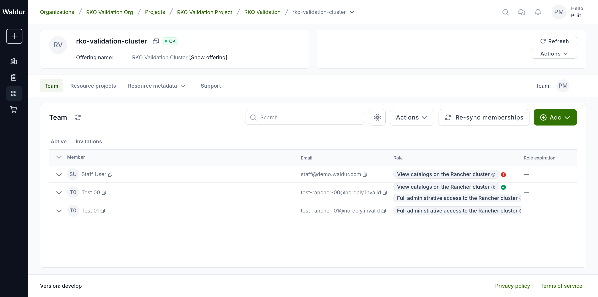
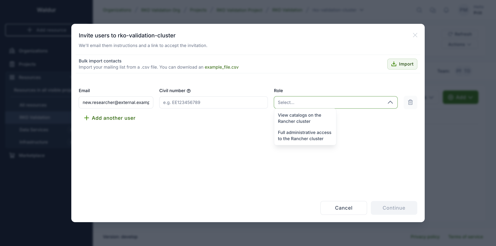
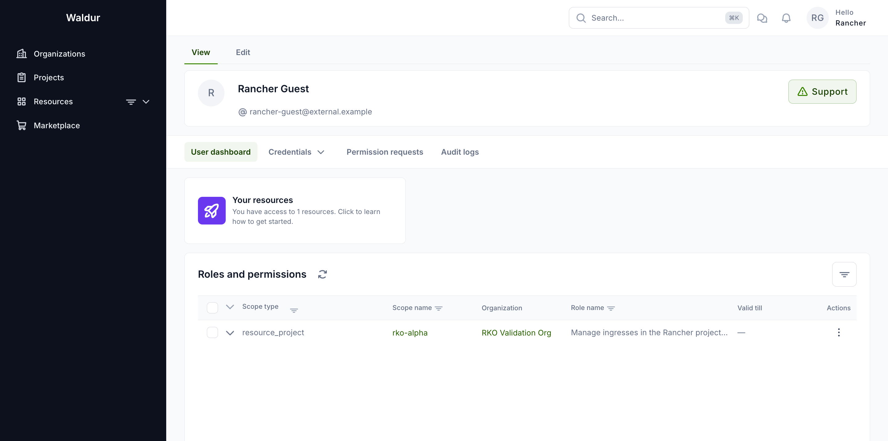
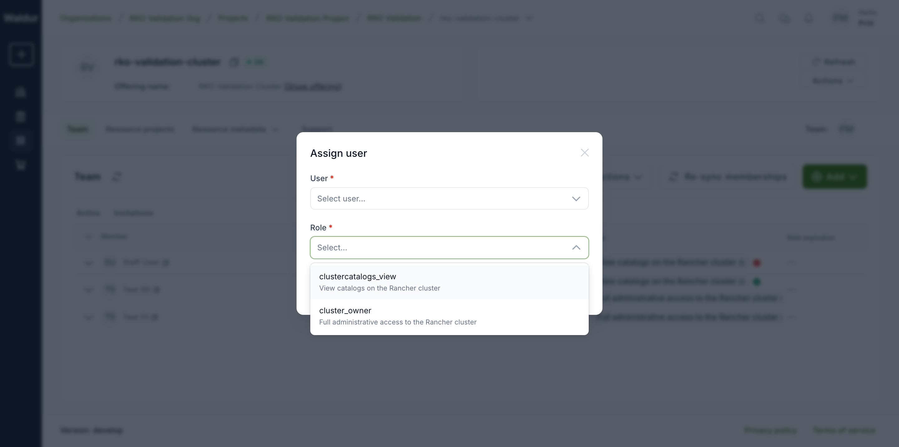
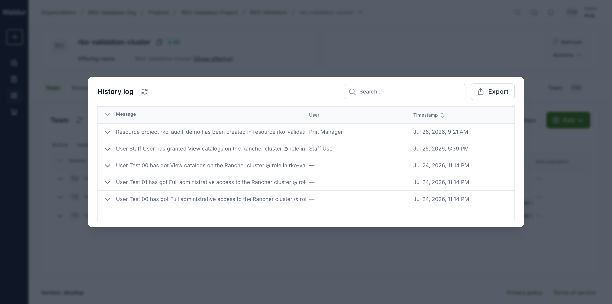

# Membership sync status

For offerings whose access control is applied by a site agent on the
provider's backend (for example a Rancher cluster with Keycloak groups), a
role granted in Waldur becomes effective only after the agent's next
synchronization cycle succeeds on the backend. Membership sync status makes
that propagation visible per member: team views show whether each role grant
has actually landed, and providers can request an immediate re-sync.

## Enabling

**Performed by:** Service provider (offering owner)

The feature is opt-in per offering via the **Membership sync status** plugin
option (`enable_membership_sync_status`) on the offering's Integration page.
It builds on resource sub-projects (`enable_resource_projects`).

When the option is off, team views render exactly as before and no sync
information is collected.

!!! note
    The reporting side requires a site agent version that supports
    membership sync reports. Older agents keep working — grants simply show
    no status indicator.

## Reading the status indicators

Each role badge on the resource **Team** tab (and on the expanded
per-sub-project rows) carries an indicator reported by the agent:

| Indicator | State | Meaning |
|---|---|---|
| Green check | **Synced** | Access is active on the provider side. |
| Clock | **Pending** | The backend has not applied this role yet — typically the agent has not completed a cycle since the grant. |
| Warning triangle | **Missing in identity provider** | The user is not known to the identity provider yet. Access activates automatically after their first login, when their account appears. |
| Cross | **Error** | Provider-side synchronization failed; the tooltip carries the reported message. |
| No indicator | Not reported | The agent has not reported on this grant (older agent, or the first report has not arrived yet). |

Hover an indicator for the detailed message and the time of the last agent
report.

## Inviting external users

**Performed by:** Service provider or staff

An offering role can be granted to someone who does not have a Waldur account
yet: use **Add** → **Invite** on the resource **Team** tab, enter their email
and pick the role. The role picker shows each offering role by its
description, so the person choosing sees a readable label rather than a raw
name.

Waldur emails the person an acceptance link. Until they accept **and** sign in
to the provider's identity provider for the first time, their grant shows
**Missing in identity provider** (see the indicator table above); the agent
flips it to **Synced** automatically once their account appears on the backend
after that first login.

Once accepted, the invited user sees only what the grant allows: their
assigned role is listed on their user dashboard with its scope and
description, and the resource page shows a reduced set of tabs (no team
management).

## Requesting a re-sync

**Performed by:** Service provider or staff

The **Re-sync memberships** action on the resource Team tab asks the
offering's agent to re-apply the resource's role grants on the backend.

- Requests are throttled to one per resource per 30 seconds.
- Delivery uses the offering's event subscriptions. Agents running in
  polling-only mode apply the change on their next cycle regardless — the
  request always succeeds, and the indicators refresh after the agent
  reports back.

## Explaining roles to users

Offering roles are provider-defined labels whose effect lives on the
provider's backend, so their names alone (for example `ingress_manage`) say
little to the person assigning or receiving them. Fill in the **description**
of each role in the offering's **Edit** → **Roles** catalog: it is shown in
the assign-user dialog and used as the role's display name in team views and
on user dashboards.

## Auditing sub-project changes

Creation, removal and recovery of resource sub-projects are recorded with
the acting user, alongside role changes. Open **Actions** → **History log**
on the resource Team tab to see the combined trail:

The sub-project rows themselves also record who created them
(`created_by`), and who removed them when soft-deleted.

## Checking that the agent is alive

Sync indicators are only as fresh as the last agent report. The offering's
**Manage** → **Status** page shows the connected agent's identity, version,
registered services and the last run of each processor — if the last run
stops advancing, the agent is down or misconfigured and the indicators go
stale.
