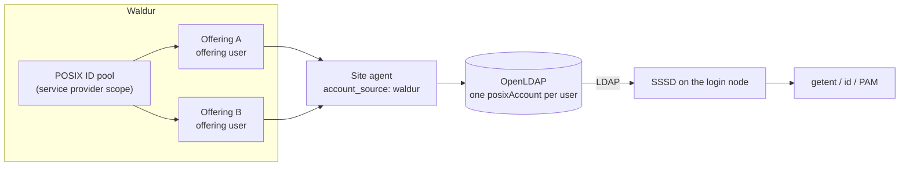

# Waldur-authoritative accounts in OpenLDAP

Where [GLAuth](glauth-user-accounts.md) renders a directory *from* Waldur on every
refresh, an existing **OpenLDAP** tree is a stateful directory you write into and
reconcile against. The Waldur site agent does that: it takes the username, UID,
primary GID, home directory and login shell Waldur already holds and writes them
into the directory as ordinary `posixAccount` entries, which a Linux host then
consumes with [SSSD](https://sssd.io/).

Use this page when a provider already runs OpenLDAP — often shared by several of
its services — and wants Waldur to be the source of truth for who exists in it.

## Which direction the identity flows

This is the decision that matters, and the agent supports both.

| `account_source` | Who decides the username and UID | Use when |
|---|---|---|
| `ldap` (default) | The **plugin**: it derives a name from the user's first and last name and scans the directory for a free UID | The directory is authoritative and Waldur is one of several consumers |
| `waldur` | **Waldur**: the agent writes the values the [POSIX ID pool](posix-id-pools.md) allocated | Waldur is the source of truth, and especially when one directory serves several of the provider's offerings |

The second mode exists because of a specific failure. A provider's POSIX ID pool
already guarantees one UID and one primary GID per user *across all of its
offerings*. If the plugin allocates locally instead, two offerings pointing at the
same directory hand the same person two different UIDs behind one DN and one home
directory — and whichever agent writes last wins.



Under `account_source: waldur` the second offering finds the entry the first one
wrote and leaves it alone, so both converge on a single account.

## Configuring the agent

!!! tip "Step by step"
    For an ordered checklist with screenshots — creating the pool, setting the
    account scope and username policy on the provider and its offerings,
    configuring the agent and checking the first accounts — see
    [Shared POSIX identity, step by step](posix-identity-step-by-step.md).

`account_source` lives in the LDAP plugin's settings, alongside the connection
details:

```yaml
offerings:
  - name: "HPC cluster"
    waldur_api_url: "https://waldur.example.com/api/"
    waldur_api_token: "<token>"
    waldur_offering_uuid: "<offering-uuid>"
    username_management_backend: "ldap"
    backend_settings:
      ldap:
        uri: "ldap://ldap.example.com"
        bind_dn: "cn=admin,dc=example,dc=com"
        bind_password: "<password>"
        base_dn: "dc=example,dc=com"
        people_ou: "ou=People"
        groups_ou: "ou=Groups"

        account_source: "waldur"
        on_missing_posix_ids: "error"
        on_posix_mismatch: "report"

        # Still used for project groups, which the resource backend allocates.
        gid_range_start: 1200
        gid_range_end: 1400
```

`username_format` is **rejected** in this mode — Waldur names the accounts, so
leaving the setting in place would only mislead. The `uid_range_*` settings are
ignored with a warning for the same reason.

!!! warning "Keep `gid_range_*` clear of the POSIX ID pool"
    User UIDs and primary GIDs come from Waldur, but *project* group GIDs are
    still allocated inside the directory from `gid_range_*`. OpenLDAP does not
    enforce `gidNumber` uniqueness, so if that range overlaps the provider's POSIX
    ID pool, a project group can silently take a GID already issued as somebody's
    primary group — and files end up ambiguously owned. Keep the two ranges
    disjoint. The agent cannot check this for you, but it logs the configured
    range at start-up so the overlap is at least visible.

## Naming the accounts

Under `account_source: waldur` the login name is whatever Waldur minted for the
offering user, so the **Username generation policy** decides what the directory
ends up holding. Set it once on the service provider's **Account settings** page
(**Accounts → Account settings**); every offering inherits it unless
it sets its own. Any policy works except `service_provider` — under
that one Waldur waits for the agent to *submit* a name, which is the opposite of
this mode.

| Policy | Login name | Fits a shared directory? |
|---|---|---|
| `anonymized` | `<prefix><POSIX UID>`, for example `hpc_9001` | Yes — see below |
| `waldur_username` | The user's Waldur username | Yes, if Waldur usernames are directory-safe |
| `identity_claim` | A username claim from the identity provider | Yes, if the claim is present for every user |
| `full_name` | `jane_smith_01` — a per-offering counter | Only for a single offering |
| `freeipa` | The user's FreeIPA profile name | Yes |
| `service_provider` | Assigned by the agent | **Rejected** in this mode |

### Anonymized names are derived from the pool

An `anonymized` name is a pure function of the account's POSIX UID: the prefix
followed by the number the [POSIX ID pool](posix-id-pools.md) allocated. Because
the pool is provider-wide, the same person gets the **same name on every offering
of the provider that draws from that pool** — two site agents writing the same
directory agree on `uid=hpc_9001` without ever talking to each other, and a
second offering's reconcile becomes a no-op on an entry the first one created.

The prefix is an account setting resolved the same way a pool is — the
offering's own value first, otherwise the provider's, otherwise the default
`waldur_`:

| Where | Field | Scope |
|---|---|---|
| Service provider → **Accounts → Account settings** | *Anonymized username prefix* (`account_options.username_anonymized_prefix`) | Every offering of the provider that does not override it |
| Offering → **Edit → Integration → User management → Accounts** | *Username anonymized prefix* (`username_anonymized_prefix`) | This offering only |

When all offerings share a directory, set it once on the provider and leave the
offering field unset; the offering form then shows the value it inherits.

If no UID resolves for a user — no pool is attached, or POSIX accounts are
disabled on the offering — Waldur falls back to a per-offering counter
(`hpc_00001`) and logs the gap. Such a name is *not* stable across offerings, so
attach the pool before users are created rather than after.

### One person, one entry

A directory shared by several offerings also needs Waldur to hold **one account
per person per provider** rather than one per offering. On the service
provider's **Account settings** page, set **Account scope** to *Per service
provider* (`account_scope: provider`; an individual offering can override it back to
`offering` when it runs its own separate directory). Switching a provider that
already has offering users links their existing accounts, and is refused while
one person holds different usernames on different offerings. With provider-scoped accounts the UID, primary GID, home directory
and — under `anonymized` — the username are held once and read through by every
offering user, so the directory entry has exactly one owner in Waldur.

`getent` on a node then shows the pool identity under the derived name:

```console
$ getent passwd hpc_9001
hpc_9001:*:9001:9001:Jane Smith:/home/hpc_9001:/bin/bash
```

### When an account cannot be written

| Situation | What the agent does |
|---|---|
| No POSIX ID pool resolves, or the offering has POSIX accounts disabled | Governed by `on_missing_posix_ids`. The account is never given a locally-invented id — that is the behaviour this mode exists to remove |
| The entry exists but its `uidNumber`/`gidNumber` disagree with Waldur | Governed by `on_posix_mismatch` |
| The UID Waldur wants is already held by an unrelated entry | Always an error, whether the account would be created on that UID or renumbered onto it. No `on_posix_mismatch` setting overrides this |

`on_missing_posix_ids` defaults to `error`: an account Waldur holds no ids for is
logged with the remedy — attach a POSIX ID pool to the provider, or enable POSIX
accounts on the offering — and skipped, while the rest of the cycle carries on.
Set it to `skip` to log at debug instead, which is useful while rolling the mode
out across offerings that are not all configured yet.

Two shapes of "no ids" are reported differently, because they mean different
things. If *every* account comes back without them, the server never returned the
fields at all — an older Waldur, or an agent not requesting them — and that is one
error for the offering rather than one per user.

`on_posix_mismatch` defaults to `report`: it logs a before/after diff and changes
nothing. That default is deliberate — rewriting a live account's `uidNumber`
orphans every file that user owns. Set it to `adopt` for a one-shot migration once
you are ready to follow up with `chown -R`, or `fail` to stop the cycle outright.

## Connecting SSSD

The agent writes standard `posixAccount` entries keyed on `uid`, and personal
groups as `posixGroup`. Unlike the [GLAuth setup](glauth-sssd-shared-storage.md),
**no attribute-mapping overrides are needed** — GLAuth serves users as `cn` and
groups as `ou`, which forces `ldap_user_name`/`ldap_group_name` overrides; here the
stock RFC 2307 schema applies:

```ini
# /etc/sssd/sssd.conf   (mode 0600, root-owned)
[sssd]
config_file_version = 2
services = nss, pam
domains = waldur

[domain/waldur]
id_provider = ldap
auth_provider = ldap
ldap_uri = ldap://ldap.example.com
ldap_search_base = dc=example,dc=com
ldap_user_search_base = ou=People,dc=example,dc=com
ldap_group_search_base = ou=Groups,dc=example,dc=com
ldap_schema = rfc2307

ldap_default_bind_dn = cn=readonly,dc=example,dc=com
ldap_default_authtok = <service-account-password>
```

Bind with a dedicated **read-only** service account rather than the directory
admin. Add `sss` to the `passwd`, `group` and `shadow` databases in
`/etc/nsswitch.conf`, enable `pam_sss` in your PAM stack, and start SSSD.

A Waldur user then resolves as an ordinary POSIX account:

```console
$ getent passwd jsmith
jsmith:*:9001:9001:Jane Smith:/home/jsmith:/bin/bash

$ id jsmith
uid=9001(jsmith) gid=9001(jsmith) groups=9001(jsmith)
```

Add `pam_mkhomedir` to the session stack if home directories should be created on
first login.

## When a user leaves

Removing the SLURM association is the resource backend's job; releasing the
directory entry is the LDAP plugin's, and in this mode it is on by default. The
chain starts in Waldur, not in the agent:

1. Turn on **Enable automatic deletion of offering users** on the offering
   (`offering_user_auto_deletion: true`). When a person loses their last project
   role on the offering, Waldur moves the offering user to *Requested deletion*.
   Without this option the offering user stays *OK* and the entry is kept — the
   agent only ever acts on Waldur's own request.
2. The agent picks the request up (on the next membership cycle, or at once from
   the offering-user event when it runs in event mode), drops the SLURM
   association, then releases the entry as `on_departure` says.
3. Because one directory serves every offering of the provider, the agent first
   asks Waldur whether an account **with the same username** is still live on
   any sibling offering. If one is, the entry stays enabled; only when every
   remaining account is in a deletion state (or none remains) is it released.
   The check runs against Waldur, never the directory, and a failed lookup keeps
   the entry and retries next cycle.

What "release" means is `on_departure`:

```yaml
backend_settings:
  ldap:
    account_source: "waldur"
    on_departure: "disable"   # disable (default in this mode) | delete
```

| `on_departure` | Directory result |
|---|---|
| `disable` (default under `waldur`) | The entry is **parked**: DN, `uidNumber`, `gidNumber` and personal group stay as they are. `loginShell` becomes `/usr/sbin/nologin`, the `shadowAccount` class is added with `shadowExpire: 1` (an expiry in the past), every `memberUid` it held in access and project groups is dropped, and `description: waldur-site-agent:disabled` marks the entry as parked by the agent rather than by an operator |
| `delete` | The entry, its personal group and its group memberships are removed |

`disable` is the default because a UID must never be reissued while files owned
by it exist: keeping the entry keeps `ls -l` honest and keeps the pool's
reservation and the directory in agreement. The name still *resolves* on the
cluster — `getent passwd` answers — but the login is shut and, on SLURM, it is
the missing association that refuses a job.

For the parked entry to lock the account out, SSSD on the nodes must honour the
shadow expiry. Add to the `[domain/...]` section of `sssd.conf`:

```ini
ldap_account_expire_policy = shadow
```

### Coming back

A returning member — re-added to a project that still holds an allocation —
gets the **same entry re-enabled**, not a new one. Waldur re-mints the same
username (an `anonymized` name derives from the pool UID, which the
provider-wide account keeps), so the reconcile finds a live offering user whose
entry exists but carries the parked marker. It restores `loginShell` from
Waldur, drops `shadowExpire` and the marker, re-adds the configured
`access_groups`, and the SLURM association brings project group membership back
with it. An entry an operator disabled by hand (no marker) is treated as an
ordinary profile update and left disabled.

## Authentication

Identity and authentication are separate concerns, and the table above only covers
identity. For a user to *log in*, the directory also needs a credential:

- **Password.** The agent writes `userPassword` only when `generate_vpn_password`
  is enabled, which produces a random secret delivered by the welcome email. A
  provider-wide `shared_user_password` on the offering is the other option.
- **SSH keys.** No `sshPublicKey` attribute is written on this path yet, so
  `sss_ssh_authorizedkeys` — the mechanism the GLAuth path uses for key-based
  login — has nothing to serve. The reason is an API one rather than a directory
  one: a user's keys are exposed on the GLAuth-specific endpoint but not on the
  offering-user list the agent reads, so the agent never sees them. (The schema is
  usually present: distributions of OpenLDAP that bundle openssh-lpk already
  define `sshPublicKey`.) Tracked in
  [waldur-site-agent#18](https://code.opennodecloud.com/waldur/waldur-site-agent/-/issues/18).
  Until it lands, use the GLAuth path where key-based SSH is the requirement.

## Trying it end to end

The site agent repository ships a runnable demo that brings up Waldur and
OpenLDAP, populates the directory, and logs in through SSSD on a throwaway host:

```bash
./ci/sssd-demo/run-demo.sh          # bring up, populate, verify
./ci/sssd-demo/run-demo.sh --down   # tear down
```

It prints the whole chain — Waldur's values, the directory entries, `getent`/`id`,
a login session, and a PAM check against both a correct and an incorrect password
— and its fixture gives one provider two offerings against one directory, so the
convergence behaviour above is visible in the reconcile log.

For the full chain — pool-derived names, the directory, a Keycloak token claim
and FirecREST acting on two clusters under one identity — see
[POSIX identity with OpenLDAP and FirecREST](firecrest-posix-identity.md).
