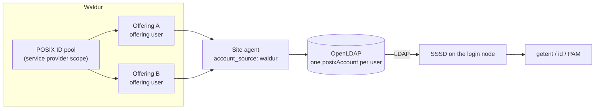

# Waldur-authoritative accounts in OpenLDAP

Where [GLAuth](glauth-user-accounts.md) renders a directory *from* Waldur on every
refresh, an existing **OpenLDAP** tree is a stateful directory you write into and
reconcile against. The Waldur site agent does that: it takes the username, UID,
primary GID, home directory and login shell Waldur already holds and writes them
into the directory as ordinary `posixAccount` entries, which a Linux host then
consumes with [SSSD](https://sssd.io/).

Use this page when a provider already runs OpenLDAP — often shared by several of
its services — and wants Waldur to be the source of truth for who exists in it.

## Which direction the identity flows

This is the decision that matters, and the agent supports both.

| `account_source` | Who decides the username and UID | Use when |
|---|---|---|
| `ldap` (default) | The **plugin**: it derives a name from the user's first and last name and scans the directory for a free UID | The directory is authoritative and Waldur is one of several consumers |
| `waldur` | **Waldur**: the agent writes the values the [POSIX ID pool](posix-id-pools.md) allocated | Waldur is the source of truth, and especially when one directory serves several of the provider's offerings |

The second mode exists because of a specific failure. A provider's POSIX ID pool
already guarantees one UID and one primary GID per user *across all of its
offerings*. If the plugin allocates locally instead, two offerings pointing at the
same directory hand the same person two different UIDs behind one DN and one home
directory — and whichever agent writes last wins.



Under `account_source: waldur` the second offering finds the entry the first one
wrote and leaves it alone, so both converge on a single account.

## Configuring the agent

`account_source` lives in the LDAP plugin's settings, alongside the connection
details:

```yaml
offerings:
  - name: "HPC cluster"
    waldur_api_url: "https://waldur.example.com/api/"
    waldur_api_token: "<token>"
    waldur_offering_uuid: "<offering-uuid>"
    username_management_backend: "ldap"
    backend_settings:
      ldap:
        uri: "ldap://ldap.example.com"
        bind_dn: "cn=admin,dc=example,dc=com"
        bind_password: "<password>"
        base_dn: "dc=example,dc=com"
        people_ou: "ou=People"
        groups_ou: "ou=Groups"

        account_source: "waldur"
        on_missing_posix_ids: "error"
        on_posix_mismatch: "report"

        # Still used for project groups, which the resource backend allocates.
        gid_range_start: 1200
        gid_range_end: 1400
```

`username_format` is **rejected** in this mode — Waldur names the accounts, so
leaving the setting in place would only mislead. The `uid_range_*` settings are
ignored with a warning for the same reason.

!!! warning "Keep `gid_range_*` clear of the POSIX ID pool"
    User UIDs and primary GIDs come from Waldur, but *project* group GIDs are
    still allocated inside the directory from `gid_range_*`. OpenLDAP does not
    enforce `gidNumber` uniqueness, so if that range overlaps the provider's POSIX
    ID pool, a project group can silently take a GID already issued as somebody's
    primary group — and files end up ambiguously owned. Keep the two ranges
    disjoint. The agent cannot check this for you, but it logs the configured
    range at start-up so the overlap is at least visible.

### When an account cannot be written

| Situation | What the agent does |
|---|---|
| No POSIX ID pool resolves, or the offering has POSIX accounts disabled | Governed by `on_missing_posix_ids`. The account is never given a locally-invented id — that is the behaviour this mode exists to remove |
| The entry exists but its `uidNumber`/`gidNumber` disagree with Waldur | Governed by `on_posix_mismatch` |
| The UID Waldur wants is already held by an unrelated entry | Always an error, whether the account would be created on that UID or renumbered onto it. No `on_posix_mismatch` setting overrides this |

`on_missing_posix_ids` defaults to `error`: an account Waldur holds no ids for is
logged with the remedy — attach a POSIX ID pool to the provider, or enable POSIX
accounts on the offering — and skipped, while the rest of the cycle carries on.
Set it to `skip` to log at debug instead, which is useful while rolling the mode
out across offerings that are not all configured yet.

Two shapes of "no ids" are reported differently, because they mean different
things. If *every* account comes back without them, the server never returned the
fields at all — an older Waldur, or an agent not requesting them — and that is one
error for the offering rather than one per user.

`on_posix_mismatch` defaults to `report`: it logs a before/after diff and changes
nothing. That default is deliberate — rewriting a live account's `uidNumber`
orphans every file that user owns. Set it to `adopt` for a one-shot migration once
you are ready to follow up with `chown -R`, or `fail` to stop the cycle outright.

## Connecting SSSD

The agent writes standard `posixAccount` entries keyed on `uid`, and personal
groups as `posixGroup`. Unlike the [GLAuth setup](glauth-sssd-shared-storage.md),
**no attribute-mapping overrides are needed** — GLAuth serves users as `cn` and
groups as `ou`, which forces `ldap_user_name`/`ldap_group_name` overrides; here the
stock RFC 2307 schema applies:

```ini
# /etc/sssd/sssd.conf   (mode 0600, root-owned)
[sssd]
config_file_version = 2
services = nss, pam
domains = waldur

[domain/waldur]
id_provider = ldap
auth_provider = ldap
ldap_uri = ldap://ldap.example.com
ldap_search_base = dc=example,dc=com
ldap_user_search_base = ou=People,dc=example,dc=com
ldap_group_search_base = ou=Groups,dc=example,dc=com
ldap_schema = rfc2307

ldap_default_bind_dn = cn=readonly,dc=example,dc=com
ldap_default_authtok = <service-account-password>
```

Bind with a dedicated **read-only** service account rather than the directory
admin. Add `sss` to the `passwd`, `group` and `shadow` databases in
`/etc/nsswitch.conf`, enable `pam_sss` in your PAM stack, and start SSSD.

A Waldur user then resolves as an ordinary POSIX account:

```console
$ getent passwd jsmith
jsmith:*:9001:9001:Jane Smith:/home/jsmith:/bin/bash

$ id jsmith
uid=9001(jsmith) gid=9001(jsmith) groups=9001(jsmith)
```

Add `pam_mkhomedir` to the session stack if home directories should be created on
first login.

## Authentication

Identity and authentication are separate concerns, and the table above only covers
identity. For a user to *log in*, the directory also needs a credential:

- **Password.** The agent writes `userPassword` only when `generate_vpn_password`
  is enabled, which produces a random secret delivered by the welcome email. A
  provider-wide `shared_user_password` on the offering is the other option.
- **SSH keys.** No `sshPublicKey` attribute is written on this path yet, so
  `sss_ssh_authorizedkeys` — the mechanism the GLAuth path uses for key-based
  login — has nothing to serve. The reason is an API one rather than a directory
  one: a user's keys are exposed on the GLAuth-specific endpoint but not on the
  offering-user list the agent reads, so the agent never sees them. (The schema is
  usually present: distributions of OpenLDAP that bundle openssh-lpk already
  define `sshPublicKey`.) Tracked in
  [waldur-site-agent#18](https://code.opennodecloud.com/waldur/waldur-site-agent/-/issues/18).
  Until it lands, use the GLAuth path where key-based SSH is the requirement.

## Trying it end to end

The site agent repository ships a runnable demo that brings up Waldur and
OpenLDAP, populates the directory, and logs in through SSSD on a throwaway host:

```bash
./ci/sssd-demo/run-demo.sh          # bring up, populate, verify
./ci/sssd-demo/run-demo.sh --down   # tear down
```

It prints the whole chain — Waldur's values, the directory entries, `getent`/`id`,
a login session, and a PAM check against both a correct and an incorrect password
— and its fixture gives one provider two offerings against one directory, so the
convergence behaviour above is visible in the reconcile log.
