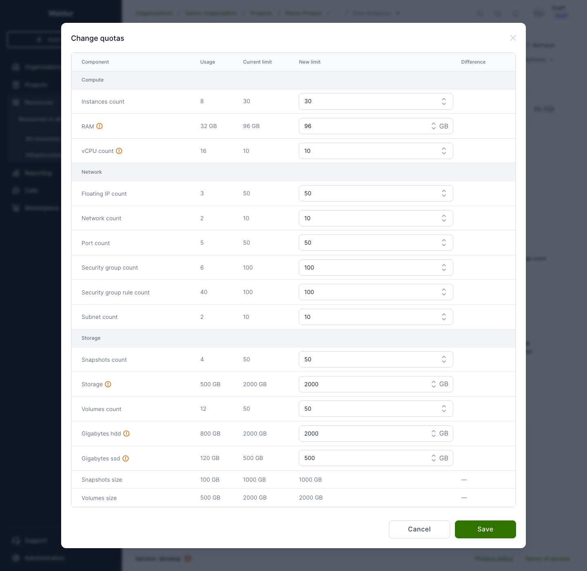

# OpenStack tenant quotas

As a service provider you can raise or lower the OpenStack-enforced resource
limits on a provisioned tenant without creating a new order. This is done
through the **Change quotas** action, which is separate from the
**Change limits** action — see the [note below](#change-quotas-vs-change-limits).

## Who can change quotas

**Change quotas** is available to:

- Platform staff
- Service provider organization owners and managers

Project members, project managers, and consumer organization owners have
read-only visibility of quota values but cannot change them. The action is
hidden entirely for users without provider-level access.

## Changing quotas

1. Open the resource detail page for the OpenStack tenant you want to adjust.
2. Click the three-dots **Actions** menu and, under the **Provider actions**
   group, select **Change quotas**.

    !!! note
        The action is disabled when the tenant is not in the **OK** state.

    

3. The **Change quotas** dialog opens as a table with columns **Component**,
   **Usage**, **Current limit**, **New limit**, and **Difference** — the same
   layout as the **Change limits** dialog. Rows are grouped into **Compute**,
   **Network**, and **Storage** sections.

    All quotas reported by OpenStack are displayed so you can see the full
    picture. Editable quotas show a number input in the **New limit** column;
    read-only quotas display their current limit as static text.

    **Editable quotas**

    | Section | Quota | Unit |
    |---|---|---|
    | Compute | Instances count | count |
    | Compute | RAM | GB |
    | Compute | vCPU count | count |
    | Network | Floating IP count | count |
    | Network | Network count | count |
    | Network | Port count | count |
    | Network | Security group count | count |
    | Network | Security group rule count | count |
    | Network | Subnet count | count |
    | Storage | Snapshots count | count |
    | Storage | Storage | GB |
    | Storage | Volumes count | count |
    | Storage | Gigabytes &lt;type&gt; (one row per volume type, e.g. Gigabytes hdd, Gigabytes ssd) | GB |

    !!! note
        RAM, Storage, and per-volume-type gigabyte quotas are entered and
        displayed in **GB**. All other quotas are plain integers.

    !!! warning
        vCPU count, RAM, Storage, and per-volume-type gigabyte quotas are
        also governed by the marketplace plan limits. Raising the OpenStack
        quota here without updating the plan limits (via **Change limits**)
        may cause billing and usage reports to drift from the actual
        infrastructure allocation. Use **Change limits** when you intend to
        change what is billed.

    **Read-only rows**

    Volumes size and Snapshots size are shown for context but are not
    separately settable — they are derived from the Storage quota.

    The **Difference** column updates live as you type, showing a green badge
    for increases and a red badge for decreases — use it to confirm the size
    of the change before saving.

4. Click **Save** to apply.

    A *"Quota update has been scheduled."* toast confirms the request was
    accepted.

### What happens after saving

The change is scheduled immediately — no approval workflow is involved.
Waldur sends the new limits to OpenStack and the tenant briefly enters the
**Updating** state. Once OpenStack confirms the change, the tenant returns
to **OK**.

!!! warning
    Do not trigger further quota or limit changes while the tenant is in
    the **Updating** state. Wait until it returns to **OK**.

## Re-syncing quota values

The tenant **Synchronise** action re-reads all tenant state from OpenStack,
including current quota limits and usage. Use it when the displayed numbers
look stale — for example, after adjusting limits directly in the OpenStack
dashboard outside of Waldur.

## Change quotas vs Change limits

| Action | What it changes | Who sees the effect |
|---|---|---|
| **Change quotas** (Provider actions) | OpenStack-enforced resource caps on the tenant | Infrastructure — controls what OpenStack actually allows |
| **Change limits** (resource order) | Marketplace plan limits used for billing and reporting | Customer-facing — controls what is billed and reported in Waldur |

When a customer's project needs more resources, you typically do both: raise
the OpenStack quota so the infrastructure allows it, and raise the plan
limits so accounting reflects the new allocation.
